# Xamarin.Forms Quickstart

This walkthrough demonstrates how to create an application that translates an alphanumeric phone number entered by the user into a numeric phone number, and that calls the number. The final application is shown below:

[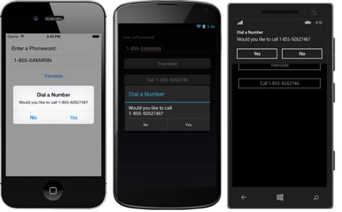](quickstart-images/intro-app-examples.png#lightbox "Phoneword Application")

Create the Phoneword application as follows:

# [Visual Studio](#tab/vswin)

1. In the **Start** screen, launch Visual Studio. This opens the start page:

    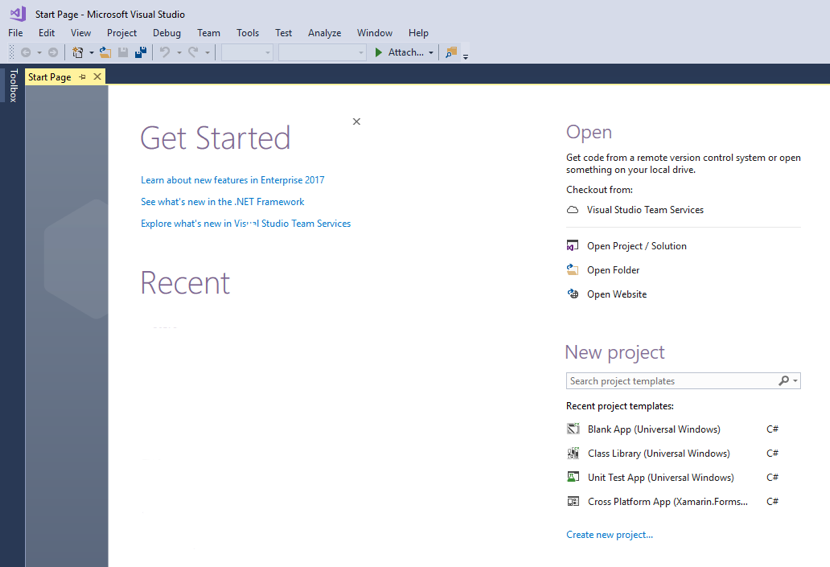

2. In Visual Studio, click **Create new project...** to create a new project:

    

3. In the **New Project** dialog, click **Cross-Platform**, select the **Mobile App (Xamarin.Forms)** template, set the Name to **Phoneword**, choose a suitable location for the project and click the **OK** button:

    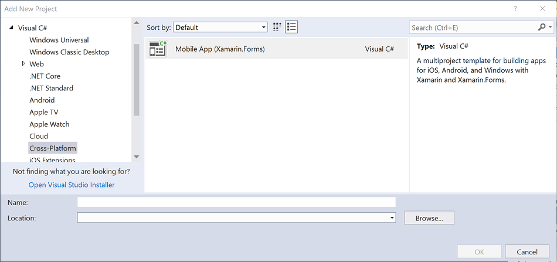

    > [!NOTE]
    > Failing to name the solution **Phoneword** will result in numerous build errors.

4. In the **New Cross Platform App** dialog, click **Blank App**, select **.NET Standard** as the Code Sharing Strategy, and click the **OK** button:

    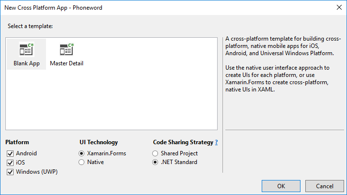

5. In **Solution Explorer**, in the **Phoneword** project, double-click **MainPage.xaml** to open it:

    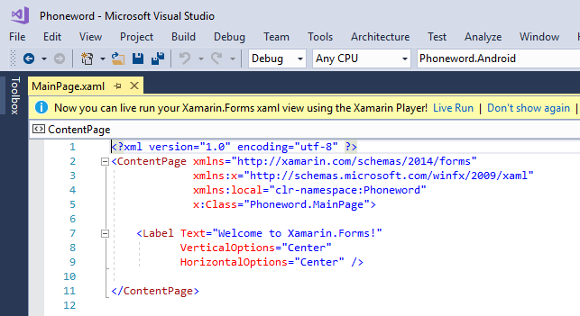

6. In **MainPage.xaml**, remove all of the template code and replace it with the following code. This code declaratively defines the user interface for the page:

    ```xaml
    <?xml version="1.0" encoding="UTF-8"?>
    <ContentPage xmlns="http://xamarin.com/schemas/2014/forms"
                       xmlns:x="http://schemas.microsoft.com/winfx/2009/xaml"
                       x:Class="Phoneword.MainPage">
        <ContentPage.Padding>
            <OnPlatform x:TypeArguments="Thickness">
                <On Platform="iOS" Value="20, 40, 20, 20" />
                <On Platform="Android, UWP" Value="20" />
            </OnPlatform>
        </ContentPage.Padding>
        <StackLayout>
          <Label Text="Enter a Phoneword:" />
          <Entry x:Name="phoneNumberText" Text="1-855-XAMARIN" />
          <Button Text="Translate" Clicked="OnTranslate" />
          <Button x:Name="callButton" Text="Call" IsEnabled="false" Clicked="OnCall" />
        </StackLayout>
    </ContentPage>
    ```

    Save the changes to **MainPage.xaml** by pressing **CTRL+S**, and close the file.

7. In **Solution Explorer**, expand **MainPage.xaml** and double-click **MainPage.xaml.cs** to open it:

    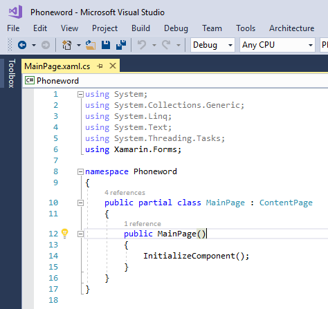

8. In **MainPage.xaml.cs**, remove all of the template code and replace it with the following code. The `OnTranslate` and `OnCall` methods will be executed in response to the **Translate** and **Call** buttons being clicked in the user interface, respectively:

    ```csharp
    using System;
    using Xamarin.Forms;

    namespace Phoneword
    {
        public partial class MainPage : ContentPage
        {
            string translatedNumber;

            public MainPage ()
            {
                InitializeComponent ();
            }

            void OnTranslate (object sender, EventArgs e)
            {
                translatedNumber = PhonewordTranslator.ToNumber (phoneNumberText.Text);
                if (!string.IsNullOrWhiteSpace (translatedNumber)) {
                    callButton.IsEnabled = true;
                    callButton.Text = "Call " + translatedNumber;
                } else {
                    callButton.IsEnabled = false;
                    callButton.Text = "Call";
                }
            }

            async void OnCall (object sender, EventArgs e)
            {
                if (await this.DisplayAlert (
                        "Dial a Number",
                        "Would you like to call " + translatedNumber + "?",
                        "Yes",
                        "No")) {
                    var dialer = DependencyService.Get<IDialer> ();
                    if (dialer != null)
                        dialer.Dial (translatedNumber);
                }
            }
        }
    }
    ```

    > [!NOTE]
    > Attempting to build the application at this point will result in errors that will be fixed later.

    Save the changes to **MainPage.xaml.cs** by pressing **CTRL+S**, and close the file.

9. In **Solution Explorer**, right click on the **Phoneword** project and select **Add > New Item...**:

    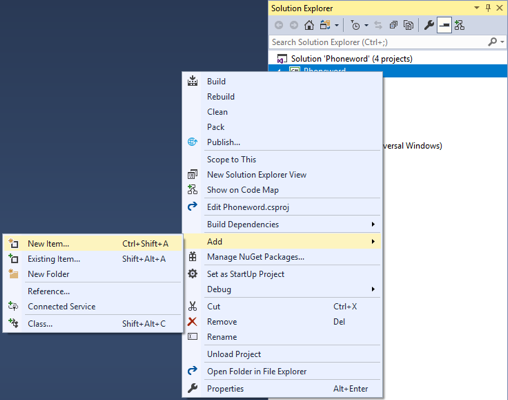

10. In the **Add New Item** dialog, select **Visual C# > Code > Class**, name the new file **PhoneTranslator**, and click the **Add** button:

    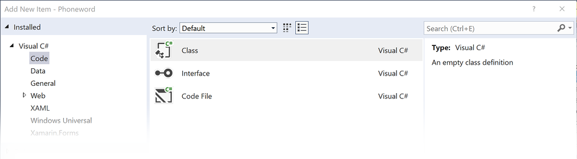

11. In **PhoneTranslator.cs**, remove all of the template code and replace it with the following code. This code will translate a phone word to a phone number:

    ```csharp
    using System.Text;

    namespace Phoneword
    {
        public static class PhonewordTranslator
        {
            public static string ToNumber(string raw)
            {
                if (string.IsNullOrWhiteSpace(raw))
                    return null;

                raw = raw.ToUpperInvariant();

                var newNumber = new StringBuilder();
                foreach (var c in raw)
                {
                    if (" -0123456789".Contains(c))
                        newNumber.Append(c);
                    else
                    {
                        var result = TranslateToNumber(c);
                        if (result != null)
                            newNumber.Append(result);
                        // Bad character?
                        else
                            return null;
                    }
                }
                return newNumber.ToString();
            }

            static bool Contains(this string keyString, char c)
            {
                return keyString.IndexOf(c) >= 0;
            }

            static readonly string[] digits = {
                "ABC", "DEF", "GHI", "JKL", "MNO", "PQRS", "TUV", "WXYZ"
            };

            static int? TranslateToNumber(char c)
            {
                for (int i = 0; i < digits.Length; i++)
                {
                    if (digits[i].Contains(c))
                        return 2 + i;
                }
                return null;
            }
        }
    }
    ```

    Save the changes to **PhoneTranslator.cs** by pressing **CTRL+S**, and close the file.

12. In **Solution Explorer**, right click on the **Phoneword** project and select **Add > New Item...**:

    

13. In the **Add New Item** dialog, select **Visual C# > Code > Interface**, name the new file **IDialer**, and click the **Add** button:

    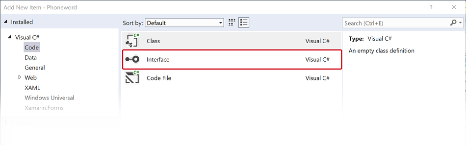

14. In **IDialer.cs**, remove all of the template code and replace it with the following code. This code defines a `Dial` method that must be implemented on each platform to dial a translated phone number:

    ```csharp
    namespace Phoneword
    {
        public interface IDialer
        {
            bool Dial(string number);
        }
    }
    ```

    Save the changes to **IDialer.cs** by pressing **CTRL+S**, and close the file.

    > [!NOTE]
    > The common code for the application is now complete. Platform-specific phone dialer code will now be implemented as a [DependencyService](~/xamarin-forms/app-fundamentals/dependency-service/index.md).

15. In **Solution Explorer**, right click on the **Phoneword.iOS** project and select **Add > New Item...**:

    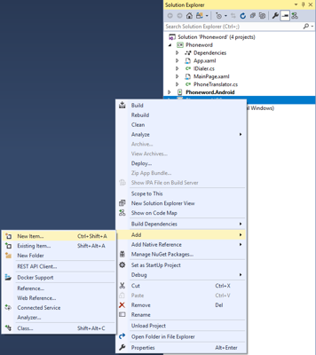

16. In the **Add New Item** dialog, select **Apple > Code > Class**, name the new file **PhoneDialer**, and click the **Add** button:

    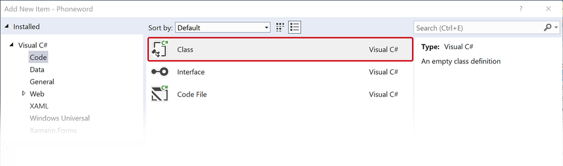

17. In **PhoneDialer.cs**, remove all of the template code and replace it with the following code. This code creates the <code>Dial</code> method that will be used on the iOS platform to dial a translated phone number:

    ```csharp
    using Foundation;
    using Phoneword.iOS;
    using UIKit;
    using Xamarin.Forms;

    [assembly: Dependency(typeof(PhoneDialer))]
    namespace Phoneword.iOS
    {
        public class PhoneDialer : IDialer
        {
            public bool Dial(string number)
            {
                return UIApplication.SharedApplication.OpenUrl (
                    new NSUrl ("tel:" + number));
            }
        }
    }
    ```

    Save the changes to **PhoneDialer.cs** by pressing **CTRL+S**, and close the file.

18. In **Solution Explorer**, right click on the **Phoneword.Android** project and select **Add > New Item...**:

    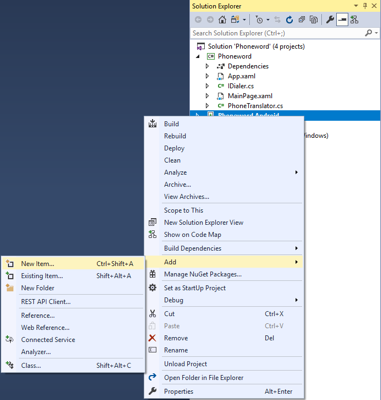

19. In the **Add New Item** dialog, select **Visual C# > Android > Class**, name the new file **PhoneDialer**, and click the **Add** button:

    

20. In **PhoneDialer.cs**, remove all of the template code and replace it with the following code. This code creates the `Dial` method that will be used on the Android platform to dial a translated phone number:

    ```csharp
    using Android.Content;
    using Android.Telephony;
    using Phoneword.Droid;
    using System.Linq;
    using Xamarin.Forms;
    using Uri = Android.Net.Uri;

    [assembly: Dependency(typeof(PhoneDialer))]
    namespace Phoneword.Droid
    {
        public class PhoneDialer : IDialer
        {
            public bool Dial(string number)
            {
                var context = MainActivity.Instance;
                if (context == null)
                    return false;

                var intent = new Intent (Intent.ActionDial);
                intent.SetData (Uri.Parse ("tel:" + number));

                if (IsIntentAvailable (context, intent)) {
                    context.StartActivity (intent);
                    return true;
                }

                return false;
            }

            public static bool IsIntentAvailable(Context context, Intent intent)
            {
                var packageManager = context.PackageManager;

                var list = packageManager.QueryIntentServices (intent, 0)
                    .Union (packageManager.QueryIntentActivities (intent, 0));

                if (list.Any ())
                    return true;

                var manager = TelephonyManager.FromContext (context);
                return manager.PhoneType != PhoneType.None;
            }
        }
    }
    ```

    Note that this code assumes that you are using the latest Android API. Save the changes to **PhoneDialer.cs** by pressing **CTRL+S**, and close the file.

21. In **Solution Explorer**, in the **Phoneword.Android** project, double-click **MainActivity.cs** to open it, remove all of the template code and replace it with the following code:

    ```csharp
    using Android.App;
    using Android.Content.PM;
    using Android.OS;

    namespace Phoneword.Droid
    {
        [Activity(Label = "Phoneword", Icon = "@mipmap/icon", Theme = "@style/MainTheme", MainLauncher = true,
                  ConfigurationChanges = ConfigChanges.ScreenSize | ConfigChanges.Orientation)]
        public class MainActivity : global::Xamarin.Forms.Platform.Android.FormsAppCompatActivity
        {
            internal static MainActivity Instance { get; private set; }

            protected override void OnCreate(Bundle bundle)
            {
                TabLayoutResource = Resource.Layout.Tabbar;
                ToolbarResource = Resource.Layout.Toolbar;

                base.OnCreate(bundle);
                Instance = this;
                global::Xamarin.Forms.Forms.Init(this, bundle);
                LoadApplication(new App());
            }
        }
    }
    ```

    Save the changes to **MainActivity.cs** by pressing **CTRL+S**, and close the file.

22. In **Solution Explorer**, in the **Phoneword.Android** project, double-click **Properties** and select the **Android Manifest** tab:

    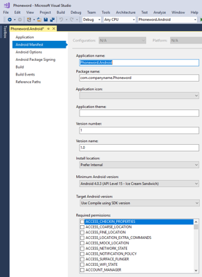

23. In the **Required permissions** section, enable the **CALL_PHONE** permission. This gives the application permission to place a phone call:

    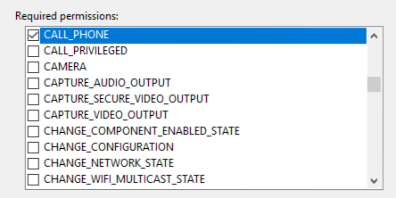

    Save the changes to the manifest by pressing **CTRL+S**, and close the file.

24. In **Solution Explorer**, right click on the **Phoneword.UWP** project and select **Properties**:

    

25. In the **Project Properties** window, change the **Target version** and **Min version** drop-downs to build 17134 of Windows 10:

    

26. In **Solution Explorer**, in the **Phoneword.UWP** project, right-click **References**, and select **Add Reference...**:

    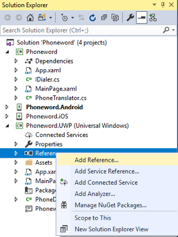

27. In the **Reference Manager** dialog, check the checkbox for **Universal Windows > Extensions > Windows Mobile Extensions for UWP**, and click the **OK** button:

    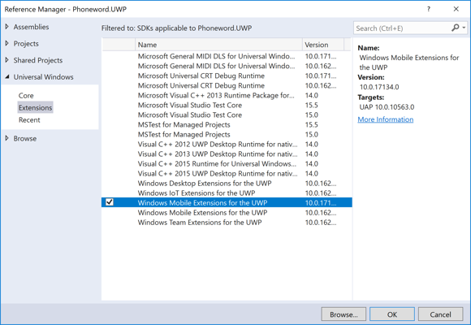

    Note that v10.0.17134.0 of the Windows Mobile Extensions for UWP must be selected to build against build 17134 of Windows 10.

28. In **Solution Explorer**, right click on the **Phoneword.UWP** project and select **Add > New Item...**:

    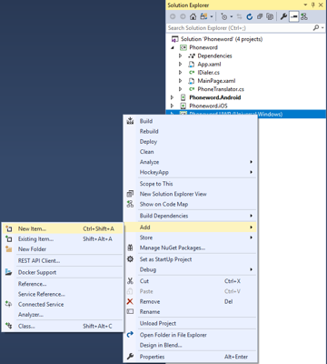    

29. In the **Add New Item** dialog, select **Visual C# > Code > Class**, name the new file **PhoneDialer**, and click the **Add** button:

    

30. In **PhoneDialer.cs**, remove all of the template code and replace it with the following code. This code creates the `Dial` method, and helper methods, that will be used on the Universal Windows Platform to dial a translated phone number:

    ```csharp
    using Phoneword.UWP;
    using System;
    using System.Threading.Tasks;
    using Windows.ApplicationModel.Calls;
    using Windows.UI.Popups;
    using Xamarin.Forms;

    [assembly: Dependency(typeof(PhoneDialer))]
    namespace Phoneword.UWP
    {
        public class PhoneDialer : IDialer
        {
            bool dialled = false;

            public bool Dial(string number)
            {
                DialNumber(number);
                return dialled;
            }

            async Task DialNumber(string number)
            {
                var phoneLine = await GetDefaultPhoneLineAsync();
                if (phoneLine != null)
                {
                    phoneLine.Dial(number, number);
                    dialled = true;
                }
                else
                {
                    var dialog = new MessageDialog("No line found to place the call");
                    await dialog.ShowAsync();
                    dialled = false;
                }
            }

            async Task<PhoneLine> GetDefaultPhoneLineAsync()
            {
                var phoneCallStore = await PhoneCallManager.RequestStoreAsync();
                var lineId = await phoneCallStore.GetDefaultLineAsync();
                return await PhoneLine.FromIdAsync(lineId);
            }
        }
    }
    ```

    Save the changes to **PhoneDialer.cs** by pressing **CTRL+S**, and close the file.

31. In **Solution Explorer**, in the **Phoneword.UWP** project, double-click **Package.appxmanifest**:

    

32. In the **Capabilities** page, enable the **Phone Call** capability. This gives the application permission to place a phone call:

    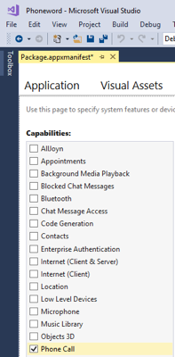

    Save the changes to the manifest by pressing **CTRL+S**, and close the file.

33. In Visual Studio, select the **Build > Build Solution** menu item (or press **CTRL+SHIFT+B**). The application will build and a success message will appear in the Visual Studio status bar:

    

    If there are errors, repeat the previous steps and correct any mistakes until the application builds successfully.

34. In **Solution Explorer**, right click on the **Phoneword.UWP** project and select **Set as StartUp Project**:

    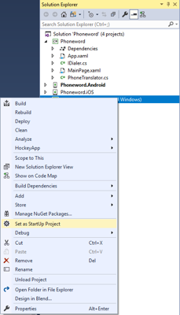

35. In the Visual Studio toolbar, press the **Start** button (the triangular button that resembles a Play button) to launch the application:

    
    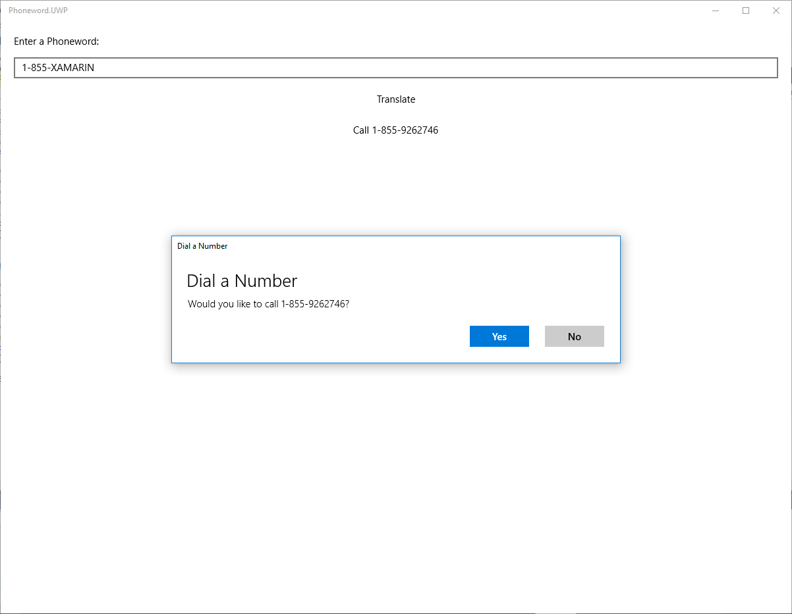

36. In **Solution Explorer**, right click on the **Phoneword.Android** project and select **Set as StartUp Project**.
37. In the Visual Studio toolbar, press the **Start** button (the triangular button that resembles a Play button) to launch the application inside an Android emulator.
38. If you have an iOS device and meet the Mac system requirements for Xamarin.Forms development, use a similar technique to deploy the app to the iOS device. Alternatively, deploy the app to the [iOS remote simulator](~/tools/ios-simulator/index.md).

    Note: phone calls are not supported on all the simulators.

# [Visual Studio for Mac](#tab/vsmac)

1. Launch Visual Studio for Mac, and on the start page click **New Project...** to create a new project:

    

2. In the **Choose a template for your new project** dialog, click **Multiplatform > App**, select the **Blank Forms App** template, and click the **Next** button:

    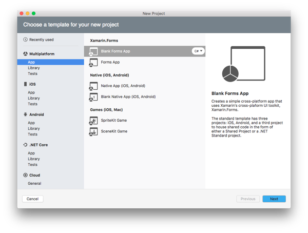

3. In the **Configure your Blank Forms app** dialog, name the new app **Phoneword**, ensure that the **Use .NET Standard** radio button is selected, and click the **Next** button:

    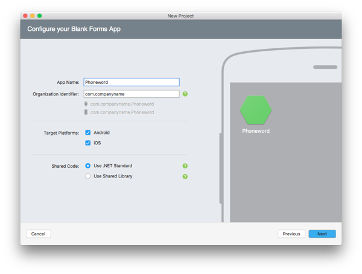

4. In the **Configure your new Blank Forms app** dialog, leave the Solution and Project names set to **Phoneword**, choose a suitable location for the project, and click the **Create** button to create the project:

    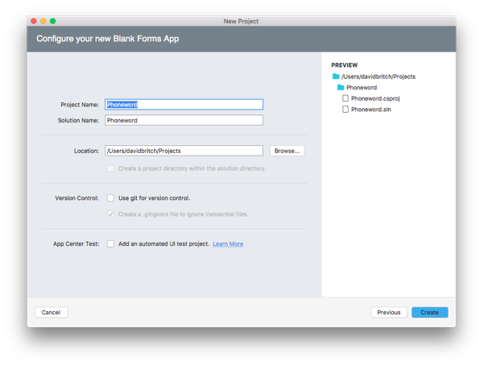

    > [!NOTE]
    > Failing to name the solution and project **Phoneword** will result in numerous build errors.

5. In the **Solution Pad**, double-click **MainPage.xaml** to open it:

    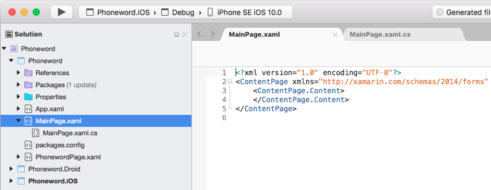

6. In **MainPage.xaml**, remove all of the template code and replace it with the following code. This code declaratively defines the user interface for the page:

    ```xaml
    <?xml version="1.0" encoding="UTF-8"?>
    <ContentPage xmlns="http://xamarin.com/schemas/2014/forms"
                       xmlns:x="http://schemas.microsoft.com/winfx/2009/xaml"
                       x:Class="Phoneword.MainPage">
        <ContentPage.Padding>
            <OnPlatform x:TypeArguments="Thickness">
                <On Platform="iOS" Value="20, 40, 20, 20" />
                <On Platform="Android, UWP" Value="20" />
            </OnPlatform>
        </ContentPage.Padding>
        <StackLayout>
          <Label Text="Enter a Phoneword:" />
          <Entry x:Name="phoneNumberText" Text="1-855-XAMARIN" />
          <Button Text="Translate" Clicked="OnTranslate" />
          <Button x:Name="callButton" Text="Call" IsEnabled="false" Clicked="OnCall" />
        </StackLayout>
    </ContentPage>
    ```

    Save the changes to **MainPage.xaml** by choosing **File > Save** (or by pressing **&#8984; + S**), and close the file.

7. In the **Solution Pad**, double-click **MainPage.xaml.cs** to open it:

    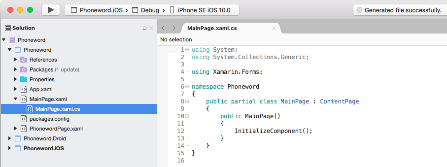

8. In **MainPage.xaml.cs**, remove all of the template code and replace it with the following code. The `OnTranslate` and `OnCall` methods will be executed in response to the **Translate** and **Call** buttons being clicked on the user interface, respectively:

    ```csharp
    using System;
    using Xamarin.Forms;

    namespace Phoneword
    {
        public partial class MainPage : ContentPage
        {
            string translatedNumber;

            public MainPage ()
            {
                InitializeComponent ();
            }

            void OnTranslate (object sender, EventArgs e)
            {
                translatedNumber = PhonewordTranslator.ToNumber (phoneNumberText.Text);
                if (!string.IsNullOrWhiteSpace (translatedNumber)) {
                    callButton.IsEnabled = true;
                    callButton.Text = "Call " + translatedNumber;
                } else {
                    callButton.IsEnabled = false;
                    callButton.Text = "Call";
                }
            }

            async void OnCall (object sender, EventArgs e)
            {
                if (await this.DisplayAlert (
                        "Dial a Number",
                        "Would you like to call " + translatedNumber + "?",
                        "Yes",
                        "No")) {
                    var dialer = DependencyService.Get<IDialer> ();
                    if (dialer != null)
                        dialer.Dial (translatedNumber);
                }
            }
        }
    }
    ```

    > [!NOTE]
    > Attempting to build the application at this point will result in errors that will be fixed later.

    Save the changes to **MainPage.xaml.cs** by choosing **File > Save** (or by pressing **&#8984; + S**), and close the file.

9. In the **Solution Pad**, select the **Phoneword** project, right-click and select **Add > New File...**:

    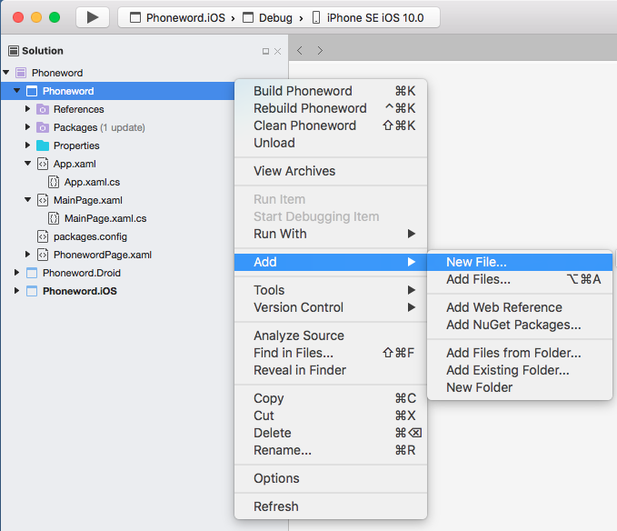

10. In the **New File** dialog, select **General > Empty Class**, name the new file **PhoneTranslator**, and click the **New** button:

    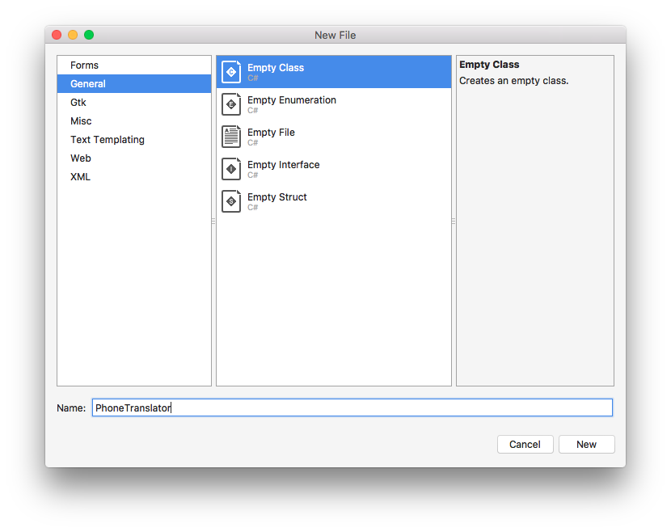

11. In **PhoneTranslator.cs**, remove all of the template code and replace it with the following code. This code will translate a phone word to a phone number:

    ```csharp
    using System.Text;

    namespace Phoneword
    {
        public static class PhonewordTranslator
        {
            public static string ToNumber(string raw)
            {
                if (string.IsNullOrWhiteSpace(raw))
                    return null;

                raw = raw.ToUpperInvariant();

                var newNumber = new StringBuilder();
                foreach (var c in raw)
                {
                    if (" -0123456789".Contains(c))
                        newNumber.Append(c);
                    else
                    {
                        var result = TranslateToNumber(c);
                        if (result != null)
                            newNumber.Append(result);
                        // Bad character?
                        else
                            return null;
                    }
                }
                return newNumber.ToString();
            }

            static bool Contains(this string keyString, char c)
            {
                return keyString.IndexOf(c) >= 0;
            }

            static readonly string[] digits = {
                "ABC", "DEF", "GHI", "JKL", "MNO", "PQRS", "TUV", "WXYZ"
            };

            static int? TranslateToNumber(char c)
            {
                for (int i = 0; i < digits.Length; i++)
                {
                    if (digits[i].Contains(c))
                        return 2 + i;
                }
                return null;
            }
        }
    }
    ```

    Save the changes to **PhoneTranslator.cs** by choosing **File > Save** (or by pressing **&#8984; + S**), and close the file.

12. In the **Solution Pad**, select the **Phoneword** project, right-click and select **Add > New File...**:

    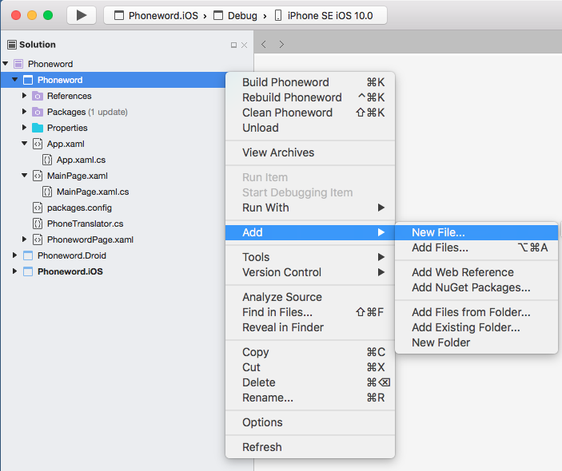

13. In the **New File** dialog, select **General > Empty Interface**, name the new file **IDialer**, and click the **New** button:

    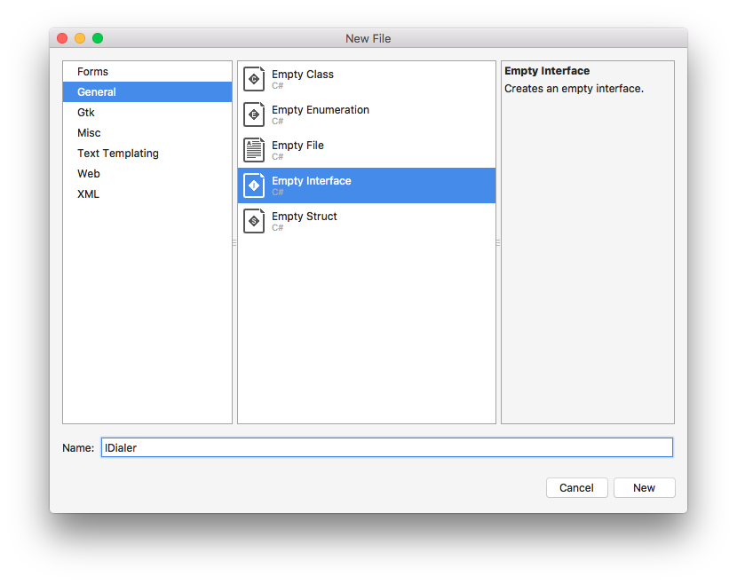

14. In **IDialer.cs**, remove all of the template code and replace it with the following code. This code defines a `Dial` method that must be implemented on each platform to dial a translated phone number:

    ```csharp
    namespace Phoneword
    {
        public interface IDialer
        {
            bool Dial(string number);
        }
    }
    ```
    Save the changes to **IDialer.cs** by choosing **File > Save** (or by pressing **&#8984; + S**), and close the file.

    > [!NOTE]
    > The common code for the application is now complete. Platform-specific phone dialer code will now be implemented as a [DependencyService](~/xamarin-forms/app-fundamentals/dependency-service/index.md).

15. In the **Solution Pad**, select the **Phoneword.iOS** project, right-click and select **Add > New File...**:

    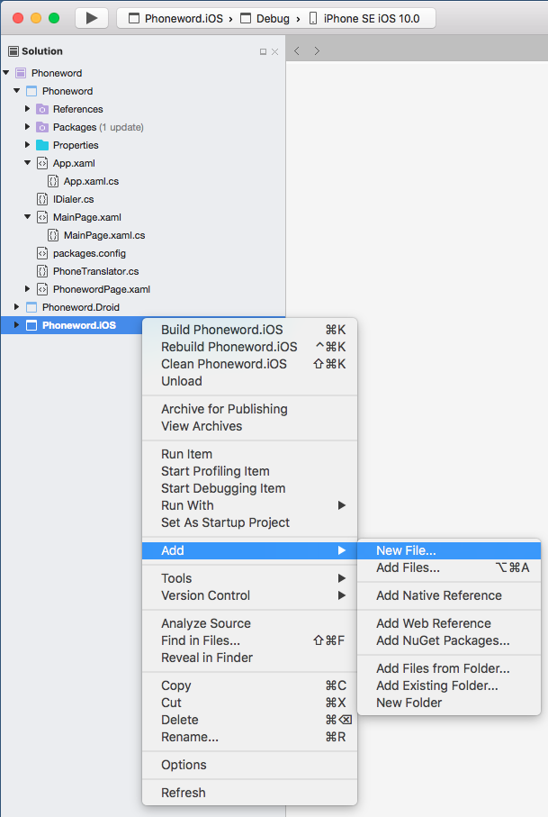

16. In the **New File** dialog, select **General > Empty Class**, name the new file **PhoneDialer**, and click the **New** button:

    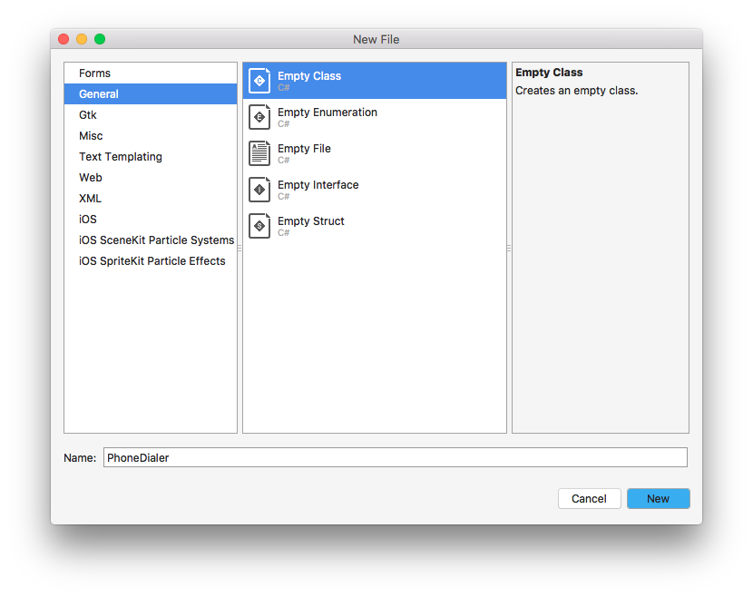

17. In **PhoneDialer.cs**, remove all of the template code and replace it with the following code. This code creates the `Dial` method that will be used on the iOS platform to dial a translated phone number:

    ```csharp
    using Foundation;
    using Phoneword.iOS;
    using UIKit;
    using Xamarin.Forms;

    [assembly: Dependency(typeof(PhoneDialer))]
    namespace Phoneword.iOS
    {
        public class PhoneDialer : IDialer
        {
            public bool Dial(string number)
            {
                return UIApplication.SharedApplication.OpenUrl (
                    new NSUrl ("tel:" + number));
            }
        }
    }
    ```

    Save the changes to **PhoneDialer.cs** by choosing **File > Save** (or by pressing **&#8984; + S**), and close the file.

18. In the **Solution Pad**, select the **Phoneword.Droid** project, right-click and select **Add > New File...**:

    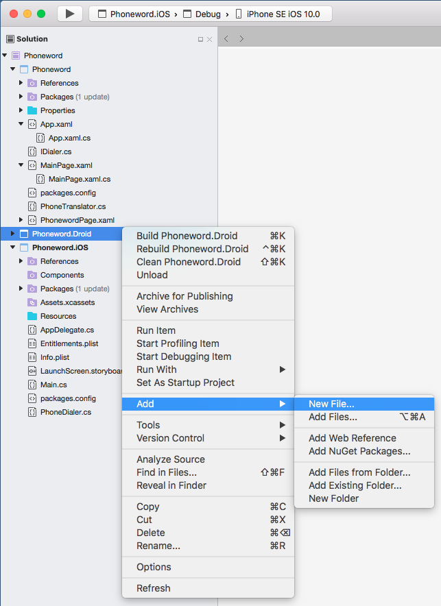

19. In the **New File** dialog, select **General > Empty Class**, name the new file **PhoneDialer**, and click the **New** button:

    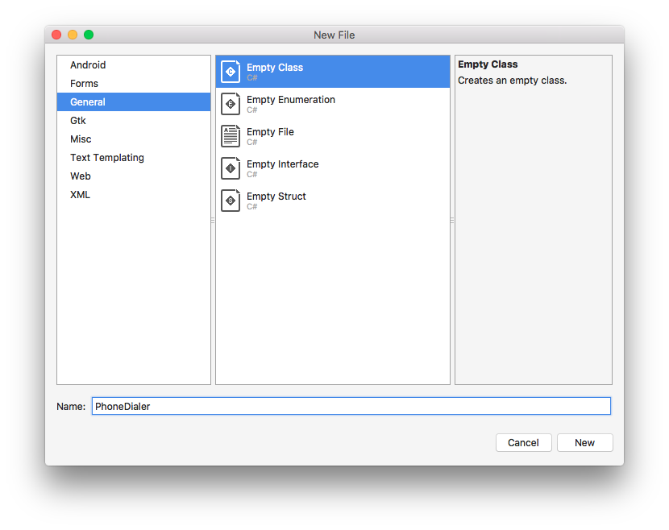

20. In **PhoneDialer.cs**, remove all of the template code and replace it with the following code. This code creates the `Dial` method that will be used on the Android platform to dial a translated phone number:

    ```csharp
    using Android.Content;
    using Android.Telephony;
    using Phoneword.Droid;
    using System.Linq;
    using Xamarin.Forms;
    using Uri = Android.Net.Uri;

    [assembly: Dependency(typeof(PhoneDialer))]
    namespace Phoneword.Droid
    {
        public class PhoneDialer : IDialer
        {
            public bool Dial(string number)
            {
                var context = MainActivity.Instance;
                if (context == null)
                    return false;

                var intent = new Intent (Intent.ActionDial);
                intent.SetData (Uri.Parse ("tel:" + number));

                if (IsIntentAvailable (context, intent)) {
                    context.StartActivity (intent);
                    return true;
                }

                return false;
            }

            public static bool IsIntentAvailable(Context context, Intent intent)
            {
                var packageManager = context.PackageManager;

                var list = packageManager.QueryIntentServices (intent, 0)
                    .Union (packageManager.QueryIntentActivities (intent, 0));

                if (list.Any ())
                    return true;

                var manager = TelephonyManager.FromContext (context);
                return manager.PhoneType != PhoneType.None;
            }
        }
    }
    ```

    Note that this code assumes that you are using the latest Android API. Save the changes to **PhoneDialer.cs** by choosing **File > Save** (or by pressing **&#8984; + S**), and close the file.

21. In the **Solution Pad**, in the **Phoneword.Droid** project, double click **MainActivity.cs** to open it, remove all of the template code and replace it with the following code:

    ```csharp
    using Android.App;
    using Android.Content.PM;
    using Android.OS;

    namespace Phoneword.Droid
    {
        [Activity(Label = "Phoneword", Icon = "@mipmap/icon", Theme = "@style/MainTheme", MainLauncher = true,
                  ConfigurationChanges = ConfigChanges.ScreenSize | ConfigChanges.Orientation)]
        public class MainActivity : global::Xamarin.Forms.Platform.Android.FormsAppCompatActivity
        {
            internal static MainActivity Instance { get; private set; }

            protected override void OnCreate(Bundle bundle)
            {
                TabLayoutResource = Resource.Layout.Tabbar;
                ToolbarResource = Resource.Layout.Toolbar;

                base.OnCreate(bundle);
                Instance = this;
                global::Xamarin.Forms.Forms.Init(this, bundle);
                LoadApplication(new App());
            }
        }
    }
    ```

    Save the changes to **MainActivity.cs** by choosing **File > Save** (or by pressing **&#8984; + S**), and close the file.

22. In the **Solution Pad**, expand the **Properties** folder and double-click the **AndroidManifest.xml** file:

    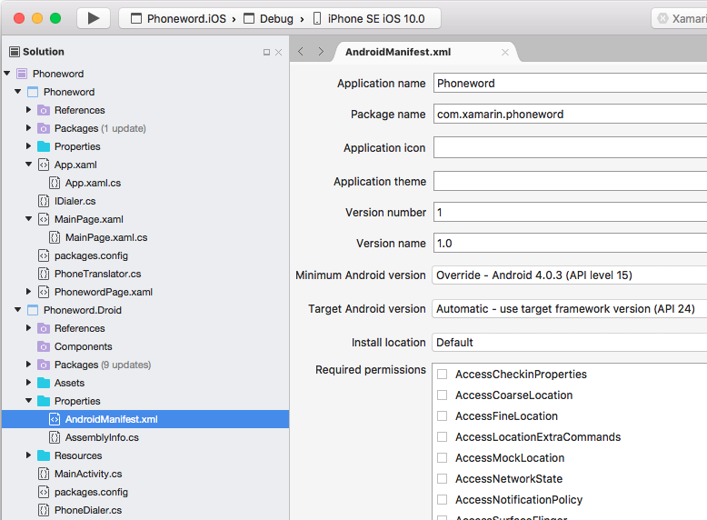

23. In the **Required permissions** section, enable the **CallPhone** permission. This gives the application permission to place a phone call:

    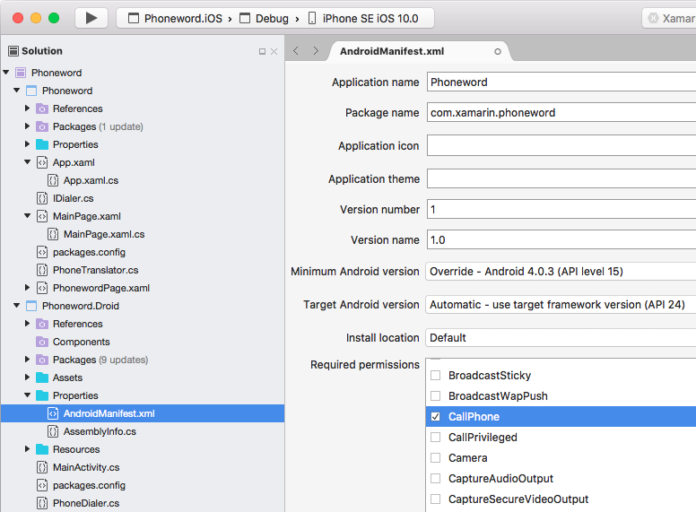

    Save the changes to **AndroidManifest.xml** by choosing **File > Save** (or by pressing **&#8984; + S**), and close the file.

24. In Visual Studio for Mac, select the **Build > Build All** menu item (or press **&#8984; + B**). The application will build and a success message will appear in the Visual Studio for Mac toolbar.

    

25. If there are errors, repeat the previous steps and correct any mistakes until the application builds successfully.
26. In the Visual Studio for Mac toolbar, press the **Start** button (the triangular button that resembles a Play button) to launch the application inside the iOS Simulator:

    
    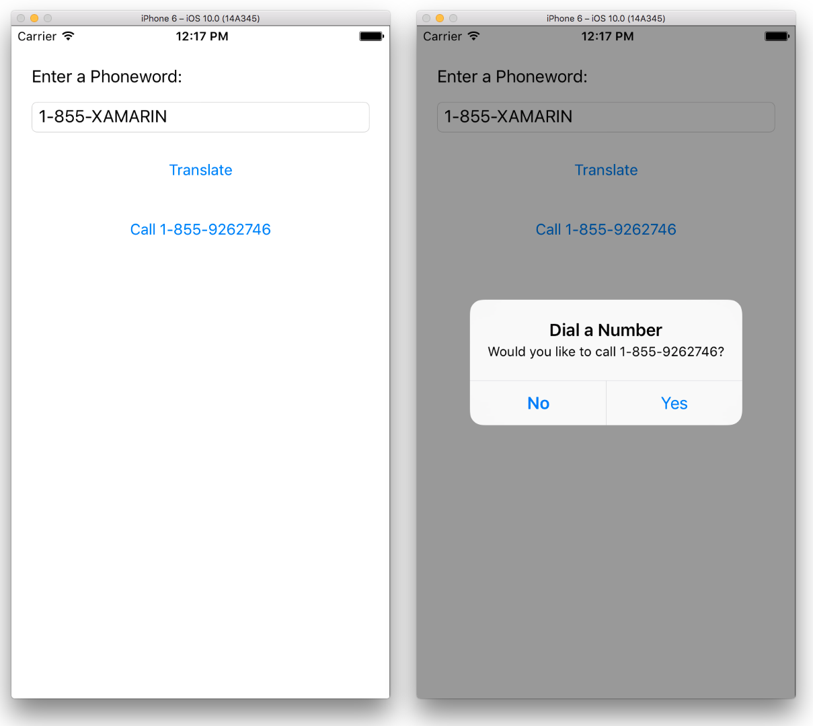

    Note: phone calls are not supported in the iOS Simulator.

27. In the **Solution Pad**, select the **Phoneword.Droid** project, right-click and select **Set As Startup Project**:

    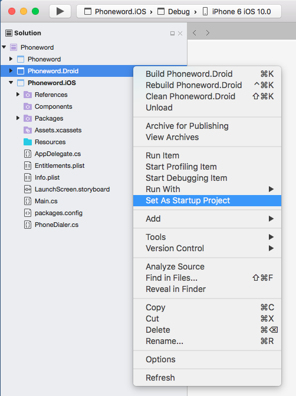

28. In the Visual Studio for Mac toolbar, press the **Start** button (the triangular button that resembles a Play button) to launch the application inside an Android emulator:

    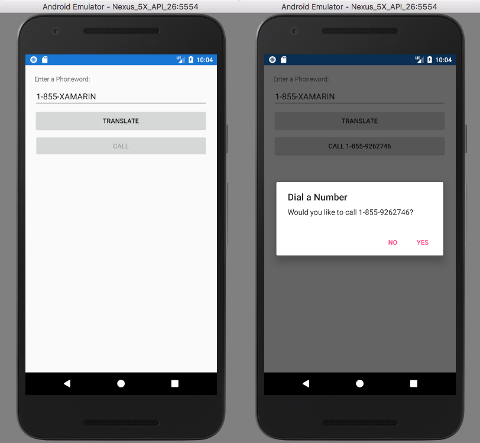

    Note: phone calls are not supported in Android emulators.

-----

Congratulations on completing a Xamarin.Forms application. The [next topic](~/xamarin-forms/get-started/hello-xamarin-forms/deepdive.md) in this guide reviews the steps that were taken in this walkthrough to gain an understanding of the fundamentals of application development using Xamarin.Forms.


## Related Links

- [Accessing Native Features via the DependencyService](~/xamarin-forms/app-fundamentals/dependency-service/index.md)
- [Phoneword (sample)](https://developer.xamarin.com/samples/xamarin-forms/Phoneword/)
