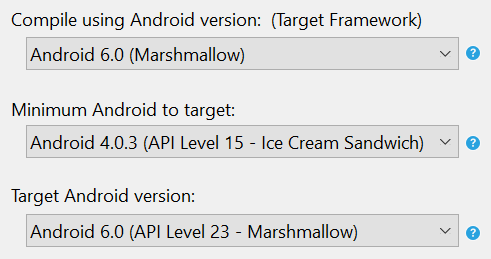

# Xamarin.Forms Requirements

_Platform and development system requirements for Xamarin.Forms._

Refer to the [Installation](~/cross-platform/get-started/installation/index.md) article for an overview of installation and setup practices that apply across platforms.

## Target Platforms

Xamarin.Forms applications can be written for the following operating systems:

-  iOS 8 or higher
-  Android 4.0.3 (API 15) or higher ([more details](#android))
-  Windows 10 Universal Windows Platform ([more details](#windows10))
-  Windows 8.1 / Windows Phone 8.1 WinRT ([more details](#windows))
-  *Windows Phone 8 Silverlight (DEPRECATED)*

It is assumed that developers have familiarity with [Portable Class Libraries](~/cross-platform/app-fundamentals/pcl.md) and [Shared Projects](~/cross-platform/app-fundamentals/shared-projects.md).

<a name="android" />

### Android

You should have the latest Android SDK Tools and Android API platform installed. You can update to the latest versions using the [Android SDK Manager](~/android/get-started/installation/android-sdk.md).

Additionally, the target/compile version for Android projects **must** be set to *Use latest installed platform*. However the minimum version can be set to API 15 so you can continue to support devices
that use Android 4.0.3 and newer. These values are set in the **Project Options**:

# [Visual Studio](#tab/vswin)

**Project Options > Application > Application Properties**

# [Visual Studio for Mac](#tab/vsmac)

**Build > General**

**Build > Android Application**

-----

<a name="windows10" />

### Universal Windows Platform

Windows 10 UWP projects are not added when a solution is created on macOS. For instructions on how to add these projects to an existing solution, see [Adding a Universal Windows Platform (UWP) App](~/xamarin-forms/platform/windows/installation/universal.md).

<a name="windows" />

### Windows 8.1 / Windows Phone 8.1 WinRT

Windows 8.1 / Windows Phone 8.1 WinRT projects are not added when a solution is created on macOS. For instructions on how to add these projects to an existing solution, see [Adding a Windows Phone App](~/xamarin-forms/platform/windows/installation/phone.md) and [Adding a Windows App](~/xamarin-forms/platform/windows/installation/tablet.md).

## Development System Requirements

Xamarin.Forms apps can be developed on macOS and Windows. However, Windows and Visual Studio are required to produce Windows versions of the app.

## Mac System Requirements

You can use Visual Studio for Mac to develop Xamarin.Forms apps on OS X El Capitan (10.11) or newer. To develop iOS apps, we recommend having at least the iOS 10 SDK and Xcode 8 installed.

> [!NOTE]
>  Windows apps cannot be developed on macOS.

## Windows System Requirements

Xamarin.Forms apps for iOS and Android can be built on any Windows installation that supports Xamarin development. This requires Visual Studio 2015 or newer running on Windows 7 or higher. A networked Mac is required for iOS development.

### Universal Windows Platform (UWP)

Developing Xamarin.Forms apps for UWP requires:

* Windows 10 (Fall Creators Update recommended)

* Visual Studio 2017 is recommended

* [Windows 10 SDK](https://dev.windows.com/downloads/windows-10-sdk)

UWP projects are included in Xamarin.Forms solutions created in Visual Studio 2015 and Visual Studio 2017.
You can also [add a Universal Windows Platform (UWP) App](~/xamarin-forms/platform/windows/installation/universal.md) to an existing
Xamarin.Forms solution.

