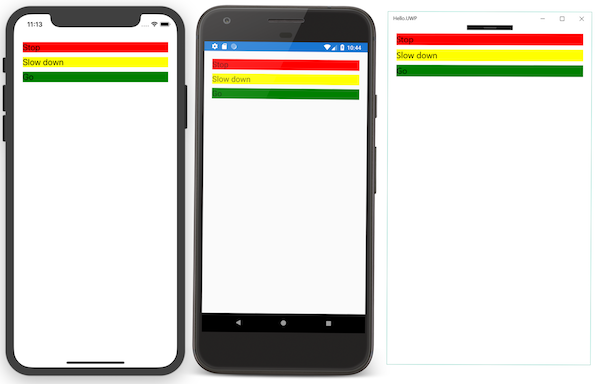
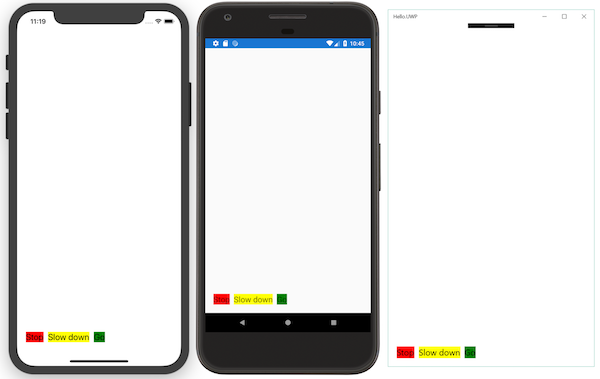
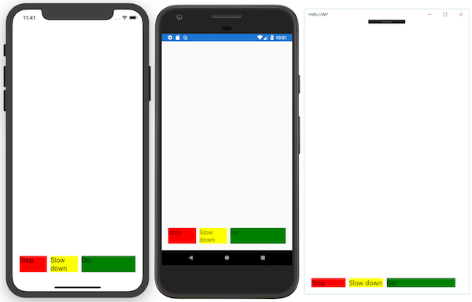
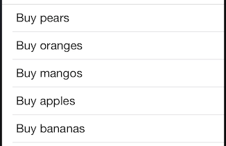

# An Introduction to Xamarin.Forms

_Xamarin.Forms is a cross-platform natively backed UI toolkit abstraction that allows developers to easily create user interfaces that can be shared across Android, iOS, Windows, and the Universal Windows Platform. The user interfaces are rendered using the native controls of the target platform, allowing Xamarin.Forms applications to retain the appropriate look and feel for each platform. This article provides an introduction to Xamarin.Forms and how to get started writing applications with it._

<a name="Overview" />

## Overview

Xamarin.Forms is a framework that allows developers to rapidly create cross platform user interfaces. It provides its own abstraction for the user interface that will be rendered using native controls on iOS, Android, or the Universal Windows Platform (UWP). This means that applications can share a large portion of their user interface code and still retain the native look and feel of the target platform.

Xamarin.Forms allows for rapid prototyping of applications that can evolve over time to complex applications. Because Xamarin.Forms applications are native applications, they don't have the limitations of other toolkits such as browser sandboxing, limited APIs, or poor performance. Applications written using Xamarin.Forms are able to utilize any of the API’s or features of the underlying platform, such as (but not limited to) CoreMotion, PassKit, and StoreKit on iOS; NFC and Google Play Services on Android; and Tiles on Windows. In addition, it's possible to create applications that will have parts of their user interface created with Xamarin.Forms while other parts are created using the native UI toolkit.

Xamarin.Forms applications are architected in the same way as traditional cross-platform applications. The most common approach is to use [Portable Libraries](~/cross-platform/app-fundamentals/pcl.md) or [Shared Projects](~/cross-platform/app-fundamentals/shared-projects.md) to house the shared code, and create platform specific applications that will consume the shared code.

There are two techniques to create user interfaces in Xamarin.Forms. The first technique is to create UIs entirely with C# source code. The second technique is to use *Extensible Application Markup Language* (XAML), a declarative markup language that is used to describe user interfaces. For more information about XAML, see [XAML Basics](~/xamarin-forms/xaml/xaml-basics/index.md).

This article discusses the fundamentals of the Xamarin.Forms framework, and covers the following topics:

-  [Examining a Xamarin.Forms application](#Examining_A_Xamarin.Forms_Application).
-  [How Xamarin.Forms pages and controls are used](#Views_and_Layouts).
-  [How to use display a list of data](#Lists_in_Xamarin.Forms).
-  [How to set up data binding](#Data_Binding).
-  [How to navigate between pages](#Navigation).
-  [Next steps](#Next_Steps).

<a name="Examining_A_Xamarin_Forms_Application" />

### Examining a Xamarin.Forms Application

In Visual Studio for Mac and Visual Studio, the default Xamarin.Forms app template creates the simplest Xamarin.Forms solution possible, which displays text to the user. If you run the application, it should appear similar to the following screenshots:

[](introduction-to-xamarin-forms-images/image05.png#lightbox "Default Xamarin.Forms Application")

Each screen in the screenshots corresponds to a *Page* in Xamarin.Forms. A [`Page`](xref:Xamarin.Forms.Page) represents an *Activity* in Android, a *View Controller* in iOS, or a *Page* in the Windows Universal Platform (UWP). The sample in the screenshots above instantiates a [`ContentPage`](xref:Xamarin.Forms.ContentPage) object and uses that to display a [`Label`](xref:Xamarin.Forms.Label).

To maximize the reuse of the startup code, Xamarin.Forms applications have a single class named `App` that is responsible for instantiating the first [`Page`](xref:Xamarin.Forms.Page) that will be displayed. An example of the `App` class can be seen in the following code:

```csharp
public class App : Application
{
  public App ()
  {
    MainPage = new ContentPage {
      Content =  new Label
      {
          Text = "Hello, Forms !",
          VerticalOptions = LayoutOptions.CenterAndExpand,
          HorizontalOptions = LayoutOptions.CenterAndExpand,
      }
      };
  }
}
```

This code instantiates a new [`ContentPage`](xref:Xamarin.Forms.ContentPage) object that will display a single [`Label`](xref:Xamarin.Forms.Label) centered both vertically and horizontally on the page.

<a name="Launching_the_Initial_Xamarin_Forms_Page_on_Each_Platform" />

### Launching the Initial Xamarin.Forms Page on Each Platform

To use this [`Page`](xref:Xamarin.Forms.Page) inside an application, each platform application must initialize the Xamarin.Forms framework and provide an instance of the [`ContentPage`](xref:Xamarin.Forms.ContentPage) as it is starting up. This initialization step varies from platform to platform and is discussed in the following sections.

<a name="Launching_in_iOS" />

#### iOS

To launch the initial Xamarin.Forms page in iOS, the platform project includes the `AppDelegate` class that inherits from the `Xamarin.Forms.Platform.iOS.FormsApplicationDelegate` class, as demonstrated in the following code example:

```csharp
[Register("AppDelegate")]
public partial class AppDelegate : global::Xamarin.Forms.Platform.iOS.FormsApplicationDelegate
{
    public override bool FinishedLaunching(UIApplication app, NSDictionary options)
    {
      global::Xamarin.Forms.Forms.Init ();
      LoadApplication (new App ());
      return base.FinishedLaunching (app, options);
    }
}
```

The `FinishedLaunching` override initializes the Xamarin.Forms framework by calling the `Init` method. This causes the iOS-specific implementation of Xamarin.Forms to be loaded in the application before the root view controller is set by the call to the `LoadApplication` method.

<a name="Launching_in_Android" />

#### Android

To launch the initial Xamarin.Forms page in Android, the platform project includes code that creates an `Activity` with the `MainLauncher` attribute, with the activity inherting from the `FormsAppCompatActivity` class, as demonstrated in the following code example:

```csharp
namespace HelloXamarinFormsWorld.Android
{
    [Activity(Label = "HelloXamarinFormsWorld", Theme = "@style/MainTheme", MainLauncher = true,
        ConfigurationChanges = ConfigChanges.ScreenSize | ConfigChanges.Orientation)]
    public class MainActivity : FormsAppCompatActivity
    {
        protected override void OnCreate(Bundle bundle)
        {
            base.OnCreate(bundle);
            Xamarin.Forms.Forms.Init(this, bundle);
            LoadApplication (new App ());
        }
    }
}
```

The `OnCreate` override initializes the Xamarin.Forms framework by calling the `Init` method. This causes the Android-specific implementation of Xamarin.Forms to be loaded in the application before the Xamarin.Forms application is loaded.

#### Universal Windows Platform

In Universal Windows Platform (UWP) applications, the `Init` method that initializes the Xamarin.Forms framework is invoked from the `App` class:

```csharp
Xamarin.Forms.Forms.Init (e);

if (e.PreviousExecutionState == ApplicationExecutionState.Terminated)
{
  ...
}
```

This causes the UWP-specific implementation of Xamarin.Forms to be loaded in the application. The initial Xamarin.Forms page is launched by the `MainPage` class, as demonstrated in the following code example:

```csharp
public partial class MainPage
{
    public MainPage()
    {
      this.InitializeComponent();
      this.LoadApplication(new HelloXamarinFormsWorld.App());
    }
}
```

The Xamarin.Forms application is loaded with the `LoadApplication` method.

<a name="Views_and_Layouts" />

### Views and Layouts

There are four main control groups used to create the user interface of a Xamarin.Forms application.

1. **Pages** – Xamarin.Forms pages represent cross-platform mobile application screens. For more information about pages, see [Xamarin.Forms Pages](~/xamarin-forms/user-interface/controls/pages.md).
1. **Layouts** – Xamarin.Forms layouts are containers used to compose views into logical structures. For more information about layouts, see [Xamarin.Forms Layouts](~/xamarin-forms/user-interface/controls/layouts.md).
1. **Views** – Xamarin.Forms views are the controls displayed on the user interface, such as labels, buttons, and text entry boxes. For more information about views, see [Xamarin.Forms Views](~/xamarin-forms/user-interface/controls/views.md).
1. **Cells** – Xamarin.Forms cells are specialized elements used for items in a list, and describe how each item in a list should be drawn. For more information about cells, see [Xamarin.Forms Cells](~/xamarin-forms/user-interface/controls/cells.md).

At runtime, each control will be mapped to its native equivalent, which is what will be rendered.

Controls are hosted inside of a layout. The [`StackLayout`](xref:Xamarin.Forms.StackLayout) class, which implements a commonly used layout, will now be examined.

<a name="StackLayout" />

#### StackLayout

The [`StackLayout`](xref:Xamarin.Forms.StackLayout) simplifies cross-platform application development by automatically arranging controls on the screen regardless of the screen size. Each child element is positioned one after the other, either horizontally or vertically in the order they were added. How much space the `StackLayout` will use depends on how the [`HorizontalOptions`](xref:Xamarin.Forms.View.HorizontalOptions) and [`VerticalOptions`](xref:Xamarin.Forms.View.HorizontalOptions) properties are set, but by default the `StackLayout` will try to use the entire screen.

The following XAML code shows an example of using a [`StackLayout`](xref:Xamarin.Forms.StackLayout) to arrange three [`Label`](xref:Xamarin.Forms.Label) controls:

```xaml
<?xml version="1.0" encoding="utf-8" ?>
<ContentPage xmlns="http://xamarin.com/schemas/2014/forms" xmlns:x="http://schemas.microsoft.com/winfx/2006/xaml" x:Class="HelloXamarinFormsWorldXaml.StackLayoutExample1" Padding="20">
  <StackLayout Spacing="10">
    <Label Text="Stop" BackgroundColor="Red" Font="20" />
    <Label Text="Slow down" BackgroundColor="Yellow" Font="20" />
    <Label Text="Go" BackgroundColor="Green" Font="20" />
  </StackLayout>
</ContentPage>
```

The equivalent C# code is shown in the following code example:

```csharp
public class StackLayoutExample : ContentPage
{
    public StackLayoutExample()
    {
        Padding = new Thickness(20);
        var red = new Label
        {
            Text = "Stop", BackgroundColor = Color.Red, FontSize = 20
        };
        var yellow = new Label
        {
            Text = "Slow down", BackgroundColor = Color.Yellow, FontSize = 20
        };
        var green = new Label
        {
            Text = "Go", BackgroundColor = Color.Green, FontSize = 20
        };

        Content = new StackLayout
        {
            Spacing = 10,
            Children = { red, yellow, green }
        };
    }
}
```

By default the [`StackLayout`](xref:Xamarin.Forms.StackLayout) assumes a vertical orientation as shown in the following screenshots:

[](introduction-to-xamarin-forms-images/image09.png#lightbox "Vertical StackLayout")

The orientation of the [`StackLayout`](xref:Xamarin.Forms.StackLayout) can be changed to a horizontal orientation, as demonstrated in the following XAML code example:

```xaml
<?xml version="1.0" encoding="utf-8" ?>
<ContentPage xmlns="http://xamarin.com/schemas/2014/forms" xmlns:x="http://schemas.microsoft.com/winfx/2006/xaml" x:Class="HelloXamarinFormsWorldXaml.StackLayoutExample2" Padding="20">
  <StackLayout Spacing="10" VerticalOptions="End" Orientation="Horizontal" HorizontalOptions="Start">
    <Label Text="Stop" BackgroundColor="Red" Font="20" />
    <Label Text="Slow down" BackgroundColor="Yellow" Font="20" />
    <Label Text="Go" BackgroundColor="Green" Font="20" />
  </StackLayout>
</ContentPage>
```

The equivalent C# code is shown in the following code example:

```csharp
public class StackLayoutExample: ContentPage
{
    public StackLayoutExample()
    {
        // Code that creates labels removed for clarity
        Content = new StackLayout
        {
            Spacing = 10,
            VerticalOptions = LayoutOptions.End,
            Orientation = StackOrientation.Horizontal,
            HorizontalOptions = LayoutOptions.Start,
            Children = { red, yellow, green }
        };
    }
}
```

The following screenshots show the resulting layout:

[](introduction-to-xamarin-forms-images/image10.png#lightbox "Horizontal StackLayout")

The size of controls can be set through the `HeightRequest` and `WidthRequest` properties, as demonstrated in the following XAML code example:

```xaml
<?xml version="1.0" encoding="utf-8" ?>
<ContentPage xmlns="http://xamarin.com/schemas/2014/forms" xmlns:x="http://schemas.microsoft.com/winfx/2006/xaml" x:Class="HelloXamarinFormsWorldXaml.StackLayoutExample3" Padding="20">
  <StackLayout Spacing="10" VerticalOptions="End" Orientation="Horizontal" HorizontalOptions="Start">
    <Label Text="Stop" BackgroundColor="Red" Font="20" WidthRequest="100" />
    <Label Text="Slow down" BackgroundColor="Yellow" Font="20" WidthRequest="100" />
    <Label Text="Go" BackgroundColor="Green" Font="20" WidthRequest="200" />
  </StackLayout>
</ContentPage>
```

The equivalent C# code is shown in the following code example:

```csharp
var red = new Label
{
    Text = "Stop", BackgroundColor = Color.Red, FontSize = 20, WidthRequest = 100
};
var yellow = new Label
{
    Text = "Slow down", BackgroundColor = Color.Yellow, FontSize = 20, WidthRequest = 100
};
var green = new Label
{
    Text = "Go", BackgroundColor = Color.Green, FontSize = 20, WidthRequest = 200
};

Content = new StackLayout
{
    Spacing = 10,
    VerticalOptions = LayoutOptions.End,
    Orientation = StackOrientation.Horizontal,
    HorizontalOptions = LayoutOptions.Start,
    Children = { red, yellow, green }
};
```

The following screenshots show the resulting layout:

[](introduction-to-xamarin-forms-images/image11.png#lightbox "Horizontal StackLayout with LayoutOptions")

For more information about the [`StackLayout`](xref:Xamarin.Forms.StackLayout) class, see [StackLayout](~/xamarin-forms/user-interface/layouts/stack-layout.md).

<a name="Lists_in_Xamarin_Forms" />

## Lists in Xamarin.Forms

The [`ListView`](xref:Xamarin.Forms.ListView) control is responsible for displaying a collection of items on the screen – each item in the `ListView` will be contained in a single cell. By default, a `ListView` will use the built-in [`TextCell`](xref:Xamarin.Forms.TextCell) template and render a single line of text.

The following code example shows a simple [`ListView`](xref:Xamarin.Forms.ListView) example:

```csharp
var listView = new ListView
{
    RowHeight = 40
};
listView.ItemsSource = new string []
{
    "Buy pears", "Buy oranges", "Buy mangos", "Buy apples", "Buy bananas"
};
Content = new StackLayout
{
    VerticalOptions = LayoutOptions.FillAndExpand,
    Children = { listView }
};
```

The following screenshot shows the resulting [`ListView`](xref:Xamarin.Forms.ListView):

 

For more information about the [`ListView`](xref:Xamarin.Forms.ListView) control, see [ListView](~/xamarin-forms/user-interface/listview/index.md).

<a name="Binding_to_a_Custom_Class" />

### Binding to a Custom Class

The [`ListView`](xref:Xamarin.Forms.ListView) control can also display custom objects using the default [`TextCell`](xref:Xamarin.Forms.TextCell) template.

The following code example shows the `TodoItem` class:

```csharp
public class TodoItem
{
    public string Name { get; set; }
    public bool Done { get; set; }
}
```

The [`ListView`](xref:Xamarin.Forms.ListView) control can be populated as demonstrated in the following code example:

```csharp
listView.ItemsSource = new TodoItem [] {
    new TodoItem { Name = "Buy pears" },
    new TodoItem { Name = "Buy oranges", Done=true} ,
    new TodoItem { Name = "Buy mangos" },
    new TodoItem { Name = "Buy apples", Done=true },
    new TodoItem { Name = "Buy bananas", Done=true }
};
```

A binding can be created to set which `TodoItem` property is displayed by the [`ListView`](xref:Xamarin.Forms.ListView), as demonstrated in the following code example:

```csharp
listView.ItemTemplate = new DataTemplate(typeof(TextCell));
listView.ItemTemplate.SetBinding(TextCell.TextProperty, "Name");
```

This creates a binding that specifies the path to the `TodoItem.Name` property, and will result in the previously displayed screenshot.

For more information about binding to a custom class, see [ListView Data Sources](~/xamarin-forms/user-interface/listview/data-and-databinding.md).

<a name="Selecting_an_Item_in_a_ListView" />

### Selecting an Item in a ListView

To respond to a user touching a cell in a [`ListView`](xref:Xamarin.Forms.ListView), the [`ItemSelected`](xref:Xamarin.Forms.ListView.ItemSelected) event should be handled, as demonstrated in the following code example:

```csharp
listView.ItemSelected += async (sender, e) => {
    await DisplayAlert("Tapped!", e.SelectedItem + " was tapped.", "OK");
};
```

When contained within a [`NavigationPage`](xref:Xamarin.Forms.NavigationPage), the [`PushAsync`](xref:Xamarin.Forms.NavigationPage.PushAsync(Xamarin.Forms.Page)) method can be used to open a new page with built-in back-navigation. The [`ItemSelected`](xref:Xamarin.Forms.ListView.ItemSelected) event can access the object that was associated with the cell through the [`e.SelectedItem`](xref:Xamarin.Forms.SelectedItemChangedEventArgs.SelectedItem) property, bind it to a new page and display the new page using `PushAsync`, as demonstrated in the following code example:

```csharp
listView.ItemSelected += async (sender, e) => {
    var todoItem = (TodoItem)e.SelectedItem;
    var todoPage = new TodoItemPage(todoItem); // so the new page shows correct data
    await Navigation.PushAsync(todoPage);
};
```

Each platform implements built-in back-navigation in its own way. For more information, see [Navigation](#Navigation).

For more information about [`ListView`](xref:Xamarin.Forms.ListView) selection, see [ListView Interactivity](~/xamarin-forms/user-interface/listview/interactivity.md).

<a name="Customizing_the_appearance_of_a_cell" />

### Customizing the Appearance of a Cell

Cell appearance can be customized by subclassing the [`ViewCell`](xref:Xamarin.Forms.ViewCell) class, and setting the type of this class to the [`ItemTemplate`](xref:Xamarin.Forms.ItemsView`1.ItemTemplate) property of the [`ListView`](xref:Xamarin.Forms.ListView).

The cell shown in the following screenshot is composed of one [`Image`](xref:Xamarin.Forms.Image) and two [`Label`](xref:Xamarin.Forms.Label) controls:

 

To create this custom layout, the [`ViewCell`](xref:Xamarin.Forms.ViewCell) class should be subclassed, as demonstrated in the following code example:

```csharp
class EmployeeCell : ViewCell
{
    public EmployeeCell()
    {
        var image = new Image
        {
            HorizontalOptions = LayoutOptions.Start
        };
        image.SetBinding(Image.SourceProperty, new Binding("ImageUri"));
        image.WidthRequest = image.HeightRequest = 40;

        var nameLayout = CreateNameLayout();
        var viewLayout = new StackLayout()
        {
           Orientation = StackOrientation.Horizontal,
           Children = { image, nameLayout }
        };
        View = viewLayout;
    }

    static StackLayout CreateNameLayout()
    {
        var nameLabel = new Label
        {
            HorizontalOptions= LayoutOptions.FillAndExpand
        };
        nameLabel.SetBinding(Label.TextProperty, "DisplayName");

        var twitterLabel = new Label
        {
           HorizontalOptions = LayoutOptions.FillAndExpand,
           Font = Fonts.Twitter
        };
        twitterLabel.SetBinding(Label.TextProperty, "Twitter");

        var nameLayout = new StackLayout()
        {
           HorizontalOptions = LayoutOptions.StartAndExpand,
           Orientation = StackOrientation.Vertical,
           Children = { nameLabel, twitterLabel }
        };
        return nameLayout;
    }
}
```

The code performs the following tasks:

-  It adds an [`Image`](xref:Xamarin.Forms.Image) control and binds it to the `ImageUri` property of the `Employee` object. For more information about data binding, see [Data Binding](#Data_Binding).
-  It creates a [`StackLayout`](xref:Xamarin.Forms.StackLayout) with a vertical orientation to hold the two [`Label`](xref:Xamarin.Forms.Label) controls. The `Label` controls are bound to the `DisplayName` and the `Twitter` properties of the `Employee` object.
-  It creates a [`StackLayout`](xref:Xamarin.Forms.StackLayout) that will host the existing [`Image`](xref:Xamarin.Forms.Image) and `StackLayout`. It will arrange its children using a horizontal orientation.

Once the custom cell has been created it can be consumed by a [`ListView`](xref:Xamarin.Forms.ListView) control by wrapping it in a [`DataTemplate`](xref:Xamarin.Forms.DataTemplate), as demonstrated in the following code example:

```csharp
List<Employee> myListOfEmployeeObjects = GetAListOfAllEmployees();
var listView = new ListView
{
    RowHeight = 40
};
listView.ItemsSource = myListOfEmployeeObjects;
listView.ItemTemplate = new DataTemplate(typeof(EmployeeCell));
```

This code will provide a `List` of `Employee` to the [`ListView`](xref:Xamarin.Forms.ListView). Each cell will be rendered using the `EmployeeCell` class. The `ListView` will pass the `Employee` object to the `EmployeeCell` as its [`BindingContext`](xref:Xamarin.Forms.BindableObject.BindingContext).

For more information about customizing cell appearance, see [Cell Appearance](~/xamarin-forms/user-interface/listview/customizing-cell-appearance.md).

<a name="Using_XAML_to_Create_and_Customize_A_List" />

### Using XAML to Create and Customize A List

The XAML equivalent of the [`ListView`](xref:Xamarin.Forms.ListView) in the previous section is demonstrated in the following code example:

```xaml
<?xml version="1.0" encoding="utf-8" ?>
<ContentPage xmlns="http://xamarin.com/schemas/2014/forms"
             xmlns:x="http://schemas.microsoft.com/winfx/2006/xaml"
             xmlns:local="clr-namespace:XamarinFormsXamlSample;assembly=XamarinFormsXamlSample"
             xmlns:constants="clr-namespace:XamarinFormsSample;assembly=XamarinFormsXamlSample"
             x:Class="XamarinFormsXamlSample.Views.EmployeeListPage"
             Title="Employee List">
  <ListView x:Name="listView" IsVisible="false" ItemsSource="{x:Static local:App.Employees}" ItemSelected="EmployeeListOnItemSelected">
    <ListView.ItemTemplate>
      <DataTemplate>
        <ViewCell>
          <ViewCell.View>
            <StackLayout Orientation="Horizontal">
              <Image Source="{Binding ImageUri}" WidthRequest="40" HeightRequest="40" />
              <StackLayout Orientation="Vertical" HorizontalOptions="StartAndExpand">
                <Label Text="{Binding DisplayName}" HorizontalOptions="FillAndExpand" />
                <Label Text="{Binding Twitter}" Font="{x:Static constants:Fonts.Twitter}"/>
              </StackLayout>
            </StackLayout>
          </ViewCell.View>
        </ViewCell>
      </DataTemplate>
    </ListView.ItemTemplate>
  </ListView>
</ContentPage>
```

This XAML defines a [`ContentPage`](xref:Xamarin.Forms.ContentPage) that contains a [`ListView`](xref:Xamarin.Forms.ListView). The data source of the `ListView` is set via the [`ItemsSource`](xref:Xamarin.Forms.ItemsView`1.ItemsSource) attribute. The layout of each row in the `ItemsSource` is defined within the [`ListView.ItemTemplate`](xref:Xamarin.Forms.ItemsView`1.ItemTemplate) element.

<a name="Data_Binding" />

## Data Binding

Data binding connects two objects, called the *source* and the *target*. The *source* object provides the data. The *target* object will consume (and often display) data from the source object. For example, a [`Label`](xref:Xamarin.Forms.Label) (*target* object) will commonly bind its [`Text`](xref:Xamarin.Forms.Label.Text) property to a public `string` property in a *source* object. The following diagram illustrates the binding relationship:


The main benefit of data binding is that you no longer have to worry about synchronizing data between your views and data source. Changes in the *source* object are automatically pushed to the *target* object behind-the-scenes by the binding framework, and changes in the target object can be optionally pushed back to the *source* object.

Establishing data binding is a two step process:

- The [`BindingContext`](xref:Xamarin.Forms.BindableObject.BindingContext) property of the *target* object must be set to the *source*.
- A binding must be established between the *target* and the *source*. In XAML, this is achieved by using the [`Binding`](xref:Xamarin.Forms.Xaml.BindingExtension) markup extension. In C#, this is achieved by the [`SetBinding`](xref:Xamarin.Forms.BindableObject.SetBinding(Xamarin.Forms.BindableProperty,Xamarin.Forms.BindingBase)) method.

For more information about data binding, see [Data Binding Basics](~/xamarin-forms/xaml/xaml-basics/data-binding-basics.md).

### XAML

The following code shows an example of performing data binding in XAML:

```xaml
<Entry Text="{Binding FirstName}" ... />
```

A binding between the [`Entry.Text`](xref:Xamarin.Forms.Entry.Text) property and the `FirstName` property of the *source* object is established. Changes made in the `Entry` control will automatically be propagated to the `employeeToDisplay` object. Similarly, if changes are made to to the `employeeToDisplay.FirstName` property, the Xamarin.Forms binding engine will also update the contents of the `Entry` control. This is known as a *two-way binding*. In order for two-way binding to work, the model class must implement the `INotifyPropertyChanged` interface.

Although the [`BindingContext`](xref:Xamarin.Forms.BindableObject.BindingContext) property of the `EmployeeDetailPage` class can be set in XAML, here it’s set in code-behind to an instance of an `Employee` object:

```csharp
public EmployeeDetailPage(Employee employee)
{
    InitializeComponent();
    this.BindingContext = employee;
}
```

While the [`BindingContext`](xref:Xamarin.Forms.BindableObject.BindingContext) property of each *target* object can be individually set, this isn’t necessary. `BindingContext` is a special property that’s inherited by all its children. Therefore, when the `BindingContext` on the [`ContentPage`](xref:Xamarin.Forms.ContentPage) is set to an `Employee` instance, all of the children of the `ContentPage` have the same `BindingContext`, and can bind to public properties of the `Employee` object.

### C&#35;

The following code shows an example of performing data binding in C#:

```csharp
public EmployeeDetailPage(Employee employeeToDisplay)
{
    this.BindingContext = employeeToDisplay;
    var firstName = new Entry()
    {
        HorizontalOptions = LayoutOptions.FillAndExpand
    };
    firstName.SetBinding(Entry.TextProperty, "FirstName");
    ...
}
```

The [`ContentPage`](xref:Xamarin.Forms.ContentPage) constructor is passed an instance of an `Employee` object, and sets the [`BindingContext`](xref:Xamarin.Forms.BindableObject.BindingContext) to the object to bind to. An [`Entry`](xref:Xamarin.Forms.Entry) control is instantiated, and the binding between the [`Entry.Text`](xref:Xamarin.Forms.Entry.Text) property and the `FirstName` property of the *source* object is set. Changes made in the `Entry` control will automatically be propagated to the `employeeToDisplay` object. Similarly, if changes are made to to the `employeeToDisplay.FirstName` property, the Xamarin.Forms binding engine will also update the contents of the `Entry` control. This is known as a *two-way binding*. In order for two-way binding to work, the model class must implement the `INotifyPropertyChanged` interface.

The `SetBinding` method takes two parameters. The first parameter specifies information about the type of binding. The second parameter is used to provide information about what to bind to or how to bind. The second parameter is, in most cases, just a string holding the name of property on the [`BindingContext`](xref:Xamarin.Forms.BindableObject.BindingContext). The following syntax is used to bind to the `BindingContext` directly:

```csharp
someLabel.SetBinding(Label.TextProperty, new Binding("."));
```

The dot syntax tells Xamarin.Forms to use the [`BindingContext`](xref:Xamarin.Forms.BindableObject.BindingContext) as the data source instead of a property on the `BindingContext`. This is useful when the `BindingContext` is a simple type, such as a `string` or an `int`.

<a name="INotifyPropertyChanged" />

### Property Change Notification

By default, the *target* object only receives the value of the *source* object when the binding is created. To keep the UI synchronized with the data source, there must be a way to notify the *target* object when the *source* object has changed. This mechanism is provided by the `INotifyPropertyChanged` interface. Implementing this interface will provide notifications to any data-bound controls when the underlying property value changes.

Objects that implement `INotifyPropertyChanged` must raise the `PropertyChanged` event when one of their properties is updated with a new value, as demonstrated in the following code example:

```csharp
public class MyObject : INotifyPropertyChanged
{
    public event PropertyChangedEventHandler PropertyChanged;

    string _firstName;
    public string FirstName
    {
        get { return _firstName; }
        set
        {
            if (value.Equals(_firstName, StringComparison.Ordinal))
            {
                // Nothing to do - the value hasn't changed;
                return;
            }
            _firstName = value;
            OnPropertyChanged();

        }
    }

    void OnPropertyChanged([CallerMemberName] string propertyName = null)
    {
        var handler = PropertyChanged;
        if (handler != null)
        {
            handler(this, new PropertyChangedEventArgs(propertyName));
        }
    }
}
```

When the `MyObject.FirstName` property changes, the `OnPropertyChanged` method is invoked, which will raise the `PropertyChanged` event. To avoid unnecessary events firing, the `PropertyChanged` event isn't raised if the property value doesn't change.

Note that in the `OnPropertyChanged` method the `propertyName` parameter is adorned with the `CallerMemberName` attribute. This ensures that if the `OnPropertyChanged` method is invoked with a `null` value, the `CallerMemberName` attribute will provide the name of the method that invoked `OnPropertyChanged`.

<a name="Navigation" />

## Navigation

Xamarin.Forms provides a number of different page navigation experiences, depending upon the [`Page`](xref:Xamarin.Forms.Page) type being used. For [`ContentPage`](xref:Xamarin.Forms.ContentPage) instances there are two navigation experiences:

- [Hierarchical Navigation](#Hierarchical_Navigation)
- [Modal Navigation](#Modal_Navigation)

The [`CarouselPage`](xref:Xamarin.Forms.CarouselPage), [`MasterDetailPage`](xref:Xamarin.Forms.MasterDetailPage) and [`TabbedPage`](xref:Xamarin.Forms.TabbedPage) classes provide alternative navigation experiences. For more information, see [Navigation](~/xamarin-forms/app-fundamentals/navigation/index.md).

<a name="Hierarchical_Navigation" />

### Hierarchical Navigation

The [`NavigationPage`](xref:Xamarin.Forms.NavigationPage) class provides a hierarchical navigation experience where the user is able to navigate through pages, forwards and backwards, as desired. The class implements navigation as a last-in, first-out (LIFO) stack of [`Page`](xref:Xamarin.Forms.Page) objects.

In hierarchical navigation, the [`NavigationPage`](xref:Xamarin.Forms.NavigationPage) class is used to navigate through a stack of [`ContentPage`](xref:Xamarin.Forms.ContentPage) objects. To move from one page to another, an application will push a new page onto the navigation stack, where it will become the active page. To return back to the previous page, the application will pop the current page from the navigation stack, and the new topmost page becomes the active page.

The first page added to a navigation stack is referred to as the *root* page of the application, and the following code example shows how this is accomplished:

```csharp
public App ()
{
    MainPage = new NavigationPage(new EmployeeListPage());
}
```

To navigate to the `LoginPage`, it is necessary to invoke the [`PushAsync`](xref:Xamarin.Forms.NavigationPage.PushAsync(Xamarin.Forms.Page)) method on the [`Navigation`](xref:Xamarin.Forms.VisualElement.Navigation) property of the current page, as demonstrated in the following code example:

```csharp
await Navigation.PushAsync(new LoginPage());
```

This causes the new `LoginPage` object to be pushed on the navigation stack, where it becomes the active page.

The active page can be popped from the navigation stack by pressing the *Back* button on the device, regardless of whether this is a physical button on the device or an on-screen button. To programmatically return to the previous page, the `LoginPage` instance must invoke the [`PopAsync`](xref:Xamarin.Forms.NavigationPage.PopAsync) method, as demonstrated in the following code example:

```csharp
await Navigation.PopAsync();
```

For more information about hierarchical navigation, see [Hierarchical Navigation](~/xamarin-forms/app-fundamentals/navigation/hierarchical.md).

<a name="Modal_Navigation" />

### Modal Navigation

Xamarin.Forms provides support for modal pages. A modal page encourages users to complete a self-contained task that cannot be navigated away from until the task is completed or cancelled.

A modal page can be any of the [`Page`](xref:Xamarin.Forms.Page) types supported by Xamarin.Forms. To display a modal page the application will push it onto the navigation stack, where it will become the active page. To return to the previous page the application will pop the current page from the navigation stack, and the new topmost page becomes the active page.

Modal navigation methods are exposed by the [`Navigation`](xref:Xamarin.Forms.VisualElement.Navigation) property on any [`Page`](xref:Xamarin.Forms.Page) derived types. The [`Navigation`](xref:Xamarin.Forms.VisualElement.Navigation) property also exposes a [`ModalStack`](xref:Xamarin.Forms.INavigation.ModalStack) property from which the modal pages in the navigation stack can be obtained. However, there is no concept of performing modal stack manipulation, or popping to the root page in modal navigation. This is because these operations are not universally supported on the underlying platforms.

> [!NOTE]
> A [`NavigationPage`](xref:Xamarin.Forms.NavigationPage) instance is not required for performing modal page navigation.

To modally navigate to the `LoginPage` it is necessary to invoke the [`PushModalAsync`](xref:Xamarin.Forms.INavigation.PushModalAsync*) method on the [`Navigation`](xref:Xamarin.Forms.VisualElement.Navigation) property of the current page, as demonstrated in the following code example:

```csharp
await Navigation.PushModalAsync(new LoginPage());
```

This causes the `LoginPage` instance to be pushed onto the navigation stack, where it becomes the active page.

The active page can be popped from the navigation stack by pressing the *Back* button on the device, regardless of whether this is a physical button on the device or an on-screen button. To programmatically return to the original page, the `LoginPage` instance must invoke the [`PopModalAsync`](xref:Xamarin.Forms.INavigation.PopModalAsync) method, as demonstrated in the following code example:

```csharp
await Navigation.PopModalAsync();
```

This causes the `LoginPage` instance to be removed from the navigation stack, with the new topmost page becoming the active page.

For more information about modal navigation, see [Modal Pages](~/xamarin-forms/app-fundamentals/navigation/modal.md).

<a name="Next_Steps" />

## Next Steps

This introductory article should enable you to start writing Xamarin.Forms applications. Suggested next steps include reading about the following functionality:

- Control templates provide the ability to easily theme and re-theme application pages at runtime. For more information, see [Control Templates](~/xamarin-forms/app-fundamentals/templates/control-templates/index.md).
- Data templates provide the ability to define the presentation of data on supported controls. For more information, see [Data Templates](~/xamarin-forms/app-fundamentals/templates/data-templates/index.md).
- Shared code can access native functionality through the [`DependencyService`](xref:Xamarin.Forms.DependencyService) class. For more information, see [Accessing Native Features with DependencyService](~/xamarin-forms/app-fundamentals/dependency-service/index.md).
- Xamarin.Forms includes a simple messaging service to send and receive messages, therefore reducing coupling between classes. For more information, see [Publish and Subscribe with MessagingCenter](~/xamarin-forms/app-fundamentals/messaging-center.md).
- Each page, layout, and control is rendered differently on each platform using a `Renderer` class that in turn creates a native control, arranges it on the screen, and adds the behavior specified in the shared code. Developers can implement their own custom `Renderer` classes to customize the appearance and/or behavior of a control. For more information, see [Custom Renderers](~/xamarin-forms/app-fundamentals/custom-renderer/index.md).
- Effects also allow the native controls on each platform to be customized. Effects are created in platform-specific projects by subclassing the [`PlatformEffect`](xref:Xamarin.Forms.PlatformEffect`2) control, and are consumed by attaching them to an appropriate Xamarin.Forms control. For more information, see [Effects](~/xamarin-forms/app-fundamentals/effects/index.md).

Alternatively, Creating Mobile Apps with Xamarin.Forms, a book by Charles Petzold, is a good place to learn more about Xamarin.Forms. For more information, see [Creating Mobile Apps with Xamarin.Forms](~/xamarin-forms/creating-mobile-apps-xamarin-forms/index.md).

## Summary

This article provided an introduction to Xamarin.Forms and how to get started writing applications with it. Xamarin.Forms is a cross-platform natively backed UI toolkit abstraction that allows developers to easily create user interfaces that can be shared across Android, iOS, and the Universal Windows Platform. The user interfaces are rendered using the native controls of the target platform, allowing Xamarin.Forms applications to retain the appropriate look and feel for each platform.


## Related Links

- [XAML Basics](~/xamarin-forms/xaml/xaml-basics/index.md)
- [Controls Reference](~/xamarin-forms/user-interface/controls/index.md)
- [User Interface](~/xamarin-forms/user-interface/index.md)
- [Xamarin.Forms Samples](https://developer.xamarin.com/samples/xamarin-forms/all/)
- [Getting Started Samples](https://developer.xamarin.com/samples/xamarin-forms/GettingStarted/)
- [Xamarin.Forms](xref:Xamarin.Forms)
- [Free Self-Guided Learning (video)](https://university.xamarin.com/self-guided)
- [Hello, Xamarin.Forms iOS Workbook](https://developer.xamarin.com/workbooks/xamarin-forms/getting-started/GettingStartedWithXamarinForms-ios.workbook)
