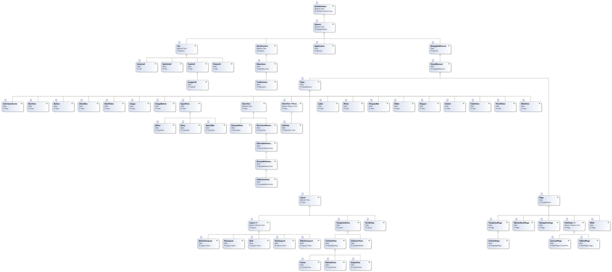

# Xamarin.Forms Controls Class Hierarchy

Xamarin.Forms is made up of hundreds of types, over multiple namespaces. Developers should be most familiar with the hierarchy of types used to create the user interface of a Xamarin.Forms application, which reside in the `Xamarin.Forms` namespace.

These types can be divided into pages, layouts, views, and cells. A Xamarin.Forms page generally occupies the entire screen, and all the page types derive from the [`Page`](xref:Xamarin.Forms.Page) class. Pages usually contain a layout, and all the layout types derive from the [`Layout`](xref:Xamarin.Forms.Layout) class. A layout usually contains views and possibly other layouts, and all the view types ultimately derive from the [`View`](xref:Xamarin.Forms.View) class. Finally, cells are specialized controls that are used in display data in the [`TableView`](xref:Xamarin.Forms.TableView) and [`ListView`](xref:Xamarin.Forms.ListView) controls. Pages, layouts, views, and cells are all ultimately derived from the [`Element`](xref:Xamarin.Forms.Element) class.

The following class diagram shows the hierarchy of types that are typically used to build a user interface in Xamarin.Forms:

However, note that the diagram only shows a single Shell type.

> [!NOTE]
> A high resolution version of the class diagram can be downloaded from [here](class-hierarchy-images/class-diagram-high-resolution.png).

## Related links

- [Xamarin.Forms Controls Reference](~/xamarin-forms/user-interface/controls/index.md)
