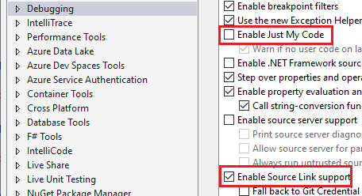
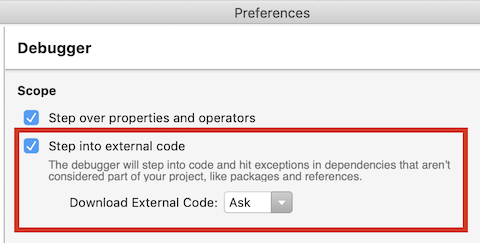
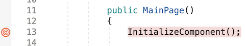
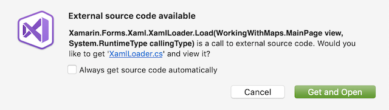
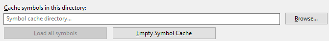

# Source Link with Xamarin.Forms

Xamarin.Forms NuGet packages include Source Link mappings. Source Link maps compiled libraries, contained in a NuGet package, to a source code repository. Visual Studio will download source code files during debugging and allow developers to step through code, enabling debugging of packages without building from source.

For more information about using Source Link, see [Source Link Documentation](/dotnet/standard/library-guidance/sourcelink).

::: zone pivot="windows"

> [!WARNING]
> Visual Studio 2019 supports Source Link for the **.NET debugger** but does not currently support Source Link for the **Mono debugger**. Therefore, you can use Source Link to debug UWP apps, but not Android or iOS app. When debugging UWP apps you must ensure that the PDB files for libraries you want to debug are copied to the **AppX** folder in the **bin** directory where your app is compiled.

## Enable Source Link

Using Source Link requires enabling debugging for external code, otherwise the debugger will step past calls to code not contained in the current solution. In Visual Studio 2019 this can be found under the **Options** menu in the **Debugging** section:

Ensure that **Enable just my code** is disabled and that **Enable Source Link support** is enabled.

::: zone-end
::: zone pivot="macos"

## Enable Source Link

Using Source Link requires enabling debugging for external code, otherwise the debugger will step past calls to code not contained in the current solution. This option can be found in the **Preferences** window in the **Debugger** section:

Ensure that **Step into external code** is enabled.

::: zone-end

## Debug Xamarin.Forms using Source Link

If debugging external packages is enabled, Visual Studio will use the Source Link mappings contained in the NuGet package to download and step through external source code. This can be tested by setting a breakpoint on a call to a method provided by Xamarin.Forms:

Depending on the settings you specified in the **Debugger** options, Visual Studio will warn you that it is downloading source files:

Once you allow Visual Studio to download the files, the debugger will step into the external code.

::: zone pivot="windows"

## Source Link caching

Source Link uses caching for performance. The caching directory for Source link is defined in the **Options** menu under **Debugging** in the **Symbols** section:

This menu allows you to specify the caching directory for all debug symbols, as well as clear the cache if you encounter issues with cached symbols.

::: zone-end
::: zone pivot="macos"

## Source Link caching

Source Link uses caching for performance. The caching directory for Source Link on MacOS is `/Users/<username>/Library/Caches/VisualStudio/8.0/Symbols`. This folder contains subfolders that store the repository used to download source files. If the backing repository for a NuGet package has changed, you may need to manually delete these folders to refresh the cache.

::: zone-end

## Related links

- [Source Link Documentation](/dotnet/standard/library-guidance/sourcelink)
- [Source Link on GitHub](https://github.com/dotnet/sourcelink)
