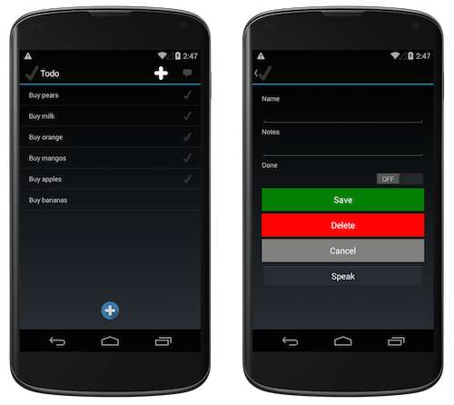
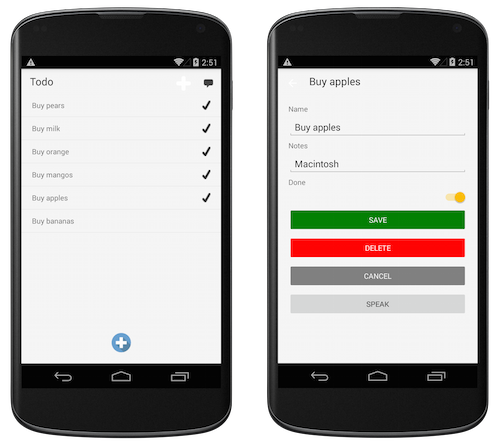

# Android Platform Features

Developing Xamarin.Forms applications for Android requires Visual Studio. The [supported platforms page](~/get-started/supported-platforms.md) contains more information about the pre-requisites.

## Platform-specifics

Platform-specifics allow you to consume functionality that's only available on a specific platform, without implementing custom renderers or effects.

The following platform-specific functionality is provided for Xamarin.Forms views, pages, and layouts on Android:

- Controlling the Z-order of visual elements to determine drawing order. For more information, see [VisualElement Elevation on Android](visualelement-elevation.md).
- Disabling legacy color mode on a supported [`VisualElement`](xref:Xamarin.Forms.VisualElement). For more information, see [VisualElement Legacy Color Mode on Android](legacy-color-mode.md).

The following platform-specific functionality is provided for Xamarin.Forms views on Android:

- Using the default padding and shadow values of Android buttons. For more information, see [Button Padding and Shadows on Android](button-padding-shadow.md).
- Setting the input method editor options for the soft keyboard for an [`Entry`](xref:Xamarin.Forms.Entry). For more information, see [Entry Input Method Editor Options on Android](entry-ime-options.md).
- Enabling a drop shadow on a `ImageButton`. For more information, see [ImageButton Drop Shadows on Android](imagebutton-drop-shadow.md).
- Enabling fast scrolling in a [`ListView`](xref:Xamarin.Forms.ListView). For more information, see [ListView Fast Scrolling on Android](listview-fast-scrolling.md).
- Controlling the transition that's used when opening a `SwipeView`. For more information, see [SwipeView Swipe Transition Mode](swipeview-swipetransitionmode.md).
- Controlling whether a [`WebView`](xref:Xamarin.Forms.WebView) can display mixed content. For more information, see [WebView Mixed Content on Android](webview-mixed-content.md).
- Enabling zoom on a [`WebView`](xref:Xamarin.Forms.WebView). For more information, see [WebView Zoom on Android](webview-zoom-controls.md).

The following platform-specific functionality is provided for Xamarin.Forms cells on Android:

- Enabling [`ViewCell`](xref:Xamarin.Forms.ViewCell) context actions legacy mode, so that the context actions menu is not updated when the selected item in a [`ListView`](xref:Xamarin.Forms.ListView) changes. For more information, see [ViewCell Context Actions on Android](viewcell-context-actions.md).

The following platform-specific functionality is provided for Xamarin.Forms pages on Android:

- Setting the height of the navigation bar on a [`NavigationPage`](xref:Xamarin.Forms.NavigationPage). For more information, see [NavigationPage Bar Height on Android](navigationpage-bar-height.md).
- Disabling transition animations when navigating through pages in a [`TabbedPage`](xref:Xamarin.Forms.TabbedPage). For more information, see [TabbedPage Page Transition Animations on Android](tabbedpage-transition-animations.md).
- Enabling swiping between pages in a [`TabbedPage`](xref:Xamarin.Forms.TabbedPage). For more information, see [TabbedPage Page Swiping on Android](tabbedpage-page-swiping.md).
- Setting the toolbar placement and color on a [`TabbedPage`](xref:Xamarin.Forms.TabbedPage). For more information, see [TabbedPage Toolbar Placement and Color on Android](tabbedpage-toolbar-placement-color.md).

The following platform-specific functionality is provided for the Xamarin.Forms [`Application`](xref:Xamarin.Forms.Application) class on Android:

- Setting the operating mode of a soft keyboard. For more information, see [Soft Keyboard Input Mode on Android](soft-keyboard-input-mode.md).
- Disabling the [`Disappearing`](xref:Xamarin.Forms.Page.Appearing) and [`Appearing`](xref:Xamarin.Forms.Page.Appearing) page lifecycle events on pause and resume respectively, for applications that use AppCompat. For more information, see [Page Lifecycle Events on Android](page-lifecycle-events.md).

## Platform support

Originally, the default Xamarin.Forms Android project used an older style of control rendering that was common prior to Android 5.0. Applications built using the template have `FormsApplicationActivity` as the base class of their main activity.

## Material design via AppCompat

Xamarin.Forms Android projects now use `FormsAppCompatActivity` as the base class of their main activity. This class uses **AppCompat** features provided by Android to implement Material Design themes.

Here is the **Todo** sample with the default `FormsApplicationActivity`:

And this is the same code after upgrading the project to use `FormsAppCompatActivity` (and adding the additional theme information):

> [!NOTE]
> When using `FormsAppCompatActivity`, the [base classes for some Android custom renderers](~/xamarin-forms/app-fundamentals/custom-renderer/renderers.md) will be different.

## AndroidX Migration

AndroidX replaces the Android Support Library. To learn about AndroidX and how to migrate a Xamarin.Forms app to use AndroidX libraries, see [AndroidX migration in Xamarin.Forms](~/xamarin-forms/platform/android/androidx-migration.md).
