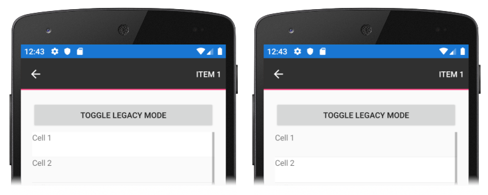
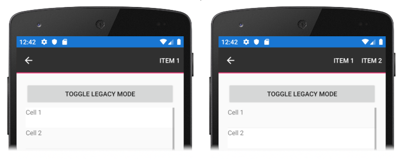

# ViewCell Context Actions on Android

[ Download the sample](/samples/xamarin/xamarin-forms-samples/userinterface-platformspecifics)

By default from Xamarin.Forms 4.3, when a [`ViewCell`](xref:Xamarin.Forms.ViewCell) in an Android application defines context actions for each item in a [`ListView`](xref:Xamarin.Forms.ListView), the context actions menu is updated when the selected item in the `ListView` changes. However, in previous versions of Xamarin.Forms the context actions menu was not updated, and this behavior is referred to as the `ViewCell` legacy mode. This legacy mode can result in incorrect behavior if a `ListView` uses a [`DataTemplateSelector`](xref:Xamarin.Forms.DataTemplateSelector) to set its `ItemTemplate` from [`DataTemplate`](xref:Xamarin.Forms.DataTemplate) objects that define different context actions.

This Android platform-specific enables the [`ViewCell`](xref:Xamarin.Forms.ViewCell) context actions menu legacy mode, for backwards compatibility, so that the context actions menu is not updated when the selected item in a [`ListView`](xref:Xamarin.Forms.ListView) changes. It's consumed in XAML by setting the `ViewCell.IsContextActionsLegacyModeEnabled` bindable property to `true`:

```xaml
<ContentPage ...
             xmlns:android="clr-namespace:Xamarin.Forms.PlatformConfiguration.AndroidSpecific;assembly=Xamarin.Forms.Core">
    <StackLayout Margin="20">
        <ListView ItemsSource="{Binding Items}">
            <ListView.ItemTemplate>
                <DataTemplate>
                    <ViewCell android:ViewCell.IsContextActionsLegacyModeEnabled="true">
                        <ViewCell.ContextActions>
                            <MenuItem Text="{Binding Item1Text}" />
                            <MenuItem Text="{Binding Item2Text}" />
                        </ViewCell.ContextActions>
                        <Label Text="{Binding Text}" />
                    </ViewCell>
                </DataTemplate>
            </ListView.ItemTemplate>
        </ListView>
    </StackLayout>
</ContentPage>
```

Alternatively, it can be consumed from C# using the fluent API:

```csharp
using Xamarin.Forms.PlatformConfiguration;
using Xamarin.Forms.PlatformConfiguration.AndroidSpecific;
...

viewCell.On<Android>().SetIsContextActionsLegacyModeEnabled(true);
```

The `ViewCell.On<Android>` method specifies that this platform-specific will only run on Android. The `ViewCell.SetIsContextActionsLegacyModeEnabled` method, in the [`Xamarin.Forms.PlatformConfiguration.AndroidSpecific`](xref:Xamarin.Forms.PlatformConfiguration.AndroidSpecific) namespace, is used to enable the [`ViewCell`](xref:Xamarin.Forms.ViewCell) context actions menu legacy mode, so that the context actions menu is not updated when the selected item in a [`ListView`](xref:Xamarin.Forms.ListView) changes. In addition, the `ViewCell.GetIsContextActionsLegacyModeEnabled` method can be used to return whether the context actions legacy mode is enabled.

The following screenshots show [`ViewCell`](xref:Xamarin.Forms.ViewCell) context actions legacy mode enabled:



In this mode, the displayed context action menu items are identical for cell 1 and cell 2, despite different context menu items being defined for cell 2.

The following screenshots show [`ViewCell`](xref:Xamarin.Forms.ViewCell) context actions legacy mode disabled, which is the default Xamarin.Forms behavior:



In this mode, the correct context action menu items are displayed for cell 1 and cell 2.

## Related links

- [PlatformSpecifics (sample)](/samples/xamarin/xamarin-forms-samples/userinterface-platformspecifics)
- [Creating Platform-Specifics](~/xamarin-forms/platform/platform-specifics/index.md#creating-platform-specifics)
- [AndroidSpecific API](xref:Xamarin.Forms.PlatformConfiguration.AndroidSpecific)
- [AndroidSpecific.AppCompat API](xref:Xamarin.Forms.PlatformConfiguration.AndroidSpecific.AppCompat)