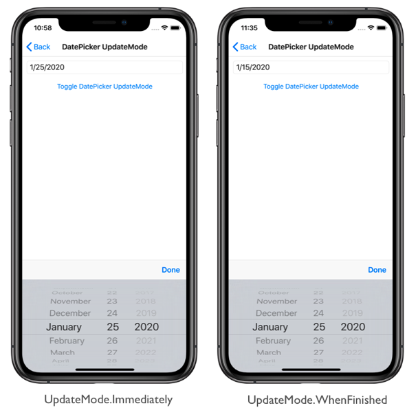

# DatePicker item selection on iOS

[ Download the sample](/samples/xamarin/xamarin-forms-samples/userinterface-platformspecifics)

This iOS platform-specific controls when item selection occurs in a [`DatePicker`](xref:Xamarin.Forms.DatePicker), allowing the user to specify that item selection occurs when browsing items in the control, or only once the **Done** button is pressed. It's consumed in XAML by setting the `DatePicker.UpdateMode` attached property to a value of the `UpdateMode` enumeration:

```xaml
<ContentPage ...
             xmlns:ios="clr-namespace:Xamarin.Forms.PlatformConfiguration.iOSSpecific;assembly=Xamarin.Forms.Core">
    <StackLayout>
       <DatePicker MinimumDate="01/01/2020"
                   MaximumDate="12/31/2020"
                   ios:DatePicker.UpdateMode="WhenFinished" />
       ...
    </StackLayout>
</ContentPage>
```

Alternatively, it can be consumed from C# using the fluent API:

```csharp
using Xamarin.Forms.PlatformConfiguration;
using Xamarin.Forms.PlatformConfiguration.iOSSpecific;
...

datePicker.On<iOS>().SetUpdateMode(UpdateMode.WhenFinished);
```

The `DatePicker.On<iOS>` method specifies that this platform-specific will only run on iOS. The `DatePicker.SetUpdateMode` method, in the [`Xamarin.Forms.PlatformConfiguration.iOSSpecific`](xref:Xamarin.Forms.PlatformConfiguration.iOSSpecific) namespace, is used to control when item selection occurs, with the `UpdateMode` enumeration providing two possible values:

- `Immediately` – item selection occurs as the user browses items in the [`DatePicker`](xref:Xamarin.Forms.DatePicker). This is the default behavior in Xamarin.Forms.
- `WhenFinished` – item selection only occurs once the user has pressed the **Done** button in the [`DatePicker`](xref:Xamarin.Forms.DatePicker).

In addition, the `SetUpdateMode` method can be used to toggle the enumeration values by calling the `UpdateMode` method, which returns the current `UpdateMode`:

```csharp
switch (datePicker.On<iOS>().UpdateMode())
{
    case UpdateMode.Immediately:
        datePicker.On<iOS>().SetUpdateMode(UpdateMode.WhenFinished);
        break;
    case UpdateMode.WhenFinished:
        datePicker.On<iOS>().SetUpdateMode(UpdateMode.Immediately);
        break;
}
```

The result is that a specified `UpdateMode` is applied to the [`DatePicker`](xref:Xamarin.Forms.DatePicker), which controls when item selection occurs:

[](datepicker-selection-images/datepicker-updatemode-large.png#lightbox "DatePicker UpdateMode Platform-Specific")

## Related links

- [PlatformSpecifics (sample)](/samples/xamarin/xamarin-forms-samples/userinterface-platformspecifics)
- [Creating Platform-Specifics](~/xamarin-forms/platform/platform-specifics/index.md#creating-platform-specifics)
- [iOSSpecific API](xref:Xamarin.Forms.PlatformConfiguration.iOSSpecific)