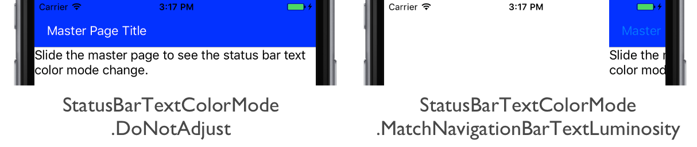

# NavigationPage Bar Text Color Mode on iOS

[ Download the sample](/samples/xamarin/xamarin-forms-samples/userinterface-platformspecifics)

This platform-specific controls whether the status bar text color on a [`NavigationPage`](xref:Xamarin.Forms.NavigationPage) is adjusted to match the luminosity of the navigation bar. It's consumed in XAML by setting the [`NavigationPage.StatusBarTextColorMode`](xref:Xamarin.Forms.PlatformConfiguration.iOSSpecific.NavigationPage.StatusBarTextColorModeProperty) attached property to a value of the [`StatusBarTextColorMode`](xref:Xamarin.Forms.PlatformConfiguration.iOSSpecific.StatusBarTextColorMode) enumeration:

```xaml
<FlyoutPage xmlns="http://xamarin.com/schemas/2014/forms"
    xmlns:x="http://schemas.microsoft.com/winfx/2009/xaml"
    xmlns:ios="clr-namespace:Xamarin.Forms.PlatformConfiguration.iOSSpecific;assembly=Xamarin.Forms.Core"
    x:Class="PlatformSpecifics.iOSStatusBarTextColorModePage">
    <FlyoutPage.Flyout>
        <ContentPage Title="Flyout Page Title" />
    </FlyoutPage.Flyout>
    <FlyoutPage.Detail>
        <NavigationPage BarBackgroundColor="Blue" BarTextColor="White"
                        ios:NavigationPage.StatusBarTextColorMode="MatchNavigationBarTextLuminosity">
            <x:Arguments>
                <ContentPage>
                    <Label Text="Slide the master page to see the status bar text color mode change." />
                </ContentPage>
            </x:Arguments>
        </NavigationPage>
    </FlyoutPage.Detail>
</FlyoutPage>

```

Alternatively, it can be consumed from C# using the fluent API:

```csharp
using Xamarin.Forms.PlatformConfiguration;
using Xamarin.Forms.PlatformConfiguration.iOSSpecific;
...

IsPresentedChanged += (sender, e) =>
{
    var flyoutPage = sender as FlyoutPage;
    if (flyoutPage.IsPresented)
        ((Xamarin.Forms.NavigationPage)flyoutPage.Detail)
          .On<iOS>()
          .SetStatusBarTextColorMode(StatusBarTextColorMode.DoNotAdjust);
    else
        ((Xamarin.Forms.NavigationPage)flyoutPage.Detail)
          .On<iOS>()
          .SetStatusBarTextColorMode(StatusBarTextColorMode.MatchNavigationBarTextLuminosity);
};
```

The `NavigationPage.On<iOS>` method specifies that this platform-specific will only run on iOS. The [`NavigationPage.SetStatusBarTextColorMode`](xref:Xamarin.Forms.PlatformConfiguration.iOSSpecific.NavigationPage.SetStatusBarTextColorMode(Xamarin.Forms.IPlatformElementConfiguration{Xamarin.Forms.PlatformConfiguration.iOS,Xamarin.Forms.NavigationPage},Xamarin.Forms.PlatformConfiguration.iOSSpecific.StatusBarTextColorMode)) method, in the [`Xamarin.Forms.PlatformConfiguration.iOSSpecific`](xref:Xamarin.Forms.PlatformConfiguration.iOSSpecific) namespace, controls whether the status bar text color on the [`NavigationPage`](xref:Xamarin.Forms.NavigationPage) is adjusted to match the luminosity of the navigation bar, with the [`StatusBarTextColorMode`](xref:Xamarin.Forms.PlatformConfiguration.iOSSpecific.StatusBarTextColorMode) enumeration providing two possible values:

- [`DoNotAdjust`](xref:Xamarin.Forms.PlatformConfiguration.iOSSpecific.StatusBarTextColorMode.DoNotAdjust) – indicates that the status bar text color should not be adjusted.
- [`MatchNavigationBarTextLuminosity`](xref:Xamarin.Forms.PlatformConfiguration.iOSSpecific.StatusBarTextColorMode.MatchNavigationBarTextLuminosity) – indicates that the status bar text color should match the luminosity of the navigation bar.

In addition, the [`GetStatusBarTextColorMode`](xref:Xamarin.Forms.PlatformConfiguration.iOSSpecific.NavigationPage.GetStatusBarTextColorMode(Xamarin.Forms.IPlatformElementConfiguration{Xamarin.Forms.PlatformConfiguration.iOS,Xamarin.Forms.NavigationPage})) method can be used to retrieve the current value of the [`StatusBarTextColorMode`](xref:Xamarin.Forms.PlatformConfiguration.iOSSpecific.StatusBarTextColorMode) enumeration that's applied to the [`NavigationPage`](xref:Xamarin.Forms.NavigationPage).

The result is that the status bar text color on a [`NavigationPage`](xref:Xamarin.Forms.NavigationPage) can be adjusted to match the luminosity of the navigation bar. In this example, the status bar text color changes as the user switches between the [`Flyout`](xref:Xamarin.Forms.FlyoutPage.Flyout) and [`Detail`](xref:Xamarin.Forms.FlyoutPage.Detail) pages of a [`FlyoutPage`](xref:Xamarin.Forms.FlyoutPage):



## Related links

- [PlatformSpecifics (sample)](/samples/xamarin/xamarin-forms-samples/userinterface-platformspecifics)
- [Creating Platform-Specifics](~/xamarin-forms/platform/platform-specifics/index.md#creating-platform-specifics)
- [iOSSpecific API](xref:Xamarin.Forms.PlatformConfiguration.iOSSpecific)
