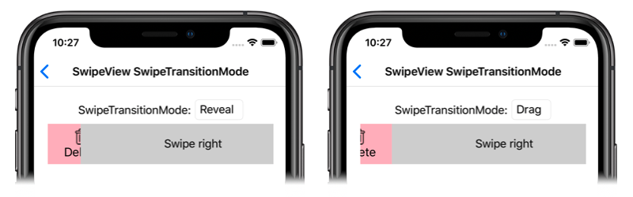

# SwipeView Swipe Transition Mode on iOS

[ Download the sample](/samples/xamarin/xamarin-forms-samples/userinterface-platformspecifics)

This iOS platform-specific controls the transition that's used when opening a `SwipeView`. It's consumed in XAML by setting the `SwipeView.SwipeTransitionMode` bindable property to a value of the `SwipeTransitionMode` enumeration:

```xaml
<ContentPage ...
             xmlns:ios="clr-namespace:Xamarin.Forms.PlatformConfiguration.iOSSpecific;assembly=Xamarin.Forms.Core">
    <StackLayout>
        <SwipeView ios:SwipeView.SwipeTransitionMode="Drag">
            <SwipeView.LeftItems>
                <SwipeItems>
                    <SwipeItem Text="Delete"
                               IconImageSource="delete.png"
                               BackgroundColor="LightPink"
                               Invoked="OnDeleteSwipeItemInvoked" />
                </SwipeItems>
            </SwipeView.LeftItems>
            <!-- Content -->
        </SwipeView>
    </StackLayout>
</ContentPage>
```

Alternatively, it can be consumed from C# using the fluent API:

```csharp
using Xamarin.Forms.PlatformConfiguration;
using Xamarin.Forms.PlatformConfiguration.iOSSpecific;
...

SwipeView swipeView = new Xamarin.Forms.SwipeView();
swipeView.On<iOS>().SetSwipeTransitionMode(SwipeTransitionMode.Drag);
// ...
```

The `SwipeView.On<iOS>` method specifies that this platform-specific will only run on iOS. The `SwipeView.SetSwipeTransitionMode` method, in the [`Xamarin.Forms.PlatformConfiguration.iOSSpecific`](xref:Xamarin.Forms.PlatformConfiguration.iOSSpecific) namespace, is used to control the transition that's used when opening a `SwipeView`. The `SwipeTransitionMode` enumeration provides two possible values:

- `Reveal` indicates that the swipe items will be revealed as the `SwipeView` content is swiped, and is the default value of the `SwipeView.SwipeTransitionMode` property.
- `Drag` indicates that the swipe items will be dragged into view as the `SwipeView` content is swiped.

In addition, the `SwipeView.GetSwipeTransitionMode` method can be used to return the `SwipeTransitionMode` that's applied to the `SwipeView`.

The result is that a specified `SwipeTransitionMode` value is applied to the `SwipeView`, which controls the transition that's used when opening the `SwipeView`:

[](swipeview-swipetransitionmode-images/swipetransitionmode-large.png#lightbox "SwipeTransitionModes on iOS")

## Related links

- [PlatformSpecifics (sample)](/samples/xamarin/xamarin-forms-samples/userinterface-platformspecifics)
- [Creating Platform-Specifics](~/xamarin-forms/platform/platform-specifics/index.md#creating-platform-specifics)
- [iOSSpecific API](xref:Xamarin.Forms.PlatformConfiguration.iOSSpecific)