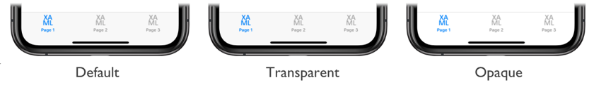

# TabbedPage translucent tab bar on iOS

[ Download the sample](/samples/xamarin/xamarin-forms-samples/userinterface-platformspecifics)

This iOS platform-specific is used to set the translucency mode of the tab bar on a [`TabbedPage`](xref:Xamarin.Forms.TabbedPage). It's consumed in XAML by setting the `TabbedPage.TranslucencyMode` bindable property to a `TranslucencyMode` enumeration value:

```xaml
<TabbedPage ...
            xmlns:ios="clr-namespace:Xamarin.Forms.PlatformConfiguration.iOSSpecific;assembly=Xamarin.Forms.Core"
            ios:TabbedPage.TranslucencyMode="Opaque">
    ...
</TabbedPage>
```

Alternatively, it can be consumed from C# using the fluent API:

```csharp
using Xamarin.Forms.PlatformConfiguration;
using Xamarin.Forms.PlatformConfiguration.iOSSpecific;
...

On<iOS>().SetTranslucencyMode(TranslucencyMode.Opaque);
```

The `TabbedPage.On<iOS>` method specifies that this platform-specific will only run on iOS. The `TabbedPage.SetTranslucencyMode` method, in the [`Xamarin.Forms.PlatformConfiguration.iOSSpecific`](xref:Xamarin.Forms.PlatformConfiguration.iOSSpecific) namespace, is used to set the translucency mode of the tab bar on a [`TabbedPage`](xref:Xamarin.Forms.TabbedPage) by specifying one of the following `TranslucencyMode` enumeration values:

- `Default`, which sets the tab bar to its default translucency mode. This is the default value of the `TabbedPage.TranslucencyMode` property.
- `Translucent`, which sets the tab bar to be translucent.
- `Opaque`, which sets the tab bar to be opaque.

In addition, the `GetTranslucencyMode` method can be used to retrieve the current value of the `TranslucencyMode` enumeration that's applied to the [`TabbedPage`](xref:Xamarin.Forms.TabbedPage).

The result is that the translucency mode of the tab bar on a [`TabbedPage`](xref:Xamarin.Forms.TabbedPage) can be set:



## Related links

- [PlatformSpecifics (sample)](/samples/xamarin/xamarin-forms-samples/userinterface-platformspecifics)
- [Creating Platform-Specifics](~/xamarin-forms/platform/platform-specifics/index.md#creating-platform-specifics)
- [iOSSpecific API](xref:Xamarin.Forms.PlatformConfiguration.iOSSpecific)