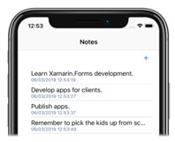
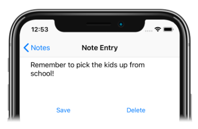
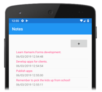
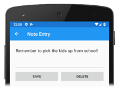
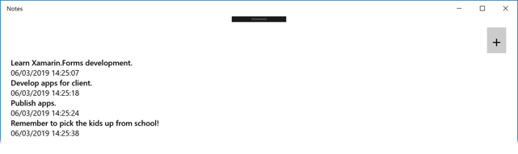
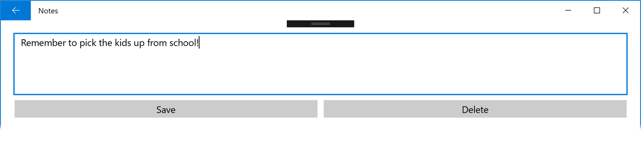

# Xamarin.Forms in Xamarin Native Projects

[ Download the sample](/samples/xamarin/xamarin-forms-samples/native2forms)

Typically, a Xamarin.Forms application includes one or more pages that derive from [`ContentPage`](xref:Xamarin.Forms.ContentPage), and these pages are shared by all platforms in a .NET Standard library project or Shared Project. However, Native Forms enables `ContentPage`-derived pages to be added directly to native Xamarin.iOS, Xamarin.Android, and UWP applications. Compared to having the native project consume `ContentPage`-derived pages from a .NET Standard library project or Shared Project, the advantage of adding pages directly to native projects is that the pages can be extended with native views. Native views can then be named in XAML with `x:Name` and referenced from the code-behind. For more information about native views, see [Native Views](~/xamarin-forms/platform/native-views/index.md).

The process for consuming a Xamarin.Forms [`ContentPage`](xref:Xamarin.Forms.ContentPage)-derived page in a native project is as follows:

1. Add the Xamarin.Forms NuGet package to the native project.
1. Add the [`ContentPage`](xref:Xamarin.Forms.ContentPage)-derived page, and any dependencies, to the native project.
1. Call the `Forms.Init` method.
1. Construct an instance of the [`ContentPage`](xref:Xamarin.Forms.ContentPage)-derived page and convert it to the appropriate native type using one of the following extension methods: `CreateViewController` for iOS, `CreateSupportFragment` for Android, or `CreateFrameworkElement` for UWP.
1. Navigate to the native type representation of the [`ContentPage`](xref:Xamarin.Forms.ContentPage)-derived page using the native navigation API.

Xamarin.Forms must be initialized by calling the `Forms.Init` method before a native project can construct a [`ContentPage`](xref:Xamarin.Forms.ContentPage)-derived page. Choosing when to do this primarily depends on when it's most convenient in your application flow – it could be performed at application startup, or just before the `ContentPage`-derived page is constructed. In this article, and the accompanying sample applications, the `Forms.Init` method is called at application startup.

> [!NOTE]
> The **NativeForms** sample application solution does not contain any Xamarin.Forms projects. Instead, it consists of a Xamarin.iOS project, a Xamarin.Android project, and a UWP project. Each project is a native project that uses Native Forms to consume [`ContentPage`](xref:Xamarin.Forms.ContentPage)-derived pages. However, there's no reason why the native projects couldn't consume `ContentPage`-derived pages from a .NET Standard library project or Shared Project.

When using Native Forms, Xamarin.Forms features such as [`DependencyService`](xref:Xamarin.Forms.DependencyService), [`MessagingCenter`](xref:Xamarin.Forms.MessagingCenter), and the data binding engine, all still work. However, page navigation must be performed using the native navigation API.

## iOS

On iOS, the `FinishedLaunching` override in the `AppDelegate` class is typically the place to perform application startup related tasks. It's called after the application has launched, and is usually overridden to configure the main window and view controller. The following code example shows the `AppDelegate` class in the sample application:

```csharp
[Register("AppDelegate")]
public class AppDelegate : UIApplicationDelegate
{
    public static AppDelegate Instance;
    UIWindow _window;
    AppNavigationController _navigation;

    public static string FolderPath { get; private set; }

    public override bool FinishedLaunching(UIApplication application, NSDictionary launchOptions)
    {
        Forms.Init();

        // Create app-level resource dictionary.
        Xamarin.Forms.Application.Current = new Xamarin.Forms.Application();
        Xamarin.Forms.Application.Current.Resources = new MyDictionary();

        Instance = this;
        _window = new UIWindow(UIScreen.MainScreen.Bounds);

        UINavigationBar.Appearance.SetTitleTextAttributes(new UITextAttributes
        {
            TextColor = UIColor.Black
        });

        FolderPath = Path.Combine(Environment.GetFolderPath(Environment.SpecialFolder.LocalApplicationData));

        NotesPage notesPage = new NotesPage()
        {
            // Set the parent so that the app-level resource dictionary can be located.
            Parent = Xamarin.Forms.Application.Current
        };

        UIViewController notesPageController = notesPage.CreateViewController();
        notesPageController.Title = "Notes";

        _navigation = new AppNavigationController(notesPageController);

        _window.RootViewController = _navigation;
        _window.MakeKeyAndVisible();

        notesPage.Parent = null;
        return true;
    }
    // ...
}
```

The `FinishedLaunching` method performs the following tasks:

- Xamarin.Forms is initialized by calling the `Forms.Init` method.
- A new `Xamarin.Forms.Application` is object is created, and its application-level resource dictionary is set to a `ResourceDictionary` that's defined in XAML.
- A reference to the `AppDelegate` class is stored in the `static` `Instance` field. This is to provide a mechanism for other classes to call methods defined in the `AppDelegate` class.
- The `UIWindow`, which is the main container for views in native iOS applications, is created.
- The `FolderPath` property is initialized to a path on the device where note data will be stored.
- A `NotesPage` object is created, which is a Xamarin.Forms [`ContentPage`](xref:Xamarin.Forms.ContentPage)-derived page defined in XAML, and its parent is set to the previously created `Xamarin.Forms.Application` object.
- The `NotesPage` object is converted to a `UIViewController` using the `CreateViewController` extension method.
- The `Title` property of the `UIViewController` is set, which will be displayed on the `UINavigationBar`.
- A `AppNavigationController` is created for managing hierarchical navigation. This is a custom navigation controller class, which derives from `UINavigationController`. The `AppNavigationController` object manages a stack of view controllers, and the `UIViewController` passed into the constructor will be presented initially when the `AppNavigationController` is loaded.
- The `AppNavigationController` object is set as the top-level `UIViewController` for the `UIWindow`, and the `UIWindow` is set as the key window for the application and is made visible.
- The `Parent` property of the `NotesPage` object is set to `null`, to prevent a memory leak.

Once the `FinishedLaunching` method has executed, the UI defined in the Xamarin.Forms `NotesPage` class will be displayed, as shown in the following screenshot:

[](native-forms-images/ios-notespage-large.png#lightbox "Xamarin.iOS app with a XAML UI")

> [!IMPORTANT]
> All [`ContentPage`](xref:Xamarin.Forms.ContentPage)-derived pages can consume resources defined in the application-level `ResourceDictionary`, provided that the `Parent` property of the page is set to the `Application` object.

Interacting with the UI, for example by tapping on the **+** [`Button`](xref:Xamarin.Forms.Button), will result in the following event handler in the `NotesPage` code-behind executing:

```csharp
void OnNoteAddedClicked(object sender, EventArgs e)
{
    AppDelegate.Instance.NavigateToNoteEntryPage(new Note());
}
```

The `static` `AppDelegate.Instance` field enables the `AppDelegate.NavigateToNoteEntryPage` method to be invoked, which is shown in the following code example:

```csharp
public void NavigateToNoteEntryPage(Note note)
{
    NoteEntryPage noteEntryPage = new NoteEntryPage
    {
        BindingContext = note,
        // Set the parent so that the app-level resource dictionary can be located.
        Parent = Xamarin.Forms.Application.Current
    };

    var noteEntryViewController = noteEntryPage.CreateViewController();
    noteEntryViewController.Title = "Note Entry";

    _navigation.PushViewController(noteEntryViewController, true);
    noteEntryPage.Parent = null;
}
```

The `NavigateToNoteEntryPage` method converts the Xamarin.Forms [`ContentPage`](xref:Xamarin.Forms.ContentPage)-derived page to a `UIViewController` with the `CreateViewController` extension method, and sets the `Title` property of the `UIViewController`. The `UIViewController` is then pushed onto `AppNavigationController` by the `PushViewController` method. Therefore, the UI defined in the Xamarin.Forms `NoteEntryPage` class will be displayed, as shown in the following screenshot:

[](native-forms-images/ios-noteentrypage-large.png#lightbox "Xamarin.iOS app with a XAML UI")

When the `NoteEntryPage` is displayed, back navigation will pop the `UIViewController` for the `NoteEntryPage` class from the `AppNavigationController`, returning the user to the `UIViewController` for the `NotesPage` class. However, popping a `UIViewController` from the iOS native navigation stack does not automatically dispose of the `UIViewController` and attached `Page` object. Therefore, the `AppNavigationController` class overrides the `PopViewController` method, to dispose of view controllers on backwards navigation:

```csharp
public class AppNavigationController : UINavigationController
{
    //...
    public override UIViewController PopViewController(bool animated)
    {
        UIViewController topView = TopViewController;
        if (topView != null)
        {
            // Dispose of ViewController on back navigation.
            topView.Dispose();
        }
        return base.PopViewController(animated);
    }
}
```

The `PopViewController` override calls the `Dispose` method on the `UIViewController` object that's been popped from the iOS native navigation stack. Failure to do this will result in the `UIViewController` and attached `Page` object being orphaned.

> [!IMPORTANT]
> Orphaned objects can't be garbage collected, and so result in a memory leak.

## Android

On Android, the `OnCreate` override in the `MainActivity` class is typically the place to perform application startup related tasks. The following code example shows the `MainActivity` class in the sample application:

```csharp
public class MainActivity : AppCompatActivity
{
    public static string FolderPath { get; private set; }

    public static MainActivity Instance;

    protected override void OnCreate(Bundle bundle)
    {
        base.OnCreate(bundle);

        Forms.Init(this, bundle);

        // Create app-level resource dictionary.
        Xamarin.Forms.Application.Current = new Xamarin.Forms.Application();
        Xamarin.Forms.Application.Current.Resources = new MyDictionary();

        Instance = this;

        SetContentView(Resource.Layout.Main);
        var toolbar = FindViewById<Toolbar>(Resource.Id.toolbar);
        SetSupportActionBar(toolbar);
        SupportActionBar.Title = "Notes";

        FolderPath = Path.Combine(System.Environment.GetFolderPath(System.Environment.SpecialFolder.LocalApplicationData));

        NotesPage notesPage = new NotesPage()
        {
            // Set the parent so that the app-level resource dictionary can be located.
            Parent = Xamarin.Forms.Application.Current
        };
        AndroidX.Fragment.App.Fragment notesPageFragment = notesPage.CreateSupportFragment(this);

        SupportFragmentManager
            .BeginTransaction()
            .Replace(Resource.Id.fragment_frame_layout, mainPage)
            .Commit();
        //...

        notesPage.Parent = null;
    }
    ...
}
```

The `OnCreate` method performs the following tasks:

- Xamarin.Forms is initialized by calling the `Forms.Init` method.
- A new `Xamarin.Forms.Application` is object is created, and its application-level resource dictionary is set to a `ResourceDictionary` that's defined in XAML.
- A reference to the `MainActivity` class is stored in the `static` `Instance` field. This is to provide a mechanism for other classes to call methods defined in the `MainActivity` class.
- The `Activity` content is set from a layout resource. In the sample application, the layout consists of a `LinearLayout` that contains a `Toolbar`, and a `FrameLayout` to act as a fragment container.
- The `Toolbar` is retrieved and set as the action bar for the `Activity`, and the action bar title is set.
- The `FolderPath` property is initialized to a path on the device where note data will be stored.
- A `NotesPage` object is created, which is a Xamarin.Forms [`ContentPage`](xref:Xamarin.Forms.ContentPage)-derived page defined in XAML, and its parent is set to the previously created `Xamarin.Forms.Application` object.
- The `NotesPage` object is converted to a `Fragment` using the `CreateSupportFragment` extension method.
- The `SupportFragmentManager` class creates and commits a transaction that replaces the `FrameLayout` instance with the `Fragment` for the `NotesPage` class.
- The `Parent` property of the `NotesPage` object is set to `null`, to prevent a memory leak.

For more information about Fragments, see [Fragments](~/android/platform/fragments/index.md).

Once the `OnCreate` method has executed, the UI defined in the Xamarin.Forms `NotesPage` class will be displayed, as shown in the following screenshot:

[](native-forms-images/android-notespage-large.png#lightbox "Xamarin.Android app with a XAML UI")

> [!IMPORTANT]
> All [`ContentPage`](xref:Xamarin.Forms.ContentPage)-derived pages can consume resources defined in the application-level `ResourceDictionary`, provided that the `Parent` property of the page is set to the `Application` object.

Interacting with the UI, for example by tapping on the **+** [`Button`](xref:Xamarin.Forms.Button), will result in the following event handler in the `NotesPage` code-behind executing:

```csharp
void OnNoteAddedClicked(object sender, EventArgs e)
{
    MainActivity.Instance.NavigateToNoteEntryPage(new Note());
}
```

The `static` `MainActivity.Instance` field enables the `MainActivity.NavigateToNoteEntryPage` method to be invoked, which is shown in the following code example:

```csharp
public void NavigateToNoteEntryPage(Note note)
{
    NoteEntryPage noteEntryPage = new NoteEntryPage
    {
        BindingContext = note,
        // Set the parent so that the app-level resource dictionary can be located.
        Parent = Xamarin.Forms.Application.Current
    };

    AndroidX.Fragment.App.Fragment noteEntryFragment = noteEntryPage.CreateSupportFragment(this);
    SupportFragmentManager
        .BeginTransaction()
        .AddToBackStack(null)
        .Replace(Resource.Id.fragment_frame_layout, noteEntryFragment)
        .Commit();

    noteEntryPage.Parent = null;
}
```

The `NavigateToNoteEntryPage` method converts the Xamarin.Forms [`ContentPage`](xref:Xamarin.Forms.ContentPage)-derived page to a `Fragment` with the `CreateSupportFragment` extension method, and adds the `Fragment` to the fragment back stack. Therefore, the UI defined in the Xamarin.Forms `NoteEntryPage` will be displayed, as shown in the following screenshot:

[](native-forms-images/android-noteentrypage-large.png#lightbox "Xamarin.Android app with a XAML UI")

When the `NoteEntryPage` is displayed, tapping the back arrow will pop the `Fragment` for the `NoteEntryPage` from the fragment back stack, returning the user to the `Fragment` for the `NotesPage` class.

### Enable back navigation support

The `SupportFragmentManager` class has a `BackStackChanged` event that fires whenever the content of the fragment back stack changes. The `OnCreate` method in the `MainActivity` class contains an anonymous event handler for this event:

```csharp
SupportFragmentManager.BackStackChanged += (sender, e) =>
{
    bool hasBack = SupportFragmentManager.BackStackEntryCount > 0;
    SupportActionBar.SetHomeButtonEnabled(hasBack);
    SupportActionBar.SetDisplayHomeAsUpEnabled(hasBack);
    SupportActionBar.Title = hasBack ? "Note Entry" : "Notes";
};
```

This event handler displays a back button on the action bar provided that there's one or more `Fragment` instances on the fragment back stack. The response to tapping the back button is handled by the `OnOptionsItemSelected` override:

```csharp
public override bool OnOptionsItemSelected(Android.Views.IMenuItem item)
{
    if (item.ItemId == global::Android.Resource.Id.Home && SupportFragmentManager.BackStackEntryCount > 0)
    {
        SupportFragmentManager.PopBackStack();
        return true;
    }
    return base.OnOptionsItemSelected(item);
}
```

The `OnOptionsItemSelected` override is called whenever an item in the options menu is selected. This implementation pops the current fragment from the fragment back stack, provided that the back button has been selected and there are one or more `Fragment` instances on the fragment back stack.

### Multiple activities

When an application is composed of multiple activities, [`ContentPage`](xref:Xamarin.Forms.ContentPage)-derived pages can be embedded into each of the activities. In this scenario, the `Forms.Init` method need be called only in the `OnCreate` override of the first `Activity` that embeds a Xamarin.Forms `ContentPage`. However, this has the following impact:

- The value of `Xamarin.Forms.Color.Accent` will be taken from the `Activity` that called the `Forms.Init` method.
- The value of `Xamarin.Forms.Application.Current` will be associated with the `Activity` that called the `Forms.Init` method.

### Choose a file

When embedding a [`ContentPage`](xref:Xamarin.Forms.ContentPage)-derived page that uses a [`WebView`](xref:Xamarin.Forms.WebView) that needs to support an HTML "Choose File" button, the `Activity` will need to override the `OnActivityResult` method:

```csharp
protected override void OnActivityResult(int requestCode, Result resultCode, Intent data)
{
    base.OnActivityResult(requestCode, resultCode, data);
    ActivityResultCallbackRegistry.InvokeCallback(requestCode, resultCode, data);
}
```

## UWP

On UWP, the native `App` class is typically the place to perform application startup related tasks. Xamarin.Forms is usually initialized, in Xamarin.Forms UWP applications, in the `OnLaunched` override in the native `App` class, to pass the `LaunchActivatedEventArgs` argument to the `Forms.Init` method. For this reason, native UWP applications that consume a Xamarin.Forms [`ContentPage`](xref:Xamarin.Forms.ContentPage)-derived page can most easily call the `Forms.Init` method from the `App.OnLaunched` method:

```csharp
protected override void OnLaunched(LaunchActivatedEventArgs e)
{
    // ...
    Xamarin.Forms.Forms.Init(e);

    // Create app-level resource dictionary.
    Xamarin.Forms.Application.Current = new Xamarin.Forms.Application();
    Xamarin.Forms.Application.Current.Resources = new MyDictionary();

    // ...
}
```

In addition, the `OnLaunched` method can also create any application-level resource dictionary that's required by the application.

By default, the native `App` class launches the `MainPage` class as the first page of the application. The following code example shows the `MainPage` class in the sample application:

```csharp
public sealed partial class MainPage : Page
{
    NotesPage notesPage;
    NoteEntryPage noteEntryPage;

    public static MainPage Instance;
    public static string FolderPath { get; private set; }

    public MainPage()
    {
        this.NavigationCacheMode = NavigationCacheMode.Enabled;
        Instance = this;
        FolderPath = Path.Combine(System.Environment.GetFolderPath(System.Environment.SpecialFolder.LocalApplicationData));

        notesPage = new Notes.UWP.Views.NotesPage
        {
            // Set the parent so that the app-level resource dictionary can be located.
            Parent = Xamarin.Forms.Application.Current
        };
        this.Content = notesPage.CreateFrameworkElement();
        // ...
        notesPage.Parent = null;    
    }
    // ...
}
```

The `MainPage` constructor performs the following tasks:

- Caching is enabled for the page, so that a new `MainPage` isn't constructed when a user navigates back to the page.
- A reference to the `MainPage` class is stored in the `static` `Instance` field. This is to provide a mechanism for other classes to call methods defined in the `MainPage` class.
- The `FolderPath` property is initialized to a path on the device where note data will be stored.
- A `NotesPage` object is created, which is a Xamarin.Forms [`ContentPage`](xref:Xamarin.Forms.ContentPage)-derived page defined in XAML, and its parent is set to the previously created `Xamarin.Forms.Application` object.
- The `NotesPage` object is converted to a `FrameworkElement` using the `CreateFrameworkElement` extension method, and then set as the content of the `MainPage` class.
- The `Parent` property of the `NotesPage` object is set to `null`, to prevent a memory leak.

Once the `MainPage` constructor has executed, the UI defined in the Xamarin.Forms `NotesPage` class will be displayed, as shown in the following screenshot:

[](native-forms-images/uwp-notespage-large.png#lightbox "UWP app with a Xamarin.Forms XAML UI")

> [!IMPORTANT]
> All [`ContentPage`](xref:Xamarin.Forms.ContentPage)-derived pages can consume resources defined in the application-level `ResourceDictionary`, provided that the `Parent` property of the page is set to the `Application` object.

Interacting with the UI, for example by tapping on the **+** [`Button`](xref:Xamarin.Forms.Button), will result in the following event handler in the `NotesPage` code-behind executing:

```csharp
void OnNoteAddedClicked(object sender, EventArgs e)
{
    MainPage.Instance.NavigateToNoteEntryPage(new Note());
}
```

The `static` `MainPage.Instance` field enables the `MainPage.NavigateToNoteEntryPage` method to be invoked, which is shown in the following code example:

```csharp
public void NavigateToNoteEntryPage(Note note)
{
    noteEntryPage = new Notes.UWP.Views.NoteEntryPage
    {
        BindingContext = note,
        // Set the parent so that the app-level resource dictionary can be located.
        Parent = Xamarin.Forms.Application.Current
    };
    this.Frame.Navigate(noteEntryPage);
    noteEntryPage.Parent = null;
}
```

Navigation in UWP is typically performed with the `Frame.Navigate` method, which takes a `Page` argument. Xamarin.Forms defines a `Frame.Navigate` extension method that takes a [`ContentPage`](xref:Xamarin.Forms.ContentPage)-derived page instance. Therefore, when the `NavigateToNoteEntryPage` method executes, the UI defined in the Xamarin.Forms `NoteEntryPage` will be displayed, as shown in the following screenshot:

[](native-forms-images/uwp-noteentrypage-large.png#lightbox "UWP app with a Xamarin.Forms XAML UI")

When the `NoteEntryPage` is displayed, tapping the back arrow will pop the `FrameworkElement` for the `NoteEntryPage` from the in-app back stack, returning the user to the `FrameworkElement` for the `NotesPage` class.

### Enable page resizing support

When the UWP application window is resized, the Xamarin.Forms content should also be resized. This is accomplished by registering an event handler for the `Loaded` event, in the `MainPage` constructor:

```csharp
public MainPage()
{
    // ...
    this.Loaded += OnMainPageLoaded;
    // ...
}
```

The `Loaded` event fires when the page is laid out, rendered, and ready for interaction, and executes the `OnMainPageLoaded` method in response:

```csharp
void OnMainPageLoaded(object sender, RoutedEventArgs e)
{
    this.Frame.SizeChanged += (o, args) =>
    {
        if (noteEntryPage != null)
            noteEntryPage.Layout(new Xamarin.Forms.Rectangle(0, 0, args.NewSize.Width, args.NewSize.Height));
        else
            notesPage.Layout(new Xamarin.Forms.Rectangle(0, 0, args.NewSize.Width, args.NewSize.Height));
    };
}
```

The `OnMainPageLoaded` method registers an anonymous event handler for the `Frame.SizeChanged` event, which is raised when either the `ActualHeight` or the `ActualWidth` properties change on the `Frame`. In response, the Xamarin.Forms content for the active page is resized by calling the `Layout` method.

### Enable back navigation support

On UWP, applications must enable back navigation for all hardware and software back buttons, across different device form factors. This can be accomplished by registering an event handler for the `BackRequested` event, which can be performed in the `MainPage` constructor:

```csharp
public MainPage()
{
    // ...
    SystemNavigationManager.GetForCurrentView().BackRequested += OnBackRequested;
}
```

When the application is launched, the `GetForCurrentView` method retrieves the `SystemNavigationManager` object associated with the current view, then registers an event handler for the `BackRequested` event. The application only receives this event if it's the foreground application, and in response, calls the `OnBackRequested` event handler:

```csharp
void OnBackRequested(object sender, BackRequestedEventArgs e)
{
    Frame rootFrame = Window.Current.Content as Frame;
    if (rootFrame.CanGoBack)
    {
        e.Handled = true;
        rootFrame.GoBack();
        noteEntryPage = null;
    }
}
```

The `OnBackRequested` event handler calls the `GoBack` method on the root frame of the application and sets the `BackRequestedEventArgs.Handled` property to `true` to mark the event as handled. Failure to mark the event as handled could result in the event being ignored.

The application chooses whether to show a back button on the title bar. This is achieved by setting the `AppViewBackButtonVisibility` property to one of the `AppViewBackButtonVisibility` enumeration values, in the `App` class:

```csharp
void OnNavigated(object sender, NavigationEventArgs e)
{
    SystemNavigationManager.GetForCurrentView().AppViewBackButtonVisibility =
        ((Frame)sender).CanGoBack ? AppViewBackButtonVisibility.Visible : AppViewBackButtonVisibility.Collapsed;
}
```

The `OnNavigated` event handler, which is executed in response to the `Navigated` event firing, updates the visibility of the title bar back button when page navigation occurs. This ensures that the title bar back button is visible if the in-app back stack is not empty, or removed from the title bar if the in-app back stack is empty.

For more information about back navigation support on UWP, see [Navigation history and backwards navigation for UWP apps](/windows/uwp/design/basics/navigation-history-and-backwards-navigation/).

## Related links

- [NativeForms (sample)](/samples/xamarin/xamarin-forms-samples/native2forms)
- [Native Views](~/xamarin-forms/platform/native-views/index.md)
