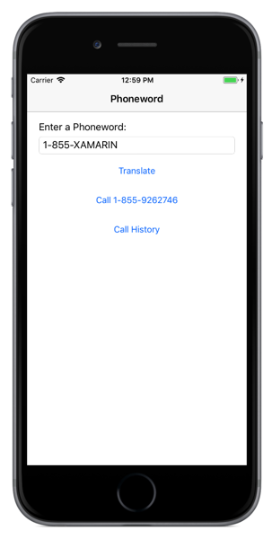
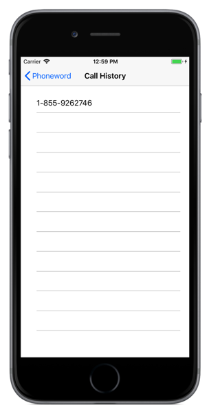
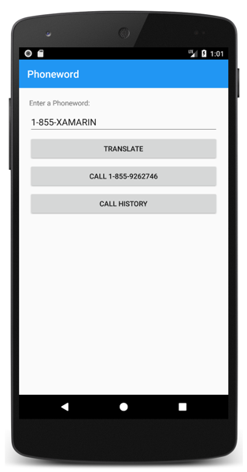
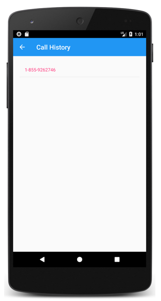
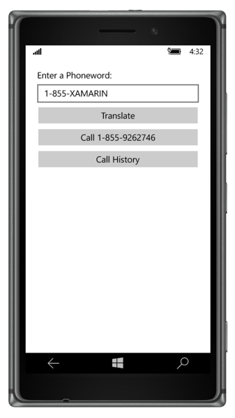
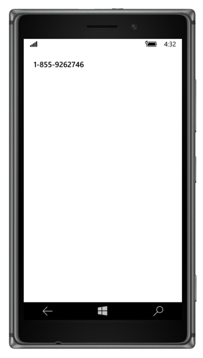

# Xamarin.Forms in Xamarin Native Projects

[ Download the sample](https://developer.xamarin.com/samples/xamarin-forms/Native2Forms/)

_Native Forms allow Xamarin.Forms ContentPage-derived pages to be consumed by native Xamarin.iOS, Xamarin.Android, and Universal Windows Platform (UWP) projects. Native projects can consume ContentPage-derived pages that are directly added to the project, or from a .NET Standard library, .NET Standard library, or Shared Project. This article explains how to consume ContentPage-derived pages that are directly added to native projects, and how to navigate between them._

Typically, a Xamarin.Forms application includes one or more pages that derive from [`ContentPage`](xref:Xamarin.Forms.ContentPage), and these pages are shared by all platforms in a .NET Standard library project or Shared Project. However, Native Forms allows `ContentPage`-derived pages to be added directly to native Xamarin.iOS, Xamarin.Android, and UWP applications. Compared to having the native project consume `ContentPage`-derived pages from a .NET Standard library project or Shared Project, the advantage of adding pages directly to native projects is that the pages can be extended with native views. Native views can then be named in XAML with `x:Name` and referenced from the code-behind. For more information about native views, see [Native Views](~/xamarin-forms/platform/native-views/index.md).

The process for consuming a Xamarin.Forms [`ContentPage`](xref:Xamarin.Forms.ContentPage)-derived page in a native project is as follows:

1. Add the Xamarin.Forms NuGet package to the native project.
1. Add the [`ContentPage`](xref:Xamarin.Forms.ContentPage)-derived page, and any dependencies, to the native project.
1. Call the `Forms.Init` method.
1. Construct an instance of the [`ContentPage`](xref:Xamarin.Forms.ContentPage)-derived page and convert it to the appropriate native type using one of the following extension methods: `CreateViewController` for iOS, `CreateSupportFragment` for Android, or `CreateFrameworkElement` for UWP.
1. Navigate to the native type representation of the [`ContentPage`](xref:Xamarin.Forms.ContentPage)-derived page using the native navigation API.

Xamarin.Forms must be initialized by calling the `Forms.Init` method before a native project can construct a [`ContentPage`](xref:Xamarin.Forms.ContentPage)-derived page. Choosing when to do this primarily depends on when it's most convenient in your application flow – it could be performed at application startup, or just before the `ContentPage`-derived page is constructed. In this article, and the accompanying sample applications, the `Forms.Init` method is called at application startup.

> [!NOTE]
> The **NativeForms** sample application solution does not contain any Xamarin.Forms projects. Instead, it consists of a Xamarin.iOS project, a Xamarin.Android project, and a UWP project. Each project is a native project that uses Native Forms to consume [`ContentPage`](xref:Xamarin.Forms.ContentPage)-derived pages. However, there's no reason why the native projects couldn't consume `ContentPage`-derived pages from a .NET Standard library project or Shared Project.

When using Native Forms, Xamarin.Forms features such as [`DependencyService`](xref:Xamarin.Forms.DependencyService), [`MessagingCenter`](xref:Xamarin.Forms.MessagingCenter), and the data binding engine, all still work. However, page navigation must be performed using the native navigation API.

## iOS

On iOS, the `FinishedLaunching` override in the `AppDelegate` class is typically the place to perform application startup related tasks. It's called after the application has launched, and is usually overridden to configure the main window and view controller. The following code example shows the `AppDelegate` class in the sample application:

```csharp
[Register("AppDelegate")]
public class AppDelegate : UIApplicationDelegate
{
    public static AppDelegate Instance;

    UIWindow _window;
    UINavigationController _navigation;

    public override bool FinishedLaunching(UIApplication application, NSDictionary launchOptions)
    {
        Forms.Init();

        Instance = this;
        _window = new UIWindow(UIScreen.MainScreen.Bounds);

        UINavigationBar.Appearance.SetTitleTextAttributes(new UITextAttributes
        {
            TextColor = UIColor.Black
        });

        var mainPage = new PhonewordPage().CreateViewController();
        mainPage.Title = "Phoneword";

        _navigation = new UINavigationController(mainPage);
        _window.RootViewController = _navigation;
        _window.MakeKeyAndVisible();

        return true;
    }
    ...
}
```

The `FinishedLaunching` method performs the following tasks:

- Xamarin.Forms is initialized by calling the `Forms.Init` method.
- A reference to the `AppDelegate` class is stored in the `static` `Instance` field. This is to provide a mechanism for other classes to call methods defined in the `AppDelegate` class.
- The `UIWindow`, which is the main container for views in native iOS applications, is created.
- The `PhonewordPage` class, which is a Xamarin.Forms [`ContentPage`](xref:Xamarin.Forms.ContentPage)-derived page defined in XAML, is constructed and converted to a `UIViewController` using the `CreateViewController` extension method.
- The `Title` property of the `UIViewController` is set, which will be displayed on the `UINavigationBar`.
- A `UINavigationController` is created for managing hierarchical navigation. The `UINavigationController` class manages a stack of view controllers, and the `UIViewController` passed into the constructor will be presented initially when the `UINavigationController` is loaded.
- The `UINavigationController` instance is set as the top-level `UIViewController` for the `UIWindow`, and the `UIWindow` is set as the key window for the application and is made visible.

Once the `FinishedLaunching` method has executed, the UI defined in the Xamarin.Forms `PhonewordPage` class will be displayed, as shown in the following screenshot:

[](native-forms-images/ios-phonewordpage-large.png#lightbox "iOS PhonewordPage")

Interacting with the UI, for example by tapping on a [`Button`](xref:Xamarin.Forms.Button), will result in event handlers in the `PhonewordPage` code-behind executing. For example, when a user taps the **Call History** button, the following event handler is executed:

```csharp
void OnCallHistory(object sender, EventArgs e)
{
    AppDelegate.Instance.NavigateToCallHistoryPage();
}
```

The `static` `AppDelegate.Instance` field allows the `AppDelegate.NavigateToCallHistoryPage` method to be invoked, which is shown in the following code example:

```csharp
public void NavigateToCallHistoryPage()
{
    var callHistoryPage = new CallHistoryPage().CreateViewController();
    callHistoryPage.Title = "Call History";
    _navigation.PushViewController(callHistoryPage, true);
}
```

The `NavigateToCallHistoryPage` method converts the Xamarin.Forms [`ContentPage`](xref:Xamarin.Forms.ContentPage)-derived page to a `UIViewController` with the `CreateViewController` extension method, and sets the `Title` property of the `UIViewController`. The `UIViewController` is then pushed onto `UINavigationController` by the `PushViewController` method. Therefore, the UI defined in the Xamarin.Forms `CallHistoryPage` class will be displayed, as shown in the following screenshot:

[](native-forms-images/ios-callhistorypage-large.png#lightbox "iOS CallHistoryPage")

When the `CallHistoryPage` is displayed, tapping the back arrow will pop the `UIViewController` for the `CallHistoryPage` class from the `UINavigationController`, returning the user to the `UIViewController` for the `PhonewordPage` class.

## Android

On Android, the `OnCreate` override in the `MainActivity` class is typically the place to perform application startup related tasks. The following code example shows the `MainActivity` class in the sample application:

```csharp
public class MainActivity : AppCompatActivity
{
    public static MainActivity Instance;

    protected override void OnCreate(Bundle bundle)
    {
        base.OnCreate(bundle);

        Forms.Init(this, bundle);
        Instance = this;

        SetContentView(Resource.Layout.Main);
        var toolbar = FindViewById<Toolbar>(Resource.Id.toolbar);
        SetSupportActionBar(toolbar);
        SupportActionBar.Title = "Phoneword";

        var mainPage = new PhonewordPage().CreateSupportFragment(this);
        SupportFragmentManager
            .BeginTransaction()
            .Replace(Resource.Id.fragment_frame_layout, mainPage)
            .Commit();
        ...
    }
    ...
}
```

The `OnCreate` method performs the following tasks:

- Xamarin.Forms is initialized by calling the `Forms.Init` method.
- A reference to the `MainActivity` class is stored in the `static` `Instance` field. This is to provide a mechanism for other classes to call methods defined in the `MainActivity` class.
- The `Activity` content is set from a layout resource. In the sample application, the layout consists of a `LinearLayout` that contains a `Toolbar`, and a `FrameLayout` to act as a fragment container.
- The `Toolbar` is retrieved and set as the action bar for the `Activity`, and the action bar title is set.
- The `PhonewordPage` class, which is a Xamarin.Forms [`ContentPage`](xref:Xamarin.Forms.ContentPage)-derived page defined in XAML, is constructed and converted to a `Fragment` using the `CreateSupportFragment` extension method.
- The `SupportFragmentManager` class creates and commits a transaction that replaces the `FrameLayout` instance with the `Fragment` for the `PhonewordPage` class.

For more information about Fragments, see [Fragments](~/android/platform/fragments/index.md).

Once the `OnCreate` method has executed, the UI defined in the Xamarin.Forms `PhonewordPage` class will be displayed, as shown in the following screenshot:

[](native-forms-images/android-phonewordpage-large.png#lightbox "Android PhonewordPage")

Interacting with the UI, for example by tapping on a [`Button`](xref:Xamarin.Forms.Button), will result in event handlers in the `PhonewordPage` code-behind executing. For example, when a user taps the **Call History** button, the following event handler is executed:

```csharp
void OnCallHistory(object sender, EventArgs e)
{
    MainActivity.Instance.NavigateToCallHistoryPage();
}
```

The `static` `MainActivity.Instance` field allows the `MainActivity.NavigateToCallHistoryPage` method to be invoked, which is shown in the following code example:

```csharp
public void NavigateToCallHistoryPage()
{
    var callHistoryPage = new CallHistoryPage().CreateSupportFragment(this);
    SupportFragmentManager
        .BeginTransaction()
        .AddToBackStack(null)
        .Replace(Resource.Id.fragment_frame_layout, callHistoryPage)
        .Commit();
}
```

The `NavigateToCallHistoryPage` method converts the Xamarin.Forms [`ContentPage`](xref:Xamarin.Forms.ContentPage)-derived page to a `Fragment` with the `CreateSupportFragment` extension method, and adds the `Fragment` to the fragment back stack. Therefore, the UI defined in the Xamarin.Forms `CallHistoryPage` will be displayed, as shown in the following screenshot:

[](native-forms-images/android-callhistorypage-large.png#lightbox "Android CallHistoryPage")

When the `CallHistoryPage` is displayed, tapping the back arrow will pop the `Fragment` for the `CallHistoryPage` from the fragment back stack, returning the user to the `Fragment` for the `PhonewordPage` class.

### Enabling Back Navigation Support

The `SupportFragmentManager` class has a `BackStackChanged` event that fires whenever the content of the fragment back stack changes. The `OnCreate` method in the `MainActivity` class contains an anonymous event handler for this event:

```csharp
SupportFragmentManager.BackStackChanged += (sender, e) =>
{
    bool hasBack = SupportFragmentManager.BackStackEntryCount > 0;
    SupportActionBar.SetHomeButtonEnabled(hasBack);
    SupportActionBar.SetDisplayHomeAsUpEnabled(hasBack);
    SupportActionBar.Title = hasBack ? "Call History" : "Phoneword";
};
```

This event handler displays a back button on the action bar provided that there's one or more `Fragment` instances on the fragment back stack. The response to tapping the back button is handled by the `OnOptionsItemSelected` override:

```csharp
public override bool OnOptionsItemSelected(Android.Views.IMenuItem item)
{
    if (item.ItemId == global::Android.Resource.Id.Home && SupportFragmentManager.BackStackEntryCount > 0)
    {
        SupportFragmentManager.PopBackStack();
        return true;
    }
    return base.OnOptionsItemSelected(item);
}
```

The `OnOptionsItemSelected` override is called whenever an item in the options menu is selected. This implementation pops the current fragment from the fragment back stack, provided that the back button has been selected and there are one or more `Fragment` instances on the fragment back stack.

### Multiple Activities

When an application is composed of multiple activities, [`ContentPage`](xref:Xamarin.Forms.ContentPage)-derived pages can be embedded into each of the activities. In this scenario, the `Forms.Init` method need be called only in the `OnCreate` override of the first `Activity` that embeds a Xamarin.Forms `ContentPage`. However, this has the following impact:

- The value of `Xamarin.Forms.Color.Accent` will be taken from the `Activity` that called the `Forms.Init` method.
- The value of `Xamarin.Forms.Application.Current` will be associated with the `Activity` that called the `Forms.Init` method.

### Choosing a File

When embedding a [`ContentPage`](xref:Xamarin.Forms.ContentPage)-derived page that uses a [`WebView`](xref:Xamarin.Forms.WebView) that needs to support an HTML "Choose File" button, the `Activity` will need to override the `OnActivityResult` method:

```csharp
protected override void OnActivityResult(int requestCode, Result resultCode, Intent data)
{
    base.OnActivityResult(requestCode, resultCode, data);
    ActivityResultCallbackRegistry.InvokeCallback(requestCode, resultCode, data);
}
```

## UWP

On UWP, the native `App` class is typically the place to perform application startup related tasks. Xamarin.Forms is usually initialized, in Xamarin.Forms UWP applications, in the `OnLaunched` override in the native `App` class, to pass the `LaunchActivatedEventArgs` argument to the `Forms.Init` method. For this reason, native UWP applications that consume a Xamarin.Forms [`ContentPage`](xref:Xamarin.Forms.ContentPage)-derived page can most easily call the `Forms.Init` method from the `App.OnLaunched` method.

By default, the native `App` class launches the `MainPage` class as the first page of the application. The following code example shows the `MainPage` class in the sample application:

```csharp
public sealed partial class MainPage : Page
{
    public static MainPage Instance;

    public MainPage()
    {
        this.InitializeComponent();
        this.NavigationCacheMode = NavigationCacheMode.Enabled;
        Instance = this;
        this.Content = new Phoneword.UWP.Views.PhonewordPage().CreateFrameworkElement();
    }
    ...
}
```

The `MainPage` constructor performs the following tasks:

- Caching is enabled for the page, so that a new `MainPage` isn't constructed when a user navigates back to the page.
- A reference to the `MainPage` class is stored in the `static` `Instance` field. This is to provide a mechanism for other classes to call methods defined in the `MainPage` class.
- The `PhonewordPage` class, which is a Xamarin.Forms [`ContentPage`](xref:Xamarin.Forms.ContentPage)-derived page defined in XAML, is constructed and converted to a `FrameworkElement` using the `CreateFrameworkElement` extension method, and then set as the content of the `MainPage` class.

Once the `MainPage` constructor has executed, the UI defined in the Xamarin.Forms `PhonewordPage` class will be displayed, as shown in the following screenshot:

[](native-forms-images/uwp-phonewordpage-large.png#lightbox "UWP PhonewordPage")

Interacting with the UI, for example by tapping on a [`Button`](xref:Xamarin.Forms.Button), will result in event handlers in the `PhonewordPage` code-behind executing. For example, when a user taps the **Call History** button, the following event handler is executed:

```csharp
void OnCallHistory(object sender, EventArgs e)
{
    Phoneword.UWP.MainPage.Instance.NavigateToCallHistoryPage();
}
```

The `static` `MainPage.Instance` field allows the `MainPage.NavigateToCallHistoryPage` method to be invoked, which is shown in the following code example:

```csharp
public void NavigateToCallHistoryPage()
{
    this.Frame.Navigate(new CallHistoryPage());
}
```

Navigation in UWP is typically performed with the `Frame.Navigate` method, which takes a `Page` argument. Xamarin.Forms defines a `Frame.Navigate` extension method that takes a [`ContentPage`](xref:Xamarin.Forms.ContentPage)-derived page instance. Therefore, when the `NavigateToCallHistoryPage` method executes, the UI defined in the Xamarin.Forms `CallHistoryPage` will be displayed, as shown in the following screenshot:

[](native-forms-images/uwp-callhistorypage-large.png#lightbox "UWP CallHistoryPage")

When the `CallHistoryPage` is displayed, tapping the back arrow will pop the `FrameworkElement` for the `CallHistoryPage` from the in-app back stack, returning the user to the `FrameworkElement` for the `PhonewordPage` class.

### Enabling Back Navigation Support

On UWP, applications must enable back navigation for all hardware and software back buttons, across different device form factors. This can be accomplished by registering an event handler for the `BackRequested` event, which can be performed in the `OnLaunched` method in the native `App` class:

```csharp
protected override void OnLaunched(LaunchActivatedEventArgs e)
{
    Frame rootFrame = Window.Current.Content as Frame;

    if (rootFrame == null)
    {
        ...      
        // Place the frame in the current Window
        Window.Current.Content = rootFrame;

        SystemNavigationManager.GetForCurrentView().BackRequested += OnBackRequested;
    }
    ...
}
```

When the application is launched, the `GetForCurrentView` method retrieves the `SystemNavigationManager` object associated with the current view, then registers an event handler for the `BackRequested` event. The application only receives this event if it's the foreground application, and in response, calls the `OnBackRequested` event handler:

```csharp
void OnBackRequested(object sender, BackRequestedEventArgs e)
{
    Frame rootFrame = Window.Current.Content as Frame;
    if (rootFrame.CanGoBack)
    {
        e.Handled = true;
        rootFrame.GoBack();
    }
}
```

The `OnBackRequested` event handler calls the `GoBack` method on the root frame of the application and sets the `BackRequestedEventArgs.Handled` property to `true` to mark the event as handled. Failure to mark the event as handled could result in the system navigating away from the application (on the mobile device family) or ignoring the event (on the desktop device family).

The application relies on a system provided back button on a phone, but chooses whether to show a back button on the title bar on desktop devices. This is achieved by setting the `AppViewBackButtonVisibility` property to one of the `AppViewBackButtonVisibility` enumeration values:

```csharp
void OnNavigated(object sender, NavigationEventArgs e)
{
    SystemNavigationManager.GetForCurrentView().AppViewBackButtonVisibility =
        ((Frame)sender).CanGoBack ? AppViewBackButtonVisibility.Visible : AppViewBackButtonVisibility.Collapsed;
}
```

The `OnNavigated` event handler, which is executed in response to the `Navigated` event firing, updates the visibility of the title bar back button when page navigation occurs. This ensures that the title bar back button is visible if the in-app back stack is not empty, or removed from the title bar if the in-app back stack is empty.

For more information about back navigation support on UWP, see [Navigation history and backwards navigation for UWP apps](/windows/uwp/design/basics/navigation-history-and-backwards-navigation/).

## Summary

Native Forms allow Xamarin.Forms [`ContentPage`](xref:Xamarin.Forms.ContentPage)-derived pages to be consumed by native Xamarin.iOS, Xamarin.Android, and Universal Windows Platform (UWP) projects. Native projects can consume `ContentPage`-derived pages that are directly added to the project, or from a .NET Standard library project or Shared Project. This article explained how to consume `ContentPage`-derived pages that are directly added to native projects, and how to navigate between them.


## Related Links

- [NativeForms (sample)](https://developer.xamarin.com/samples/xamarin-forms/Native2Forms/)
- [Native Views](~/xamarin-forms/platform/native-views/index.md)
