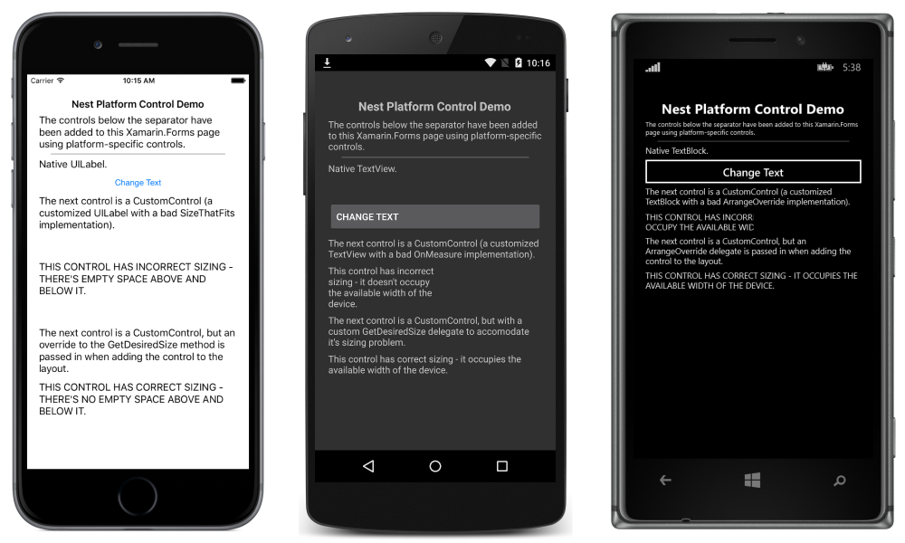
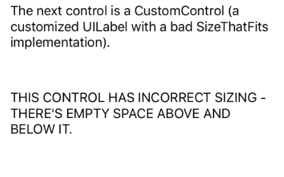
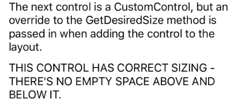
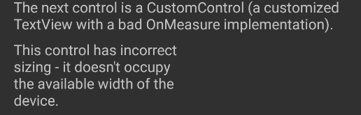
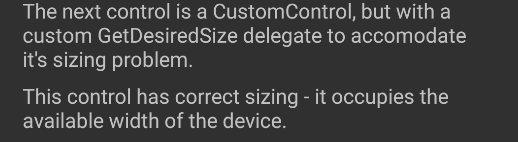

# Native Views in C\#

[ Download the sample](/samples/xamarin/xamarin-forms-samples/userinterface-nativeembedding)

_Native views from iOS, Android, and UWP can be directly referenced from Xamarin.Forms pages created using C#. This article demonstrates how to add native views to a Xamarin.Forms layout created using C#, and how to override the layout of custom views to correct their measurement API usage._

## Overview

Any Xamarin.Forms control that allows `Content` to be set, or that has a `Children` collection, can add platform-specific views. For example, an iOS `UILabel` can be directly added to the [`ContentView.Content`](xref:Xamarin.Forms.ContentView.Content) property, or to the [`StackLayout.Children`](xref:Xamarin.Forms.Layout`1.Children) collection. However, note that this functionality requires the use of `#if` defines in Xamarin.Forms Shared Project solutions, and isn't available from Xamarin.Forms .NET Standard library solutions.

The following screenshots demonstrate platform-specific views having been added to a Xamarin.Forms [`StackLayout`](xref:Xamarin.Forms.StackLayout):

[](code-images/screenshots.png#lightbox "StackLayout Containing Platform-Specific Views")

The ability to add platform-specific views to a Xamarin.Forms layout is enabled by two extension methods on each platform:

- `Add` – adds a platform-specific view to the [`Children`](xref:Xamarin.Forms.Layout`1.Children) collection of a layout.
- `ToView` – takes a platform-specific view and wraps it as a Xamarin.Forms [`View`](xref:Xamarin.Forms.View) that can be set as the `Content` property of a control.

Using these methods in a Xamarin.Forms shared project requires importing the appropriate platform-specific Xamarin.Forms namespace:

- **iOS** – Xamarin.Forms.Platform.iOS
- **Android** – Xamarin.Forms.Platform.Android
- **Universal Windows Platform (UWP)** – Xamarin.Forms.Platform.UWP

## Adding Platform-Specific Views on Each Platform

The following sections demonstrate how to add platform-specific views to a Xamarin.Forms layout on each platform.

### iOS

The following code example demonstrates how to add a `UILabel` to a [`StackLayout`](xref:Xamarin.Forms.StackLayout) and a [`ContentView`](xref:Xamarin.Forms.ContentView):

```csharp
var uiLabel = new UILabel {
  MinimumFontSize = 14f,
  Lines = 0,
  LineBreakMode = UILineBreakMode.WordWrap,
  Text = originalText,
};
stackLayout.Children.Add (uiLabel);
contentView.Content = uiLabel.ToView();
```

The example assumes that the `stackLayout` and `contentView` instances have previously been created in XAML or C#.

### Android

The following code example demonstrates how to add a `TextView` to a [`StackLayout`](xref:Xamarin.Forms.StackLayout) and a [`ContentView`](xref:Xamarin.Forms.ContentView):

```csharp
var textView = new TextView (MainActivity.Instance) { Text = originalText, TextSize = 14 };
stackLayout.Children.Add (textView);
contentView.Content = textView.ToView();
```

The example assumes that the `stackLayout` and `contentView` instances have previously been created in XAML or C#.

### Universal Windows Platform

The following code example demonstrates how to add a `TextBlock` to a [`StackLayout`](xref:Xamarin.Forms.StackLayout) and a [`ContentView`](xref:Xamarin.Forms.ContentView):

```csharp
var textBlock = new TextBlock
{
    Text = originalText,
    FontSize = 14,
    FontFamily = new FontFamily("HelveticaNeue"),
    TextWrapping = TextWrapping.Wrap
};
stackLayout.Children.Add(textBlock);
contentView.Content = textBlock.ToView();
```

The example assumes that the `stackLayout` and `contentView` instances have previously been created in XAML or C#.

## Overriding Platform Measurements for Custom Views

Custom views on each platform often only correctly implement measurement for the layout scenario for which they were designed. For example, a custom view may have been designed to only occupy half of the available width of the device. However, after being shared with other users, the custom view may be required to occupy the full available width of the device. Therefore, it can be necessary to override a custom views measurement implementation when being reused in a Xamarin.Forms layout. For that reason, the `Add` and `ToView` extension methods provide overrides that allow measurement delegates to be specified, which can override the custom view layout when it's added to a Xamarin.Forms layout.

The following sections demonstrate how to override the layout of custom views, to correct their measurement API usage.

### iOS

The following code example shows the `CustomControl` class, which inherits from `UILabel`:

```csharp
public class CustomControl : UILabel
{
  public override string Text {
    get { return base.Text; }
    set { base.Text = value.ToUpper (); }
  }

  public override CGSize SizeThatFits (CGSize size)
  {
    return new CGSize (size.Width, 150);
  }
}
```

An instance of this view is added to a [`StackLayout`](xref:Xamarin.Forms.StackLayout), as demonstrated in the following code example:

```csharp
var customControl = new CustomControl {
  MinimumFontSize = 14,
  Lines = 0,
  LineBreakMode = UILineBreakMode.WordWrap,
  Text = "This control has incorrect sizing - there's empty space above and below it."
};
stackLayout.Children.Add (customControl);
```

However, because the `CustomControl.SizeThatFits` override always returns a height of 150, the view will be displayed with empty space above and below it, as shown in the following screenshot:



A solution to this problem is to provide a `GetDesiredSizeDelegate` implementation, as demonstrated in the following code example:

```csharp
SizeRequest? FixSize (NativeViewWrapperRenderer renderer, double width, double height)
{
  var uiView = renderer.Control;

  if (uiView == null) {
    return null;
  }

  var constraint = new CGSize (width, height);

  // Let the CustomControl determine its size (which will be wrong)
  var badRect = uiView.SizeThatFits (constraint);

  // Use the width and substitute the height
  return new SizeRequest (new Size (badRect.Width, 70));
}
```

This method uses the width provided by the `CustomControl.SizeThatFits` method, but substitutes the height of 150 for a height of 70. When the `CustomControl` instance is added to the [`StackLayout`](xref:Xamarin.Forms.StackLayout), the `FixSize` method can be specified as the `GetDesiredSizeDelegate` to fix the bad measurement provided by the `CustomControl` class:

```csharp
stackLayout.Children.Add (customControl, FixSize);
```

This results in the custom view being displayed correctly, without empty space above and below it, as shown in the following screenshot:



### Android

The following code example shows the `CustomControl` class, which inherits from `TextView`:

```csharp
public class CustomControl : TextView
{
  public CustomControl (Context context) : base (context)
  {
  }

  protected override void OnMeasure (int widthMeasureSpec, int heightMeasureSpec)
  {
    int width = MeasureSpec.GetSize (widthMeasureSpec);

    // Force the width to half of what's been requested.
    // This is deliberately wrong to demonstrate providing an override to fix it with.
    int widthSpec = MeasureSpec.MakeMeasureSpec (width / 2, MeasureSpec.GetMode (widthMeasureSpec));

    base.OnMeasure (widthSpec, heightMeasureSpec);
  }
}
```

An instance of this view is added to a [`StackLayout`](xref:Xamarin.Forms.StackLayout), as demonstrated in the following code example:

```csharp
var customControl = new CustomControl (MainActivity.Instance) {
  Text = "This control has incorrect sizing - it doesn't occupy the available width of the device.",
  TextSize = 14
};
stackLayout.Children.Add (customControl);
```

However, because the `CustomControl.OnMeasure` override always returns half of the requested width, the view will be displayed occupying only half the available width of the device, as shown in the following screenshot:



A solution to this problem is to provide a `GetDesiredSizeDelegate` implementation, as demonstrated in the following code example:

```csharp
SizeRequest? FixSize (NativeViewWrapperRenderer renderer, int widthConstraint, int heightConstraint)
{
  var nativeView = renderer.Control;

  if ((widthConstraint == 0 && heightConstraint == 0) || nativeView == null) {
    return null;
  }

  int width = Android.Views.View.MeasureSpec.GetSize (widthConstraint);
  int widthSpec = Android.Views.View.MeasureSpec.MakeMeasureSpec (
    width * 2, Android.Views.View.MeasureSpec.GetMode (widthConstraint));
  nativeView.Measure (widthSpec, heightConstraint);
  return new SizeRequest (new Size (nativeView.MeasuredWidth, nativeView.MeasuredHeight));
}
```

This method uses the width provided by the `CustomControl.OnMeasure` method, but multiplies it by two. When the `CustomControl` instance is added to the [`StackLayout`](xref:Xamarin.Forms.StackLayout), the `FixSize` method can be specified as the `GetDesiredSizeDelegate` to fix the bad measurement provided by the `CustomControl` class:

```csharp
stackLayout.Children.Add (customControl, FixSize);
```

This results in the custom view being displayed correctly, occupying the width of the device, as shown in the following screenshot:



### Universal Windows Platform

The following code example shows the `CustomControl` class, which inherits from `Panel`:

```csharp
public class CustomControl : Panel
{
  public static readonly DependencyProperty TextProperty =
    DependencyProperty.Register(
      "Text", typeof(string), typeof(CustomControl), new PropertyMetadata(default(string), OnTextPropertyChanged));

  public string Text
  {
    get { return (string)GetValue(TextProperty); }
    set { SetValue(TextProperty, value.ToUpper()); }
  }

  readonly TextBlock textBlock;

  public CustomControl()
  {
    textBlock = new TextBlock
    {
      MinHeight = 0,
      MaxHeight = double.PositiveInfinity,
      MinWidth = 0,
      MaxWidth = double.PositiveInfinity,
      FontSize = 14,
      TextWrapping = TextWrapping.Wrap,
      VerticalAlignment = VerticalAlignment.Center
    };

    Children.Add(textBlock);
  }

  static void OnTextPropertyChanged(DependencyObject dependencyObject, DependencyPropertyChangedEventArgs args)
  {
    ((CustomControl)dependencyObject).textBlock.Text = (string)args.NewValue;
  }

  protected override Size ArrangeOverride(Size finalSize)
  {
      // This is deliberately wrong to demonstrate providing an override to fix it with.
      textBlock.Arrange(new Rect(0, 0, finalSize.Width/2, finalSize.Height));
      return finalSize;
  }

  protected override Size MeasureOverride(Size availableSize)
  {
      textBlock.Measure(availableSize);
      return new Size(textBlock.DesiredSize.Width, textBlock.DesiredSize.Height);
  }
}
```

An instance of this view is added to a [`StackLayout`](xref:Xamarin.Forms.StackLayout), as demonstrated in the following code example:

```csharp
var brokenControl = new CustomControl {
  Text = "This control has incorrect sizing - it doesn't occupy the available width of the device."
};
stackLayout.Children.Add(brokenControl);
```

However, because the `CustomControl.ArrangeOverride` override always returns half of the requested width, the view will be clipped to half the available width of the device, as shown in the following screenshot:


A solution to this problem is to provide an `ArrangeOverrideDelegate` implementation, when adding the view to the [`StackLayout`](xref:Xamarin.Forms.StackLayout), as demonstrated in the following code example:

```csharp
stackLayout.Children.Add(fixedControl, arrangeOverrideDelegate: (renderer, finalSize) =>
{
    if (finalSize.Width <= 0 || double.IsInfinity(finalSize.Width))
    {
        return null;
    }
    var frameworkElement = renderer.Control;
    frameworkElement.Arrange(new Rect(0, 0, finalSize.Width * 2, finalSize.Height));
    return finalSize;
});
```

This method uses the width provided by the `CustomControl.ArrangeOverride` method, but multiplies it by two. This results in the custom view being displayed correctly, occupying the width of the device, as shown in the following screenshot:


## Summary

This article explained how to add native views to a Xamarin.Forms layout created using C#, and how to override the layout of custom views to correct their measurement API usage.

## Related Links

- [NativeEmbedding (sample)](/samples/xamarin/xamarin-forms-samples/userinterface-nativeembedding)
- [Native Forms](~/xamarin-forms/platform/native-forms.md)