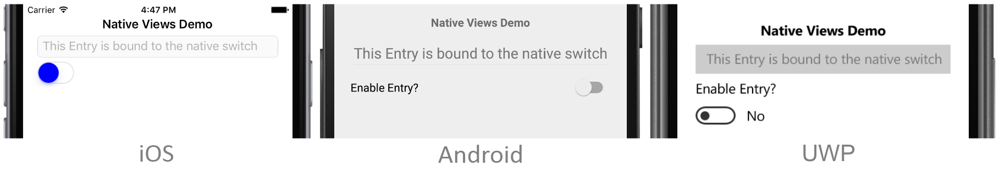
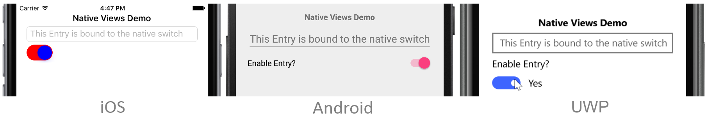
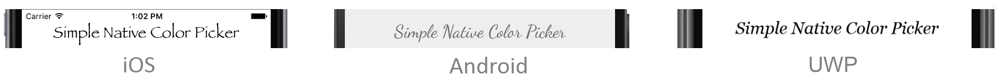
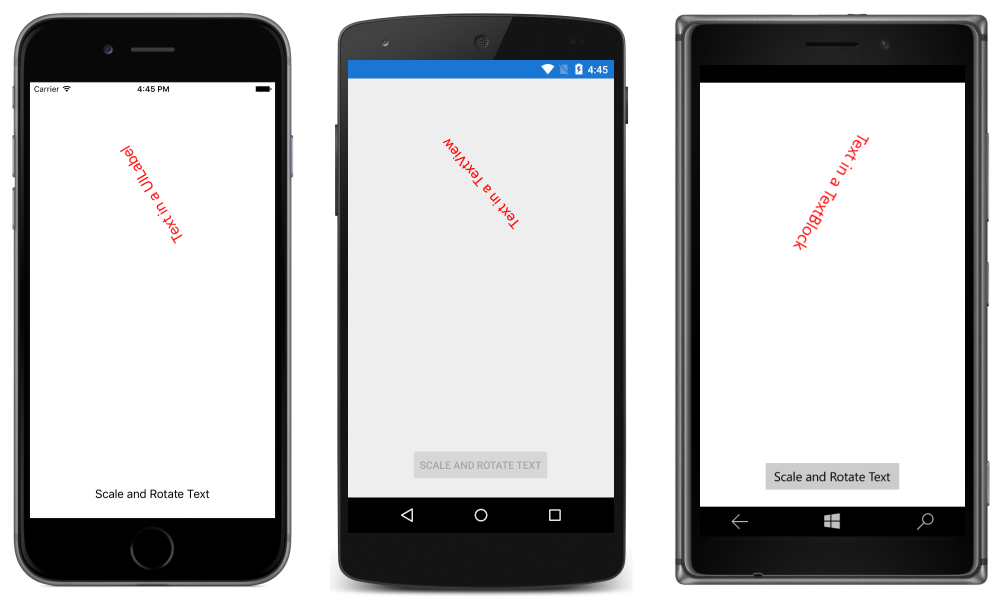
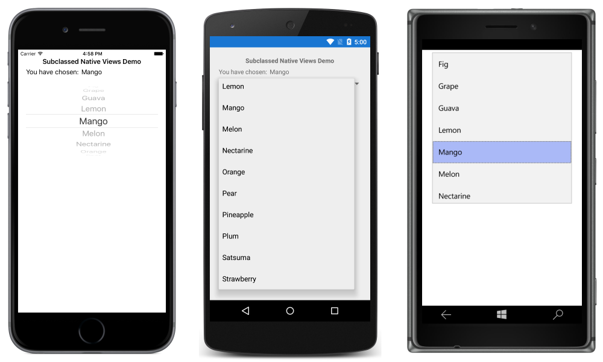

# Native Views in XAML

[ Download the sample](https://developer.xamarin.com/samples/xamarin-forms/UserInterface/NativeViews/NativeSwitch/)

_Native views from iOS, Android, and the Universal Windows Platform can be directly referenced from Xamarin.Forms XAML files. Properties and event handlers can be set on native views, and they can interact with Xamarin.Forms views. This article demonstrates how to consume native views from Xamarin.Forms XAML files._

This article discusses the following topics:

- [Consuming native views](#consuming) – the process for consuming a native view from XAML.
- [Using native bindings](#native_bindings) – data binding to and from properties of native views.
- [Passing arguments to native views](#passing_arguments) – passing arguments to native view constructors, and calling native view factory methods.
- [Referring to native views from code](#native_view_code) –  retrieving native view instances declared in a XAML file, from its code-behind file.
- [Subclassing native views](#subclassing) – subclassing native views to define a XAML-friendly API.  

<a name="overview" />

## Overview

To embed a native view into a Xamarin.Forms XAML file:

1. Add an `xmlns` namespace declaration in the XAML file for the namespace that contains the native view.
1. Create an instance of the native view in the XAML file.

> [!NOTE]
> XAMLC must be turned off for any XAML pages that use native views.

To reference a native view from a code-behind file, you must use a Shared Asset Project (SAP) and wrap the platform-specific code with conditional compilation directives. For more information see [Referring to Native Views from Code](#native_view_code).

<a name="consuming" />

## Consuming Native Views

The following code example demonstrates consuming native views for each platform to a Xamarin.Forms [`ContentPage`](xref:Xamarin.Forms.ContentPage):

```xaml
<ContentPage xmlns="http://xamarin.com/schemas/2014/forms"
        xmlns:x="http://schemas.microsoft.com/winfx/2009/xaml"
        xmlns:ios="clr-namespace:UIKit;assembly=Xamarin.iOS;targetPlatform=iOS"
        xmlns:androidWidget="clr-namespace:Android.Widget;assembly=Mono.Android;targetPlatform=Android"
        xmlns:androidLocal="clr-namespace:SimpleColorPicker.Droid;assembly=SimpleColorPicker.Droid;targetPlatform=Android"
        xmlns:win="clr-namespace:Windows.UI.Xaml.Controls;assembly=Windows, Version=255.255.255.255,
            Culture=neutral, PublicKeyToken=null, ContentType=WindowsRuntime;targetPlatform=Windows"
        x:Class="NativeViews.NativeViewDemo">
    <StackLayout Margin="20">
        <ios:UILabel Text="Hello World" TextColor="{x:Static ios:UIColor.Red}" View.HorizontalOptions="Start" />
        <androidWidget:TextView Text="Hello World" x:Arguments="{x:Static androidLocal:MainActivity.Instance}" />
        <win:TextBlock Text="Hello World" />
    </StackLayout>
</ContentPage>
```

As well as specifying the `clr-namespace` and `assembly` for a native view namespace, a `targetPlatform` must also be specified. This should be set to one of values of the [`TargetPlatform`](xref:Xamarin.Forms.TargetPlatform) enumeration, and will typically be set to `iOS`, `Android`, or `Windows`. At runtime, the XAML parser will ignore any XML namespace prefixes that have a `targetPlatform` that doesn't match the platform on which the application is running.

Each namespace declaration can be used to reference any class or structure from the specified namespace. For example, the `ios` namespace declaration can be used to reference any class or structure from the iOS `UIKit` namespace. Properties of the native view can be set through XAML, but the property and object types must match. For example, the `UILabel.TextColor` property is set to `UIColor.Red` using the `x:Static` markup extension and the `ios` namespace.

Bindable properties and attached bindable properties can also be set on native views by using the `Class.BindableProperty="value"` syntax. Each native view is wrapped in a platform-specific `NativeViewWrapper` instance, which derives from the [`Xamarin.Forms.View`](xref:Xamarin.Forms.View) class. Setting a bindable property or attached bindable property on a native view transfers the property value to the wrapper. For example, a centered horizontal layout can be specified by setting `View.HorizontalOptions="Center"` on the native view.

> [!NOTE]
> Note that styles can't be used with native views, because styles can only target properties that are backed by `BindableProperty` objects.

Android widget constructors generally require the Android `Context` object as an argument, and this can be made available through a static property in the `MainActivity` class. Therefore, when creating an Android widget in XAML, the `Context` object must generally be passed to the widget's constructor using the `x:Arguments` attribute with a `x:Static` markup extension. For more information, see [Passing Arguments to Native Views](#passing_arguments).

> [!NOTE]
> Note that naming a native view with `x:Name` is not possible in either a .NET Standard library project or a Shared Asset Project (SAP). Doing so will generate a variable of the native type, which will cause a compilation error. However, native views can be wrapped in `ContentView` instances and retrieved in the code-behind file, provided that a SAP is being used. For more information, see [Referring to a Native View from Code](#native_view_code).

<a name="native_bindings" />

## Native Bindings

Data binding is used to synchronize a UI with its data source, and simplifies how a Xamarin.Forms application displays and interacts with its data. Provided that the source object implements the `INotifyPropertyChanged` interface, changes in the *source* object are automatically pushed to the *target* object by the binding framework, and changes in the *target* object can optionally be pushed to the *source* object.

Properties of native views can also use data binding. The following code example demonstrates data binding using properties of native views:

```xaml
<ContentPage xmlns="http://xamarin.com/schemas/2014/forms"
        xmlns:x="http://schemas.microsoft.com/winfx/2009/xaml"
        xmlns:ios="clr-namespace:UIKit;assembly=Xamarin.iOS;targetPlatform=iOS"
        xmlns:androidWidget="clr-namespace:Android.Widget;assembly=Mono.Android;targetPlatform=Android"
        xmlns:androidLocal="clr-namespace:SimpleColorPicker.Droid;assembly=SimpleColorPicker.Droid;targetPlatform=Android"
        xmlns:win="clr-namespace:Windows.UI.Xaml.Controls;assembly=Windows, Version=255.255.255.255,
            Culture=neutral, PublicKeyToken=null, ContentType=WindowsRuntime;targetPlatform=Windows"
        xmlns:local="clr-namespace:NativeSwitch"
        x:Class="NativeSwitch.NativeSwitchPage">
    <StackLayout Margin="20">
        <Label Text="Native Views Demo" FontAttributes="Bold" HorizontalOptions="Center" />
        <Entry Placeholder="This Entry is bound to the native switch" IsEnabled="{Binding IsSwitchOn}" />
        <ios:UISwitch On="{Binding Path=IsSwitchOn, Mode=TwoWay, UpdateSourceEventName=ValueChanged}"
            OnTintColor="{x:Static ios:UIColor.Red}"
            ThumbTintColor="{x:Static ios:UIColor.Blue}" />
        <androidWidget:Switch x:Arguments="{x:Static androidLocal:MainActivity.Instance}"
            Checked="{Binding Path=IsSwitchOn, Mode=TwoWay, UpdateSourceEventName=CheckedChange}"
            Text="Enable Entry?" />
        <win:ToggleSwitch Header="Enable Entry?"
            OffContent="No"
            OnContent="Yes"
            IsOn="{Binding IsSwitchOn, Mode=TwoWay, UpdateSourceEventName=Toggled}" />
    </StackLayout>
</ContentPage>

```

The page contains an [`Entry`](xref:Xamarin.Forms.Entry) whose [`IsEnabled`](xref:Xamarin.Forms.VisualElement.IsEnabled) property binds to the `NativeSwitchPageViewModel.IsSwitchOn` property. The [`BindingContext`](xref:Xamarin.Forms.BindableObject.BindingContext) of the page is set to a new instance of the `NativeSwitchPageViewModel` class in the code-behind file, with the ViewModel class implementing the `INotifyPropertyChanged` interface.

The page also contains a native switch for each platform. Each native switch uses a [`TwoWay`](xref:Xamarin.Forms.BindingMode.TwoWay) binding to update the value of the `NativeSwitchPageViewModel.IsSwitchOn` property. Therefore, when the switch is off, the `Entry` is disabled, and when the switch is on, the `Entry` is enabled. The following screenshots show this functionality on each platform:




Two-way bindings are automatically supported provided that the native property implements `INotifyPropertyChanged`, or supports Key-Value Observing (KVO) on iOS, or is a `DependencyProperty` on UWP. However, many native views don't support property change notification. For these views, you can specify an [`UpdateSourceEventName`](xref:Xamarin.Forms.Binding.UpdateSourceEventName) property value as part of the binding expression. This property should be set to the name of an event in the native view that signals when the target property has changed. Then, when the value of the native switch changes, the `Binding` class is notified that the user has changed the switch value, and the `NativeSwitchPageViewModel.IsSwitchOn` property value is updated.

<a name="passing_arguments" />

## Passing Arguments to Native Views

Constructor arguments can be passed to native views using the `x:Arguments` attribute with a `x:Static` markup extension. In addition, native view factory methods (`public static` methods that return objects or values of the same type as the class or structure that defines the methods) can be called by specifying the method's name using the `x:FactoryMethod` attribute, and its arguments using the `x:Arguments` attribute.

The following code example demonstrates both techniques:

```xaml
<ContentPage ...
        xmlns:ios="clr-namespace:UIKit;assembly=Xamarin.iOS;targetPlatform=iOS"
        xmlns:androidWidget="clr-namespace:Android.Widget;assembly=Mono.Android;targetPlatform=Android"
        xmlns:androidGraphics="clr-namespace:Android.Graphics;assembly=Mono.Android;targetPlatform=Android"
        xmlns:androidLocal="clr-namespace:SimpleColorPicker.Droid;assembly=SimpleColorPicker.Droid;targetPlatform=Android"
        xmlns:winControls="clr-namespace:Windows.UI.Xaml.Controls;assembly=Windows, Version=255.255.255.255, Culture=neutral, PublicKeyToken=null, ContentType=WindowsRuntime;targetPlatform=Windows"
        xmlns:winMedia="clr-namespace:Windows.UI.Xaml.Media;assembly=Windows, Version=255.255.255.255, Culture=neutral, PublicKeyToken=null, ContentType=WindowsRuntime;targetPlatform=Windows"
        xmlns:winText="clr-namespace:Windows.UI.Text;assembly=Windows, Version=255.255.255.255, Culture=neutral, PublicKeyToken=null, ContentType=WindowsRuntime;targetPlatform=Windows"
        xmlns:winui="clr-namespace:Windows.UI;assembly=Windows, Version=255.255.255.255, Culture=neutral, PublicKeyToken=null, ContentType=WindowsRuntime;targetPlatform=Windows">
        ...
        <ios:UILabel Text="Simple Native Color Picker" View.HorizontalOptions="Center">
            <ios:UILabel.Font>
                <ios:UIFont x:FactoryMethod="FromName">
                    <x:Arguments>
                        <x:String>Papyrus</x:String>
                        <x:Single>24</x:Single>
                    </x:Arguments>
                </ios:UIFont>
            </ios:UILabel.Font>
        </ios:UILabel>
        <androidWidget:TextView x:Arguments="{x:Static androidLocal:MainActivity.Instance}"
                    Text="Simple Native Color Picker"
                    TextSize="24"
                    View.HorizontalOptions="Center">
            <androidWidget:TextView.Typeface>
                <androidGraphics:Typeface x:FactoryMethod="Create">
                    <x:Arguments>
                        <x:String>cursive</x:String>
                        <androidGraphics:TypefaceStyle>Normal</androidGraphics:TypefaceStyle>
                    </x:Arguments>
                </androidGraphics:Typeface>
            </androidWidget:TextView.Typeface>
        </androidWidget:TextView>
        <winControls:TextBlock Text="Simple Native Color Picker"
                    FontSize="20"
                    FontStyle="{x:Static winText:FontStyle.Italic}"
                    View.HorizontalOptions="Center">
            <winControls:TextBlock.FontFamily>
                <winMedia:FontFamily>
                    <x:Arguments>
                        <x:String>Georgia</x:String>
                    </x:Arguments>
                </winMedia:FontFamily>
            </winControls:TextBlock.FontFamily>
        </winControls:TextBlock>
        ...
</ContentPage>
```

The [`UIFont.FromName`](xref:UIKit.UIFont.FromName*) factory method is used to set the [`UILabel.Font`](xref:UIKit.UILabel.Font) property to a new [`UIFont`](xref:UIKit.UIFont) on iOS. The `UIFont` name and size are specified by the method arguments that are children of the `x:Arguments` attribute.

The [`Typeface.Create`](https://developer.xamarin.com/api/member/Android.Graphics.Typeface.Create/p/System.String/Android.Graphics.TypefaceStyle/) factory method is used to set the [`TextView.Typeface`](https://developer.xamarin.com/api/property/Android.Widget.TextView.Typeface/) property to a new [`Typeface`](https://developer.xamarin.com/api/type/Android.Graphics.Typeface/) on Android. The `Typeface` family name and style are specified by the method arguments that are children of the `x:Arguments` attribute.

The [`FontFamily`](https://msdn.microsoft.com/library/windows/apps/windows.ui.xaml.media.fontfamily) constructor is used to set the [`TextBlock.FontFamily`](https://msdn.microsoft.com/library/windows/apps/windows.ui.xaml.controls.textblock.fontfamily) property to a new `FontFamily` on the Universal Windows Platform (UWP). The `FontFamily` name is specified by the method argument that is a child of the `x:Arguments` attribute.

> [!NOTE]
> Arguments must match the types required by the constructor or factory method.

The following screenshots show the result of specifying factory method and constructor arguments to set the font on different native views:



For more information about passing arguments in XAML, see [Passing Arguments in XAML](~/xamarin-forms/xaml/passing-arguments.md).

<a name="native_view_code" />

## Referring to Native Views from Code

Although it's not possible to name a native view with the `x:Name` attribute, it is possible to retrieve a native view instance declared in a XAML file from its code-behind file in a Shared Access Project, provided that the native view is a child of a [`ContentView`](xref:Xamarin.Forms.ContentView) that specifies an `x:Name` attribute value. Then, inside conditional compilation directives in the code-behind file you should:

1. Retrieve the [`ContentView.Content`](xref:Xamarin.Forms.ContentView.Content) property value and cast it to a platform-specific `NativeViewWrapper` type.
1. Retrieve the `NativeViewWrapper.NativeElement` property and cast it to the native view type.

The native API can then be invoked on the native view to perform the desired operations. This approach also offers the benefit that multiple XAML native views for different platforms can be children of the same [`ContentView`](xref:Xamarin.Forms.ContentView). The following code example demonstrates this technique:

```xaml
<ContentPage xmlns="http://xamarin.com/schemas/2014/forms"
        xmlns:x="http://schemas.microsoft.com/winfx/2009/xaml"
        xmlns:ios="clr-namespace:UIKit;assembly=Xamarin.iOS;targetPlatform=iOS"
        xmlns:androidWidget="clr-namespace:Android.Widget;assembly=Mono.Android;targetPlatform=Android"
        xmlns:androidLocal="clr-namespace:SimpleColorPicker.Droid;assembly=SimpleColorPicker.Droid;targetPlatform=Android"
        xmlns:winControls="clr-namespace:Windows.UI.Xaml.Controls;assembly=Windows, Version=255.255.255.255,
            Culture=neutral, PublicKeyToken=null, ContentType=WindowsRuntime;targetPlatform=Windows"
        xmlns:local="clr-namespace:NativeViewInsideContentView"
        x:Class="NativeViewInsideContentView.NativeViewInsideContentViewPage">
    <StackLayout Margin="20">
        <ContentView x:Name="contentViewTextParent" HorizontalOptions="Center" VerticalOptions="CenterAndExpand">
            <ios:UILabel Text="Text in a UILabel" TextColor="{x:Static ios:UIColor.Red}" />
            <androidWidget:TextView x:Arguments="{x:Static androidLocal:MainActivity.Instance}"
                Text="Text in a TextView" />
              <winControls:TextBlock Text="Text in a TextBlock" />
        </ContentView>
        <ContentView x:Name="contentViewButtonParent" HorizontalOptions="Center" VerticalOptions="EndAndExpand">
            <ios:UIButton TouchUpInside="OnButtonTap" View.HorizontalOptions="Center" View.VerticalOptions="Center" />
            <androidWidget:Button x:Arguments="{x:Static androidLocal:MainActivity.Instance}"
                Text="Scale and Rotate Text"
                Click="OnButtonTap" />
            <winControls:Button Content="Scale and Rotate Text" />
        </ContentView>
    </StackLayout>
</ContentPage>
```

In the example above, the native views for each platform are children of [`ContentView`](xref:Xamarin.Forms.ContentView) controls, with the `x:Name` attribute value being used to retrieve the `ContentView` in the code-behind:

```csharp
public partial class NativeViewInsideContentViewPage : ContentPage
{
    public NativeViewInsideContentViewPage()
    {
        InitializeComponent();

#if __IOS__
        var wrapper = (Xamarin.Forms.Platform.iOS.NativeViewWrapper)contentViewButtonParent.Content;
        var button = (UIKit.UIButton)wrapper.NativeView;
        button.SetTitle("Scale and Rotate Text", UIKit.UIControlState.Normal);
        button.SetTitleColor(UIKit.UIColor.Black, UIKit.UIControlState.Normal);
#endif
#if __ANDROID__
        var wrapper = (Xamarin.Forms.Platform.Android.NativeViewWrapper)contentViewTextParent.Content;
        var textView = (Android.Widget.TextView)wrapper.NativeView;
        textView.SetTextColor(Android.Graphics.Color.Red);
#endif
#if WINDOWS_UWP
        var textWrapper = (Xamarin.Forms.Platform.UWP.NativeViewWrapper)contentViewTextParent.Content;
        var textBlock = (Windows.UI.Xaml.Controls.TextBlock)textWrapper.NativeElement;
        textBlock.Foreground = new Windows.UI.Xaml.Media.SolidColorBrush(Windows.UI.Colors.Red);
        var buttonWrapper = (Xamarin.Forms.Platform.UWP.NativeViewWrapper)contentViewButtonParent.Content;
        var button = (Windows.UI.Xaml.Controls.Button)buttonWrapper.NativeElement;
        button.Click += (sender, args) => OnButtonTap(sender, EventArgs.Empty);
#endif
    }

    async void OnButtonTap(object sender, EventArgs e)
    {
        contentViewButtonParent.Content.IsEnabled = false;
        contentViewTextParent.Content.ScaleTo(2, 2000);
        await contentViewTextParent.Content.RotateTo(360, 2000);
        contentViewTextParent.Content.ScaleTo(1, 2000);
        await contentViewTextParent.Content.RelRotateTo(360, 2000);
        contentViewButtonParent.Content.IsEnabled = true;
    }
}
```

The [`ContentView.Content`](xref:Xamarin.Forms.ContentView.Content) property is accessed to retrieve the wrapped native view as a platform-specific `NativeViewWrapper` instance. The `NativeViewWrapper.NativeElement` property is then accessed to retrieve the native view as its native type. The native view's API is then invoked to perform the desired operations.

The iOS and Android native buttons share the same `OnButtonTap` event handler, because each native button consumes an `EventHandler` delegate in response to a touch event. However, the Universal Windows Platform (UWP) uses a separate `RoutedEventHandler`, which in turn consumes the `OnButtonTap` event handler in this example. Therefore, when a native button is clicked, the `OnButtonTap` event handler executes, which scales and rotates the native control contained within the [`ContentView`](xref:Xamarin.Forms.ContentView) named `contentViewTextParent`. The following screenshots demonstrate this occurring on each platform:



<a name="subclassing" />

## Subclassing Native Views

Many iOS and Android native views are not suitable for instantiating in XAML because they use methods, rather than properties, to set up the control. The solution to this issue is to subclass native views in wrappers that define a more XAML-friendly API that uses properties to setup the control, and that uses platform-independent events. The wrapped native views can then be placed in a Shared Asset Project (SAP) and surrounded with conditional compilation directives, or placed in platform-specific projects and referenced from XAML in a .NET Standard library project.

The following code example demonstrates a Xamarin.Forms page that consumes subclassed native views:

```xaml
<ContentPage xmlns="http://xamarin.com/schemas/2014/forms"
        xmlns:x="http://schemas.microsoft.com/winfx/2009/xaml"
        xmlns:ios="clr-namespace:UIKit;assembly=Xamarin.iOS;targetPlatform=iOS"
        xmlns:iosLocal="clr-namespace:SubclassedNativeControls.iOS;assembly=SubclassedNativeControls.iOS;targetPlatform=iOS"
        xmlns:android="clr-namespace:Android.Widget;assembly=Mono.Android;targetPlatform=Android"
        xmlns:androidLocal="clr-namespace:SimpleColorPicker.Droid;assembly=SimpleColorPicker.Droid;targetPlatform=Android"
        xmlns:androidLocal="clr-namespace:SubclassedNativeControls.Droid;assembly=SubclassedNativeControls.Droid;targetPlatform=Android"
        xmlns:winControls="clr-namespace:Windows.UI.Xaml.Controls;assembly=Windows, Version=255.255.255.255,
            Culture=neutral, PublicKeyToken=null, ContentType=WindowsRuntime;targetPlatform=Windows"
        xmlns:local="clr-namespace:SubclassedNativeControls"
        x:Class="SubclassedNativeControls.SubclassedNativeControlsPage">
    <StackLayout Margin="20">
        <Label Text="Subclassed Native Views Demo" FontAttributes="Bold" HorizontalOptions="Center" />
        <StackLayout Orientation="Horizontal">
          <Label Text="You have chosen:" />
          <Label Text="{Binding SelectedFruit}" />      
        </StackLayout>
        <iosLocal:MyUIPickerView ItemsSource="{Binding Fruits}"
            SelectedItem="{Binding SelectedFruit, Mode=TwoWay, UpdateSourceEventName=SelectedItemChanged}" />
        <androidLocal:MySpinner x:Arguments="{x:Static androidLocal:MainActivity.Instance}"
            ItemsSource="{Binding Fruits}"
            SelectedObject="{Binding SelectedFruit, Mode=TwoWay, UpdateSourceEventName=ItemSelected}" />
        <winControls:ComboBox ItemsSource="{Binding Fruits}"
            SelectedItem="{Binding SelectedFruit, Mode=TwoWay, UpdateSourceEventName=SelectionChanged}" />
    </StackLayout>
</ContentPage>
```

The page contains a [`Label`](xref:Xamarin.Forms.Label) that displays the fruit chosen by the user from a native control. The `Label` binds to the `SubclassedNativeControlsPageViewModel.SelectedFruit` property. The [`BindingContext`](xref:Xamarin.Forms.BindableObject.BindingContext) of the page is set to a new instance of the `SubclassedNativeControlsPageViewModel` class in the code-behind file, with the ViewModel class implementing the `INotifyPropertyChanged` interface.

The page also contains a native picker view for each platform. Each native view displays the collection of fruits by binding its `ItemSource` property to the `SubclassedNativeControlsPageViewModel.Fruits` collection. This allows the user to pick a fruit, as shown in the following screenshots:



On iOS and Android the native pickers use methods to setup the controls. Therefore, these pickers must be subclassed to expose properties to make them XAML-friendly. On the Universal Windows Platform (UWP), the `ComboBox` is already XAML-friendly, and so doesn't require subclassing.

### iOS

The iOS implementation subclasses the [`UIPickerView`](xref:UIKit.UIPickerView) view, and exposes properties and an event that can be easily consumed from XAML:

```csharp
public class MyUIPickerView : UIPickerView
{
    public event EventHandler<EventArgs> SelectedItemChanged;

    public MyUIPickerView()
    {
        var model = new PickerModel();
        model.ItemChanged += (sender, e) =>
        {
            if (SelectedItemChanged != null)
            {
                SelectedItemChanged.Invoke(this, e);
            }
        };
        Model = model;
    }

    public IList<string> ItemsSource
    {
        get
        {
            var pickerModel = Model as PickerModel;
            return (pickerModel != null) ? pickerModel.Items : null;
        }
        set
        {
            var model = Model as PickerModel;
            if (model != null)
            {
                model.Items = value;
            }
        }
    }

    public string SelectedItem
    {
        get { return (Model as PickerModel).SelectedItem; }
        set { }
    }
}
```

The `MyUIPickerView` class exposes `ItemsSource` and `SelectedItem` properties, and a `SelectedItemChanged` event. A [`UIPickerView`](xref:UIKit.UIPickerView) requires an underlying [`UIPickerViewModel`](xref:UIKit.UIPickerViewModel) data model, which is accessed by the `MyUIPickerView` properties and event. The `UIPickerViewModel` data model is provided by the `PickerModel` class:

```csharp
class PickerModel : UIPickerViewModel
{
    int selectedIndex = 0;
    public event EventHandler<EventArgs> ItemChanged;
    public IList<string> Items { get; set; }

    public string SelectedItem
    {
        get
        {
            return Items != null && selectedIndex >= 0 && selectedIndex < Items.Count ? Items[selectedIndex] : null;
        }
    }

    public override nint GetRowsInComponent(UIPickerView pickerView, nint component)
    {
        return Items != null ? Items.Count : 0;
    }

    public override string GetTitle(UIPickerView pickerView, nint row, nint component)
    {
        return Items != null && Items.Count > row ? Items[(int)row] : null;
    }

    public override nint GetComponentCount(UIPickerView pickerView)
    {
        return 1;
    }

    public override void Selected(UIPickerView pickerView, nint row, nint component)
    {
        selectedIndex = (int)row;
        if (ItemChanged != null)
        {
            ItemChanged.Invoke(this, new EventArgs());
        }
    }
}
```

The `PickerModel` class provides the underlying storage for the `MyUIPickerView` class, via the `Items` property. Whenever the selected item in the `MyUIPickerView` changes, the [`Selected`](xref:UIKit.UIPickerViewModel.Selected*) method is executed, which updates the selected index and fires the `ItemChanged` event. This ensures that the `SelectedItem` property will always return the last item picked by the user. In addition, the `PickerModel` class overrides methods that are used to setup the `MyUIPickerView` instance.

### Android

The Android implementation subclasses the [`Spinner`](https://developer.xamarin.com/api/type/Android.Widget.Spinner/) view, and exposes properties and an event that can be easily consumed from XAML:

```csharp
class MySpinner : Spinner
{
    ArrayAdapter adapter;
    IList<string> items;

    public IList<string> ItemsSource
    {
        get { return items; }
        set
        {
            if (items != value)
            {
                items = value;
                adapter.Clear();

                foreach (string str in items)
                {
                    adapter.Add(str);
                }
            }
        }
    }

    public string SelectedObject
    {
        get { return (string)GetItemAtPosition(SelectedItemPosition); }
        set
        {
            if (items != null)
            {
                int index = items.IndexOf(value);
                if (index != -1)
                {
                    SetSelection(index);
                }
            }
        }
    }

    public MySpinner(Context context) : base(context)
    {
        ItemSelected += OnBindableSpinnerItemSelected;

        adapter = new ArrayAdapter(context, Android.Resource.Layout.SimpleSpinnerItem);
        adapter.SetDropDownViewResource(Android.Resource.Layout.SimpleSpinnerDropDownItem);
        Adapter = adapter;
    }

    void OnBindableSpinnerItemSelected(object sender, ItemSelectedEventArgs args)
    {
        SelectedObject = (string)GetItemAtPosition(args.Position);
    }
}
```

The `MySpinner` class exposes `ItemsSource` and `SelectedObject` properties, and a `ItemSelected` event. The items displayed by the `MySpinner` class are provided by the [`Adapter`](https://developer.xamarin.com/api/type/Android.Widget.Adapter/) associated with the view, and items are populated into the `Adapter` when the `ItemsSource` property is first set. Whenever the selected item in the `MySpinner` class changes, the `OnBindableSpinnerItemSelected` event handler updates the `SelectedObject` property.

## Summary

This article demonstrated how to consume native views from Xamarin.Forms XAML files. Properties and event handlers can be set on native views, and they can interact with Xamarin.Forms views.


## Related Links

- [NativeSwitch (sample)](https://developer.xamarin.com/samples/xamarin-forms/UserInterface/NativeViews/NativeSwitch/)
- [Forms2Native (sample)](https://developer.xamarin.com/samples/xamarin-forms/Forms2Native/)
- [NativeViewInsideContentView (sample)](https://developer.xamarin.com/samples/xamarin-forms/UserInterface/NativeViews/NativeViewInsideContentView/)
- [SubclassedNativeControls (sample)](https://developer.xamarin.com/samples/xamarin-forms/UserInterface/NativeViews/SubclassedNativeControls/)
- [Native Forms](~/xamarin-forms/platform/native-forms.md)
- [Passing Arguments in XAML](~/xamarin-forms/xaml/passing-arguments.md)
