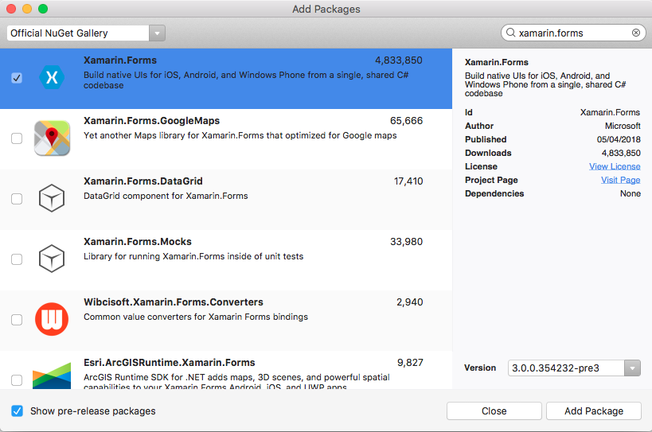
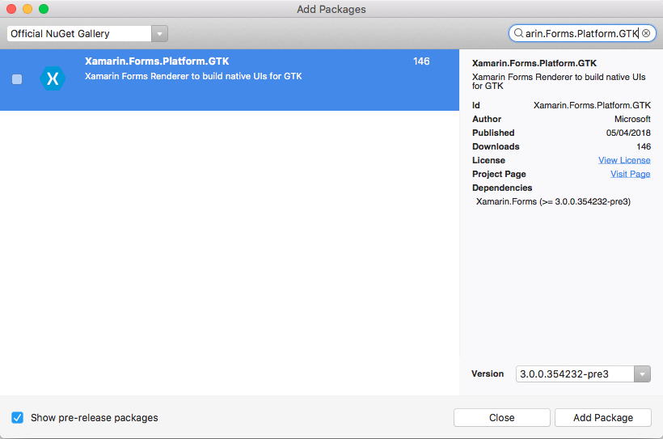
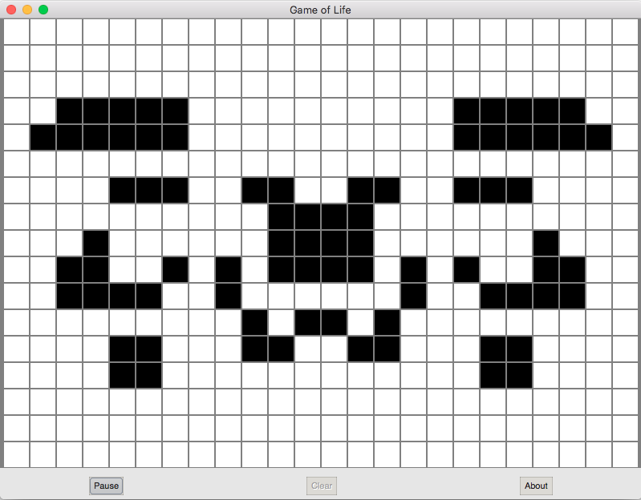

# GTK# Platform Setup

:::image type="icon" source="~/media/shared/preview.png" border="false":::

Xamarin.Forms now has preview support for GTK# apps. GTK# is a graphical user interface toolkit that links the GTK+ toolkit and a variety of GNOME libraries, allowing the development of fully native GNOME graphics apps using Mono and .NET. This article demonstrates how to add a GTK# project to a Xamarin.Forms solution.

> [!IMPORTANT]
> Xamarin.Forms support for GTK# is provided by the community. For more information, see [Xamarin.Forms Platform Support](https://github.com/xamarin/Xamarin.Forms/wiki/Platform-Support).

Before you start, create a new Xamarin.Forms solution, or use an existing Xamarin.Forms solution, for example, [**GameOfLife**](/samples/xamarin/xamarin-forms-samples/boxview-gameoflife).

> [!NOTE]
> While this article focuses on adding a GTK# app to a Xamarin.Forms solution in VS2017 and Visual Studio for Mac, it can also be performed in [MonoDevelop](https://www.monodevelop.com/) for Linux.

## Adding a GTK# App

GTK# for macOS and Linux is installed as part of [Mono](https://www.mono-project.com/download/stable/). GTK# for .NET can be installed on Windows with the [GTK# Installer](https://www.mono-project.com/download/stable/#download-win).

# [Visual Studio](#tab/windows)

Follow these instructions to add a GTK# app that will run on the Windows desktop:

1. In Visual Studio 2019, right-click on the solution name in **Solution Explorer** and choose **Add > New Project...**.

2. In the **New Project** window, at the left select **Visual C#** and **Windows Classic Desktop**. In the list of project types, choose **Class Library (.NET Framework)**, and ensure that the **Framework** drop-down is set to a minimum of .NET Framework 4.7.

3. Type a name for the project with a **GTK** extension, for example **GameOfLife.GTK**. Click the **Browse** button, select the folder containing the other platform projects, and press **Select Folder**. This will put the GTK project in the same directory as the other projects in the solution.

    

    Press the **OK** button to create the project.

4. In the **Solution Explorer**, right click the new GTK project and select **Manage NuGet Packages**. Select the **Browse** tab, and search for **Xamarin.Forms** 3.0 or greater.

    

    Select the package and click the **Install** button.

5. Now search for the **Xamarin.Forms.Platform.GTK** 3.0 package or greater.

    

    Select the package and click the **Install** button.

6. In the **Solution Explorer**, right-click the solution name and select **Manage NuGet Packages for Solution**. Select the **Update** tab and the **Xamarin.Forms** package. Select all the projects and update them to the same Xamarin.Forms version as used by the GTK project.

7. In the **Solution Explorer**, right-click on **References** in the GTK project. In the **Reference Manager** dialog, select **Projects** at the left, and check the checkbox adjacent to the .NET Standard or Shared project:

    

8. In the **Reference Manager** dialog, press the **Browse** button and browse to the **C:\Program Files (x86)\GtkSharp\2.12\lib** folder and select the **atk-sharp.dll**, **gdk-sharp.dll**, **glade-sharp.dll**, **glib-sharp.dll**, **gtk-dotnet.dll**, **gtk-sharp.dll** files.

    

    Press the **OK** button to add the references.

9. In the GTK project, rename **Class1.cs** to **Program.cs**.

10. In the GTK project, edit the **Program.cs** file so that it resembles the following code:

    ```csharp
    using System;
    using Xamarin.Forms;
    using Xamarin.Forms.Platform.GTK;

    namespace GameOfLife.GTK
    {
        class MainClass
        {
            [STAThread]
            public static void Main(string[] args)
            {
                Gtk.Application.Init();
                Forms.Init();

                var app = new App();
                var window = new FormsWindow();
                window.LoadApplication(app);
                window.SetApplicationTitle("Game of Life");
                window.Show();

                Gtk.Application.Run();
            }
        }
    }
    ```

    This code initializes GTK# and Xamarin.Forms, creates an application window, and runs the app.

11. In the **Solution Explorer**, right click the GTK project and select **Properties**.

12. In the **Properties** window, select the **Application** tab and change the **Output type** drop-down to **Windows Application**.

    

13. In the **Solution Explorer**, right-click the GTK project and select **Set as Startup Project**. Press F5 to run the program with the Visual Studio debugger on the Windows desktop:

    

# [Visual Studio for Mac](#tab/macos)

Follow these instructions to add a GTK# app that will run on the Mac desktop:

1. In Visual Studio for Mac, right-click on the Xamarin.Forms solution and choose **Add > Add New Project...**.

2. In the **New Project** window choose **Other > .NET > Gtk# 2.0 Project** and press **Next**.

3. Type a name for the project with a **GTK** extension, for example **GameOfLife.GTK**, and press **Create**.

4. In the **Solution Pad**, right-click on **Packages > Add Packages...** for the GTK project, and add the Xamarin.Forms 3.0 pre-release NuGet package or greater.

    

5. In the **Solution Pad**, right-click on **Packages > Add Packages...** for the GTK project, and add the Xamarin.Forms.Platform.GTK 3.0 pre-release NuGet package or greater.

    

6. Update the other platform projects to use the same Xamarin.Forms version as used by the GTK project.

7. In the **Solution Pad**, right-click on **References > Edit References...** for the GTK project, and add a reference to the Xamarin.Forms project (either .NET Standard or Shared Project).

    

8. Edit the **Program.cs** file of the GTK project so that it resembles the following code:

    ```csharp
    using System;
    using Xamarin.Forms;
    using Xamarin.Forms.Platform.GTK;

    namespace GameOfLife.GTK
    {
        class MainClass
        {
            [STAThread]
            public static void Main(string[] args)
            {
                Gtk.Application.Init();
                Forms.Init();

                var app = new App();
                var window = new FormsWindow();
                window.LoadApplication(app);
                window.SetApplicationTitle("Game of Life");
                window.Show();

                Gtk.Application.Run();
            }
        }
    }
    ```

    This code initializes GTK# and Xamarin.Forms, creates an application window, and runs the app.

9. In the **Solution Pad**, right-click the GTK project and select **Set as Startup Project**.

10. In the Visual Studio for Mac toolbar, press the **Start** button (the triangular button that resembles a Play button) to launch the app.

    

-----

## Next Steps

### Platform Specifics

You can determine what platform your Xamarin.Forms application is running on from either XAML or code. This allows you to change program characteristics when it's running on GTK#. In code, compare the value of `Device.RuntimePlatform` with the `Device.GTK` constant (which equals the string "GTK"). If there's a match, the application is running on GTK#.

In XAML, you can use the `OnPlatform` tag to select a property value specific to the platform:

```xaml
<Button.TextColor>
    <OnPlatform x:TypeArguments="Color">
        <On Platform="iOS" Value="White" />
        <On Platform="macOS" Value="White" />
        <On Platform="Android" Value="Black" />
        <On Platform="GTK" Value="Blue" />
    </OnPlatform>
</Button.TextColor>
```

### Application Icon

You can set the app icon at startup:

```csharp
window.SetApplicationIcon("icon.png");
```

### Themes

There are a wide variety of themes available for GTK#, and they can be used from a Xamarin.Forms app:

```csharp
GtkThemes.Init ();
GtkThemes.LoadCustomTheme ("Themes/gtkrc");
```

### Native Forms

Native Forms allows Xamarin.Forms [`ContentPage`](xref:Xamarin.Forms.ContentPage)-derived pages to be consumed by native projects, including GTK# projects. This can be accomplished by creating an instance of the [`ContentPage`](xref:Xamarin.Forms.ContentPage)-derived page and converting it to the native GTK# type using the `CreateContainer` extension method:

```csharp
var settingsView = new SettingsView().CreateContainer();
vbox.PackEnd(settingsView, true, true, 0);
```

For more information about Native Forms, see [Native Forms](~/xamarin-forms/platform/native-forms.md).

## Issues

This is a Preview, so you should expect that not everything is production ready. For the current implementation status, see [Status](https://github.com/jsuarezruiz/forms-gtk-progress/blob/master/Status.md), and for the current known issues, see [Pending & Known Issues](https://github.com/jsuarezruiz/forms-gtk-progress/blob/master/Issues-Pending.md).