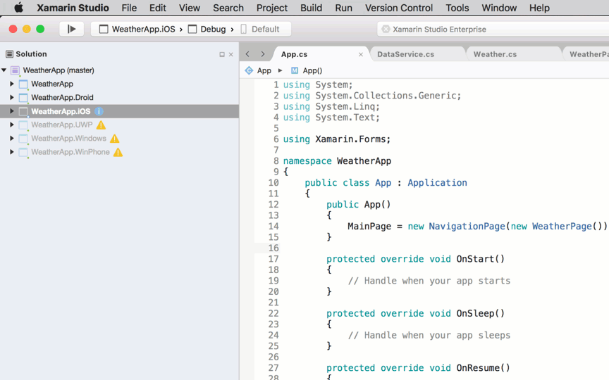
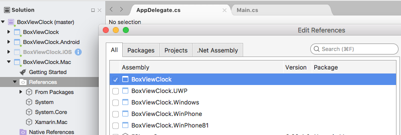

# Mac Platform Setup


Before you start, create (or use an existing) Xamarin.Forms project.
You can only add Mac apps using Visual Studio for Mac.

> [!VIDEO https://youtube.com/embed/mvQ7jzaNseM]

**Adding a macOS project to Xamarin.Forms, by [Xamarin University](https://university.xamarin.com/)**

## Adding a Mac App

Follow these instructions to add a Mac app that will run on macOS Sierra and macOS El Capitan:

1. In Visual Studio for Mac, right-click on the existing Xamarin.Forms solution and choose **Add > Add New Project...**

2. In the **New Project** window choose **Mac > App > Cocoa App** and press **Next**.

3. Type an **App Name** (and optionally choose a different name for the Dock Item), then press **Next**.

4. Review the configuration and press **Create**. These steps are shown in below:

  

5. In the Mac project, right-click on **Packages > Add Packages...** to add the
  [Xamarin.Forms/2.3.5.235-pre2](https://www.nuget.org/packages/Xamarin.Forms/2.3.5.235-pre2) NuGet. You should also update the other projects to this version.

6. In the Mac project, right-click on **References** and add a reference to the Xamarin.Forms project (either Shared Project or .NET Standard library project).

  

7. Update **Main.cs** to initialize the `AppDelegate`:

    ```csharp
    static class MainClass
    {
        static void Main(string[] args)
        {
            NSApplication.Init();
            NSApplication.SharedApplication.Delegate = new AppDelegate(); // add this line
            NSApplication.Main(args);
        }
    }
    ```

8. Update `AppDelegate` to initialize Xamarin.Forms, create a window, and load the Xamarin.Forms application (remembering to set an appropriate `Title`). _If you have other dependencies that need to be initialized, do that here as well._

    ```csharp
    using Xamarin.Forms;
    using Xamarin.Forms.Platform.MacOS;
    // also add a using for the Xamarin.Forms project, if the namespace is different to this file
    ...
    [Register("AppDelegate")]
    public class AppDelegate : FormsApplicationDelegate
    {
        NSWindow window;
        public AppDelegate()
        {
            var style = NSWindowStyle.Closable | NSWindowStyle.Resizable | NSWindowStyle.Titled;

            var rect = new CoreGraphics.CGRect(200, 1000, 1024, 768);
            window = new NSWindow(rect, style, NSBackingStore.Buffered, false);
            window.Title = "Xamarin.Forms on Mac!"; // choose your own Title here
            window.TitleVisibility = NSWindowTitleVisibility.Hidden;
        }

        public override NSWindow MainWindow
        {
            get { return window; }
        }

        public override void DidFinishLaunching(NSNotification notification)
        {
            Forms.Init();
            LoadApplication(new App());
            base.DidFinishLaunching(notification); 
        }
    }
    ```

9. Double-click **Main.storyboard** to edit in Xcode. Select the **Window** and _uncheck_ the **Is Initial Controller** checkbox (this is because the code above creates a window):

  [](mac-images/xcode-init-controller.png#lightbox)

  You can edit the menu system in the storyboard to remove unwanted items.

10. Finally, add any local resources (eg. image files) from the existing platform projects that are required.

11. The Mac project should now run your Xamarin.Forms code on macOS!

## Next Steps

### Styling

With recent changes made to `OnPlatform` you can now target any number of platforms. That includes macOS.

```xml
<Button.TextColor>
    <OnPlatform x:TypeArguments="Color">
        <On Platform="iOS" Value="White"/>
        <On Platform="macOS" Value="White"/>
        <On Platform="Android" Value="Black"/>
    </OnPlatform>
</Button.TextColor>
```

Note you may also double up on platforms like this: `<On Platform="iOS, macOS" ...>`.

### Window Size and Position

You can adjust the initial size and location of the window in the `AppDelegate`:

```csharp
var rect = new CoreGraphics.CGRect(200, 1000, 1024, 768);  // x, y, width, height
```

## Known Issues

This is a Preview, so you should expect that not everything is production ready. Below are a few things you may encounter as you add macOS to your projects:

### Not all NuGets are ready for macOS

Packages must target "xamarinmac20" to work in a macOS project. You may find that some of the libraries you use do not yet support macOS.

In this case, you'll need to send a request to the project's maintainer to add it. Until they have support, you may need to look for alternatives.

### Missing Xamarin.Forms Features

Not all Xamarin.Forms features are complete in this preview; here is a list of some of the functionality that is not yet implemented:

* Footer
* Image – Aspect
* ListView – ScrollTo, UnevenRows support, refreshing, SeparatorColor, SeparatorVisibility
* MasterDetailPage – BackgroundColor
* Navigation – InsertPageBefore
* OpenGLRenderer
* Picker – Bindable/Observable implementation
* TabbedPage – BarBackgroundColor, BarTextColor
* TableView – UnevenRows
* ViewCell – IsEnabled, ForceUpdateSize
* WebView – most WebNavigationEvents


## Related Links

- [Xamarin.Mac](~/mac/index.yml)
