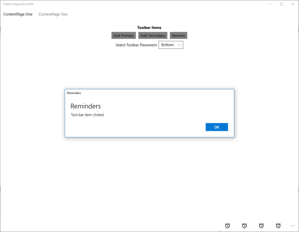
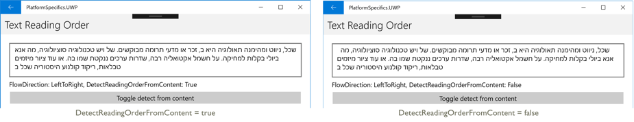

# Windows Platform-Specifics

_Platform-specifics allow you to consume functionality that's only available on a specific platform, without implementing custom renderers or effects. This article demonstrates how to consume the Windows platform-specifics that are built into Xamarin.Forms._

On the Universal Windows Platform (UWP), Xamarin.Forms contains the following platform-specifics:

- Setting toolbar placement options. For more information, see [Changing the Toolbar Placement](#toolbar_placement).
- Collapsing the [`MasterDetailPage`](https://developer.xamarin.com/api/type/Xamarin.Forms.MasterDetailPage/) navigation bar. For more information, see [Collapsing a MasterDetailPage Navigation Bar](#collapsable_navigation_bar).
- Enabling a [`WebView`](xref:Xamarin.Forms.WebView) to display JavaScript alerts in a UWP message dialog. For more information, see [Displaying JavaScript Alerts](#webview-javascript-alert).
- Enabling a [`SearchBar`](xref:Xamarin.Forms.SearchBar) to interact with the spell check engine. For more information, see [Enabling SearchBar Spell Check](#searchbar-spellcheck).
- Detecting reading order from text content in [`Entry`](xref:Xamarin.Forms.Entry), [`Editor`](xref:Xamarin.Forms.Editor), and [`Label`](xref:Xamarin.Forms.Label) instances. For more information, see [Detecting Reading Order from Content](#inputview-readingorder).
- Disabling legacy color mode on a supported [`VisualElement`](xref:Xamarin.Forms.VisualElement). For more information, see [Disabling Legacy Color Mode](#legacy-color-mode).
- Enabling tap gesture support in a [`ListView`](xref:Xamarin.Forms.ListView). For more information, see [Enabling Tap Gesture Support in a ListView](#listview-selectionmode).

<a name="toolbar_placement" />

## Changing the Toolbar Placement

This platform-specific is used to change the placement of a toolbar on a [`Page`](https://developer.xamarin.com/api/type/Xamarin.Forms.Page/), and is consumed in XAML by setting the [`Page.ToolbarPlacement`](https://developer.xamarin.com/api/field/Xamarin.Forms.PlatformConfiguration.WindowsSpecific.Page.ToolbarPlacementProperty/) attached property to a value of the [`ToolbarPlacement`](https://developer.xamarin.com/api/type/Xamarin.Forms.PlatformConfiguration.WindowsSpecific.ToolbarPlacement/) enumeration:

```xaml
<TabbedPage ...
            xmlns:windows="clr-namespace:Xamarin.Forms.PlatformConfiguration.WindowsSpecific;assembly=Xamarin.Forms.Core"
            windows:Page.ToolbarPlacement="Bottom">
  ...
</TabbedPage>
```

Alternatively, it can be consumed from C# using the fluent API:

```csharp
using Xamarin.Forms.PlatformConfiguration;
using Xamarin.Forms.PlatformConfiguration.WindowsSpecific;
...

page.On<Windows>().SetToolbarPlacement(ToolbarPlacement.Bottom);
```

The `Page.On<Windows>` method specifies that this platform-specific will only run on Windows. The [`Page.SetToolbarPlacement`](https://developer.xamarin.com/api/member/Xamarin.Forms.PlatformConfiguration.WindowsSpecific.Page.SetToolbarPlacement/p/Xamarin.Forms.IPlatformElementConfiguration{Xamarin.Forms.PlatformConfiguration.Windows,Xamarin.Forms.Page}/Xamarin.Forms.PlatformConfiguration.WindowsSpecific.ToolbarPlacement/) method, in the [`Xamarin.Forms.PlatformConfiguration.WindowsSpecific`](xref:Xamarin.Forms.PlatformConfiguration.WindowsSpecific) namespace, is used to set the toolbar placement, with the [`ToolbarPlacement`](xref:Xamarin.Forms.PlatformConfiguration.WindowsSpecific.ToolbarPlacement) enumeration providing three values: [`Default`](xref:Xamarin.Forms.PlatformConfiguration.WindowsSpecific.ToolbarPlacement.Default), [`Top`](xref:Xamarin.Forms.PlatformConfiguration.WindowsSpecific.ToolbarPlacement.Top), and [`Bottom`](xref:Xamarin.Forms.PlatformConfiguration.WindowsSpecific.ToolbarPlacement.Bottom).

The result is that the specified toolbar placement is applied to the [`Page`](https://developer.xamarin.com/api/type/Xamarin.Forms.Page/) instance:

[](windows-images/toolbar-placement-large.png#lightbox "Toolbar Placement Platform-Specific")

<a name="collapsable_navigation_bar" />

## Collapsing a MasterDetailPage Navigation Bar

This platform-specific is used to collapse the navigation bar on a [`MasterDetailPage`](https://developer.xamarin.com/api/type/Xamarin.Forms.MasterDetailPage/), and is consumed in XAML by setting the [`MasterDetailPage.CollapseStyle`](https://developer.xamarin.com/api/field/Xamarin.Forms.PlatformConfiguration.WindowsSpecific.MasterDetailPage.CollapseStyleProperty/) and [`MasterDetailPage.CollapsedPaneWidth`](https://developer.xamarin.com/api/field/Xamarin.Forms.PlatformConfiguration.WindowsSpecific.MasterDetailPage.CollapsedPaneWidthProperty/) attached properties:

```xaml
<MasterDetailPage ...
                  xmlns:windows="clr-namespace:Xamarin.Forms.PlatformConfiguration.WindowsSpecific;assembly=Xamarin.Forms.Core"
                  windows:MasterDetailPage.CollapseStyle="Partial"
                  windows:MasterDetailPage.CollapsedPaneWidth="48">
  ...
</MasterDetailPage>

```

Alternatively, it can be consumed from C# using the fluent API:

```csharp
using Xamarin.Forms.PlatformConfiguration;
using Xamarin.Forms.PlatformConfiguration.WindowsSpecific;
...

page.On<Windows>().SetCollapseStyle(CollapseStyle.Partial).CollapsedPaneWidth(148);
```

The `MasterDetailPage.On<Windows>` method specifies that this platform-specific will only run on Windows. The [`Page.SetCollapseStyle`](https://developer.xamarin.com/api/member/Xamarin.Forms.PlatformConfiguration.WindowsSpecific.MasterDetailPage.SetCollapseStyle/p/Xamarin.Forms.IPlatformElementConfiguration{Xamarin.Forms.PlatformConfiguration.Windows,Xamarin.Forms.MasterDetailPage}/Xamarin.Forms.PlatformConfiguration.WindowsSpecific.CollapseStyle/) method, in the [`Xamarin.Forms.PlatformConfiguration.WindowsSpecific`](https://developer.xamarin.com/api/namespace/Xamarin.Forms.PlatformConfiguration.WindowsSpecific/) namespace, is used to specify the collapse style, with the [`CollapseStyle`](https://developer.xamarin.com/api/type/Xamarin.Forms.PlatformConfiguration.WindowsSpecific.CollapseStyle/) enumeration providing two values: [`Full`](xref:Xamarin.Forms.PlatformConfiguration.WindowsSpecific.CollapseStyle.Full) and [`Partial`](xref:Xamarin.Forms.PlatformConfiguration.WindowsSpecific.CollapseStyle.Partial). The [`MasterDetailPage.CollapsedPaneWidth`](https://developer.xamarin.com/api/member/Xamarin.Forms.PlatformConfiguration.WindowsSpecific.MasterDetailPage.CollapsedPaneWidth/p/Xamarin.Forms.IPlatformElementConfiguration{Xamarin.Forms.PlatformConfiguration.Windows,Xamarin.Forms.MasterDetailPage}/System.Double/) method is used to specify the width of a partially collapsed navigation bar.

The result is that a specified [`CollapseStyle`](https://developer.xamarin.com/api/type/Xamarin.Forms.PlatformConfiguration.WindowsSpecific.CollapseStyle/) is applied to the [`MasterDetailPage`](https://developer.xamarin.com/api/type/Xamarin.Forms.MasterDetailPage/) instance, with the width also being specified:

[](windows-images/collapsed-navigation-bar-large.png#lightbox "Collapsed Navigation Bar Platform-Specific")

<a name="webview-javascript-alert" />

## Displaying JavaScript Alerts

This platform-specific enables a [`WebView`](xref:Xamarin.Forms.WebView) to display JavaScript alerts in a UWP message dialog. It's consumed in XAML by setting the [`WebView.IsJavaScriptAlertEnabled`](xref:Xamarin.Forms.PlatformConfiguration.WindowsSpecific.WebView.IsJavaScriptAlertEnabledProperty) attached property to a `boolean` value:

```xaml
<ContentPage ...
             xmlns:windows="clr-namespace:Xamarin.Forms.PlatformConfiguration.WindowsSpecific;assembly=Xamarin.Forms.Core">
    <StackLayout>
        <WebView ... windows:WebView.IsJavaScriptAlertEnabled="true" />
        ...
    </StackLayout>
</ContentPage>
```

Alternatively, it can be consumed from C# using the fluent API:

```csharp
using Xamarin.Forms.PlatformConfiguration;
using Xamarin.Forms.PlatformConfiguration.WindowsSpecific;
...

var webView = new Xamarin.Forms.WebView
{
  Source = new HtmlWebViewSource
  {
    Html = @"<html><body><button onclick=""window.alert('Hello World from JavaScript');"">Click Me</button></body></html>"
  }
};
webView.On<Windows>().SetIsJavaScriptAlertEnabled(true);
```

The `WebView.On<Windows>` method specifies that this platform-specific will only run on the Universal Windows Platform. The [`WebView.SetIsJavaScriptAlertEnabled`](xref:Xamarin.Forms.PlatformConfiguration.WindowsSpecific.WebView.SetIsJavaScriptAlertEnabled(Xamarin.Forms.IPlatformElementConfiguration{Xamarin.Forms.PlatformConfiguration.Windows,Xamarin.Forms.WebView},System.Boolean)) method, in the [`Xamarin.Forms.PlatformConfiguration.WindowsSpecific`](xref:Xamarin.Forms.PlatformConfiguration.WindowsSpecific) namespace, is used to control whether JavaScript alerts are enabled. In addition, the `WebView.SetIsJavaScriptAlertEnabled` method can be used to toggle JavaScript alerts by calling the [`IsJavaScriptAlertEnabled`](xref:Xamarin.Forms.PlatformConfiguration.WindowsSpecific.WebView.IsJavaScriptAlertEnabled*) method to return whether they are enabled:

```csharp
_webView.On<Windows>().SetIsJavaScriptAlertEnabled(!_webView.On<Windows>().IsJavaScriptAlertEnabled());
```

The result is that JavaScript alerts can be displayed in a UWP message dialog:


<a name="searchbar-spellcheck" />

## Enabling SearchBar Spell Check

This platform-specific enables a [`SearchBar`](xref:Xamarin.Forms.SearchBar) to interact with the spell check engine. It's consumed in XAML by setting the [`SearchBar.IsSpellCheckEnabled`](xref:Xamarin.Forms.PlatformConfiguration.WindowsSpecific.SearchBar.IsSpellCheckEnabledProperty) attached property to a `boolean` value:

```xaml
<ContentPage ...
             xmlns:windows="clr-namespace:Xamarin.Forms.PlatformConfiguration.WindowsSpecific;assembly=Xamarin.Forms.Core">
    <StackLayout>
        <SearchBar ... windows:SearchBar.IsSpellCheckEnabled="true" />
        ...
    </StackLayout>
</ContentPage>
```

Alternatively, it can be consumed from C# using the fluent API:

```csharp
using Xamarin.Forms.PlatformConfiguration;
using Xamarin.Forms.PlatformConfiguration.WindowsSpecific;
...

searchBar.On<Windows>().SetIsSpellCheckEnabled(true);
```

The `SearchBar.On<Windows>` method specifies that this platform-specific will only run on the Universal Windows Platform. The [`SearchBar.SetIsSpellCheckEnabled`](xref:Xamarin.Forms.PlatformConfiguration.WindowsSpecific.SearchBar.SetIsSpellCheckEnabled(Xamarin.Forms.IPlatformElementConfiguration{Xamarin.Forms.PlatformConfiguration.Windows,Xamarin.Forms.SearchBar},System.Boolean)) method, in the [`Xamarin.Forms.PlatformConfiguration.WindowsSpecific`](xref:Xamarin.Forms.PlatformConfiguration.WindowsSpecific) namespace, turns the spell checker on and off. In addition, the `SearchBar.SetIsSpellCheckEnabled` method can be used to toggle the spell checker by calling the [`SearchBar.GetIsSpellCheckEnabled`](xref:Xamarin.Forms.PlatformConfiguration.WindowsSpecific.SearchBar.GetIsSpellCheckEnabled(Xamarin.Forms.IPlatformElementConfiguration{Xamarin.Forms.PlatformConfiguration.Windows,Xamarin.Forms.SearchBar})) method to return whether the spell checker is enabled:

```csharp
searchBar.On<Windows>().SetIsSpellCheckEnabled(!searchBar.On<Windows>().GetIsSpellCheckEnabled());
```

The result is that text entered into the [`SearchBar`](xref:Xamarin.Forms.SearchBar) can be spell checked, with incorrect spellings being indicated to the user:


> [!NOTE]
> The `SearchBar` class in the [`Xamarin.Forms.PlatformConfiguration.WindowsSpecific`](xref:Xamarin.Forms.PlatformConfiguration.WindowsSpecific) namespace also has [`EnableSpellCheck`](xref:Xamarin.Forms.PlatformConfiguration.WindowsSpecific.SearchBar.EnableSpellCheck*) and [`DisableSpellCheck`](xre:Xamarin.Forms.PlatformConfiguration.WindowsSpecific.SearchBar.DisableSpellCheck*) methods that can be used to enable and disable the spell checker on the `SearchBar`, respectively.

<a name="inputview-readingorder" />

## Detecting Reading Order from Content

This platform-specific enables the reading order (left-to-right or right-to-left) of bidirectional text in [`Entry`](xref:Xamarin.Forms.Entry), [`Editor`](xref:Xamarin.Forms.Editor), and [`Label`](xref:Xamarin.Forms.Label) instances to be detected dynamically. It's consumed in XAML by setting the [`InputView.DetectReadingOrderFromContent`](xref:Xamarin.Forms.PlatformConfiguration.WindowsSpecific.InputView.DetectReadingOrderFromContentProperty) (for `Entry` and `Editor` instances) or [`Label.DetectReadingOrderFromContent`](xref:Xamarin.Forms.PlatformConfiguration.WindowsSpecific.Label.DetectReadingOrderFromContentProperty) attached property to a `boolean` value:

```xaml
<ContentPage ...
             xmlns:windows="clr-namespace:Xamarin.Forms.PlatformConfiguration.WindowsSpecific;assembly=Xamarin.Forms.Core">
    <StackLayout>
        <Editor ... windows:InputView.DetectReadingOrderFromContent="true" />
        ...
    </StackLayout>
</ContentPage>
```

Alternatively, it can be consumed from C# using the fluent API:

```csharp
using Xamarin.Forms.PlatformConfiguration;
using Xamarin.Forms.PlatformConfiguration.WindowsSpecific;
...

editor.On<Windows>().SetDetectReadingOrderFromContent(true);
```

The `Editor.On<Windows>` method specifies that this platform-specific will only run on the Universal Windows Platform. The [`InputView.SetDetectReadingOrderFromContent`](xref:Xamarin.Forms.PlatformConfiguration.WindowsSpecific.InputView.SetDetectReadingOrderFromContent(Xamarin.Forms.IPlatformElementConfiguration{Xamarin.Forms.PlatformConfiguration.Windows,Xamarin.Forms.InputView},System.Boolean)) method, in the [`Xamarin.Forms.PlatformConfiguration.WindowsSpecific`](xref:Xamarin.Forms.PlatformConfiguration.WindowsSpecific) namespace, is used to control whether the reading order is detected from the content in the [`InputView`](xref:Xamarin.Forms.InputView). In addition, the `InputView.SetDetectReadingOrderFromContent` method can be used to toggle whether the reading order is detected from the content by calling the [`InputView.GetDetectReadingOrderFromContent`](xref:Xamarin.Forms.PlatformConfiguration.WindowsSpecific.InputView.GetDetectReadingOrderFromContent(Xamarin.Forms.IPlatformElementConfiguration{Xamarin.Forms.PlatformConfiguration.Windows,Xamarin.Forms.InputView})) method to return the current value:

```csharp
editor.On<Windows>().SetDetectReadingOrderFromContent(!editor.On<Windows>().GetDetectReadingOrderFromContent());
```

The result is that [`Entry`](xref:Xamarin.Forms.Entry), [`Editor`](xref:Xamarin.Forms.Editor), and [`Label`](xref:Xamarin.Forms.Label) instances can have the reading order of their content detected dynamically:

[](windows-images/editor-readingorder-large.png#lightbox "InputView detecting reading order from content platform-specific")

> [!NOTE]
> Unlike setting the [`FlowDirection`](xref:Xamarin.Forms.VisualElement.FlowDirection) property, the logic for views that detect the reading order from their text content will not affect the alignment of text within the view. Instead, it adjusts the order in which blocks of bidirectional text are laid out.

<a name="legacy-color-mode" />

## Disabling Legacy Color Mode

Some of the Xamarin.Forms views feature a legacy color mode. In this mode, when the [`IsEnabled`](xref:Xamarin.Forms.VisualElement.IsEnabled) property of the view is set to `false`, the view will override the colors set by the user with the default native colors for the disabled state. For backwards compatibility, this legacy color mode remains the default behavior for supported views.

This platform-specific disables this legacy color mode, so that colors set on a view by the user remain even when the view is disabled. It's consumed in XAML by setting the [`VisualElement.IsLegacyColorModeEnabled`](xref:Xamarin.Forms.PlatformConfiguration.WindowsSpecific.VisualElement.IsLegacyColorModeEnabledProperty) attached property to `false`:

```xaml
<ContentPage ...
             xmlns:windows="clr-namespace:Xamarin.Forms.PlatformConfiguration.WindowsSpecific;assembly=Xamarin.Forms.Core">
    <StackLayout>
        ...
        <Editor Text="Enter text here"
                TextColor="Blue"
                BackgroundColor="Bisque"
                windows:VisualElement.IsLegacyColorModeEnabled="False" />
        ...
    </StackLayout>
</ContentPage>
```

Alternatively, it can be consumed from C# using the fluent API:

```csharp
using Xamarin.Forms.PlatformConfiguration;
using Xamarin.Forms.PlatformConfiguration.WindowsSpecific;
...

_legacyColorModeDisabledEditor.On<Windows>().SetIsLegacyColorModeEnabled(false);
```

The `VisualElement.On<Windows>` method specifies that this platform-specific will only run on Windows. The [`VisualElement.SetIsLegacyColorModeEnabled`](xref:Xamarin.Forms.PlatformConfiguration.WindowsSpecific.VisualElement.SetIsLegacyColorModeEnabled(Xamarin.Forms.IPlatformElementConfiguration{Xamarin.Forms.PlatformConfiguration.Windows,Xamarin.Forms.VisualElement},System.Boolean)) method, in the [`Xamarin.Forms.PlatformConfiguration.WindowsSpecific`](xref:Xamarin.Forms.PlatformConfiguration.WindowsSpecific) namespace, is used to control whether the legacy color mode is disabled. In addition, the [`VisualElement.GetIsLegacyColorModeEnabled`](xref:Xamarin.Forms.PlatformConfiguration.WindowsSpecific.VisualElement.GetIsLegacyColorModeEnabled(Xamarin.Forms.IPlatformElementConfiguration{Xamarin.Forms.PlatformConfiguration.Windows,Xamarin.Forms.VisualElement})) method can be used to return whether the legacy color mode is disabled.

The result is that the legacy color mode can be disabled, so that colors set on a view by the user remain even when the view is disabled:


> [!NOTE]
> When setting a [`VisualStateGroup`](xref:Xamarin.Forms.VisualStateGroup) on a view, the legacy color mode is completely ignored. For more information about visual states, see [The Xamarin.Forms Visual State Manager](~/xamarin-forms/user-interface/visual-state-manager.md).

<a name="listview-selectionmode" />

## Enabling Tap Gesture Support in a ListView

On the Universal Windows Platform, by default the Xamarin.Forms [`ListView`](xref:Xamarin.Forms.ListView) uses the native `ItemClick` event to respond to interaction, rather than the native `Tapped` event. This provides accessibility functionality so that the Windows Narrator and the keyboard can interact with the `ListView`. However, it also renders any tap gestures inside the `ListView` inoperable.

This platform-specific controls whether items in a [`ListView`](xref:Xamarin.Forms.ListView) can respond to tap gestures, and hence whether the native `ListView` fires the `ItemClick` or `Tapped` event. It's consumed in XAML by setting the [`ListView.SelectionMode`](xref:Xamarin.Forms.PlatformConfiguration.WindowsSpecific.ListView.SelectionModeProperty) attached property to a value of the [`ListViewSelectionMode`](xref:Xamarin.Forms.PlatformConfiguration.WindowsSpecific.ListViewSelectionMode) enumeration:

```xaml
<ContentPage ...
             xmlns:windows="clr-namespace:Xamarin.Forms.PlatformConfiguration.WindowsSpecific;assembly=Xamarin.Forms.Core">
    <StackLayout>
        <ListView ... windows:ListView.SelectionMode="Inaccessible">
            ...
        </ListView>
    </StackLayout>
</ContentPage>
```

Alternatively, it can be consumed from C# using the fluent API:

```csharp
using Xamarin.Forms.PlatformConfiguration;
using Xamarin.Forms.PlatformConfiguration.WindowsSpecific;
...

listView.On<Windows>().SetSelectionMode(ListViewSelectionMode.Inaccessible);
```

The `ListView.On<Windows>` method specifies that this platform-specific will only run on the Universal Windows Platform. The [`ListView.SetSelectionMode`](xref:Xamarin.Forms.PlatformConfiguration.WindowsSpecific.ListView.SetSelectionMode(Xamarin.Forms.IPlatformElementConfiguration{Xamarin.Forms.PlatformConfiguration.Windows,Xamarin.Forms.ListView},Xamarin.Forms.PlatformConfiguration.WindowsSpecific.ListViewSelectionMode)) method, in the [`Xamarin.Forms.PlatformConfiguration.WindowsSpecific`](xref:Xamarin.Forms.PlatformConfiguration.WindowsSpecific) namespace, is used to control whether items in a [`ListView`](xref:Xamarin.Forms.ListView) can respond to tap gestures, with the [`ListViewSelectionMode`](xref:Xamarin.Forms.PlatformConfiguration.WindowsSpecific.ListViewSelectionMode) enumeration providing two possible values:

- [`Accessible`](xref:Xamarin.Forms.PlatformConfiguration.WindowsSpecific.ListViewSelectionMode.Accessible) – indicates that the `ListView` will fire the native `ItemClick` event to handle interaction, and hence provide accessibility functionality. Therefore, the Windows Narrator and the keyboard can interact with the `ListView`. However, items in the `ListView` can't respond to tap gestures. This is the default behavior for `ListView` instances on the Universal Windows Platform.
- [`Inaccessible`](xref:Xamarin.Forms.PlatformConfiguration.WindowsSpecific.ListViewSelectionMode.Inaccessible) – indicates that the `ListView` will fire the native `Tapped` event to handle interaction. Therefore, items in the `ListView` can respond to tap gestures. However, there's no accessibility functionality and hence the Windows Narrator and the keyboard can't interact with the `ListView`.

> [!NOTE]
> The `Accessible` and `Inaccessible` selection modes are mutually exclusive, and you will need to choose between an accessible [`ListView`](xref:Xamarin.Forms.ListView) or a `ListView` that can respond to tap gestures.

In addition, the [`GetSelectionMode`](xref:Xamarin.Forms.PlatformConfiguration.WindowsSpecific.ListView.GetSelectionMode(Xamarin.Forms.IPlatformElementConfiguration{Xamarin.Forms.PlatformConfiguration.Windows,Xamarin.Forms.ListView})) method can be used to return the current [`ListViewSelectionMode`](xref:Xamarin.Forms.PlatformConfiguration.WindowsSpecific.ListViewSelectionMode).

The result is that a specified [`ListViewSelectionMode`](xref:Xamarin.Forms.PlatformConfiguration.WindowsSpecific.ListViewSelectionMode) is applied to the [`ListView`](xref:Xamarin.Forms.ListView), which controls whether items in the `ListView` can respond to tap gestures, and hence whether the native `ListView` fires the `ItemClick` or `Tapped` event.

## Summary

This article demonstrated how to consume the Windows platform-specifics that are built into Xamarin.Forms. Platform-specifics allow you to consume functionality that's only available on a specific platform, without implementing custom renderers or effects.

## Related Links

- [Creating Platform-Specifics](~/xamarin-forms/platform/platform-specifics/creating.md)
- [PlatformSpecifics (sample)](https://developer.xamarin.com/samples/xamarin-forms/userinterface/platformspecifics/)
- [WindowsSpecific](https://developer.xamarin.com/api/namespace/Xamarin.Forms.PlatformConfiguration.WindowsSpecific/)
