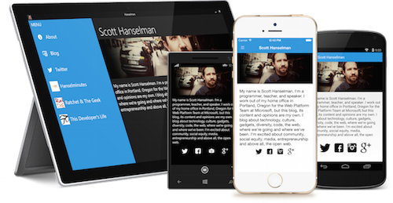

# Windows Platform Features

Developing Xamarin.Forms applications for Windows platforms requires Visual Studio. The [supported platforms page](~/get-started/supported-platforms.md) contains more information about the pre-requisites.

## Platform-specifics

Platform-specifics allow you to consume functionality that's only available on a specific platform, without implementing custom renderers or effects.

The following platform-specific functionality is provided for Xamarin.Forms views, pages, and layouts on the Universal Windows Platform (UWP):

- Setting an access key for a [`VisualElement`](xref:Xamarin.Forms.VisualElement). For more information, see [VisualElement Access Keys on Windows](visualelement-access-keys.md).
- Disabling legacy color mode on a supported [`VisualElement`](xref:Xamarin.Forms.VisualElement). For more information, see [VisualElement Legacy Color Mode on Windows](legacy-color-mode.md).

The following platform-specific functionality is provided for Xamarin.Forms views on UWP:

- Detecting reading order from text content in [`Entry`](xref:Xamarin.Forms.Entry), [`Editor`](xref:Xamarin.Forms.Editor), and [`Label`](xref:Xamarin.Forms.Label) instances. For more information, see [InputView Reading Order on Windows](inputview-reading-order.md).
- Enabling tap gesture support in a [`ListView`](xref:Xamarin.Forms.ListView). For more information, see [ListView SelectionMode on Windows](listview-selectionmode.md).
- Enabling the pull direction of a `RefreshView` to be changed. For more information, see [RefreshView Pull Direction on Windows](refreshview-pulldirection.md).
- Enabling a [`SearchBar`](xref:Xamarin.Forms.SearchBar) to interact with the spell check engine. For more information, see [SearchBar Spell Check on Windows](searchbar-spell-check.md).
- Setting the thread on which a [`WebView`](xref:Xamarin.Forms.WebView) hosts its content. For more information, see [WebView Execution Mode on Windows](webview-executionmode.md).
- Enabling a [`WebView`](xref:Xamarin.Forms.WebView) to display JavaScript alerts in a UWP message dialog. For more information, see [WebView JavaScript Alerts on Windows](webview-javascript-alert.md).

The following platform-specific functionality is provided for Xamarin.Forms pages on UWP:

- Collapsing the [`FlyoutPage`](xref:Xamarin.Forms.FlyoutPage) navigation bar. For more information, see [FlyoutPage Navigation Bar on Windows](flyoutpage-navigation-bar.md).
- Setting toolbar placement options. For more information, see [Page Toolbar Placement on Windows](page-toolbar-placement.md).
- Enabling page icons to be displayed on a [`TabbedPage`](xref:Xamarin.Forms.TabbedPage) toolbar. For more information, see [TabbedPage Icons on Windows](tabbedpage-icons.md).

The following platform-specific functionality is provided for the Xamarin.Forms [`Application`](xref:Xamarin.Forms.Application) class on UWP:

- Specifying the directory in the project that image assets will be loaded from. For more information, see [Default Image Directory on Windows](default-image-directory.md).

## Platform support

The Xamarin.Forms templates available in Visual Studio contain a Universal Windows Platform (UWP) project.

> [!NOTE]
> Xamarin.Forms 1.x and 2.x support _Windows Phone 8 Silverlight_, _Windows Phone 8.1_, and _Windows 8.1_ application development. However, these project types have been deprecated.

## Getting started

Go to **File > New > Project** in Visual Studio and choose one of the **Cross-Platform > Blank App (Xamarin.Forms)** templates to get started.

Older Xamarin.Forms solutions, or those created on macOS, will not have all the Windows projects listed above (but they need to be manually added). If the Windows platform you wish to target isn't already in your solution, visit the [setup instructions](installation/index.md) to add the desired Windows project type/s.

## Samples

[All the samples](https://github.com/xamarin/xamarin-forms-book-preview-2) for Charles Petzold's book [*Creating Mobile Apps with Xamarin.Forms*](~/xamarin-forms/creating-mobile-apps-xamarin-forms/index.md) include Universal Windows Platform (for Windows 10) projects.

The ["Scott Hanselman" demo app](https://github.com/jamesmontemagno/Hanselman.Forms) is available separately, and also includes Apple Watch and Android Wear projects
(using Xamarin.iOS and Xamarin.Android respectively, Xamarin.Forms does not run on those platforms).

## Related links

- [Setup Windows Projects](~/xamarin-forms/platform/windows/installation/index.md)
