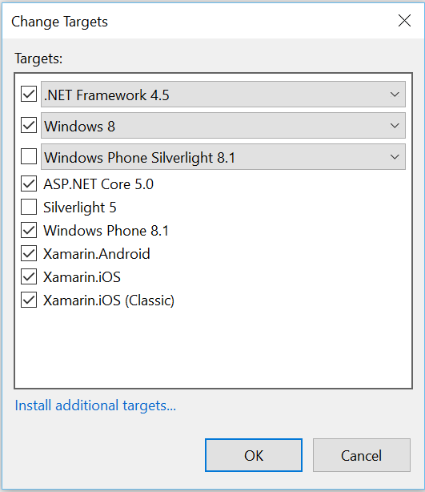
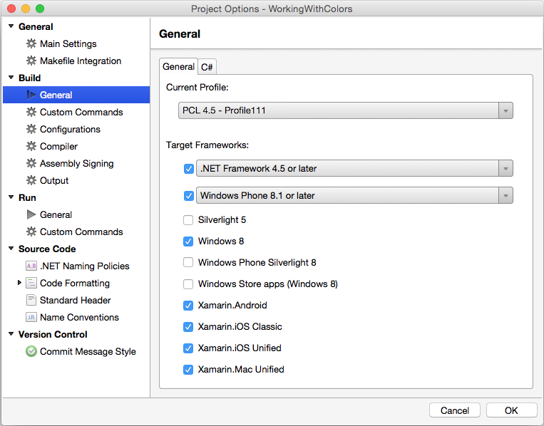

# Setup Windows Projects

_Adding new Windows projects to an existing Xamarin.Forms solution_

Older Xamarin.Forms projects (or those created on Mac OS&nbsp;X)
will not have these Windows projects set-up.

This means you'll need to manually add these project
  types to build Windows 8.1, Windows Phone 8.1,
  and Windows 10 (UWP) apps.

## Add a Windows 8.1 app

* If you used the PCL template, [update the profile](#pcl), then
* [Add a Windows 8.1 app](~/xamarin-forms/platform/windows/installation/tablet.md) for
  tablet/desktop form-factors.

## Add a Windows Phone 8.1 app

* If you used the PCL template, [update the profile](#pcl), then
* [Add a Windows Phone 8.1 app](~/xamarin-forms/platform/windows/installation/phone.md)

## Add a Universal Windows Platform (UWP) app

* Building [UWP](https://msdn.microsoft.com/library/windows/apps/dn894631.aspx) apps requires Visual Studio 2015 running on Windows 10.
* If you used the PCL template, [update the profile](#pcl), then
* [Add a Universal Windows Platform app](~/xamarin-forms/platform/windows/installation/universal.md)

<a name="pcl" />

### Update your PCL Profile

If your existing Xamarin.Forms app used the Portable Class Library
  (PCL) template, you must update its profile.

1. **right-click > Properties** (your existing settings may differ)

  

2. Click on the **Change...** button

3. Ensure the **Windows 8** and **Windows Phone 8.1** options are selected (and **Windows Phone Silveright** is *de-selected*):

  

4. Press **OK** and save the changes.

This equates to **Profile 111** if you are configuring your PCL
  in Visual Studio for Mac using the drop-down list.

  

**Note:** If your solution still has a Windows Phone 8 Silverlight project,
the PCL should be set to Profile 259. Windows Phone 8 Silverlight
support is being deprecated, so it is recommended that you replace
it with the project types shown on this page.
