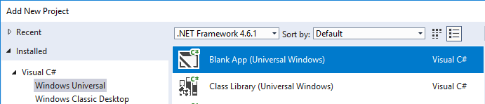
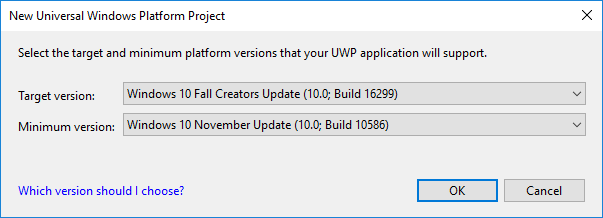
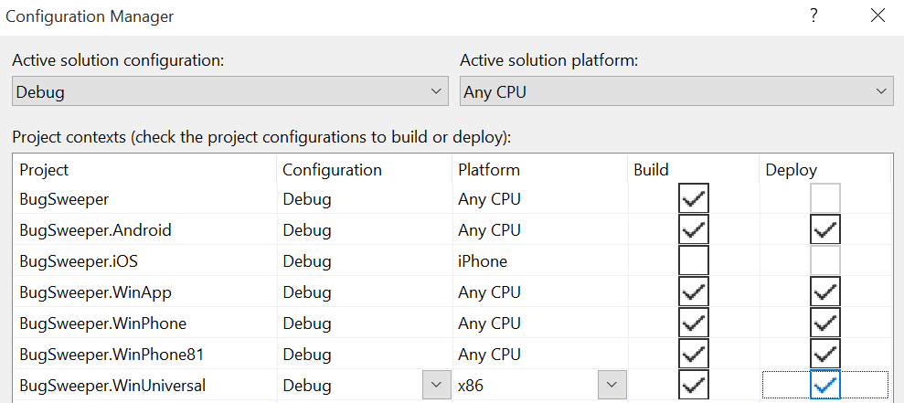

# Setup Windows Projects

_Adding new Windows projects to an existing Xamarin.Forms solution_

Older Xamarin.Forms solutions (or those created on macOS) will not have Universal Windows Platform (UWP) app projects. Therefore, you'll need to manually add a UWP project to build a Windows 10 (UWP) app.

## Add a Universal Windows Platform app

**Visual Studio 2019** on **Windows 10** is recommended to build
UWP apps. For more information about the Universal Windows Platform, see [Intro to the Universal Windows Platform](/windows/uwp/get-started/universal-application-platform-guide/).

UWP is available in Xamarin.Forms 2.1 and later, and Xamarin.Forms.Maps is supported in Xamarin.Forms 2.2 and later.

Check the <a href="#troubleshooting">troubleshooting</a> section for helpful tips.

Follow these instructions to add a UWP app that will run on
Windows 10 phones, tablets, and desktops:

 1 . Right-click on the solution and select **Add > New Project...**
  and add a **Blank App (Universal Windows)** project:

  

 2 . In the **New Universal Windows Platform Project** dialog, select the minimum and target versions of Windows 10 that the app will run on:

  

 3 . Right-click on the UWP project and select **Manage NuGet Packages...** and
  add the **Xamarin.Forms** package. Ensure the other projects in the solution
  are also updated to the same version of the Xamarin.Forms package.

 4 . Make sure the new UWP project will be built in the **Build > Configuration Manager** window
 (this probably won't have happened by default). Tick the **Build** and **Deploy**
 boxes for the Universal project:

  [](universal-images/configuration.png#lightbox "Configuration Manager Window")

 5 . Right-click on the project and select **Add > Reference** and create a
  reference to the Xamarin.Forms application project (.NET Standard or Shared Project).

  

 6 . In the UWP project, edit **App.xaml.cs** to include the `Init` method call
    inside the `OnLaunched` method around line 52:

```csharp
// under this line
rootFrame.NavigationFailed += OnNavigationFailed;
// add this line
Xamarin.Forms.Forms.Init (e); // requires the `e` parameter
```

 7 . In the UWP project, edit **MainPage.xaml** by removing the `Grid` contained within the `Page` element.

 8 . In **MainPage.xaml**, add a new `xmlns` entry for `Xamarin.Forms.Platform.UWP`:

```csharp
xmlns:forms="using:Xamarin.Forms.Platform.UWP"
```

 9 . In **MainPage.xaml**, change the root `<Page` element to `<forms:WindowsPage`:

```xaml
<forms:WindowsPage
...
   xmlns:forms="using:Xamarin.Forms.Platform.UWP"
...
</forms:WindowsPage>
```

 10 . In the UWP project, edit **MainPage.xaml.cs** to remove the `: Page` inheritance specifier
  for the class name (since it will now inherit from `WindowsPage` due to the change
  made in the previous step):

```csharp
public sealed partial class MainPage  // REMOVE ": Page"
```

 11 . In **MainPage.xaml.cs**, add the `LoadApplication` call
  in the `MainPage` constructor to start the Xamarin.Forms app:

```csharp
// below this existing line
this.InitializeComponent();
// add this line
LoadApplication(new YOUR_NAMESPACE.App());
```

> [!NOTE]
> The argument to the `LoadApplication` method is the `Xamarin.Forms.Application` instance defined in your .NET standard project.

<!--
11 . Double-click **Package.appxmanifest** to set these capabilities
  that are often required:

  Capabilities set:

  * Internet (Client)
  * Location
-->

12 . Add any local resources (eg. image files) from the existing platform projects that are required.

## Troubleshooting

### "Target Invocation Exception" when using "Compile with .NET Native tool chain"

If your UWP app is referencing multiple assemblies (for example third party control libraries,
or your app itself is split into multiple libraries), Xamarin.Forms may be unable
to load objects from those assemblies (such as custom renderers).

This might occur when using the **Compile with .NET Native tool chain** which
is an option for UWP apps in the **Properties > Build > General** window
for the project.

You can fix this by using a UWP-specific overload of the `Forms.Init` call
in **App.xaml.cs** as shown in the code below (you should replace
`ClassInOtherAssembly` with an actual class your code references):

```csharp
// You'll need to add `using System.Reflection;`
List<Assembly> assembliesToInclude = new List<Assembly>();

// Now, add in all the assemblies your app uses
assembliesToInclude.Add(typeof (ClassInOtherAssembly).GetTypeInfo().Assembly);

// Also do this for all your other 3rd party libraries
Xamarin.Forms.Forms.Init(e, assembliesToInclude);
// replaces Xamarin.Forms.Forms.Init(e);
```

Add an entry for each assembly that you have added as a reference in the Solution Explorer, either via a direct reference or a NuGet.

#### Dependency Services and .NET Native Compilation

Release builds using .NET Native compilation can fail to resolve
dependency services that are defined outside the main app executable
(such as in a separate project or library).

Use the `DependencyService.Register<T>()` method to manually register
dependency service classes. Based on the example above, add the
register method like this:

```csharp
Xamarin.Forms.Forms.Init(e, assembliesToInclude);
Xamarin.Forms.DependencyService.Register<ClassInOtherAssembly>(); // add this
```
