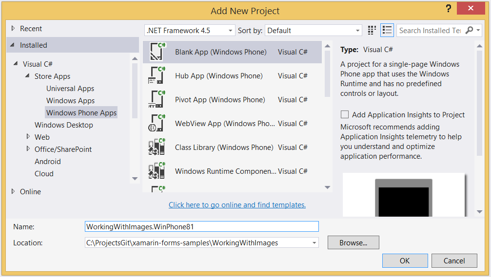
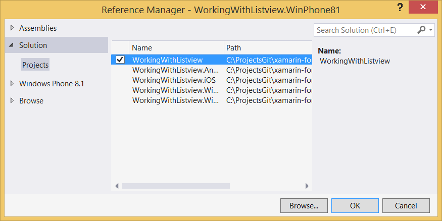

# Adding a Windows Phone App


Firstly, if you used the Xamarin.Forms PCL template, [update the profile](~/xamarin-forms/platform/windows/installation/index.md),
  then follow the instructions below:

1. **right-click on solution > Add > New Project...** and add a **Blank App (Windows Phone)**

  

2. **right-click on the newly created project > Manage NuGet Packages...** and
   add the **Xamarin.Forms** package.

3. **right-click on project > Add > Reference** and create a project
  reference to the shared Xamarin.Forms application project.

  

4. Edit **App.xaml.cs** to include the `Init()` method call,
  in the `OnLaunched` method around line 67:

```csharp
// add this line
Xamarin.Forms.Forms.Init (e); // requires LaunchActivatedEventArgs
// above this existing line
if (e.PreviousExecutionState == ApplicationExecutionState.Terminated) {}
```

 5 . Edit **MainPage.xaml** - change the root element `<Page` to `<forms:WindowsPhonePage` *and*
  define the `xmlns:forms` that it uses:

```xaml
<forms:WindowsPhonePage
...
   xmlns:forms="using:Xamarin.Forms.Platform.WinRT"
...
</forms:WindowsPhonePage>
```

 6 . Edit **MainPage.xaml.cs** to remove the `: PhonePage`
 inheritance specifier for the class name.

```csharp
public sealed partial class MainPage  // REMOVE ": PhonePage"
```

 7 . Still in **MainPage.xaml.cs**, add the `LoadApplication` call
  in the `MainPage` constructor (around line 28) to start your Xamarin.Forms app:

```csharp
// below this existing line
this.InitializeComponent();
// add this line
LoadApplication(new YOUR_NAMESPACE.App());
```

8 . Double-click **Package.appxmanifest** to set these capabilities
  that are often required:

  * Internet (Client & Server)

9 . Finally, add any local resources (eg. image files) from
  the existing platform projects that are required.

