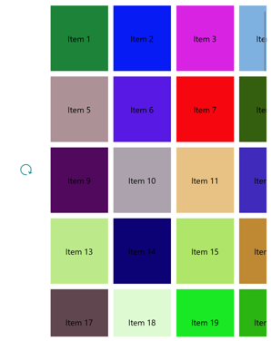

# RefreshView Pull Direction on Windows

[ Download the sample](/samples/xamarin/xamarin-forms-samples/userinterface-platformspecifics)

This Universal Windows Platform platform-specific enables the pull direction of a `RefreshView` to be changed to match the orientation of the scrollable control that's displaying data. It's consumed in XAML by setting the `RefreshView.RefreshPullDirection` bindable property to a value of the `RefreshPullDirection` enumeration:

```xaml
<ContentPage ...
             xmlns:windows="clr-namespace:Xamarin.Forms.PlatformConfiguration.WindowsSpecific;assembly=Xamarin.Forms.Core">
    <RefreshView windows:RefreshView.RefreshPullDirection="LeftToRight"
                 IsRefreshing="{Binding IsRefreshing}"
                 Command="{Binding RefreshCommand}">
        <ScrollView>
            ...
        </ScrollView>
    </RefreshView>
 </ContentPage>
```

Alternatively, it can be consumed from C# using the fluent API:

```csharp
using Xamarin.Forms.PlatformConfiguration;
using Xamarin.Forms.PlatformConfiguration.WindowsSpecific;
...
refreshView.On<Windows>().SetRefreshPullDirection(RefreshPullDirection.LeftToRight);
```

The `RefreshView.On<Windows>` method specifies that this platform-specific will only run on the Universal Windows Platform. The `RefreshView.SetRefreshPullDirection` method, in the [`Xamarin.Forms.PlatformConfiguration.WindowsSpecific`](xref:Xamarin.Forms.PlatformConfiguration.WindowsSpecific) namespace, is used to set the pull direction of the `RefreshView`, with the `RefreshPullDirection` enumeration providing four possible values:

- `LeftToRight` indicates that a pull from left to right initiates a refresh.
- `TopToBottom` indicates that a pull from top to bottom initiates a refresh, and is the default pull direction of a `RefreshView`.
- `RightToLeft` indicates that a pull from right to left initiates a refresh.
- `BottomToTop` indicates that a pull from bottom to top initiates a refresh.

In addition, the `GetRefreshPullDirection` method can be used to return the current `RefreshPullDirection` of the `RefreshView`.

The result is that a specified `RefreshPullDirection` is applied to the `RefreshView`, to set the pull direction to match the orientation of the scrollable control that's displaying data. The following screenshot shows a `RefreshView` with a `LeftToRight` pull direction:

[](refreshview-pulldirection-images/refreshview-pulldirection-large.png#lightbox "RefreshView with left to right pull direction")

> [!NOTE]
> When you change the pull direction, the starting position of the progress circle automatically rotates so that the arrow starts in the appropriate position for the pull direction.

## Related links

- [PlatformSpecifics (sample)](/samples/xamarin/xamarin-forms-samples/userinterface-platformspecifics)
- [Creating Platform-Specifics](~/xamarin-forms/platform/platform-specifics/index.md#creating-platform-specifics)
- [WindowsSpecific API](xref:Xamarin.Forms.PlatformConfiguration.WindowsSpecific)