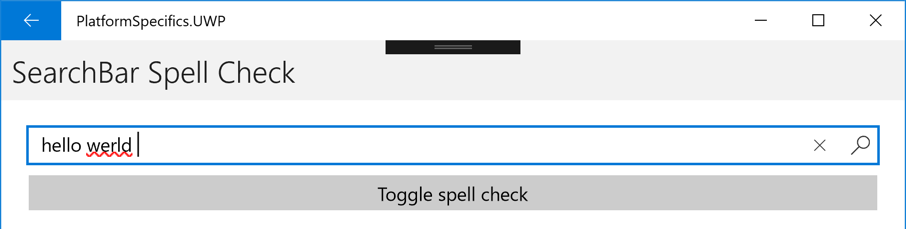

# SearchBar Spell Check on Windows

[ Download the sample](/samples/xamarin/xamarin-forms-samples/userinterface-platformspecifics)

This Universal Windows Platform platform-specific enables a [`SearchBar`](xref:Xamarin.Forms.SearchBar) to interact with the spell check engine. It's consumed in XAML by setting the [`SearchBar.IsSpellCheckEnabled`](xref:Xamarin.Forms.PlatformConfiguration.WindowsSpecific.SearchBar.IsSpellCheckEnabledProperty) attached property to a `boolean` value:

```xaml
<ContentPage ...
             xmlns:windows="clr-namespace:Xamarin.Forms.PlatformConfiguration.WindowsSpecific;assembly=Xamarin.Forms.Core">
    <StackLayout>
        <SearchBar ... windows:SearchBar.IsSpellCheckEnabled="true" />
        ...
    </StackLayout>
</ContentPage>
```

Alternatively, it can be consumed from C# using the fluent API:

```csharp
using Xamarin.Forms.PlatformConfiguration;
using Xamarin.Forms.PlatformConfiguration.WindowsSpecific;
...

searchBar.On<Windows>().SetIsSpellCheckEnabled(true);
```

The `SearchBar.On<Windows>` method specifies that this platform-specific will only run on the Universal Windows Platform. The [`SearchBar.SetIsSpellCheckEnabled`](xref:Xamarin.Forms.PlatformConfiguration.WindowsSpecific.SearchBar.SetIsSpellCheckEnabled(Xamarin.Forms.IPlatformElementConfiguration{Xamarin.Forms.PlatformConfiguration.Windows,Xamarin.Forms.SearchBar},System.Boolean)) method, in the [`Xamarin.Forms.PlatformConfiguration.WindowsSpecific`](xref:Xamarin.Forms.PlatformConfiguration.WindowsSpecific) namespace, turns the spell checker on and off. In addition, the `SearchBar.SetIsSpellCheckEnabled` method can be used to toggle the spell checker by calling the [`SearchBar.GetIsSpellCheckEnabled`](xref:Xamarin.Forms.PlatformConfiguration.WindowsSpecific.SearchBar.GetIsSpellCheckEnabled(Xamarin.Forms.IPlatformElementConfiguration{Xamarin.Forms.PlatformConfiguration.Windows,Xamarin.Forms.SearchBar})) method to return whether the spell checker is enabled:

```csharp
searchBar.On<Windows>().SetIsSpellCheckEnabled(!searchBar.On<Windows>().GetIsSpellCheckEnabled());
```

The result is that text entered into the [`SearchBar`](xref:Xamarin.Forms.SearchBar) can be spell checked, with incorrect spellings being indicated to the user:



> [!NOTE]
> The `SearchBar` class in the [`Xamarin.Forms.PlatformConfiguration.WindowsSpecific`](xref:Xamarin.Forms.PlatformConfiguration.WindowsSpecific) namespace also has [`EnableSpellCheck`](xref:Xamarin.Forms.PlatformConfiguration.WindowsSpecific.SearchBar.EnableSpellCheck*) and [`DisableSpellCheck`](xref:Xamarin.Forms.PlatformConfiguration.WindowsSpecific.SearchBar.DisableSpellCheck*) methods that can be used to enable and disable the spell checker on the `SearchBar`, respectively.

## Related links

- [PlatformSpecifics (sample)](/samples/xamarin/xamarin-forms-samples/userinterface-platformspecifics)
- [Creating Platform-Specifics](~/xamarin-forms/platform/platform-specifics/index.md#creating-platform-specifics)
- [WindowsSpecific API](xref:Xamarin.Forms.PlatformConfiguration.WindowsSpecific)