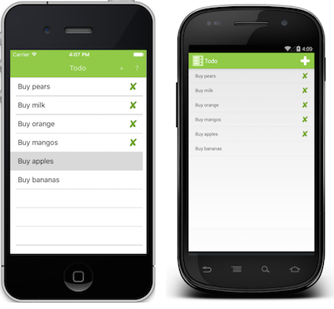
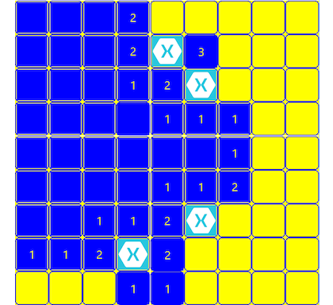
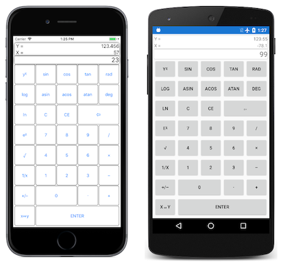
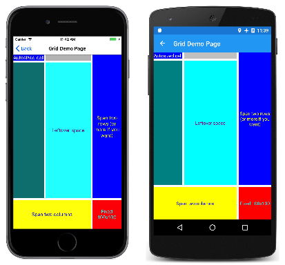

# Xamarin.Forms Samples

Xamarin.Forms sample apps and code demos to help you get started and understand concepts in Xamarin.Forms.

[All Xamarin.Forms samples](/samples/browse/?products=xamarin&term=Xamarin.Forms)

:::row:::
    :::column:::

### [Todo](/samples/xamarin/xamarin-forms-samples/todo/)

This sample demonstrates a Todo list application where the data is stored and accessed in a local SQLite database.
    :::column-end:::
    :::column:::

### [BugSweeper](/samples/xamarin/xamarin-forms-samples/bugsweeper/)

This is a familiar game with a new twist. Ten bugs are hidden in a 9-by-9 grid of tiles. To win, you must find and flag all ten bugs.
    :::column-end:::
    :::column:::

### [RPN Calculator](/samples/xamarin/xamarin-forms-samples/rpncalculator/)

An RPN (Reverse Polish Notation) calculator allows numbers and operations to be entered without parentheses or an equal key.
    :::column-end:::
:::row-end:::

:::row:::
    :::column:::

### [SpinPaint](/samples/xamarin/xamarin-forms-samples/skiasharpforms-spinpaint/)

The program simulates a revolving disk that you can paint on by touching and moving your fingers. SpinPaint responds to touch by painting a line under your finger, but it also duplicates that line in three mirror images in the other three quadrants of the disk.
    :::column-end:::
    :::column:::

### [XAML Samples](/samples/xamarin/xamarin-forms-samples/xamlsamples/)

XAML—the eXtensible Application Markup Language—allows developers to define user interfaces in Xamarin.Forms applications using markup rather than code.
    :::column-end:::
        :::column:::

### [Xuzzle](/samples/xamarin/mobile-samples/liveplayer-xamagonxuzzlelp/)

This game is a variation of the classic 14-15 puzzle that you can solve by sliding tiles into the correct order.
    :::column-end:::
:::row-end:::

## All samples

For the complete set of Xamarin.Forms sample apps and code demos, see [All Xamarin.Forms samples](/samples/browse/?products=xamarin&term=Xamarin.Forms).