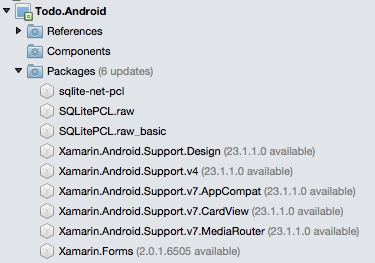

# Troubleshooting Xamarin.Forms

_Common error conditions and how to resolve them_

## Error: "Unable to find a version of Xamarin.Forms compatible with..."

The following errors can appear in the **Package Console** window
when updating all the NuGet packages in a Xamarin.Forms solution or in
a Xamarin.Forms Android app project:

```csharp
Attempting to resolve dependency 'Xamarin.Android.Support.v7.AppCompat (= 23.3.0.0)'.
Attempting to resolve dependency 'Xamarin.Android.Support.v4 (= 23.3.0.0)'.
Looking for updates for 'Xamarin.Android.Support.v7.MediaRouter'...
Updating 'Xamarin.Android.Support.v7.MediaRouter' from version '23.3.0.0' to '23.3.1.0' in project 'Todo.Droid'.
Updating 'Xamarin.Android.Support.v7.MediaRouter 23.3.0.0' to 'Xamarin.Android.Support.v7.MediaRouter 23.3.1.0' failed.
Unable to find a version of 'Xamarin.Forms' that is compatible with 'Xamarin.Android.Support.v7.MediaRouter 23.3.0.0'.
```

### What causes this error?

Visual Studio for Mac (or Visual Studio) may indicate that updates are available
for the Xamarin.Forms NuGet packge *and all its dependencies*. In Xamarin
Studio, the solution's **Packages** node might look like this (the version
numbers might be different):



This error may occur if you attempt to update _all_ the packages.

This is because with Android projects set to a target/compile version of
Android 6.0 (API 23) or below, Xamarin.Forms has a hard dependency on *specific*
versions of the Android support packages. Although updated versions of those
packages may be available, Xamarin.Forms is not necessarily compatible with them.

In this case you should update _only_ the **Xamarin.Forms** package as this will
ensure that the dependencies remain on compatible versions. Other packages
that you have added to your project may also be updated individually as long as they
do not cause the Android support packages to update.

> [!NOTE]
> If you are using Xamarin.Forms 2.3.4 or higher **and** your Android project's
target/compile version is set to Android 7.0 (API 24) or higher, then the hard
dependencies mentioned above no longer apply and you may update the support packages
independently of the Xamarin.Forms package.

### Fix: Remove all packages, and re-add Xamarin.Forms

If the **Xamarin.Android.Support** packages have been updated to incompatible
versions, the simplest fix is to:

1. Manually delete all the NuGet packages in the Android project, then
2. Re-add the **Xamarin.Forms** package.

This will automatically download the *correct* versions of the other packages.

To see a video of this process, refer to this
[forums post](https://forums.xamarin.com/discussion/comment/170012/#Comment_170012).
