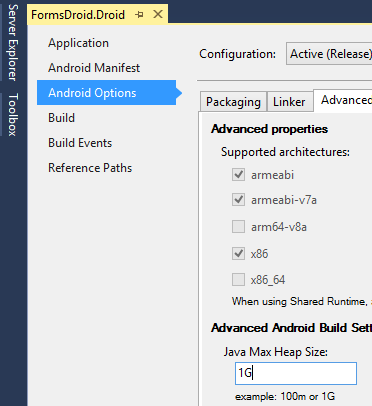

# Why does my Xamarin.Forms.Maps Android project fail with COMPILETODALVIK UNEXPECTED TOP-LEVEL ERROR?

This error may be seen in the Error pad of Visual Studio for Mac or in the Build Output window of Visual Studio; in Android projects using Xamarin.Forms.Maps.

This is most commonly resolved by increasing the Java Heap Size for your Xamarin.Android project. Follow these steps to increase the heap size:

## Visual Studio

1. Right-click the Android project & open the project options.
2. Go to **Android Options -> Advanced**
3. In the Java heap size text box enter 1G.
4. Rebuild the project.

## Visual Studio for Mac

1. Right-click the Android project & open the project options.
2. Go to **Build -> Android Build -> Advanced**
3. In the Java heap size text box enter 1G.
4. Rebuild the project.  

