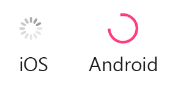
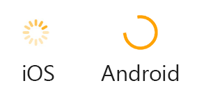

# Xamarin.Forms ActivityIndicator
[ Download the sample](/samples/xamarin/xamarin-forms-samples/userinterface-activityindicatordemos/)

The Xamarin.Forms [`ActivityIndicator`](xref:Xamarin.Forms.ActivityIndicator) control displays an animation to show that the application is engaged in a lengthy activity. Unlike the [`ProgressBar`](xref:Xamarin.Forms.ProgressBar), the `ActivityIndicator` gives no indication of progress. The `ActivityIndicator` inherits from [`View`](xref:Xamarin.Forms.View).

The following screenshots show an `ActivityIndicator` control on iOS and Android:



The `ActivityIndicator` control defines the following properties:

* [`Color`](xref:Xamarin.Forms.ActivityIndicator.Color) is a `Color` value that defines the display color of the `ActivityIndicator`.
* [`IsRunning`](xref:Xamarin.Forms.ActivityIndicator.IsRunning) is a `bool` value that indicates whether the `ActivityIndicator` should be visible and animating, or hidden. When the value is `false` the `ActivityIndicator` isn't visible.

These properties are backed by [`BindableProperty`](xref:Xamarin.Forms.BindableProperty) objects, which means that the `ActivityIndicator` can be styled and be the target of data bindings.

## Create an ActivityIndicator

The `ActivityIndicator` class can be instantiated in XAML. Its `IsRunning` property determines if the control is visible and animating. The `IsRunning` property defaults to `false`. The following example shows how to instantiate an `ActivityIndicator` in XAML with the optional `IsRunning` property set:

```xaml
<ActivityIndicator IsRunning="true" />
```

An `ActivityIndicator` can also be created in code:

```csharp
ActivityIndicator activityIndicator = new ActivityIndicator { IsRunning = true };
```

## ActivityIndicator appearance properties

The `Color` property defines the `ActivityIndicator` color. The following example shows how to instantiate an `ActivityIndicator` in XAML with the `Color` property set:

```xaml
<ActivityIndicator Color="Orange" />
```

The `Color` property can also be set when creating an `ActivityIndicator` in code:

```csharp
ActivityIndicator activityIndicator = new ActivityIndicator { Color = Color.Orange };
```

The following screenshots show the `ActivityIndicator` with the `Color` property set to `Color.Orange` on iOS and Android:



## Related links

* [ActivityIndicator Demos](/samples/xamarin/xamarin-forms-samples/userinterface-activityindicatordemos/)
* [ProgressBar](~/xamarin-forms/user-interface/progressbar.md)