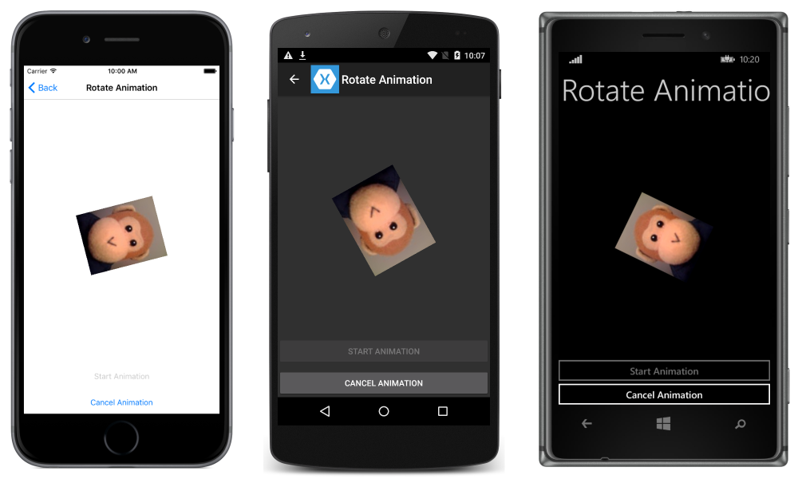
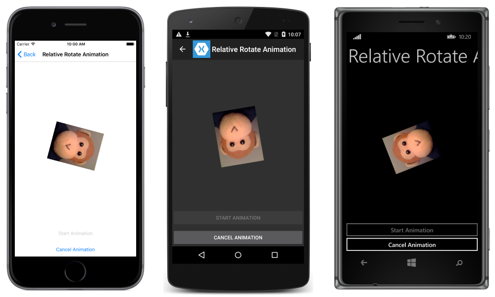
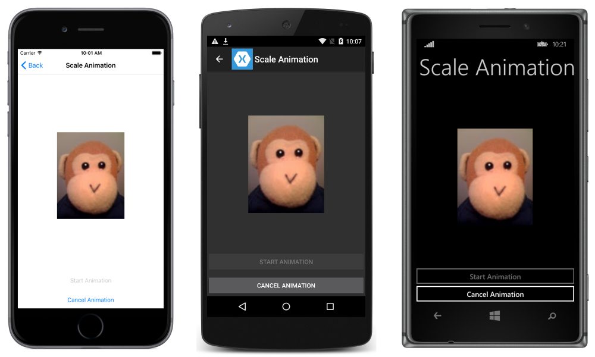
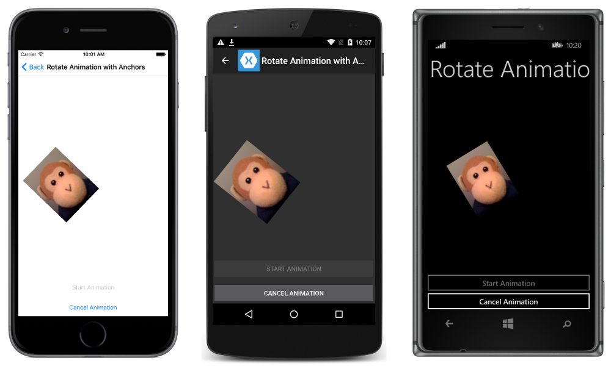
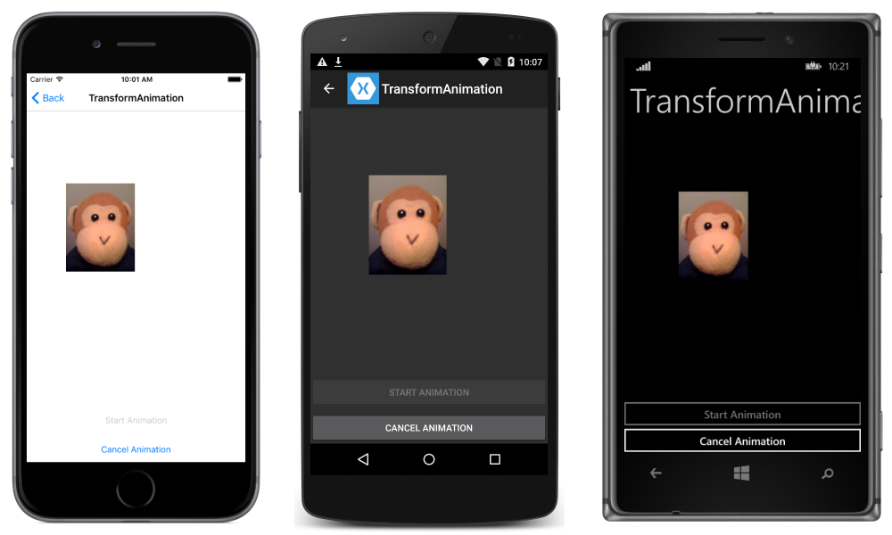
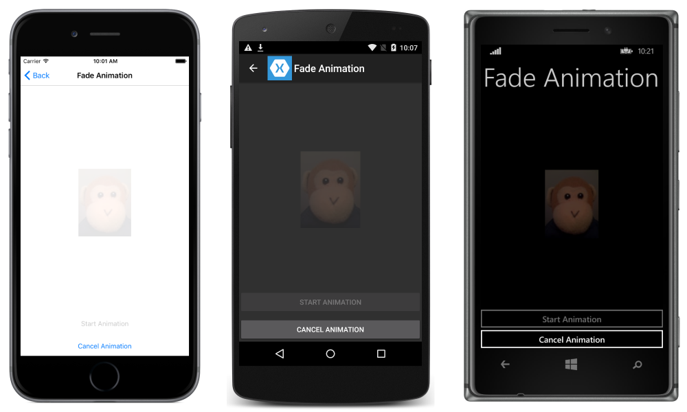
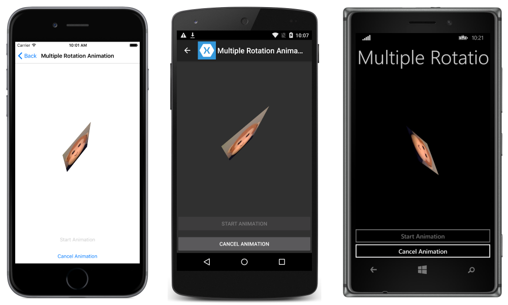

# Simple Animations in Xamarin.Forms

[ Download the sample](/samples/xamarin/xamarin-forms-samples/userinterface-animation-basic)

_The ViewExtensions class provides extension methods that can be used to construct simple animations. This article demonstrates creating and canceling animations using the ViewExtensions class._

The [`ViewExtensions`](xref:Xamarin.Forms.ViewExtensions) class provides the following extension methods that can be used to create simple animations:

- [`CancelAnimations`](xref:Xamarin.Forms.ViewExtensions.CancelAnimations(Xamarin.Forms.VisualElement)) cancels any animations.
- [`FadeTo`](xref:Xamarin.Forms.ViewExtensions.FadeTo(Xamarin.Forms.VisualElement,System.Double,System.UInt32,Xamarin.Forms.Easing)) animates the [`Opacity`](xref:Xamarin.Forms.VisualElement.Opacity) property of a [`VisualElement`](xref:Xamarin.Forms.VisualElement).
- [`RelScaleTo`](xref:Xamarin.Forms.ViewExtensions.RelScaleTo(Xamarin.Forms.VisualElement,System.Double,System.UInt32,Xamarin.Forms.Easing)) applies an animated incremental increase or decrease to the [`Scale`](xref:Xamarin.Forms.VisualElement.Scale) property of a [`VisualElement`](xref:Xamarin.Forms.VisualElement).
- [`RotateTo`](xref:Xamarin.Forms.ViewExtensions.RotateTo(Xamarin.Forms.VisualElement,System.Double,System.UInt32,Xamarin.Forms.Easing)) animates the [`Rotation`](xref:Xamarin.Forms.VisualElement.Rotation) property of a [`VisualElement`](xref:Xamarin.Forms.VisualElement).
- [`RelRotateTo`](xref:Xamarin.Forms.ViewExtensions.RelRotateTo(Xamarin.Forms.VisualElement,System.Double,System.UInt32,Xamarin.Forms.Easing)) applies an animated incremental increase or decrease to the [`Rotation`](xref:Xamarin.Forms.VisualElement.Rotation) property of a [`VisualElement`](xref:Xamarin.Forms.VisualElement).
- [`RotateXTo`](xref:Xamarin.Forms.ViewExtensions.RotateXTo(Xamarin.Forms.VisualElement,System.Double,System.UInt32,Xamarin.Forms.Easing)) animates the [`RotationX`](xref:Xamarin.Forms.VisualElement.RotationX) property of a [`VisualElement`](xref:Xamarin.Forms.VisualElement).
- [`RotateYTo`](xref:Xamarin.Forms.ViewExtensions.RotateYTo(Xamarin.Forms.VisualElement,System.Double,System.UInt32,Xamarin.Forms.Easing)) animates the [`RotationY`](xref:Xamarin.Forms.VisualElement.RotationY) property of a [`VisualElement`](xref:Xamarin.Forms.VisualElement).
- [`ScaleTo`](xref:Xamarin.Forms.ViewExtensions.ScaleTo*) animates the [`Scale`](xref:Xamarin.Forms.VisualElement.Scale) property of a [`VisualElement`](xref:Xamarin.Forms.VisualElement).
- `ScaleXTo` animates the [`ScaleX`](xref:Xamarin.Forms.VisualElement.ScaleX) property of a [`VisualElement`](xref:Xamarin.Forms.VisualElement).
- `ScaleYTo` animates the [`ScaleY`](xref:Xamarin.Forms.VisualElement.ScaleY) property of a [`VisualElement`](xref:Xamarin.Forms.VisualElement).
- [`TranslateTo`](xref:Xamarin.Forms.ViewExtensions.TranslateTo(Xamarin.Forms.VisualElement,System.Double,System.Double,System.UInt32,Xamarin.Forms.Easing)) animates the [`TranslationX`](xref:Xamarin.Forms.VisualElement.TranslationX) and [`TranslationY`](xref:Xamarin.Forms.VisualElement.TranslationY) properties of a [`VisualElement`](xref:Xamarin.Forms.VisualElement).

By default, each animation will take 250 milliseconds. However, a duration for each animation can be specified when creating the animation.

> [!NOTE]
> The [`ViewExtensions`](xref:Xamarin.Forms.ViewExtensions) class provides a [`LayoutTo`](xref:Xamarin.Forms.ViewExtensions.LayoutTo(Xamarin.Forms.VisualElement,Xamarin.Forms.Rectangle,System.UInt32,Xamarin.Forms.Easing)) extension method. However, this method is intended to be used by layouts to animate transitions between layout states that contain size and position changes. Therefore, it should only be used by [`Layout`](xref:Xamarin.Forms.Layout) subclasses.

The animation extension methods in the [`ViewExtensions`](xref:Xamarin.Forms.ViewExtensions) class are all asynchronous and return a `Task<bool>` object. The return value is `false` if the animation completes, and `true` if the animation is cancelled. Therefore, the animation methods should typically be used with the `await` operator, which makes it possible to easily determine when an animation has completed. In addition, it then becomes possible to create sequential animations with subsequent animation methods executing after the previous method has completed. For more information, see [Compound Animations](#compound-animations).

If there's a requirement to let an animation complete in the background, then the `await` operator can be omitted. In this scenario, the animation extension methods will quickly return after initiating the animation, with the animation occurring in the background. This operation can be taken advantage of when creating composite animations. For more information, see [Composite Animations](#composite-animations).

For more information about the `await` operator, see [Async Support Overview](~/cross-platform/platform/async.md).

## Single Animations

Each extension method in the [`ViewExtensions`](xref:Xamarin.Forms.ViewExtensions) implements a single animation operation that progressively changes a property from one value to another value over a period of time. This section explores each animation operation.

### Rotation

The following code example demonstrates using the [`RotateTo`](xref:Xamarin.Forms.ViewExtensions.RotateTo(Xamarin.Forms.VisualElement,System.Double,System.UInt32,Xamarin.Forms.Easing)) method to animate the [`Rotation`](xref:Xamarin.Forms.VisualElement.Rotation) property of an [`Image`](xref:Xamarin.Forms.Image):

```csharp
await image.RotateTo (360, 2000);
image.Rotation = 0;
```

This code animates the [`Image`](xref:Xamarin.Forms.Image) instance by rotating up to 360 degrees over 2 seconds (2000 milliseconds). The [`RotateTo`](xref:Xamarin.Forms.ViewExtensions.RotateTo(Xamarin.Forms.VisualElement,System.Double,System.UInt32,Xamarin.Forms.Easing)) method obtains the current [`Rotation`](xref:Xamarin.Forms.VisualElement.Rotation) property value for the start of the animation, and then rotates from that value to its first argument (360). Once the animation is complete, the image's [`Rotation`](xref:Xamarin.Forms.VisualElement.Rotation) property is reset to 0. This ensures that the `Rotation` property doesn't remain at 360 after the animation concludes, which would prevent additional rotations.

The following screenshots show the rotation in progress on each platform:



> [!NOTE]
> In addition to the [`RotateTo`](xref:Xamarin.Forms.ViewExtensions.RotateTo(Xamarin.Forms.VisualElement,System.Double,System.UInt32,Xamarin.Forms.Easing)) method, there are also [`RotateXTo`](xref:Xamarin.Forms.ViewExtensions.RotateXTo(Xamarin.Forms.VisualElement,System.Double,System.UInt32,Xamarin.Forms.Easing)) and [`RotateYTo`](xref:Xamarin.Forms.ViewExtensions.RotateYTo(Xamarin.Forms.VisualElement,System.Double,System.UInt32,Xamarin.Forms.Easing)) methods that animate the [`RotationX`](xref:Xamarin.Forms.VisualElement.RotationX) and [`RotationY`](xref:Xamarin.Forms.VisualElement.RotationY) properties, respectively.

### Relative Rotation

The following code example demonstrates using the [`RelRotateTo`](xref:Xamarin.Forms.ViewExtensions.RelRotateTo(Xamarin.Forms.VisualElement,System.Double,System.UInt32,Xamarin.Forms.Easing)) method to incrementally increase or decrease the [`Rotation`](xref:Xamarin.Forms.VisualElement.Rotation) property of an [`Image`](xref:Xamarin.Forms.Image):

```csharp
await image.RelRotateTo (360, 2000);
```

This code animates the [`Image`](xref:Xamarin.Forms.Image) instance by rotating 360 degrees from its starting position over 2 seconds (2000 milliseconds). The [`RelRotateTo`](xref:Xamarin.Forms.ViewExtensions.RelRotateTo(Xamarin.Forms.VisualElement,System.Double,System.UInt32,Xamarin.Forms.Easing)) method obtains the current [`Rotation`](xref:Xamarin.Forms.VisualElement.Rotation) property value for the start of the animation, and then rotates from that value to the value plus its first argument (360). This ensures that each animation will always be a 360 degrees rotation from the starting position. Therefore, if a new animation is invoked while an animation is already in progress, it will start from the current position and may end at a position that is not an increment of 360 degrees.

The following screenshots show the relative rotation in progress on each platform:



### Scaling

The following code example demonstrates using the [`ScaleTo`](xref:Xamarin.Forms.ViewExtensions.ScaleTo*) method to animate the [`Scale`](xref:Xamarin.Forms.VisualElement.Scale) property of an [`Image`](xref:Xamarin.Forms.Image):

```csharp
await image.ScaleTo (2, 2000);
```

This code animates the [`Image`](xref:Xamarin.Forms.Image) instance by scaling up to twice its size over 2 seconds (2000 milliseconds). The [`ScaleTo`](xref:Xamarin.Forms.ViewExtensions.ScaleTo*) method obtains the current [`Scale`](xref:Xamarin.Forms.VisualElement.Scale) property value (default value of 1) for the start of the animation, and then scales from that value to its first argument (2). This has the effect of expanding the size of the image to twice its size.

The following screenshots show the scaling in progress on each platform:



> [!NOTE]
> In addition to the [`ScaleTo`](xref:Xamarin.Forms.ViewExtensions.ScaleTo*) method, there are also `ScaleXTo` and `ScaleYTo` methods that animate the [`ScaleX`](xref:Xamarin.Forms.VisualElement.ScaleX) and [`ScaleY`](xref:Xamarin.Forms.VisualElement.ScaleY) properties, respectively.

### Relative Scaling

The following code example demonstrates using the [`RelScaleTo`](xref:Xamarin.Forms.ViewExtensions.RelScaleTo(Xamarin.Forms.VisualElement,System.Double,System.UInt32,Xamarin.Forms.Easing)) method to animate the [`Scale`](xref:Xamarin.Forms.VisualElement.Scale) property of an [`Image`](xref:Xamarin.Forms.Image):

```csharp
await image.RelScaleTo (2, 2000);
```

This code animates the [`Image`](xref:Xamarin.Forms.Image) instance by scaling up to twice its size over 2 seconds (2000 milliseconds). The [`RelScaleTo`](xref:Xamarin.Forms.ViewExtensions.RelScaleTo(Xamarin.Forms.VisualElement,System.Double,System.UInt32,Xamarin.Forms.Easing)) method obtains the current [`Scale`](xref:Xamarin.Forms.VisualElement.Scale) property value for the start of the animation, and then scales from that value to the value plus its first argument (2). This ensures that each animation will always be a scaling of 2 from the starting position.

### Scaling and Rotation with Anchors

The [`AnchorX`](xref:Xamarin.Forms.VisualElement.AnchorX) and [`AnchorY`](xref:Xamarin.Forms.VisualElement.AnchorY) properties set the center of scaling or rotation for the [`Rotation`](xref:Xamarin.Forms.VisualElement.Rotation) and [`Scale`](xref:Xamarin.Forms.VisualElement.Scale) properties. Therefore, their values also affect the [`RotateTo`](xref:Xamarin.Forms.ViewExtensions.RotateTo(Xamarin.Forms.VisualElement,System.Double,System.UInt32,Xamarin.Forms.Easing)) and [`ScaleTo`](xref:Xamarin.Forms.ViewExtensions.ScaleTo*) methods.

Given an [`Image`](xref:Xamarin.Forms.Image) that has been placed at the center of a layout, the following code example demonstrates rotating the image around the center of the layout by setting its [`AnchorY`](xref:Xamarin.Forms.VisualElement.AnchorY) property:

```csharp
double radius = Math.Min(absoluteLayout.Width, absoluteLayout.Height) / 2;
image.AnchorY = radius / image.Height;
await image.RotateTo(360, 2000);
```

To rotate the [`Image`](xref:Xamarin.Forms.Image) instance around the center of the layout, the [`AnchorX`](xref:Xamarin.Forms.VisualElement.AnchorX) and [`AnchorY`](xref:Xamarin.Forms.VisualElement.AnchorY) properties must be set to values that are relative to the width and height of the `Image`. In this example, the center of the `Image` is defined to be at the center of the layout, and so the default `AnchorX` value of 0.5 does not require changing. However, the `AnchorY` property is redefined to be a value from the top of the `Image` to the center point of the layout. This ensures that the `Image` makes a full rotation of 360 degrees around the center point of the layout, as shown in the following screenshots:



### Translation

The following code example demonstrates using the [`TranslateTo`](xref:Xamarin.Forms.ViewExtensions.TranslateTo(Xamarin.Forms.VisualElement,System.Double,System.Double,System.UInt32,Xamarin.Forms.Easing)) method to animate the [`TranslationX`](xref:Xamarin.Forms.VisualElement.TranslationX) and [`TranslationY`](xref:Xamarin.Forms.VisualElement.TranslationY) properties of an [`Image`](xref:Xamarin.Forms.Image):

```csharp
await image.TranslateTo (-100, -100, 1000);
```

This code animates the [`Image`](xref:Xamarin.Forms.Image) instance by translating it horizontally and vertically over 1 second (1000 milliseconds). The [`TranslateTo`](xref:Xamarin.Forms.ViewExtensions.TranslateTo(Xamarin.Forms.VisualElement,System.Double,System.Double,System.UInt32,Xamarin.Forms.Easing)) method simultaneously translates the image 100 pixels to the left, and 100 pixels upwards. This is because the first and second arguments are both negative numbers. Providing positive numbers would translate the image to the right, and down.

The following screenshots show the translation in progress on each platform:



> [!NOTE]
> If an element is initially laid out off screen and then translated onto the screen, after translation the element's input layout remains off screen and the user can't interact with it. Therefore, it's recommended that a view should be laid out in its final position, and then any required translations performed.

### Fading

The following code example demonstrates using the [`FadeTo`](xref:Xamarin.Forms.ViewExtensions.FadeTo(Xamarin.Forms.VisualElement,System.Double,System.UInt32,Xamarin.Forms.Easing)) method to animate the [`Opacity`](xref:Xamarin.Forms.VisualElement.Opacity) property of an [`Image`](xref:Xamarin.Forms.Image):

```csharp
image.Opacity = 0;
await image.FadeTo (1, 4000);
```

This code animates the [`Image`](xref:Xamarin.Forms.Image) instance by fading it in over 4 seconds (4000 milliseconds). The [`FadeTo`](xref:Xamarin.Forms.ViewExtensions.FadeTo(Xamarin.Forms.VisualElement,System.Double,System.UInt32,Xamarin.Forms.Easing)) method obtains the current [`Opacity`](xref:Xamarin.Forms.VisualElement.Opacity) property value for the start of the animation, and then fades in from that value to its first argument (1).

The following screenshots show the fade in progress on each platform:



## Compound Animations

A compound animation is a sequential combination of animations, and can be created with the `await` operator, as demonstrated in the following code example:

```csharp
await image.TranslateTo (-100, 0, 1000);    // Move image left
await image.TranslateTo (-100, -100, 1000); // Move image diagonally up and left
await image.TranslateTo (100, 100, 2000);   // Move image diagonally down and right
await image.TranslateTo (0, 100, 1000);     // Move image left
await image.TranslateTo (0, 0, 1000);       // Move image up
```

In this example, the [`Image`](xref:Xamarin.Forms.Image) is translated over 6 seconds (6000 milliseconds). The translation of the `Image` uses five animations, with the `await` operator indicating that each animation executes sequentially. Therefore, subsequent animation methods execute after the previous method has completed.

## Composite Animations

A composite animation is a combination of animations where two or more animations run simultaneously. Composite animations can be created by mixing awaited and non-awaited animations, as demonstrated in the following code example:

```csharp
image.RotateTo (360, 4000);
await image.ScaleTo (2, 2000);
await image.ScaleTo (1, 2000);
```

In this example, the [`Image`](xref:Xamarin.Forms.Image) is scaled and simultaneously rotated over 4 seconds (4000 milliseconds). The scaling of the `Image` uses two sequential animations that occur at the same time as the rotation. The [`RotateTo`](xref:Xamarin.Forms.ViewExtensions.RotateTo(Xamarin.Forms.VisualElement,System.Double,System.UInt32,Xamarin.Forms.Easing)) method executes without an `await` operator and returns immediately, with the first [`ScaleTo`](xref:Xamarin.Forms.ViewExtensions.ScaleTo*) animation then beginning. The `await` operator on the first `ScaleTo` method call delays the second `ScaleTo` method call until the first `ScaleTo` method call has completed. At this point the `RotateTo` animation is half way completed and the `Image` will be rotated 180 degrees. During the final 2 seconds (2000 milliseconds), the second `ScaleTo` animation and the `RotateTo` animation both complete.

### Running Multiple Asynchronous Methods Concurrently

The `static` `Task.WhenAny` and `Task.WhenAll` methods are used to run multiple asynchronous methods concurrently, and therefore can be used to create composite animations. Both methods return a `Task` object and accept a collection of methods that each return a `Task` object. The `Task.WhenAny` method completes when any method in its collection completes execution, as demonstrated in the following code example:

```csharp
await Task.WhenAny<bool>
(
  image.RotateTo (360, 4000),
  image.ScaleTo (2, 2000)
);
await image.ScaleTo (1, 2000);
```

In this example, the `Task.WhenAny` method call contains two tasks. The first task rotates the image over 4 seconds (4000 milliseconds), and the second task scales the image over 2 seconds (2000 milliseconds). When the second task completes, the `Task.WhenAny` method call completes. However, even though the [`RotateTo`](xref:Xamarin.Forms.ViewExtensions.RotateTo(Xamarin.Forms.VisualElement,System.Double,System.UInt32,Xamarin.Forms.Easing)) method is still running, the second [`ScaleTo`](xref:Xamarin.Forms.ViewExtensions.ScaleTo*) method can begin.

The `Task.WhenAll` method completes when all the methods in its collection have completed, as demonstrated in the following code example:

```csharp
// 10 minute animation
uint duration = 10 * 60 * 1000;

await Task.WhenAll (
  image.RotateTo (307 * 360, duration),
  image.RotateXTo (251 * 360, duration),
  image.RotateYTo (199 * 360, duration)
);
```

In this example, the `Task.WhenAll` method call contains three tasks, each of which executes over 10 minutes. Each `Task` makes a different number of 360 degree rotations – 307 rotations for [`RotateTo`](xref:Xamarin.Forms.ViewExtensions.RotateTo(Xamarin.Forms.VisualElement,System.Double,System.UInt32,Xamarin.Forms.Easing)), 251 rotations for [`RotateXTo`](xref:Xamarin.Forms.ViewExtensions.RotateXTo(Xamarin.Forms.VisualElement,System.Double,System.UInt32,Xamarin.Forms.Easing)), and 199 rotations for [`RotateYTo`](xref:Xamarin.Forms.ViewExtensions.RotateYTo(Xamarin.Forms.VisualElement,System.Double,System.UInt32,Xamarin.Forms.Easing)). These values are prime numbers, therefore ensuring that the rotations aren't synchronized and hence won't result in repetitive patterns.

The following screenshots show the multiple rotations in progress on each platform:



## Canceling Animations

An application can cancel one or more animations with a call to the [`CancelAnimations`](xref:Xamarin.Forms.ViewExtensions.CancelAnimations(Xamarin.Forms.VisualElement)) extension method, as demonstrated in the following code example:

```csharp
image.CancelAnimations();
```

This will immediately cancel all animations that are currently running on the [`Image`](xref:Xamarin.Forms.Image) instance.

## Summary

This article demonstrated creating and canceling animations using the [`ViewExtensions`](xref:Xamarin.Forms.ViewExtensions) class. This class provides extension methods that can be used to construct simple animations that rotate, scale, translate, and fade [`VisualElement`](xref:Xamarin.Forms.VisualElement) instances.

## Related Links

- [Async Support Overview](~/cross-platform/platform/async.md)
- [Basic Animation (sample)](/samples/xamarin/xamarin-forms-samples/userinterface-animation-basic)
- [ViewExtensions](xref:Xamarin.Forms.ViewExtensions)
