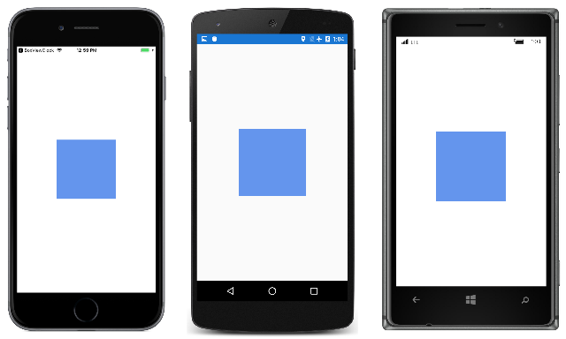
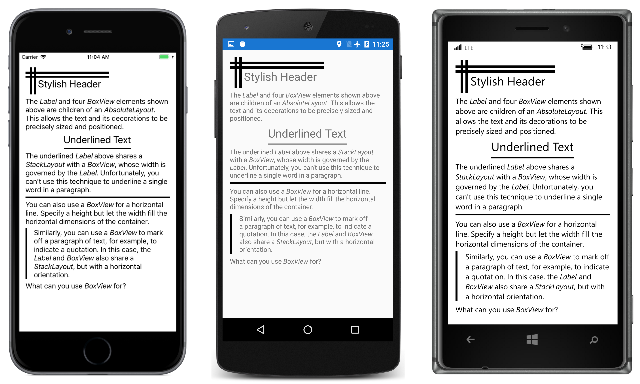
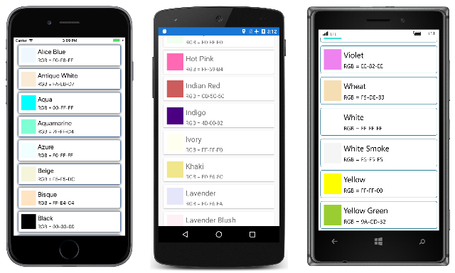
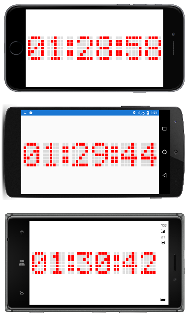
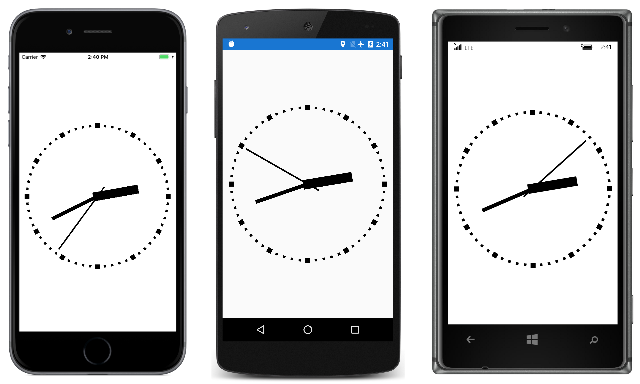

# Xamarin.Forms BoxView

[ Download the sample](/samples/xamarin/xamarin-forms-samples/boxview-basicboxview)

[`BoxView`](xref:Xamarin.Forms.BoxView) renders a simple rectangle of a specified width, height, and color. You can use `BoxView` for decoration, rudimentary graphics, and for interaction with the user through touch.

Because Xamarin.Forms does not have a built-in vector graphics system, the `BoxView` helps to compensate. Some of the sample programs described in this article use `BoxView` for rendering graphics. The `BoxView` can be sized to resemble a line of a specific width and thickness, and then rotated by any angle using the `Rotation` property.

Although `BoxView` can mimic simple graphics, you might want to investigate [Using SkiaSharp in Xamarin.Forms](~/xamarin-forms/user-interface/graphics/skiasharp/index.md) for more sophisticated graphics requirements.

## Setting BoxView Color and Size

Typically you'll set the following properties of `BoxView`:

- [`Color`](xref:Xamarin.Forms.BoxView.Color) to set its color.
- [`CornerRadius`](xref:Xamarin.Forms.BoxView.CornerRadius) to set its corner radius.
- [`WidthRequest`](xref:Xamarin.Forms.VisualElement.WidthRequest) to set the width of the `BoxView` in device-independent units.
- [`HeightRequest`](xref:Xamarin.Forms.VisualElement.HeightRequest) to set the height of the `BoxView`.

The `Color` property is of type `Color`; the property can be set to any `Color` value, including the 141 static read-only fields of named colors ranging alphabetically from `AliceBlue` to `YellowGreen`.

The `CornerRadius` property is of type [`CornerRadius`](xref:Xamarin.Forms.CornerRadius); the property can be set to a single `double` uniform corner radius value, or a `CornerRadius` structure defined by four `double` values that are applied to the top left, top right, bottom left, and bottom right of the `BoxView`.

The `WidthRequest` and `HeightRequest` properties only play a role if the `BoxView` is *unconstrained* in layout. This is the case when the layout container needs to know the child's size, for example, when the `BoxView` is a child of an auto-sized cell in the `Grid` layout. A `BoxView` is also unconstrained when its `HorizontalOptions` and `VerticalOptions` properties are set to values other than `LayoutOptions.Fill`. If the `BoxView` is unconstrained, but the `WidthRequest` and `HeightRequest` properties are not set, then the width or height are set to default values of 40 units, or about 1/4 inch on mobile devices.

The `WidthRequest` and `HeightRequest` properties are ignored if the `BoxView` is *constrained* in layout, in which case the layout container imposes its own size on the `BoxView`.

A `BoxView` can be constrained in one dimension and unconstrained in the other. For example, if the `BoxView` is a child of a vertical `StackLayout`, the vertical dimension of the `BoxView` is unconstrained and its horizontal dimension is generally constrained. But there are exceptions for that horizontal dimension: If the `BoxView` has its `HorizontalOptions` property set to something other than `LayoutOptions.Fill`, then the horizontal dimension is also unconstrained. It's also possible for the `StackLayout` itself to have an unconstrained horizontal dimension, in which case the `BoxView` will also be horizontally unconstrained.

The [**BasicBoxView**](/samples/xamarin/xamarin-forms-samples/boxview-basicboxview) sample displays a one-inch-square unconstrained `BoxView` in the center of its page:

```xaml
<ContentPage xmlns="http://xamarin.com/schemas/2014/forms"
             xmlns:x="http://schemas.microsoft.com/winfx/2009/xaml"
             xmlns:local="clr-namespace:BasicBoxView"
             x:Class="BasicBoxView.MainPage">

    <BoxView Color="CornflowerBlue"
             CornerRadius="10"
             WidthRequest="160"
             HeightRequest="160"
             VerticalOptions="Center"
             HorizontalOptions="Center" />

</ContentPage>
```

Here's the result:

[](boxview-images/basicboxview-large.png#lightbox "BasicBoxView")

If the `VerticalOptions` and `HorizontalOptions` properties are removed from the `BoxView` tag or are set to `Fill`, then the `BoxView` becomes constrained by the size of the page, and expands to fill the page.

A `BoxView` can also be a child of an `AbsoluteLayout`. In that case, both the location and size of the `BoxView` are set using the `LayoutBounds` attached bindable property. The `AbsoluteLayout` is discussed in the article [**AbsoluteLayout**](~/xamarin-forms/user-interface/layouts/absolutelayout.md).

You'll see examples of all these cases in the sample programs that follow.

## Rendering Text Decorations

You can use the `BoxView` to add some simple decorations on your pages in the form of horizontal and vertical lines. The [**TextDecoration**](/samples/xamarin/xamarin-forms-samples/boxview-textdecoration) sample demonstrates this. All of the program's visuals are defined in the **MainPage.xaml** file, which contains several `Label` and `BoxView` elements in the `StackLayout` shown here:

```xaml
<ContentPage xmlns="http://xamarin.com/schemas/2014/forms"
             xmlns:x="http://schemas.microsoft.com/winfx/2009/xaml"
             xmlns:local="clr-namespace:TextDecoration"
             x:Class="TextDecoration.MainPage">
    <ContentPage.Padding>
        <OnPlatform x:TypeArguments="Thickness">
            <On Platform="iOS" Value="0, 20, 0, 0" />
        </OnPlatform>
    </ContentPage.Padding>

    <ContentPage.Resources>
        <ResourceDictionary>
            <Style TargetType="BoxView">
                <Setter Property="Color" Value="Black" />
            </Style>
        </ResourceDictionary>
    </ContentPage.Resources>

    <ScrollView Margin="15">
        <StackLayout>

            ···

        </StackLayout>
    </ScrollView>
</ContentPage>
```

All of the markup that follows are children of the `StackLayout`. This markup consists of several types of decorative `BoxView` elements used with the `Label` element:

[](boxview-images/textdecoration-large.png#lightbox "Text Decoration")

The stylish header at the top of the page is achieved with an `AbsoluteLayout` whose children are four `BoxView` elements and a `Label`, all of which are assigned specific locations and sizes:

```xaml
<AbsoluteLayout>
    <BoxView AbsoluteLayout.LayoutBounds="0, 10, 200, 5" />
    <BoxView AbsoluteLayout.LayoutBounds="0, 20, 200, 5" />
    <BoxView AbsoluteLayout.LayoutBounds="10, 0, 5, 65" />
    <BoxView AbsoluteLayout.LayoutBounds="20, 0, 5, 65" />
    <Label Text="Stylish Header"
           FontSize="24"
           AbsoluteLayout.LayoutBounds="30, 25, AutoSize, AutoSize"/>
</AbsoluteLayout>
```

In the XAML file, the `AbsoluteLayout` is followed by a `Label` with formatted text that describes the `AbsoluteLayout`.

You can underline a text string by enclosing both the `Label` and `BoxView` in a `StackLayout` that has its `HorizontalOptions` value set to something other than `Fill`. The width of the `StackLayout` is then governed by the width of the `Label`, which then imposes that width on the `BoxView`. The `BoxView` is assigned only an explicit height:

```xaml
<StackLayout HorizontalOptions="Center">
    <Label Text="Underlined Text"
           FontSize="24" />
    <BoxView HeightRequest="2" />
</StackLayout>
```

You can't use this technique to underline individual words within longer text strings or a paragraph.

It's also possible to use a `BoxView` to resemble an HTML `hr` (horizontal rule) element. Simply let the width of the `BoxView` be determined by its parent container, which in this case is the `StackLayout`:

```xaml
<BoxView HeightRequest="3" />
```

Finally, you can draw a vertical line on one side of a paragraph of text by enclosing both the `BoxView` and the `Label` in a horizontal `StackLayout`. In this case, the height of the `BoxView` is the same as the height of `StackLayout`, which is governed by the height of the `Label`:

```xaml
<StackLayout Orientation="Horizontal">
    <BoxView WidthRequest="4"
             Margin="0, 0, 10, 0" />
    <Label>

        ···

    </Label>
</StackLayout>
```

## Listing Colors with BoxView

The `BoxView` is convenient for displaying colors. This program uses a `ListView` to list all the public static read-only fields of the Xamarin.Forms `Color` structure:

[](boxview-images/listviewcolors-large.png#lightbox "ListView Colors")

The [**ListViewColors**](/samples/xamarin/xamarin-forms-samples/boxview-listviewcolors) program includes a class named `NamedColor`. The static constructor uses reflection to access all the fields of the `Color` structure and create a `NamedColor` object for each one. These are stored in the static `All` property:

```csharp
public class NamedColor
{
    // Instance members.
    private NamedColor()
    {
    }

    public string Name { private set; get; }

    public string FriendlyName { private set; get; }

    public Color Color { private set; get; }

    public string RgbDisplay { private set; get; }

    // Static members.
    static NamedColor()
    {
        List<NamedColor> all = new List<NamedColor>();
        StringBuilder stringBuilder = new StringBuilder();

        // Loop through the public static fields of the Color structure.
        foreach (FieldInfo fieldInfo in typeof(Color).GetRuntimeFields ())
        {
            if (fieldInfo.IsPublic &&
                fieldInfo.IsStatic &&
                fieldInfo.FieldType == typeof (Color))
            {
                // Convert the name to a friendly name.
                string name = fieldInfo.Name;
                stringBuilder.Clear();
                int index = 0;

                foreach (char ch in name)
                {
                    if (index != 0 && Char.IsUpper(ch))
                    {
                        stringBuilder.Append(' ');
                    }
                    stringBuilder.Append(ch);
                    index++;
                }

                // Instantiate a NamedColor object.
                Color color = (Color)fieldInfo.GetValue(null);

                NamedColor namedColor = new NamedColor
                {
                    Name = name,
                    FriendlyName = stringBuilder.ToString(),
                    Color = color,
                    RgbDisplay = String.Format("{0:X2}-{1:X2}-{2:X2}",
                                               (int)(255 * color.R),
                                               (int)(255 * color.G),
                                               (int)(255 * color.B))
                };

                // Add it to the collection.
                all.Add(namedColor);
            }
        }
        all.TrimExcess();
        All = all;
    }

    public static IList<NamedColor> All { private set; get; }
}
```

The program visuals are described in the XAML file. The `ItemsSource` property of the `ListView` is set to the static `NamedColor.All` property, which means that the `ListView` displays all the individual `NamedColor` objects:

```xaml
<ContentPage xmlns="http://xamarin.com/schemas/2014/forms"
             xmlns:x="http://schemas.microsoft.com/winfx/2009/xaml"
             xmlns:local="clr-namespace:ListViewColors"
             x:Class="ListViewColors.MainPage">
    <ContentPage.Padding>
        <OnPlatform x:TypeArguments="Thickness">
            <On Platform="iOS" Value="10, 20, 10, 0" />
            <On Platform="Android, UWP" Value="10, 0" />
        </OnPlatform>
    </ContentPage.Padding>

    <ListView SeparatorVisibility="None"
              ItemsSource="{x:Static local:NamedColor.All}">
        <ListView.RowHeight>
            <OnPlatform x:TypeArguments="x:Int32">
                <On Platform="iOS, Android" Value="80" />
                <On Platform="UWP" Value="90" />
            </OnPlatform>
        </ListView.RowHeight>

        <ListView.ItemTemplate>
            <DataTemplate>
                <ViewCell>
                    <ContentView Padding="5">
                        <Frame OutlineColor="Accent"
                               Padding="10">
                            <StackLayout Orientation="Horizontal">
                                <BoxView Color="{Binding Color}"
                                         WidthRequest="50"
                                         HeightRequest="50" />
                                <StackLayout>
                                    <Label Text="{Binding FriendlyName}"
                                           FontSize="22"
                                           VerticalOptions="StartAndExpand" />
                                    <Label Text="{Binding RgbDisplay, StringFormat='RGB = {0}'}"
                                           FontSize="16"
                                           VerticalOptions="CenterAndExpand" />
                                </StackLayout>
                            </StackLayout>
                        </Frame>
                    </ContentView>
                </ViewCell>
            </DataTemplate>
        </ListView.ItemTemplate>
    </ListView>
</ContentPage>
```

The `NamedColor` objects are formatted by the `ViewCell` object that is set as the data template of the `ListView`. This template includes a `BoxView` whose `Color` property is bound to the `Color` property of the `NamedColor` object.

## Playing the Game of Life by Subclassing BoxView

The Game of Life is a cellular automaton invented by mathematician John Conway and popularized in the pages of *Scientific American* in the 1970s. A good introduction is provided by the Wikipedia article [Conway's Game of Life](https://en.wikipedia.org/wiki/Conway%27s_Game_of_Life).

The Xamarin.Forms [**GameOfLife**](/samples/xamarin/xamarin-forms-samples/boxview-gameoflife) program defines a class named `LifeCell` that derives from `BoxView`. This class encapsulates the logic of an individual cell in the Game of Life:

```csharp
class LifeCell : BoxView
{
    bool isAlive;

    public event EventHandler Tapped;

    public LifeCell()
    {
        BackgroundColor = Color.White;

        TapGestureRecognizer tapGesture = new TapGestureRecognizer();
        tapGesture.Tapped += (sender, args) =>
        {
            Tapped?.Invoke(this, EventArgs.Empty);
        };
        GestureRecognizers.Add(tapGesture);
    }

    public int Col { set; get; }

    public int Row { set; get; }

    public bool IsAlive
    {
        set
        {
            if (isAlive != value)
            {
                isAlive = value;
                BackgroundColor = isAlive ? Color.Black : Color.White;
            }
        }
        get
        {
            return isAlive;
        }
    }
}
```

`LifeCell` adds three more properties to `BoxView`: the `Col` and `Row` properties store the position of the cell within the grid, and the `IsAlive` property indicates its state. The `IsAlive` property also sets the `Color` property of the `BoxView` to black if the cell is alive, and white if the cell is not alive.

`LifeCell` also installs a `TapGestureRecognizer` to allow the user to toggle the state of cells by tapping them. The class translates the `Tapped` event from the gesture recognizer into its own `Tapped` event.

The **GameOfLife** program also includes a `LifeGrid` class that encapsulates much of the logic of the game, and a `MainPage` class that handles the program's visuals. These include an overlay that describes the rules of the game. Here is the program in action showing a couple hundred `LifeCell` objects on the page:

[](boxview-images/gameoflife-large.png#lightbox "Game of Life")

## Creating a Digital Clock

The [**DotMatrixClock**](/samples/xamarin/xamarin-forms-samples/boxview-dotmatrixclock) program creates 210 `BoxView` elements to simulate the dots of an old-fashioned 5-by-7 dot-matrix display. You can read the time in either portrait or landscape mode, but it's larger in landscape:

[](boxview-images/dotmatrixclock-large.png#lightbox "Dot-Matrix Clock")

The XAML file does little more than instantiate the `AbsoluteLayout` used for the clock:

```xaml
<ContentPage xmlns="http://xamarin.com/schemas/2014/forms"
             xmlns:x="http://schemas.microsoft.com/winfx/2009/xaml"
             xmlns:local="clr-namespace:DotMatrixClock"
             x:Class="DotMatrixClock.MainPage"
             Padding="10"
             SizeChanged="OnPageSizeChanged">

    <AbsoluteLayout x:Name="absoluteLayout"
                    VerticalOptions="Center" />
</ContentPage>
```

Everything else occurs in the code-behind file. The dot-matrix display logic is greatly simplified by the definition of several arrays that describe the dots corresponding to each of the 10 digits and a colon:

```csharp
public partial class MainPage : ContentPage
{
    // Total dots horizontally and vertically.
    const int horzDots = 41;
    const int vertDots = 7;

    // 5 x 7 dot matrix patterns for 0 through 9.
    static readonly int[, ,] numberPatterns = new int[10, 7, 5]
    {
        {
            { 0, 1, 1, 1, 0}, { 1, 0, 0, 0, 1}, { 1, 0, 0, 1, 1}, { 1, 0, 1, 0, 1},
            { 1, 1, 0, 0, 1}, { 1, 0, 0, 0, 1}, { 0, 1, 1, 1, 0}
        },
        {
            { 0, 0, 1, 0, 0}, { 0, 1, 1, 0, 0}, { 0, 0, 1, 0, 0}, { 0, 0, 1, 0, 0},
            { 0, 0, 1, 0, 0}, { 0, 0, 1, 0, 0}, { 0, 1, 1, 1, 0}
        },
        {
            { 0, 1, 1, 1, 0}, { 1, 0, 0, 0, 1}, { 0, 0, 0, 0, 1}, { 0, 0, 0, 1, 0},
            { 0, 0, 1, 0, 0}, { 0, 1, 0, 0, 0}, { 1, 1, 1, 1, 1}
        },
        {
            { 1, 1, 1, 1, 1}, { 0, 0, 0, 1, 0}, { 0, 0, 1, 0, 0}, { 0, 0, 0, 1, 0},
            { 0, 0, 0, 0, 1}, { 1, 0, 0, 0, 1}, { 0, 1, 1, 1, 0}
        },
        {
            { 0, 0, 0, 1, 0}, { 0, 0, 1, 1, 0}, { 0, 1, 0, 1, 0}, { 1, 0, 0, 1, 0},
            { 1, 1, 1, 1, 1}, { 0, 0, 0, 1, 0}, { 0, 0, 0, 1, 0}
        },
        {
            { 1, 1, 1, 1, 1}, { 1, 0, 0, 0, 0}, { 1, 1, 1, 1, 0}, { 0, 0, 0, 0, 1},
            { 0, 0, 0, 0, 1}, { 1, 0, 0, 0, 1}, { 0, 1, 1, 1, 0}
        },
        {
            { 0, 0, 1, 1, 0}, { 0, 1, 0, 0, 0}, { 1, 0, 0, 0, 0}, { 1, 1, 1, 1, 0},
            { 1, 0, 0, 0, 1}, { 1, 0, 0, 0, 1}, { 0, 1, 1, 1, 0}
        },
        {
            { 1, 1, 1, 1, 1}, { 0, 0, 0, 0, 1}, { 0, 0, 0, 1, 0}, { 0, 0, 1, 0, 0},
            { 0, 1, 0, 0, 0}, { 0, 1, 0, 0, 0}, { 0, 1, 0, 0, 0}
        },
        {
            { 0, 1, 1, 1, 0}, { 1, 0, 0, 0, 1}, { 1, 0, 0, 0, 1}, { 0, 1, 1, 1, 0},
            { 1, 0, 0, 0, 1}, { 1, 0, 0, 0, 1}, { 0, 1, 1, 1, 0}
        },
        {
            { 0, 1, 1, 1, 0}, { 1, 0, 0, 0, 1}, { 1, 0, 0, 0, 1}, { 0, 1, 1, 1, 1},
            { 0, 0, 0, 0, 1}, { 0, 0, 0, 1, 0}, { 0, 1, 1, 0, 0}
        },
    };

    // Dot matrix pattern for a colon.
    static readonly int[,] colonPattern = new int[7, 2]
    {
        { 0, 0 }, { 1, 1 }, { 1, 1 }, { 0, 0 }, { 1, 1 }, { 1, 1 }, { 0, 0 }
    };

    // BoxView colors for on and off.
    static readonly Color colorOn = Color.Red;
    static readonly Color colorOff = new Color(0.5, 0.5, 0.5, 0.25);

    // Box views for 6 digits, 7 rows, 5 columns.
    BoxView[, ,] digitBoxViews = new BoxView[6, 7, 5];

    ···

}
```

These fields conclude with a three-dimensional array of `BoxView` elements for storing the dot patterns for the six digits.

The constructor creates all the `BoxView` elements for the digits and colon, and also initializes the `Color` property of the `BoxView` elements for the colon:

```csharp
public partial class MainPage : ContentPage
{

    ···

    public MainPage()
    {
        InitializeComponent();

        // BoxView dot dimensions.
        double height = 0.85 / vertDots;
        double width = 0.85 / horzDots;

        // Create and assemble the BoxViews.
        double xIncrement = 1.0 / (horzDots - 1);
        double yIncrement = 1.0 / (vertDots - 1);
        double x = 0;

        for (int digit = 0; digit < 6; digit++)
        {
            for (int col = 0; col < 5; col++)
            {
                double y = 0;

                for (int row = 0; row < 7; row++)
                {
                    // Create the digit BoxView and add to layout.
                    BoxView boxView = new BoxView();
                    digitBoxViews[digit, row, col] = boxView;
                    absoluteLayout.Children.Add(boxView,
                                                new Rectangle(x, y, width, height),
                                                AbsoluteLayoutFlags.All);
                    y += yIncrement;
                }
                x += xIncrement;
            }
            x += xIncrement;

            // Colons between the hours, minutes, and seconds.
            if (digit == 1 || digit == 3)
            {
                int colon = digit / 2;

                for (int col = 0; col < 2; col++)
                {
                    double y = 0;

                    for (int row = 0; row < 7; row++)
                    {
                        // Create the BoxView and set the color.
                        BoxView boxView = new BoxView
                            {
                                Color = colonPattern[row, col] == 1 ?
                                            colorOn : colorOff
                            };
                        absoluteLayout.Children.Add(boxView,
                                                    new Rectangle(x, y, width, height),
                                                    AbsoluteLayoutFlags.All);
                        y += yIncrement;
                    }
                    x += xIncrement;
                }
                x += xIncrement;
            }
        }

        // Set the timer and initialize with a manual call.
        Device.StartTimer(TimeSpan.FromSeconds(1), OnTimer);
        OnTimer();
    }

    ···

}
```

This program uses the relative positioning and sizing feature of `AbsoluteLayout`. The width and height of each `BoxView` are set to fractional values, specifically 85% of 1 divided by the number of horizontal and vertical dots. The positions are also set to fractional values.

Because all the positions and sizes are relative to the total size of the `AbsoluteLayout`, the `SizeChanged` handler for the page need only set a `HeightRequest` of the `AbsoluteLayout`:

```csharp
public partial class MainPage : ContentPage
{

    ···

    void OnPageSizeChanged(object sender, EventArgs args)
    {
        // No chance a display will have an aspect ratio > 41:7
        absoluteLayout.HeightRequest = vertDots * Width / horzDots;
    }

    ···

}
```

The width of the `AbsoluteLayout` is automatically set because it stretches to the full width of the page.

The final code in the `MainPage` class processes the timer callback and colors the dots of each digit. The definition of the multi-dimensional arrays at the beginning of the code-behind file helps make this logic the simplest part of the program:

```csharp
public partial class MainPage : ContentPage
{

    ···

    bool OnTimer()
    {
        DateTime dateTime = DateTime.Now;

        // Convert 24-hour clock to 12-hour clock.
        int hour = (dateTime.Hour + 11) % 12 + 1;

        // Set the dot colors for each digit separately.
        SetDotMatrix(0, hour / 10);
        SetDotMatrix(1, hour % 10);
        SetDotMatrix(2, dateTime.Minute / 10);
        SetDotMatrix(3, dateTime.Minute % 10);
        SetDotMatrix(4, dateTime.Second / 10);
        SetDotMatrix(5, dateTime.Second % 10);
        return true;
    }

    void SetDotMatrix(int index, int digit)
    {
        for (int row = 0; row < 7; row++)
            for (int col = 0; col < 5; col++)
            {
                bool isOn = numberPatterns[digit, row, col] == 1;
                Color color = isOn ? colorOn : colorOff;
                digitBoxViews[index, row, col].Color = color;
            }
    }
}
```

## Creating an Analog Clock

A dot-matrix clock might seem to be an obvious application of `BoxView`, but `BoxView` elements are also capable of realizing an analog clock:

[](boxview-images/boxviewclock-large.png#lightbox "BoxView Clock")

All the visuals in the [**BoxViewClock**](/samples/xamarin/xamarin-forms-samples/boxview-boxviewclock) program are children of an `AbsoluteLayout`. These elements are sized using the `LayoutBounds` attached property, and rotated using the `Rotation` property.

The three `BoxView` elements for the hands of the clock are instantiated in the XAML file, but not positioned or sized:

```xaml
<ContentPage xmlns="http://xamarin.com/schemas/2014/forms"
             xmlns:x="http://schemas.microsoft.com/winfx/2009/xaml"
             xmlns:local="clr-namespace:BoxViewClock"
             x:Class="BoxViewClock.MainPage">
    <ContentPage.Padding>
        <OnPlatform x:TypeArguments="Thickness">
            <On Platform="iOS" Value="0, 20, 0, 0" />
        </OnPlatform>
    </ContentPage.Padding>

    <AbsoluteLayout x:Name="absoluteLayout"
                    SizeChanged="OnAbsoluteLayoutSizeChanged">

        <BoxView x:Name="hourHand"
                 Color="Black" />

        <BoxView x:Name="minuteHand"
                 Color="Black" />

        <BoxView x:Name="secondHand"
                 Color="Black" />
    </AbsoluteLayout>
</ContentPage>
```

The constructor of the code-behind file instantiates the 60 `BoxView` elements for the tick marks around the circumference of the clock:

```csharp
public partial class MainPage : ContentPage
{

    ···

    BoxView[] tickMarks = new BoxView[60];

    public MainPage()
    {
        InitializeComponent();

        // Create the tick marks (to be sized and positioned later).
        for (int i = 0; i < tickMarks.Length; i++)
        {
            tickMarks[i] = new BoxView { Color = Color.Black };
            absoluteLayout.Children.Add(tickMarks[i]);
        }

        Device.StartTimer(TimeSpan.FromSeconds(1.0 / 60), OnTimerTick);
    }

    ···

}
```

The sizing and positioning of all the `BoxView` elements occurs in the `SizeChanged` handler for the `AbsoluteLayout`. A little structure internal to the class called `HandParams` describes the size of each of the three hands relative to the total size of the clock:

```csharp
public partial class MainPage : ContentPage
{
    // Structure for storing information about the three hands.
    struct HandParams
    {
        public HandParams(double width, double height, double offset) : this()
        {
            Width = width;
            Height = height;
            Offset = offset;
        }

        public double Width { private set; get; }   // fraction of radius
        public double Height { private set; get; }  // ditto
        public double Offset { private set; get; }  // relative to center pivot
    }

    static readonly HandParams secondParams = new HandParams(0.02, 1.1, 0.85);
    static readonly HandParams minuteParams = new HandParams(0.05, 0.8, 0.9);
    static readonly HandParams hourParams = new HandParams(0.125, 0.65, 0.9);

    ···

 }
```

The `SizeChanged` handler determines the center and radius of the `AbsoluteLayout`, and then sizes and positions the 60 `BoxView` elements used as tick marks. The `for` loop concludes by setting the `Rotation` property of each of these `BoxView` elements. At the end of the `SizeChanged` handler, the `LayoutHand` method is called to size and position the three hands of the clock:

```csharp
public partial class MainPage : ContentPage
{

    ···

    void OnAbsoluteLayoutSizeChanged(object sender, EventArgs args)
    {
        // Get the center and radius of the AbsoluteLayout.
        Point center = new Point(absoluteLayout.Width / 2, absoluteLayout.Height / 2);
        double radius = 0.45 * Math.Min(absoluteLayout.Width, absoluteLayout.Height);

        // Position, size, and rotate the 60 tick marks.
        for (int index = 0; index < tickMarks.Length; index++)
        {
            double size = radius / (index % 5 == 0 ? 15 : 30);
            double radians = index * 2 * Math.PI / tickMarks.Length;
            double x = center.X + radius * Math.Sin(radians) - size / 2;
            double y = center.Y - radius * Math.Cos(radians) - size / 2;
            AbsoluteLayout.SetLayoutBounds(tickMarks[index], new Rectangle(x, y, size, size));
            tickMarks[index].Rotation = 180 * radians / Math.PI;
        }

        // Position and size the three hands.
        LayoutHand(secondHand, secondParams, center, radius);
        LayoutHand(minuteHand, minuteParams, center, radius);
        LayoutHand(hourHand, hourParams, center, radius);
    }

    void LayoutHand(BoxView boxView, HandParams handParams, Point center, double radius)
    {
        double width = handParams.Width * radius;
        double height = handParams.Height * radius;
        double offset = handParams.Offset;

        AbsoluteLayout.SetLayoutBounds(boxView,
            new Rectangle(center.X - 0.5 * width,
                          center.Y - offset * height,
                          width, height));

        // Set the AnchorY property for rotations.
        boxView.AnchorY = handParams.Offset;
    }

    ···

}
```

The `LayoutHand` method sizes and positions each hand to point straight up to the 12:00 position. At the end of the method, the `AnchorY` property is set to a position corresponding to the center of the clock. This indicates the center of rotation.

The hands are rotated in the timer callback function:

```csharp
public partial class MainPage : ContentPage
{

    ···

    bool OnTimerTick()
    {
        // Set rotation angles for hour and minute hands.
        DateTime dateTime = DateTime.Now;
        hourHand.Rotation = 30 * (dateTime.Hour % 12) + 0.5 * dateTime.Minute;
        minuteHand.Rotation = 6 * dateTime.Minute + 0.1 * dateTime.Second;

        // Do an animation for the second hand.
        double t = dateTime.Millisecond / 1000.0;

        if (t < 0.5)
        {
            t = 0.5 * Easing.SpringIn.Ease(t / 0.5);
        }
        else
        {
            t = 0.5 * (1 + Easing.SpringOut.Ease((t - 0.5) / 0.5));
        }

        secondHand.Rotation = 6 * (dateTime.Second + t);
        return true;
    }
}
```

The second hand is treated a little differently: An animation easing function is applied to make the movement seem mechanical rather than smooth. On each tick, the second hand pulls back a little and then overshoots its destination. This little bit of code adds a lot to the realism of the movement.

## Related Links

- [Basic BoxView (sample)](/samples/xamarin/xamarin-forms-samples/boxview-basicboxview)
- [Text Decoration (sample)](/samples/xamarin/xamarin-forms-samples/boxview-textdecoration)
- [ListView Colors (sample)](/samples/xamarin/xamarin-forms-samples/boxview-listviewcolors/)
- [Game of Life (sample)](/samples/xamarin/xamarin-forms-samples/boxview-gameoflife)
- [Dot-Matrix Clock (sample)](/samples/xamarin/xamarin-forms-samples/boxview-dotmatrixclock)
- [BoxView Clock (sample)](/samples/xamarin/xamarin-forms-samples/boxview-boxviewclock)
- [BoxView](xref:Xamarin.Forms.BoxView)