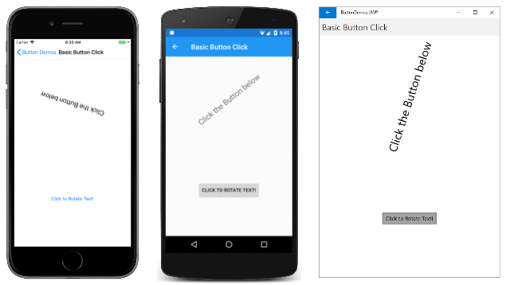
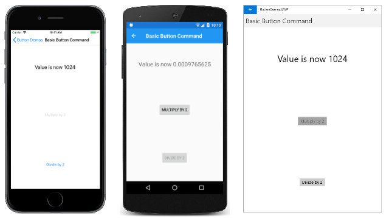
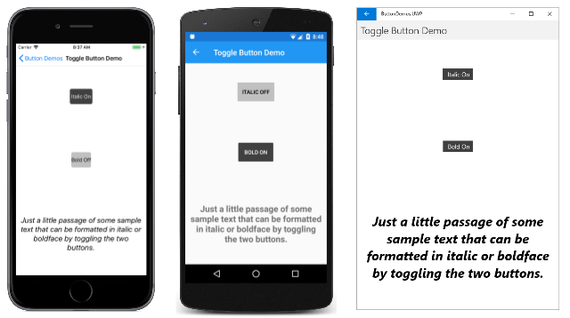
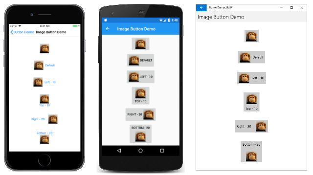

# Xamarin.Forms Button

[ Download the sample](/samples/xamarin/xamarin-forms-samples/userinterface-buttondemos)

_The Button responds to a tap or click that directs an application to carry out a particular task._

The [`Button`](xref:Xamarin.Forms.Button) is the most fundamental interactive control in all of Xamarin.Forms. The `Button` usually displays a short text string indicating a command, but it can also display a bitmap image, or a combination of text and an image. The user presses the `Button` with a finger or clicks it with a mouse to initiate that command.

Most of the topics discussed below correspond to pages in the [**ButtonDemos**](/samples/xamarin/xamarin-forms-samples/userinterface-buttondemos) sample.

## Handling button clicks

`Button` defines a [`Clicked`](xref:Xamarin.Forms.Button.Clicked) event that is fired when the user taps the `Button` with a finger or mouse pointer. The event is fired when the finger or mouse button is released from the surface of the `Button`. The `Button` must have its [`IsEnabled`](xref:Xamarin.Forms.VisualElement.IsEnabled) property set to `true` for it to respond to taps.

The **Basic Button Click** page in the [**ButtonDemos**](/samples/xamarin/xamarin-forms-samples/userinterface-buttondemos) sample demonstrates how to instantiate a `Button` in XAML and handle its `Clicked` event. The **BasicButtonClickPage.xaml** file contains a `StackLayout` with both a `Label` and a `Button`:

```xaml
<ContentPage xmlns="http://xamarin.com/schemas/2014/forms"
             xmlns:x="http://schemas.microsoft.com/winfx/2009/xaml"
             x:Class="ButtonDemos.BasicButtonClickPage"
             Title="Basic Button Click">
    <StackLayout>

        <Label x:Name="label"
               Text="Click the Button below"
               FontSize="Large"
               VerticalOptions="CenterAndExpand"
               HorizontalOptions="Center" />

        <Button Text="Click to Rotate Text!"
                VerticalOptions="CenterAndExpand"
                HorizontalOptions="Center"
                Clicked="OnButtonClicked" />

    </StackLayout>
</ContentPage>
```

The `Button` tends to occupy all the space that's allowed for it. For example, if you don't set the `HorizontalOptions` property of `Button` to something other than `Fill`, the `Button` will occupy the full width of its parent.

By default, the `Button` is rectangular, but you can give it rounded corners by using the [`CornerRadius`](xref:Xamarin.Forms.Button.CornerRadius) property, as described below in the section [**Button appearance**](#button-appearance).

The [`Text`](xref:Xamarin.Forms.Button.Text) property specifies the text that appears in the `Button`. The [`Clicked`](xref:Xamarin.Forms.Button.Clicked) event is set to an event handler named `OnButtonClicked`. This handler is located in the code-behind file, **BasicButtonClickPage.xaml.cs**:

```csharp
public partial class BasicButtonClickPage : ContentPage
{
    public BasicButtonClickPage ()
    {
        InitializeComponent ();
    }

    async void OnButtonClicked(object sender, EventArgs args)
    {
        await label.RelRotateTo(360, 1000);
    }
}
```

When the `Button` is tapped, the `OnButtonClicked` method executes. The `sender` argument is the `Button` object responsible for this event. You can use this to access the `Button` object, or to distinguish between multiple `Button` objects sharing the same `Clicked` event.

This particular `Clicked` handler calls an animation function that rotates the `Label` 360 degrees in 1000 milliseconds. Here's the program running on iOS and Android devices, and as a Universal Windows Platform (UWP) application on the Windows 10 desktop:

[](button-images/BasicButtonClick-Large.png#lightbox "Basic Button Click")

Notice that the `OnButtonClicked` method includes the `async` modifier because `await` is used within the event handler. A `Clicked` event handler requires the `async` modifier only if the body of the handler uses `await`.

Each platform renders the `Button` in its own specific manner. In the [**Button appearance**](#button-appearance) section, you'll see how to set colors and make the `Button` border visible for more customized appearances. `Button` implements the [`IFontElement`](xref:Xamarin.Forms.Internals.IFontElement) interface, so it includes [`FontFamily`](xref:Xamarin.Forms.Button.FontFamily), [`FontSize`](xref:Xamarin.Forms.Button.FontSize), and [`FontAttributes`](xref:Xamarin.Forms.Button.FontAttributes) properties.

## Creating a button in code

It's common to instantiate a `Button` in XAML, but you can also create a `Button` in code. This might be convenient when your application needs to create multiple buttons based on data that is enumerable with a `foreach` loop.

The **Code Button Click** page demonstrates how to create a page that is functionally equivalent to the **Basic Button Click** page but entirely in C#:

```csharp
public class CodeButtonClickPage : ContentPage
{
    public CodeButtonClickPage ()
    {
        Title = "Code Button Click";

        Label label = new Label
        {
            Text = "Click the Button below",
            FontSize = Device.GetNamedSize(NamedSize.Large, typeof(Label)),
            VerticalOptions = LayoutOptions.CenterAndExpand,
            HorizontalOptions = LayoutOptions.Center
        };

        Button button = new Button
        {
            Text = "Click to Rotate Text!",
            VerticalOptions = LayoutOptions.CenterAndExpand,
            HorizontalOptions = LayoutOptions.Center
        };
        button.Clicked += async (sender, args) => await label.RelRotateTo(360, 1000);

        Content = new StackLayout
        {
            Children =
            {
                label,
                button
            }
        };
    }
}
```

Everything is done in the class's constructor. Because the `Clicked` handler is only one statement long, it can be attached to the event very simply:

```csharp
button.Clicked += async (sender, args) => await label.RelRotateTo(360, 1000);
```

Of course, you can also define the event handler as a separate method (just like the `OnButtonClick` method in **Basic Button Click**) and attach that method to the event:

```csharp
button.Clicked += OnButtonClicked;
```

## Disabling the button

Sometimes an application is in a particular state where a particular `Button` click is not a valid operation. In those cases, the `Button` should be disabled by setting its `IsEnabled` property to `false`. The classic example is an `Entry` control for a filename accompanied by a file-open `Button`: The `Button` should be enabled only if some text has been typed into the `Entry`.
You can use a `DataTrigger` for this task, as shown in the [**Data Triggers**](~/xamarin-forms/app-fundamentals/triggers.md#data-triggers) article.

## Using the command interface

It is possible for an application to respond to `Button` taps without handling the `Clicked` event. The `Button` implements an alternative notification mechanism called the _command_ or _commanding_ interface. This consists of two properties:

- [`Command`](xref:Xamarin.Forms.Button.Command) of type [`ICommand`](xref:System.Windows.Input.ICommand), an interface defined in the [`System.Windows.Input`](xref:System.Windows.Input) namespace.
- [`CommandParameter`](xref:Xamarin.Forms.Button.CommandParameter) property of type [`Object`](xref:System.Object).

This approach is particularly suitable in connection with data-binding, and particularly when implementing the Model-View-ViewModel (MVVM) architecture. These topics are discussed in the articles [Data Binding](~/xamarin-forms/app-fundamentals/data-binding/index.md), [From Data Bindings to MVVM](~/xamarin-forms/xaml/xaml-basics/data-bindings-to-mvvm.md), and [MVVM](~/xamarin-forms/enterprise-application-patterns/mvvm.md).

In an MVVM application, the viewmodel defines properties of type `ICommand` that are then connected to the XAML `Button` elements with data bindings. Xamarin.Forms also defines [`Command`](xref:Xamarin.Forms.Command) and [`Command<T>`](xref:Xamarin.Forms.Command`1) classes that implement the `ICommand` interface and assist the viewmodel in defining properties of type `ICommand`.

Commanding is described in greater detail in the article [**The Command Interface**](~/xamarin-forms/app-fundamentals/data-binding/commanding.md) but the **Basic Button Command** page in the [**ButtonDemos**](/samples/xamarin/xamarin-forms-samples/userinterface-buttondemos) sample shows the basic approach.

The `CommandDemoViewModel` class is a very simple viewmodel that defines a property of type `double` named `Number`, and two properties of type `ICommand` named `MultiplyBy2Command` and `DivideBy2Command`:

```csharp
class CommandDemoViewModel : INotifyPropertyChanged
{
    double number = 1;

    public event PropertyChangedEventHandler PropertyChanged;

    public CommandDemoViewModel()
    {
        MultiplyBy2Command = new Command(() => Number *= 2);

        DivideBy2Command = new Command(() => Number /= 2);
    }

    public double Number
    {
        set
        {
            if (number != value)
            {
                number = value;
                PropertyChanged?.Invoke(this, new PropertyChangedEventArgs("Number"));
            }
        }
        get
        {
            return number;
        }
    }

    public ICommand MultiplyBy2Command { private set; get; }

    public ICommand DivideBy2Command { private set; get; }
}
```

The two `ICommand` properties are initialized in the class's constructor with two objects of type `Command`. The `Command` constructors include a little function (called the `execute` constructor argument) that either doubles or halves the `Number` property.

The **BasicButtonCommand.xaml** file sets its `BindingContext` to an instance of `CommandDemoViewModel`. The `Label` element and two `Button` elements contain bindings to the three properties in `CommandDemoViewModel`:

```xaml
<ContentPage xmlns="http://xamarin.com/schemas/2014/forms"
             xmlns:x="http://schemas.microsoft.com/winfx/2009/xaml"
             xmlns:local="clr-namespace:ButtonDemos"
             x:Class="ButtonDemos.BasicButtonCommandPage"
             Title="Basic Button Command">

    <ContentPage.BindingContext>
        <local:CommandDemoViewModel />
    </ContentPage.BindingContext>

    <StackLayout>
        <Label Text="{Binding Number, StringFormat='Value is now {0}'}"
               FontSize="Large"
               VerticalOptions="CenterAndExpand"
               HorizontalOptions="Center" />

        <Button Text="Multiply by 2"
                VerticalOptions="CenterAndExpand"
                HorizontalOptions="Center"
                Command="{Binding MultiplyBy2Command}" />

        <Button Text="Divide by 2"
                VerticalOptions="CenterAndExpand"
                HorizontalOptions="Center"
                Command="{Binding DivideBy2Command}" />
    </StackLayout>
</ContentPage>
```

As the two `Button` elements are tapped, the commands are executed, and the number changes value:

[](button-images/BasicButtonCommand-Large.png#lightbox)

The advantage of this approach over `Clicked` handlers is that all the logic involving the functionality of this page is located in the viewmodel rather than the code-behind file, achieving a better separation of the user interface from the business logic.

It is also possible for the `Command` objects to control the enabling and disabling of the `Button` elements. For example, suppose you want to limit the range of number values between 2<sup>10</sup> and 2<sup>&ndash;10</sup>. You can add another  function to the constructor (called the `canExecute` argument) that returns `true` if the `Button` should be enabled. Here's the modification to the `CommandDemoViewModel` constructor:

```csharp
class CommandDemoViewModel : INotifyPropertyChanged
{
    ···
    public CommandDemoViewModel()
    {
        MultiplyBy2Command = new Command(
            execute: () =>
            {
                Number *= 2;
                ((Command)MultiplyBy2Command).ChangeCanExecute();
                ((Command)DivideBy2Command).ChangeCanExecute();
            },
            canExecute: () => Number < Math.Pow(2, 10));

        DivideBy2Command = new Command(
            execute: () =>
            {
                Number /= 2;
                ((Command)MultiplyBy2Command).ChangeCanExecute();
                ((Command)DivideBy2Command).ChangeCanExecute();
            },
            canExecute: () => Number > Math.Pow(2, -10));
    }
    ···
}
```

The calls to the `ChangeCanExecute` method of `Command` are necessary so that the `Command` method can call the `canExecute` method and determine whether the `Button` should be disabled or not. With this code change, as the number reaches the limit, the `Button` is disabled:

[](button-images/BasicButtonCommandModified-Large.png#lightbox)

It is possible for two or more `Button` elements to be bound to the same `ICommand` property. The `Button` elements can be distinguished using the [`CommandParameter`](xref:Xamarin.Forms.Button.CommandParameter) property of `Button`. In this case, you'll want to use the generic [`Command<T>`](xref:Xamarin.Forms.Command`1) class. The `CommandParameter` object is then passed as an argument to the `execute` and `canExecute` methods. This technique is shown in detail in the [**Basic Commanding**](~/xamarin-forms/app-fundamentals/data-binding/commanding.md#basic-commanding) section of the [**Command Interface**](~/xamarin-forms/app-fundamentals/data-binding/commanding.md#basic-commanding) article.

The [**ButtonDemos**](/samples/xamarin/xamarin-forms-samples/userinterface-buttondemos) sample also uses this technique in its `MainPage` class. The **MainPage.xaml** file contains a `Button` for each page of the sample:

```xaml
<ContentPage xmlns="http://xamarin.com/schemas/2014/forms"
             xmlns:x="http://schemas.microsoft.com/winfx/2009/xaml"
             xmlns:local="clr-namespace:ButtonDemos"
             x:Class="ButtonDemos.MainPage"
             Title="Button Demos">
    <ScrollView>
        <FlexLayout Direction="Column"
                    JustifyContent="SpaceEvenly"
                    AlignItems="Center">

            <Button Text="Basic Button Click"
                    Command="{Binding NavigateCommand}"
                    CommandParameter="{x:Type local:BasicButtonClickPage}" />

            <Button Text="Code Button Click"
                    Command="{Binding NavigateCommand}"
                    CommandParameter="{x:Type local:CodeButtonClickPage}" />

            <Button Text="Basic Button Command"
                    Command="{Binding NavigateCommand}"
                    CommandParameter="{x:Type local:BasicButtonCommandPage}" />

            <Button Text="Press and Release Button"
                    Command="{Binding NavigateCommand}"
                    CommandParameter="{x:Type local:PressAndReleaseButtonPage}" />

            <Button Text="Button Appearance"
                    Command="{Binding NavigateCommand}"
                    CommandParameter="{x:Type local:ButtonAppearancePage}" />

            <Button Text="Toggle Button Demo"
                    Command="{Binding NavigateCommand}"
                    CommandParameter="{x:Type local:ToggleButtonDemoPage}" />

            <Button Text="Image Button Demo"
                    Command="{Binding NavigateCommand}"
                    CommandParameter="{x:Type local:ImageButtonDemoPage}" />

        </FlexLayout>
    </ScrollView>
</ContentPage>
```

Each `Button` has its `Command` property bound to a property named `NavigateCommand`, and the `CommandParameter` is set to a [`Type`](xref:System.Type) object corresponding to one of the page classes in the project.

That `NavigateCommand` property is of type `ICommand` and is defined in the code-behind file:

```csharp
public partial class MainPage : ContentPage
{
    public MainPage()
    {
        InitializeComponent();

        NavigateCommand = new Command<Type>(async (Type pageType) =>
        {
            Page page = (Page)Activator.CreateInstance(pageType);
            await Navigation.PushAsync(page);
        });

        BindingContext = this;
    }

    public ICommand NavigateCommand { private set; get; }
}
```

The constructor initializes the `NavigateCommand` property to a `Command<Type>` object because `Type` is the type of the `CommandParameter` object set in the XAML file. This means that the `execute` method has an argument of type `Type` that corresponds to this `CommandParameter` object. The function instantiates the page and then navigates to it.

Notice that the constructor concludes by setting its `BindingContext` to itself. This is necessary for properties in the XAML file to bind to the `NavigateCommand` property.

## Pressing and releasing the button

Besides the `Clicked` event, `Button` also defines [`Pressed`](xref:Xamarin.Forms.Button.Pressed) and [`Released`](xref:Xamarin.Forms.Button.Released) events. The `Pressed` event occurs when a finger presses on a `Button`, or a mouse button is pressed with the pointer positioned over the `Button`. The `Released` event occurs when the finger or mouse button is released. Generally, a `Clicked` event is also fired at the same time as the `Released` event, but if the finger or mouse pointer slides away from the surface of the `Button` before being released, the `Clicked` event might not occur.

The `Pressed` and `Released` events are not often used, but they can be used for special purposes, as demonstrated in the **Press and Release Button** page. The XAML file contains a `Label` and a `Button` with handlers attached for the `Pressed` and `Released` events:

```xaml
<ContentPage xmlns="http://xamarin.com/schemas/2014/forms"
             xmlns:x="http://schemas.microsoft.com/winfx/2009/xaml"
             x:Class="ButtonDemos.PressAndReleaseButtonPage"
             Title="Press and Release Button">
    <StackLayout>

        <Label x:Name="label"
               Text="Press and hold the Button below"
               FontSize="Large"
               VerticalOptions="CenterAndExpand"
               HorizontalOptions="Center" />

        <Button Text="Press to Rotate Text!"
                VerticalOptions="CenterAndExpand"
                HorizontalOptions="Center"
                Pressed="OnButtonPressed"
                Released="OnButtonReleased" />

    </StackLayout>
</ContentPage>
```

The code-behind file animates the `Label` when a `Pressed` event occurs, but suspends the rotation when a `Released` event occurs:

```csharp
public partial class PressAndReleaseButtonPage : ContentPage
{
    bool animationInProgress = false;
    Stopwatch stopwatch = new Stopwatch();

    public PressAndReleaseButtonPage ()
    {
        InitializeComponent ();
    }

    void OnButtonPressed(object sender, EventArgs args)
    {
        stopwatch.Start();
        animationInProgress = true;

        Device.StartTimer(TimeSpan.FromMilliseconds(16), () =>
        {
            label.Rotation = 360 * (stopwatch.Elapsed.TotalSeconds % 1);

            return animationInProgress;
        });
    }

    void OnButtonReleased(object sender, EventArgs args)
    {
        animationInProgress = false;
        stopwatch.Stop();
    }
}
```

The result is that the `Label` only rotates while a finger is in contact with the `Button`, and stops when the finger is released:

[](button-images/PressAndReleaseButton-Large.png)

This kind of behavior has applications for games: A finger held on a `Button` might make an on-screen object move in a particular direction.

## Button appearance

The `Button` inherits or defines several properties that affect its appearance:

- [`TextColor`](xref:Xamarin.Forms.Button.TextColor) is the color of the `Button` text
- [`BackgroundColor`](xref:Xamarin.Forms.VisualElement.BackgroundColor) is the color of the background to that text
- [`BorderColor`](xref:Xamarin.Forms.Button.BorderColor) is the color of an area surrounding the `Button`
- [`FontFamily`](xref:Xamarin.Forms.Button.FontFamily) is the font family used for the text
- [`FontSize`](xref:Xamarin.Forms.Button.FontSize) is the size of the text
- [`FontAttributes`](xref:Xamarin.Forms.Button.FontAttributes) indicates if the text is italic or bold
- [`BorderWidth`](xref:Xamarin.Forms.Button.BorderWidth) is the width of the border
- [`CornerRadius`](xref:Xamarin.Forms.Button.CornerRadius) is the corner radius of the `Button`
- [`CharacterSpacing`](xref:Xamarin.Forms.Button.CharacterSpacing) is the spacing between characters of the `Button` text.
- `TextTransform` determines the casing of the `Button` text.

> [!NOTE]
> The `Button` class also has [`Margin`](xref:Xamarin.Forms.View.Margin) and [`Padding`](xref:Xamarin.Forms.Button.Padding) properties that control the layout behavior of the `Button`. For more information, see [Margin and Padding](~/xamarin-forms/user-interface/layouts/margin-and-padding.md).

The effects of six of these properties (excluding `FontFamily` and `FontAttributes`) are demonstrated in the **Button Appearance** page. Another property, [`Image`](xref:Xamarin.Forms.Button.ImageSource), is discussed in the section [**Using bitmaps with button**](#using-bitmaps-with-buttons).

All of the views and data bindings in the **Button Appearance** page are defined in the XAML file:

```xaml
<ContentPage xmlns="http://xamarin.com/schemas/2014/forms"
             xmlns:x="http://schemas.microsoft.com/winfx/2009/xaml"
             xmlns:local="clr-namespace:ButtonDemos"
             x:Class="ButtonDemos.ButtonAppearancePage"
             Title="Button Appearance">
    <StackLayout>
        <Button x:Name="button"
                Text="Button"
                VerticalOptions="CenterAndExpand"
                HorizontalOptions="Center"
                TextColor="{Binding Source={x:Reference textColorPicker},
                                    Path=SelectedItem.Color}"
                BackgroundColor="{Binding Source={x:Reference backgroundColorPicker},
                                          Path=SelectedItem.Color}"
                BorderColor="{Binding Source={x:Reference borderColorPicker},
                                      Path=SelectedItem.Color}" />

        <StackLayout BindingContext="{x:Reference button}"
                     Padding="10">

            <Slider x:Name="fontSizeSlider"
                    Maximum="48"
                    Minimum="1"
                    Value="{Binding FontSize}" />

            <Label Text="{Binding Source={x:Reference fontSizeSlider},
                                  Path=Value,
                                  StringFormat='FontSize = {0:F0}'}"
                   HorizontalTextAlignment="Center" />

            <Slider x:Name="borderWidthSlider"
                    Minimum="-1"
                    Maximum="12"
                    Value="{Binding BorderWidth}" />

            <Label Text="{Binding Source={x:Reference borderWidthSlider},
                                  Path=Value,
                                  StringFormat='BorderWidth = {0:F0}'}"
                   HorizontalTextAlignment="Center" />

            <Slider x:Name="cornerRadiusSlider"
                    Minimum="-1"
                    Maximum="24"
                    Value="{Binding CornerRadius}" />

            <Label Text="{Binding Source={x:Reference cornerRadiusSlider},
                                  Path=Value,
                                  StringFormat='CornerRadius = {0:F0}'}"
                   HorizontalTextAlignment="Center" />

            <Grid>
                <Grid.RowDefinitions>
                    <RowDefinition Height="Auto" />
                    <RowDefinition Height="Auto" />
                    <RowDefinition Height="Auto" />
                </Grid.RowDefinitions>

                <Grid.ColumnDefinitions>
                    <ColumnDefinition Width="*" />
                    <ColumnDefinition Width="*" />
                </Grid.ColumnDefinitions>

                <Grid.Resources>
                    <Style TargetType="Label">
                        <Setter Property="VerticalOptions" Value="Center" />
                    </Style>
                </Grid.Resources>

                <Label Text="Text Color:"
                       Grid.Row="0" Grid.Column="0" />

                <Picker x:Name="textColorPicker"
                        ItemsSource="{Binding Source={x:Static local:NamedColor.All}}"
                        ItemDisplayBinding="{Binding FriendlyName}"
                        SelectedIndex="0"
                        Grid.Row="0" Grid.Column="1" />

                <Label Text="Background Color:"
                       Grid.Row="1" Grid.Column="0" />

                <Picker x:Name="backgroundColorPicker"
                        ItemsSource="{Binding Source={x:Static local:NamedColor.All}}"
                        ItemDisplayBinding="{Binding FriendlyName}"
                        SelectedIndex="0"
                        Grid.Row="1" Grid.Column="1" />

                <Label Text="Border Color:"
                       Grid.Row="2" Grid.Column="0" />

                <Picker x:Name="borderColorPicker"
                        ItemsSource="{Binding Source={x:Static local:NamedColor.All}}"
                        ItemDisplayBinding="{Binding FriendlyName}"
                        SelectedIndex="0"
                        Grid.Row="2" Grid.Column="1" />
            </Grid>
        </StackLayout>
    </StackLayout>
</ContentPage>
```

The `Button` at the top of the page has its three `Color` properties bound to `Picker` elements at the bottom of the page. The items in the `Picker` elements are colors from the `NamedColor` class included in the project. Three `Slider` elements contain two-way bindings to the `FontSize`, `BorderWidth`, and `CornerRadius` properties of the `Button`.

This program allows you to experiment with combinations of all these properties:

[](button-images/ButtonAppearance-Large.png)

To see the `Button` border, you'll need to set a `BorderColor` to something other than `Default`, and the `BorderWidth` to a positive value.

On iOS, you'll notice that large border widths intrude into the interior of the `Button` and interfere with the display of text. If you choose to use a border with an iOS `Button`, you'll probably want to begin and end the `Text` property with spaces to retain its visibility.

On UWP, selecting a `CornerRadius` that exceeds half the height of the `Button` raises an exception.

## Button visual states

[`Button`](xref:Xamarin.Forms.Button) has a `Pressed` [`VisualState`](xref:Xamarin.Forms.VisualState) that can be used to initiate a visual change to the `Button` when pressed by the user, provided that it's enabled.

The following XAML example shows how to define a visual state for the `Pressed` state:

```xaml
<Button Text="Click me!"
        ...>
    <VisualStateManager.VisualStateGroups>
        <VisualStateGroup x:Name="CommonStates">
            <VisualState x:Name="Normal">
                <VisualState.Setters>
                    <Setter Property="Scale"
                            Value="1" />
                </VisualState.Setters>
            </VisualState>

            <VisualState x:Name="Pressed">
                <VisualState.Setters>
                    <Setter Property="Scale"
                            Value="0.8" />
                </VisualState.Setters>
            </VisualState>

        </VisualStateGroup>
    </VisualStateManager.VisualStateGroups>
</Button>
```

The `Pressed` [`VisualState`](xref:Xamarin.Forms.VisualState) specifies that when the [`Button`](xref:Xamarin.Forms.Button) is pressed, its [`Scale`](xref:Xamarin.Forms.VisualElement.Scale) property will be changed from its default value of 1 to 0.8. The `Normal` `VisualState` specifies that when the `Button` is in a normal state, its `Scale` property will be set to 1. Therefore, the overall effect is that when the `Button` is pressed, it's rescaled to be slightly smaller, and when the `Button` is released, it's rescaled to its default size.

For more information about visual states, see [The Xamarin.Forms Visual State Manager](~/xamarin-forms/user-interface/visual-state-manager.md).

## Creating a toggle button

It is possible to subclass `Button` so that it works like an on-off switch: Tap the button once to toggle the button on and tap it
again to toggle it off.

The following `ToggleButton` class derives from `Button` and defines a new event named `Toggled` and a Boolean property named `IsToggled`. These are the same two properties defined by the Xamarin.Forms [`Switch`](xref:Xamarin.Forms.Switch):

```csharp
class ToggleButton : Button
{
    public event EventHandler<ToggledEventArgs> Toggled;

    public static BindableProperty IsToggledProperty =
        BindableProperty.Create("IsToggled", typeof(bool), typeof(ToggleButton), false,
                                propertyChanged: OnIsToggledChanged);

    public ToggleButton()
    {
        Clicked += (sender, args) => IsToggled ^= true;
    }

    public bool IsToggled
    {
        set { SetValue(IsToggledProperty, value); }
        get { return (bool)GetValue(IsToggledProperty); }
    }

    protected override void OnParentSet()
    {
        base.OnParentSet();
        VisualStateManager.GoToState(this, "ToggledOff");
    }

    static void OnIsToggledChanged(BindableObject bindable, object oldValue, object newValue)
    {
        ToggleButton toggleButton = (ToggleButton)bindable;
        bool isToggled = (bool)newValue;

        // Fire event
        toggleButton.Toggled?.Invoke(toggleButton, new ToggledEventArgs(isToggled));

        // Set the visual state
        VisualStateManager.GoToState(toggleButton, isToggled ? "ToggledOn" : "ToggledOff");
    }
}
```

The `ToggleButton` constructor attaches a handler to the `Clicked` event so that it can change the value of the `IsToggled` property. The `OnIsToggledChanged` method fires the `Toggled` event.

The last line of the `OnIsToggledChanged` method calls the static `VisualStateManager.GoToState` method with the two text strings "ToggledOn" and "ToggledOff". You can read about this method and how your application can respond to visual states in the article [**The Xamarin.Forms Visual State Manager**](~/xamarin-forms/user-interface/visual-state-manager.md).

Because `ToggleButton` makes the call to `VisualStateManager.GoToState`, the class itself doesn't need to include any additional facilities to change the button's appearance based on its `IsToggled` state. That is the responsibility of the XAML that hosts the `ToggleButton`.

The **Toggle Button Demo** page contains two instances of `ToggleButton`, including Visual State Manager markup that sets the `Text`, `BackgroundColor`, and `TextColor` of the button based on the visual state:

```xaml
<?xml version="1.0" encoding="utf-8" ?>
<ContentPage xmlns="http://xamarin.com/schemas/2014/forms"
             xmlns:x="http://schemas.microsoft.com/winfx/2009/xaml"
             xmlns:local="clr-namespace:ButtonDemos"
             x:Class="ButtonDemos.ToggleButtonDemoPage"
             Title="Toggle Button Demo">

    <ContentPage.Resources>
        <Style TargetType="local:ToggleButton">
            <Setter Property="VerticalOptions" Value="CenterAndExpand" />
            <Setter Property="HorizontalOptions" Value="Center" />
        </Style>
    </ContentPage.Resources>

    <StackLayout Padding="10, 0">
        <local:ToggleButton Toggled="OnItalicButtonToggled">
            <VisualStateManager.VisualStateGroups>
                <VisualStateGroup Name="ToggleStates">
                    <VisualState Name="ToggledOff">
                        <VisualState.Setters>
                            <Setter Property="Text" Value="Italic Off" />
                            <Setter Property="BackgroundColor" Value="#C0C0C0" />
                            <Setter Property="TextColor" Value="Black" />
                        </VisualState.Setters>
                    </VisualState>

                    <VisualState Name="ToggledOn">
                        <VisualState.Setters>
                            <Setter Property="Text" Value=" Italic On " />
                            <Setter Property="BackgroundColor" Value="#404040" />
                            <Setter Property="TextColor" Value="White" />
                        </VisualState.Setters>
                    </VisualState>
                </VisualStateGroup>
            </VisualStateManager.VisualStateGroups>
        </local:ToggleButton>

        <local:ToggleButton Toggled="OnBoldButtonToggled">
            <VisualStateManager.VisualStateGroups>
                <VisualStateGroup Name="ToggleStates">
                    <VisualState Name="ToggledOff">
                        <VisualState.Setters>
                            <Setter Property="Text" Value="Bold Off" />
                            <Setter Property="BackgroundColor" Value="#C0C0C0" />
                            <Setter Property="TextColor" Value="Black" />
                        </VisualState.Setters>
                    </VisualState>

                    <VisualState Name="ToggledOn">
                        <VisualState.Setters>
                            <Setter Property="Text" Value=" Bold On " />
                            <Setter Property="BackgroundColor" Value="#404040" />
                            <Setter Property="TextColor" Value="White" />
                        </VisualState.Setters>
                    </VisualState>
                </VisualStateGroup>
            </VisualStateManager.VisualStateGroups>
        </local:ToggleButton>

        <Label x:Name="label"
               Text="Just a little passage of some sample text that can be formatted in italic or boldface by toggling the two buttons."
               FontSize="Large"
               HorizontalTextAlignment="Center"
               VerticalOptions="CenterAndExpand" />

    </StackLayout>
</ContentPage>
```

The `Toggled` event handlers are in the code-behind file. They are responsible for setting the `FontAttributes` property of the `Label` based on the state of the buttons:

```csharp
public partial class ToggleButtonDemoPage : ContentPage
{
    public ToggleButtonDemoPage ()
    {
        InitializeComponent ();
    }

    void OnItalicButtonToggled(object sender, ToggledEventArgs args)
    {
        if (args.Value)
        {
            label.FontAttributes |= FontAttributes.Italic;
        }
        else
        {
            label.FontAttributes &= ~FontAttributes.Italic;
        }
    }

    void OnBoldButtonToggled(object sender, ToggledEventArgs args)
    {
        if (args.Value)
        {
            label.FontAttributes |= FontAttributes.Bold;
        }
        else
        {
            label.FontAttributes &= ~FontAttributes.Bold;
        }
    }
}
```

Here's the program running on iOS, Android, and the UWP:

[](button-images/ToggleButtonDemo-Large.png#lightbox)

## Using bitmaps with buttons

The `Button` class defines an [`ImageSource`](xref:Xamarin.Forms.Button.Image) property that allows you to display a bitmap image on the `Button`, either alone or in combination with text. You can also specify how the text and image are arranged.

The `ImageSource` property is of type [`ImageSource`](xref:Xamarin.Forms.ImageSource), which means that the bitmaps can be loaded from a file, embedded resource, URI, or stream.

> [!NOTE]
> While a `Button` can load an animated GIF, it will only display the first frame of the GIF.

Each platform supported by Xamarin.Forms allows images to be stored in multiple sizes for different pixel resolutions of the various devices that the application might run on. These multiple bitmaps are named or stored in such a way that the operating system can pick the best match for the device's video display resolution.

For a bitmap on a `Button`, the best size is usually between 32 and 64 device-independent units, depending on how large you want it to be. The images used in this example are based on a size of 48 device-independent units.

In the iOS project, the **Resources** folder contains three sizes of this image:

- A 48-pixel square bitmap stored as **/Resources/MonkeyFace.png**
- A 96-pixel square bitmap stored as **/Resource/MonkeyFace@2x.png**
- A 144-pixel square bitmap stored as **/Resource/MonkeyFace@3x.png**

All three bitmaps were given a **Build Action** of **BundleResource**.

For the Android project, the bitmaps all have the same name, but they are stored in different subfolders of the **Resources** folder:

- A 72-pixel square bitmap stored as **/Resources/drawable-hdpi/MonkeyFace.png**
- A 96-pixel square bitmap stored as **/Resources/drawable-xhdpi/MonkeyFace.png**
- A 144-pixel square bitmap stored as **/Resources/drawable-xxhdpi/MonkeyFace.png**
- A 192-pixel square bitmap stored as **/Resources/drawable-xxxhdpi/MonkeyFace.png**

These were given a **Build Action** of **AndroidResource**.

In the UWP project, bitmaps can be stored anywhere in the project, but they are generally stored in a custom folder or the **Assets** existing folder. The UWP project contains these bitmaps:

- A 48-pixel square bitmap stored as **/Assets/MonkeyFace.scale-100.png**
- A 96-pixel square bitmap stored as **/Assets/MonkeyFace.scale-200.png**
- A 192-pixel square bitmap stored as **/Assets/MonkeyFace.scale-400.png**

They were all given a **Build Action** of **Content**.

You can specify how the `Text` and `ImageSource` properties are arranged on the `Button` using the [`ContentLayout`](xref:Xamarin.Forms.Button.ContentLayout) property of `Button`. This property is of type [`ButtonContentLayout`](xref:Xamarin.Forms.Button.ButtonContentLayout), which is an embedded class in `Button`. The [constructor](xref:Xamarin.Forms.Button.ButtonContentLayout.%23ctor(Xamarin.Forms.Button.ButtonContentLayout.ImagePosition,System.Double)) has two arguments:

- A member of the [`ImagePosition`](xref:Xamarin.Forms.Button.ButtonContentLayout.ImagePosition) enumeration: `Left`, `Top`, `Right`, or `Bottom` indicating how the bitmap appears relative to the text.
- A `double` value for the spacing between the bitmap and the text.

The defaults are `Left` and 10 units. Two read-only properties of `ButtonContentLayout` named [`Position`](xref:Xamarin.Forms.Button.ButtonContentLayout.Position) and [`Spacing`](xref:Xamarin.Forms.Button.ButtonContentLayout.Spacing) provide the values of those properties.

In code, you can create a `Button` and set the `ContentLayout` property like this:

```csharp
Button button = new Button
{
    Text = "button text",
    ImageSource = new FileImageSource
    {
        File = "image filename"
    },
    ContentLayout = new Button.ButtonContentLayout(Button.ButtonContentLayout.ImagePosition.Right, 20)
};
```

In XAML, you need specify only the enumeration member, or the spacing, or both in any order separated by commas:

```xaml
<Button Text="button text"
        ImageSource="image filename"
        ContentLayout="Right, 20" />
```

The **Image Button Demo** page uses `OnPlatform` to specify different filenames for the iOS, Android, and UWP bitmap files. If you want to use the same filename for each platform and avoid the use of `OnPlatform`, you'll need to store the UWP bitmaps in the root directory of the project.

The first `Button` on the **Image Button Demo** page sets the `Image` property but not the `Text` property:

```xaml
<Button>
    <Button.ImageSource>
        <OnPlatform x:TypeArguments="ImageSource">
            <On Platform="iOS, Android" Value="MonkeyFace.png" />
            <On Platform="UWP" Value="Assets/MonkeyFace.png" />
        </OnPlatform>
    </Button.ImageSource>
</Button>
```

If the UWP bitmaps are stored in the root directory of the project, this markup can be considerably simplified:

```xaml
<Button ImageSource="MonkeyFace.png" />
```

To avoid a lot of repetitious markup in the **ImageButtonDemo.xaml** file, an implicit `Style` is also defined to set the `ImageSource` property. This `Style` is automatically applied to five other `Button` elements. Here's the complete XAML file:

```xaml
<ContentPage xmlns="http://xamarin.com/schemas/2014/forms"
             xmlns:x="http://schemas.microsoft.com/winfx/2009/xaml"
             x:Class="ButtonDemos.ImageButtonDemoPage">

    <FlexLayout Direction="Column"
                JustifyContent="SpaceEvenly"
                AlignItems="Center">

        <FlexLayout.Resources>
            <Style TargetType="Button">
                <Setter Property="ImageSource">
                    <OnPlatform x:TypeArguments="ImageSource">
                        <On Platform="iOS, Android" Value="MonkeyFace.png" />
                        <On Platform="UWP" Value="Assets/MonkeyFace.png" />
                    </OnPlatform>
                </Setter>
            </Style>
        </FlexLayout.Resources>

        <Button>
            <Button.ImageSource>
                <OnPlatform x:TypeArguments="ImageSource">
                    <On Platform="iOS, Android" Value="MonkeyFace.png" />
                    <On Platform="UWP" Value="Assets/MonkeyFace.png" />
                </OnPlatform>
            </Button.ImageSource>
        </Button>

        <Button Text="Default" />

        <Button Text="Left - 10"
                ContentLayout="Left, 10" />

        <Button Text="Top - 10"
                ContentLayout="Top, 10" />

        <Button Text="Right - 20"
                ContentLayout="Right, 20" />

        <Button Text="Bottom - 20"
                ContentLayout="Bottom, 20" />
    </FlexLayout>
</ContentPage>
```

The final four `Button` elements make use of the `ContentLayout` property to specify a position and spacing of the text and bitmap:

[](button-images/ImageButtonDemo-Large.png#lightbox)

You've now seen the various ways that you can handle `Button` events and change the `Button` appearance.

## Related links

- [ButtonDemos sample](/samples/xamarin/xamarin-forms-samples/userinterface-buttondemos)
- [Button API](xref:Xamarin.Forms.Button)