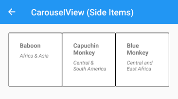
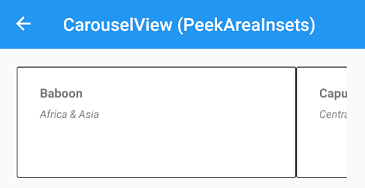

# Xamarin.Forms CarouselView Layouts


[ Download the sample](https://github.com/xamarin/xamarin-forms-samples/tree/master/UserInterface/CarouselViewDemos/)

## Introduction

Much of the layout functionality available to CarouselView originates from CollectionView. You can refer to the CollectionView's [Layout documentation](../collectionview/layout.md) to see the use of various layouts.

## Differences from CollectionView

By default, items in a CarouselView will be oriented horizontally, as is the typical function of a carousel in apps.

CarouselView also provides some additional properties:

> [!IMPORTANT]
> Additional properties for CarouselView are still under development and this list is not yet complete.

| API | Function |
|---|---|---|
| NumberOfSideItems | Sets the number of items which appear to each side of the current item. Defaults to 0.
| PeekAreaInsets | Provides a way to visibly indicate to the user that the CarouselView has additional items to scroll to by adjusting their level of visibility adjacent the current item.

## Setting the number of fully visible items

By default, the CarouselView displays one item in its entirety on the screen. Users can set the `NumberOfSideItems` property to allow for more items to display adjacent to the current item. Note that any value set to `PeekAreaInsets` will still apply.

```xaml
<StackLayout Margin="20">
    <CarouselView ItemsSource="{Binding Monkeys}" HeightRequest="125" NumberOfSideItems="1">
        <CarouselView.ItemTemplate>
            <DataTemplate>
                <Frame BorderColor="Black">
                    <Grid>
                        <Grid.RowDefinitions>
                            <RowDefinition Height="Auto" />
                            <RowDefinition Height="Auto" />
                        </Grid.RowDefinitions>
                        <Grid.ColumnDefinitions>
                            <ColumnDefinition Width="Auto" />
                            <ColumnDefinition Width="Auto" />
                        </Grid.ColumnDefinitions>
                        <Label Grid.Column="1"
                            Text="{Binding Name}"
                            FontAttributes="Bold"
                            FontSize="14"/>
                        <Label Grid.Row="1"
                            Grid.Column="1"
                            Text="{Binding Location}"
                            FontAttributes="Italic"
                            FontSize="12"
                            VerticalOptions="End" />
                    </Grid>
                </Frame>
            </DataTemplate>
        </CarouselView.ItemTemplate>
    </CarouselView>
</StackLayout>
```

[](carouselview-images/side-items-large.png#lightbox "CarouselView side items")

## Making adjacent items partially visible

When using a CarouselView in your app, it can be helpful to indicate to the user that the CarouselView functions in such a manner by setting the `PeekAreaInsets` property to a non-zero value (the default), which partially exposes them on the screen.

```xaml
<StackLayout Margin="20">
  <CarouselView ItemsSource="{Binding Monkeys}" HeightRequest="125" PeekAreaInsets="100">
      <CarouselView.ItemTemplate>
          <DataTemplate>
              <Frame BorderColor="Black">
                  <Grid>
                      <Grid.RowDefinitions>
                          <RowDefinition Height="Auto" />
                          <RowDefinition Height="Auto" />
                      </Grid.RowDefinitions>
                      <Grid.ColumnDefinitions>
                          <ColumnDefinition Width="Auto" />
                          <ColumnDefinition Width="Auto" />
                      </Grid.ColumnDefinitions>
                      <Label Grid.Column="1"
                          Text="{Binding Name}"
                          FontAttributes="Bold"
                          FontSize="14"/>
                      <Label Grid.Row="1"
                          Grid.Column="1"
                          Text="{Binding Location}"
                          FontAttributes="Italic"
                          FontSize="12"
                          VerticalOptions="End" />
                  </Grid>
              </Frame>
          </DataTemplate>
      </CarouselView.ItemTemplate>
  </CarouselView>
</StackLayout>
```

[](carouselview-images/peek-area-insets-large.png#lightbox "CarouselView side items")

## Related links

- [CollectionView (sample)](https://github.com/xamarin/xamarin-forms-samples/tree/master/UserInterface/CarouselViewDemos/)
- [CollectionView layout documentation](../collectionview/layout.md)
