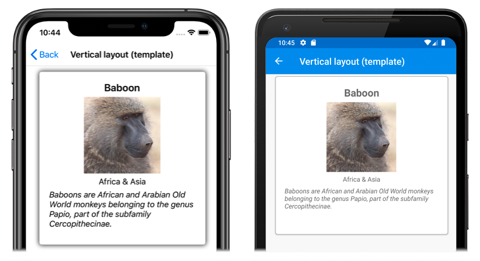

# Xamarin.Forms CarouselView Layout

[ Download the sample](/samples/xamarin/xamarin-forms-samples/userinterface-carouselviewdemos/)

[`CarouselView`](xref:Xamarin.Forms.CarouselView) defines the following properties that control layout:

- [`ItemsLayout`](xref:Xamarin.Forms.ItemsLayout), of type `LinearItemsLayout`, specifies the layout to be used.
- `PeekAreaInsets`, of type [`Thickness`](xref:Xamarin.Forms.Thickness), specifies how much to make adjacent items partially visible by.

These properties are backed by [`BindableProperty`](xref:Xamarin.Forms.BindableProperty) objects, which means that the properties can be targets of data bindings.

By default, a [`CarouselView`](xref:Xamarin.Forms.CarouselView) will display its items in a horizontal orientation. A single item will be displayed on screen, with swipe gestures resulting in forwards and backwards navigation through the collection of items. However, a vertical orientation is also possible. This is because the [`ItemsLayout`](xref:Xamarin.Forms.ItemsLayout) property is of type `LinearItemsLayout`, which inherits from the [`ItemsLayout`](xref:Xamarin.Forms.ItemsLayout) class. The `ItemsLayout` class defines the following properties:

- [`Orientation`](xref:Xamarin.Forms.ItemsLayout.Orientation), of type [`ItemsLayoutOrientation`](xref:Xamarin.Forms.ItemsLayoutOrientation), specifies the direction in which the [`CarouselView`](xref:Xamarin.Forms.CarouselView) expands as items are added.
- [`SnapPointsAlignment`](xref:Xamarin.Forms.ItemsLayout.SnapPointsAlignment), of type [`SnapPointsAlignment`](xref:Xamarin.Forms.SnapPointsAlignment), specifies how snap points are aligned with items.
- [`SnapPointsType`](xref:Xamarin.Forms.ItemsLayout.SnapPointsType), of type [`SnapPointsType`](xref:Xamarin.Forms.SnapPointsType), specifies the behavior of snap points when scrolling.

These properties are backed by [`BindableProperty`](xref:Xamarin.Forms.BindableProperty) objects, which means that the properties can be targets of data bindings. For more information about snap points, see [Snap points](scrolling.md#snap-points) in the [Xamarin.Forms CollectionView Scrolling](scrolling.md) guide.

The [`ItemsLayoutOrientation`](xref:Xamarin.Forms.ItemsLayoutOrientation) enumeration defines the following members:

- `Vertical` indicates that the [`CarouselView`](xref:Xamarin.Forms.CarouselView) will expand vertically as items are added.
- `Horizontal` indicates that the [`CarouselView`](xref:Xamarin.Forms.CarouselView) will expand horizontally as items are added.

The `LinearItemsLayout` class inherits from the [`ItemsLayout`](xref:Xamarin.Forms.ItemsLayout) class, and defines an `ItemSpacing` property, of type `double`, that represents the empty space around each item. The default value of this property is 0, and its value must always be greater than or equal to 0. The `LinearItemsLayout` class also defines static `Vertical` and `Horizontal` members. These members can be used to create vertical or horizontal lists, respectively. Alternatively, a `LinearItemsLayout` object can be created, specifying an [`ItemsLayoutOrientation`](xref:Xamarin.Forms.ItemsLayoutOrientation) enumeration member as an argument.

> [!NOTE]
> [`CarouselView`](xref:Xamarin.Forms.CarouselView) uses the native layout engines to perform layout.

## Horizontal layout

By default, [`CarouselView`](xref:Xamarin.Forms.CarouselView) will display its items horizontally. Therefore, it's not necessary to set the [`ItemsLayout`](xref:Xamarin.Forms.CarouselView.ItemsLayout) property to use this layout:

```xaml
<CarouselView ItemsSource="{Binding Monkeys}">
    <CarouselView.ItemTemplate>
        <DataTemplate>
            <StackLayout>
                <Frame HasShadow="True"
                       BorderColor="DarkGray"
                       CornerRadius="5"
                       Margin="20"
                       HeightRequest="300"
                       HorizontalOptions="Center"
                       VerticalOptions="CenterAndExpand">
                    <StackLayout>
                        <Label Text="{Binding Name}"
                               FontAttributes="Bold"
                               FontSize="Large"
                               HorizontalOptions="Center"
                               VerticalOptions="Center" />
                        <Image Source="{Binding ImageUrl}"
                               Aspect="AspectFill"
                               HeightRequest="150"
                               WidthRequest="150"
                               HorizontalOptions="Center" />
                        <Label Text="{Binding Location}"
                               HorizontalOptions="Center" />
                        <Label Text="{Binding Details}"
                               FontAttributes="Italic"
                               HorizontalOptions="Center"
                               MaxLines="5"
                               LineBreakMode="TailTruncation" />
                    </StackLayout>
                </Frame>
            </StackLayout>
        </DataTemplate>
    </CarouselView.ItemTemplate>
</CarouselView>
```

Alternatively, this layout can also be accomplished by setting the [`ItemsLayout`](xref:Xamarin.Forms.CarouselView.ItemsLayout) property to a `LinearItemsLayout` object, specifying the `Horizontal` [`ItemsLayoutOrientation`](xref:Xamarin.Forms.ItemsLayoutOrientation) enumeration member as the `Orientation` property value:

```xaml
<CarouselView ItemsSource="{Binding Monkeys}">
    <CarouselView.ItemsLayout>
        <LinearItemsLayout Orientation="Horizontal" />
    </CarouselView.ItemsLayout>
    ...
</CarouselView>
```

The equivalent C# code is:

```csharp
CarouselView carouselView = new CarouselView
{
    ...
    ItemsLayout = LinearItemsLayout.Horizontal
};
```

This results in a layout that grows horizontally as new items are added:

[](layout-images/horizontal-large.png#lightbox "CarouselView horizontal layout")

## Vertical layout

[`CarouselView`](xref:Xamarin.Forms.CarouselView) can display its items vertically by setting the [`ItemsLayout`](xref:Xamarin.Forms.CarouselView.ItemsLayout) property to a `LinearItemsLayout` object, specifying the `Vertical` [`ItemsLayoutOrientation`](xref:Xamarin.Forms.ItemsLayoutOrientation) enumeration member as the `Orientation` property value:

```xaml
<CarouselView ItemsSource="{Binding Monkeys}">
    <CarouselView.ItemsLayout>
        <LinearItemsLayout Orientation="Vertical" />
    </CarouselView.ItemsLayout>
    <CarouselView.ItemTemplate>
        <DataTemplate>
            <StackLayout>
                <Frame HasShadow="True"
                       BorderColor="DarkGray"
                       CornerRadius="5"
                       Margin="20"
                       HeightRequest="300"
                       HorizontalOptions="Center"
                       VerticalOptions="CenterAndExpand">
                    <StackLayout>
                        <Label Text="{Binding Name}"
                               FontAttributes="Bold"
                               FontSize="Large"
                               HorizontalOptions="Center"
                               VerticalOptions="Center" />
                        <Image Source="{Binding ImageUrl}"
                               Aspect="AspectFill"
                               HeightRequest="150"
                               WidthRequest="150"
                               HorizontalOptions="Center" />
                        <Label Text="{Binding Location}"
                               HorizontalOptions="Center" />
                        <Label Text="{Binding Details}"
                               FontAttributes="Italic"
                               HorizontalOptions="Center"
                               MaxLines="5"
                               LineBreakMode="TailTruncation" />
                    </StackLayout>
                </Frame>
            </StackLayout>
        </DataTemplate>
    </CarouselView.ItemTemplate>
</CarouselView>
```

The equivalent C# code is:

```csharp
CarouselView carouselView = new CarouselView
{
    ...
    ItemsLayout = LinearItemsLayout.Vertical
};
```

This results in a layout that grows vertically as new items are added:

[](layout-images/vertical-large.png#lightbox "CarouselView vertical layout")

## Partially visible adjacent items

By default, [`CarouselView`](xref:Xamarin.Forms.CarouselView) displays full items at once. However, this behavior can be changed by setting the `PeekAreaInsets` property to a `Thickness` value that specifies how much to make adjacent items partially visible by. This can be useful to indicate to users that there are additional items to view. The following XAML shows an example of setting this property:

```xaml
<CarouselView ItemsSource="{Binding Monkeys}"
              PeekAreaInsets="100">
    ...
</CarouselView>
```

The equivalent C# code is:

```csharp
CarouselView carouselView = new CarouselView
{
    ...
    PeekAreaInsets = new Thickness(100)
};
```

The result is that adjacent items are partially exposed on screen:

[](layout-images/peek-items-large.png#lightbox "CarouselView peak area insets")

## Item spacing

By default, there is no space between each item in a [`CarouselView`](xref:Xamarin.Forms.CarouselView). This behavior can be changed by setting the `ItemSpacing` property on the items layout used by the `CarouselView`.

When a [`CarouselView`](xref:Xamarin.Forms.CarouselView) sets its [`ItemsLayout`](xref:Xamarin.Forms.CarouselView.ItemsLayout) property to a `LinearItemsLayout` object, the `LinearItemsLayout.ItemSpacing` property can be set to a `double` value that represents the space between items:

```xaml
<CarouselView ItemsSource="{Binding Monkeys}">
    <CarouselView.ItemsLayout>
        <LinearItemsLayout Orientation="Vertical"
                           ItemSpacing="20" />
    </CarouselView.ItemsLayout>
    ...
</CarouselView>
```

> [!NOTE]
> The `LinearItemsLayout.ItemSpacing` property has a validation callback set, which ensures that the value of the property is always greater than or equal to 0.

The equivalent C# code is:

```csharp
CarouselView carouselView = new CarouselView
{
    ...
    ItemsLayout = new LinearItemsLayout(ItemsLayoutOrientation.Vertical)
    {
        ItemSpacing = 20
    }
};
```

This code results in a vertical layout, that has a spacing of 20 between items.

## Dynamic resizing of items

Items in a [`CarouselView`](xref:Xamarin.Forms.CarouselView) can be dynamically resized at runtime by changing layout related properties of elements within the [`DataTemplate`](xref:Xamarin.Forms.DataTemplate). For example, the following code example changes the [`HeightRequest`](xref:Xamarin.Forms.VisualElement.HeightRequest) and [`WidthRequest`](xref:Xamarin.Forms.VisualElement.WidthRequest) properties of an [`Image`](xref:Xamarin.Forms.Image) object, and the `HeightRequest` property of its parent [`Frame`](xref:Xamarin.Forms.Frame):

```csharp
void OnImageTapped(object sender, EventArgs e)
{
    Image image = sender as Image;
    image.HeightRequest = image.WidthRequest = image.HeightRequest.Equals(150) ? 200 : 150;
    Frame frame = ((Frame)image.Parent.Parent);
    frame.HeightRequest = frame.HeightRequest.Equals(300) ? 350 : 300;
}
```

The `OnImageTapped` event handler is executed in response to an [`Image`](xref:Xamarin.Forms.Image) object being tapped, and changes the dimensions of the image (and its parent `Frame`), so that it's more easily viewed:

[](layout-images/runtime-resizing-large.png#lightbox "CarouselView dynamic item sizing")

## Right-to-left layout

[`CarouselView`](xref:Xamarin.Forms.CarouselView) can layout its content in a right-to-left flow direction by setting its [`FlowDirection`](xref:Xamarin.Forms.VisualElement.FlowDirection) property to [`RightToLeft`](xref:Xamarin.Forms.FlowDirection.RightToLeft). However, the `FlowDirection` property should ideally be set on a page or root layout, which causes all the elements within the page, or root layout, to respond to the flow direction:

```xaml
<ContentPage xmlns="http://xamarin.com/schemas/2014/forms"
             xmlns:x="http://schemas.microsoft.com/winfx/2009/xaml"
             x:Class="CarouselViewDemos.Views.HorizontalTemplateLayoutRTLPage"
             Title="Horizontal layout (RTL FlowDirection)"
             FlowDirection="RightToLeft">    
    <CarouselView ItemsSource="{Binding Monkeys}">
        ...
    </CarouselView>
</ContentPage>
```

The default [`FlowDirection`](xref:Xamarin.Forms.VisualElement.FlowDirection) for an element with a parent is [`MatchParent`](xref:Xamarin.Forms.FlowDirection.MatchParent). Therefore, the [`CarouselView`](xref:Xamarin.Forms.CarouselView) inherits the `FlowDirection` property value from the [`ContentPage`](xref:Xamarin.Forms.ContentPage).

For more information about flow direction, see [Right-to-left localization](~/xamarin-forms/app-fundamentals/localization/right-to-left.md).

## Related links

- [CarouselView (sample)](/samples/xamarin/xamarin-forms-samples/userinterface-carouselviewdemos/)
- [Right-to-left localization](~/xamarin-forms/app-fundamentals/localization/right-to-left.md)
- [Xamarin.Forms CarouselView Scrolling](scrolling.md)
