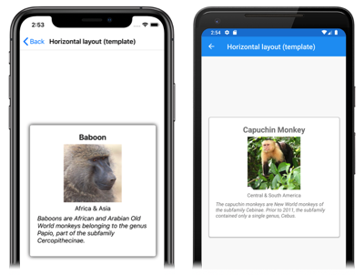
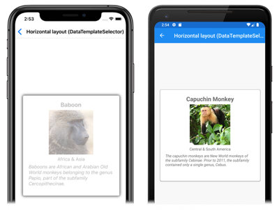
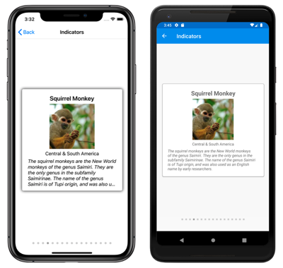
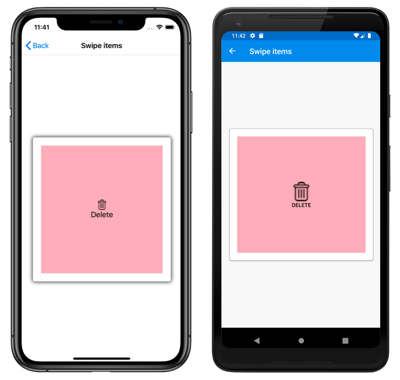
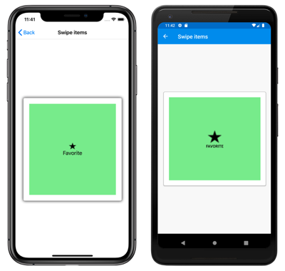
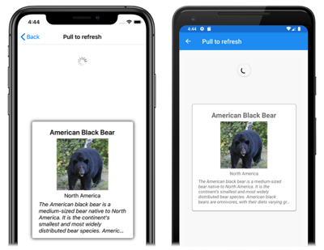

# Xamarin.Forms CarouselView Data

[ Download the sample](/samples/xamarin/xamarin-forms-samples/userinterface-carouselviewdemos/)

[`CarouselView`](xref:Xamarin.Forms.CarouselView) includes the following properties that define the data to be displayed, and its appearance:

- [`ItemsSource`](xref:Xamarin.Forms.ItemsView.ItemsSource), of type `IEnumerable`, specifies the collection of items to be displayed, and has a default value of `null`.
- [`ItemTemplate`](xref:Xamarin.Forms.ItemsView.ItemTemplate), of type [`DataTemplate`](xref:Xamarin.Forms.DataTemplate), specifies the template to apply to each item in the collection of items to be displayed.

These properties are backed by [`BindableProperty`](xref:Xamarin.Forms.BindableProperty) objects, which means that the properties can be targets of data bindings.

> [!NOTE]
> [`CarouselView`](xref:Xamarin.Forms.CarouselView) defines a `ItemsUpdatingScrollMode` property that represents the scrolling behavior of the `CarouselView` when new items are added to it. For more information about this property, see [Control scroll position when new items are added](scrolling.md#control-scroll-position-when-new-items-are-added).

[`CarouselView`](xref:Xamarin.Forms.CarouselView) supports incremental data virtualization as the user scrolls. For more information, see [Load data incrementally](#load-data-incrementally).

## Populate a CarouselView with data

A [`CarouselView`](xref:Xamarin.Forms.CarouselView) is populated with data by setting its [`ItemsSource`](xref:Xamarin.Forms.ItemsView.ItemsSource) property to any collection that implements `IEnumerable`. By default, [`CarouselView`](xref:Xamarin.Forms.CarouselView) displays items horizontally.

> [!IMPORTANT]
> If the [`CarouselView`](xref:Xamarin.Forms.CarouselView) is required to refresh as items are added, removed, or changed in the underlying collection, the underlying collection should be an `IEnumerable` collection that sends property change notifications, such as `ObservableCollection`.

[`CarouselView`](xref:Xamarin.Forms.CarouselView) can be populated with data by using data binding to bind its [`ItemsSource`](xref:Xamarin.Forms.ItemsView.ItemsSource) property to an `IEnumerable` collection. In XAML, this is achieved with the `Binding` markup extension:

```xaml
<CarouselView ItemsSource="{Binding Monkeys}" />
```

The equivalent C# code is:

```csharp
CarouselView carouselView = new CarouselView();
carouselView.SetBinding(ItemsView.ItemsSourceProperty, "Monkeys");
```

In this example, the [`ItemsSource`](xref:Xamarin.Forms.ItemsView.ItemsSource) property data binds to the `Monkeys` property of the connected viewmodel.

> [!NOTE]
> Compiled bindings can be enabled to improve data binding performance in Xamarin.Forms applications. For more information, see [Compiled Bindings](~/xamarin-forms/app-fundamentals/data-binding/compiled-bindings.md).

For information on how to change the [`CarouselView`](xref:Xamarin.Forms.CarouselView) orientation, see [Xamarin.Forms CarouselView Layout](layout.md). For information on how to define the appearance of each item in the `CarouselView`, see [Define item appearance](#define-item-appearance). For more information about data binding, see [Xamarin.Forms Data Binding](~/xamarin-forms/app-fundamentals/data-binding/index.md).

## Define item appearance

The appearance of each item in the [`CarouselView`](xref:Xamarin.Forms.CarouselView) can be defined by setting the [`CarouselView.ItemTemplate`](xref:Xamarin.Forms.ItemsView.ItemTemplate) property to a [`DataTemplate`](xref:Xamarin.Forms.DataTemplate):

```xaml
<CarouselView ItemsSource="{Binding Monkeys}">
    <CarouselView.ItemTemplate>
        <DataTemplate>
            <StackLayout>
                <Frame HasShadow="True"
                       BorderColor="DarkGray"
                       CornerRadius="5"
                       Margin="20"
                       HeightRequest="300"
                       HorizontalOptions="Center"
                       VerticalOptions="CenterAndExpand">
                    <StackLayout>
                        <Label Text="{Binding Name}"
                               FontAttributes="Bold"
                               FontSize="Large"
                               HorizontalOptions="Center"
                               VerticalOptions="Center" />
                        <Image Source="{Binding ImageUrl}"
                               Aspect="AspectFill"
                               HeightRequest="150"
                               WidthRequest="150"
                               HorizontalOptions="Center" />
                        <Label Text="{Binding Location}"
                               HorizontalOptions="Center" />
                        <Label Text="{Binding Details}"
                               FontAttributes="Italic"
                               HorizontalOptions="Center"
                               MaxLines="5"
                               LineBreakMode="TailTruncation" />
                    </StackLayout>
                </Frame>
            </StackLayout>
        </DataTemplate>
    </CarouselView.ItemTemplate>
</CarouselView>
```

The equivalent C# code is:

```csharp
CarouselView carouselView = new CarouselView();
carouselView.SetBinding(ItemsView.ItemsSourceProperty, "Monkeys");

carouselView.ItemTemplate = new DataTemplate(() =>
{
    Label nameLabel = new Label { ... };
    nameLabel.SetBinding(Label.TextProperty, "Name");

    Image image = new Image { ... };
    image.SetBinding(Image.SourceProperty, "ImageUrl");

    Label locationLabel = new Label { ... };
    locationLabel.SetBinding(Label.TextProperty, "Location");

    Label detailsLabel = new Label { ... };
    detailsLabel.SetBinding(Label.TextProperty, "Details");

    StackLayout stackLayout = new StackLayout
    {
        Children = { nameLabel, image, locationLabel, detailsLabel }
    };

    Frame frame = new Frame { ... };
    StackLayout rootStackLayout = new StackLayout
    {
        Children = { frame }
    };

    return rootStackLayout;
});
```

The elements specified in the [`DataTemplate`](xref:Xamarin.Forms.DataTemplate) define the appearance of each item in the `CarouselView`. In the example, layout within the `DataTemplate` is managed by a [`StackLayout`](xref:Xamarin.Forms.StackLayout), and the data is displayed with an [`Image`](xref:Xamarin.Forms.Image) object, and three [`Label`](xref:Xamarin.Forms.Label) objects, that all bind to properties of the `Monkey` class:

```csharp
public class Monkey
{
    public string Name { get; set; }
    public string Location { get; set; }
    public string Details { get; set; }
    public string ImageUrl { get; set; }
}
```

The following screenshots show the result of templating each item:

[](populate-data-images/datatemplate-large.png#lightbox "Templated items in a CarouselView")

For more information about data templates, see [Xamarin.Forms Data Templates](~/xamarin-forms/app-fundamentals/templates/data-templates/index.md).

## Choose item appearance at runtime

The appearance of each item in the [`CarouselView`](xref:Xamarin.Forms.CarouselView) can be chosen at runtime, based on the item value, by setting the [`CarouselView.ItemTemplate`](xref:Xamarin.Forms.ItemsView.ItemTemplate) property to a [`DataTemplateSelector`](xref:Xamarin.Forms.DataTemplateSelector) object:

```xaml
<ContentPage ...
             xmlns:controls="clr-namespace:CarouselViewDemos.Controls"
             x:Class="CarouselViewDemos.Views.HorizontalLayoutDataTemplateSelectorPage">
    <ContentPage.Resources>
        <DataTemplate x:Key="AmericanMonkeyTemplate">
            ...
        </DataTemplate>

        <DataTemplate x:Key="OtherMonkeyTemplate">
            ...
        </DataTemplate>

        <controls:MonkeyDataTemplateSelector x:Key="MonkeySelector"
                                             AmericanMonkey="{StaticResource AmericanMonkeyTemplate}"
                                             OtherMonkey="{StaticResource OtherMonkeyTemplate}" />
    </ContentPage.Resources>

    <CarouselView ItemsSource="{Binding Monkeys}"
                  ItemTemplate="{StaticResource MonkeySelector}" />
</ContentPage>
```

The equivalent C# code is:

```csharp
CarouselView carouselView = new CarouselView
{
    ItemTemplate = new MonkeyDataTemplateSelector { ... }
};
carouselView.SetBinding(ItemsView.ItemsSourceProperty, "Monkeys");
```

The [`ItemTemplate`](xref:Xamarin.Forms.ItemsView.ItemTemplate) property is set to a `MonkeyDataTemplateSelector` object. The following example shows the `MonkeyDataTemplateSelector` class:

```csharp
public class MonkeyDataTemplateSelector : DataTemplateSelector
{
    public DataTemplate AmericanMonkey { get; set; }
    public DataTemplate OtherMonkey { get; set; }

    protected override DataTemplate OnSelectTemplate(object item, BindableObject container)
    {
        return ((Monkey)item).Location.Contains("America") ? AmericanMonkey : OtherMonkey;
    }
}
```

The `MonkeyDataTemplateSelector` class defines `AmericanMonkey` and `OtherMonkey` [`DataTemplate`](xref:Xamarin.Forms.DataTemplate) properties that are set to different data templates. The `OnSelectTemplate` override returns the `AmericanMonkey` template when the monkey name contains "America". When the monkey name doesn't contain "America", the `OnSelectTemplate` override returns the `OtherMonkey` template, which displays its data grayed out:

[](populate-data-images/datatemplateselector-large.png#lightbox "Runtime item template selection in a CarouselView")

For more information about data template selectors, see [Create a Xamarin.Forms DataTemplateSelector](~/xamarin-forms/app-fundamentals/templates/data-templates/selector.md).

> [!IMPORTANT]
> When using [`CarouselView`](xref:Xamarin.Forms.CarouselView), never set the root element of your [`DataTemplate`](xref:Xamarin.Forms.DataTemplate) objects to a `ViewCell`. This will result in an exception being thrown because `CarouselView` has no concept of cells.

## Display indicators

Indicators, that represent the number of items and current position in a `CarouselView`, can be displayed next to the `CarouselView`. This can be accomplished with the `IndicatorView` control:

```xaml
<StackLayout>
    <CarouselView ItemsSource="{Binding Monkeys}"
                  IndicatorView="indicatorView">
        <CarouselView.ItemTemplate>
            <!-- DataTemplate that defines item appearance -->
        </CarouselView.ItemTemplate>
    </CarouselView>
    <IndicatorView x:Name="indicatorView"
                   IndicatorColor="LightGray"
                   SelectedIndicatorColor="DarkGray"
                   HorizontalOptions="Center" />
</StackLayout>
```

In this example, the `IndicatorView` is rendered beneath the `CarouselView`, with an indicator for each item in the `CarouselView`. The `IndicatorView` is populated with data by setting the `CarouselView.IndicatorView` property to the `IndicatorView` object. Each indicator is a light gray circle, while the indicator that represents the current item in the `CarouselView` is dark gray:

[](populate-data-images/indicators-large.png#lightbox "IndicatorView circles")

> [!IMPORTANT]
> Setting the `CarouselView.IndicatorView` property results in the `IndicatorView.Position` property binding to the `CarouselView.Position` property, and the `IndicatorView.ItemsSource` property binding to the `CarouselView.ItemsSource` property.

For more information about indicators, see [Xamarin.Forms IndicatorView](~/xamarin-forms/user-interface/indicatorview.md).

## Context menus

[`CarouselView`](xref:Xamarin.Forms.CarouselView) supports context menus for items of data through the `SwipeView`, which reveals the context menu with a swipe gesture. The `SwipeView` is a container control that wraps around an item of content, and provides context menu items for that item of content. Therefore, context menus are implemented for a `CarouselView` by creating a `SwipeView` that defines the content that the `SwipeView` wraps around, and the context menu items that are revealed by the swipe gesture. This is achieved by adding a `SwipeView` to the [`DataTemplate`](xref:Xamarin.Forms.DataTemplate) that defines the appearance of each item of data in the `CarouselView`:

```xaml
<CarouselView x:Name="carouselView"
              ItemsSource="{Binding Monkeys}">
    <CarouselView.ItemTemplate>
        <DataTemplate>
            <StackLayout>
                    <Frame HasShadow="True"
                           BorderColor="DarkGray"
                           CornerRadius="5"
                           Margin="20"
                           HeightRequest="300"
                           HorizontalOptions="Center"
                           VerticalOptions="CenterAndExpand">
                        <SwipeView>
                            <SwipeView.TopItems>
                                <SwipeItems>
                                    <SwipeItem Text="Favorite"
                                               IconImageSource="favorite.png"
                                               BackgroundColor="LightGreen"
                                               Command="{Binding Source={x:Reference carouselView}, Path=BindingContext.FavoriteCommand}"
                                               CommandParameter="{Binding}" />
                                </SwipeItems>
                            </SwipeView.TopItems>
                            <SwipeView.BottomItems>
                                <SwipeItems>
                                    <SwipeItem Text="Delete"
                                               IconImageSource="delete.png"
                                               BackgroundColor="LightPink"
                                               Command="{Binding Source={x:Reference carouselView}, Path=BindingContext.DeleteCommand}"
                                               CommandParameter="{Binding}" />
                                </SwipeItems>
                            </SwipeView.BottomItems>
                            <StackLayout>
                                <!-- Define item appearance -->
                            </StackLayout>
                        </SwipeView>
                    </Frame>
            </StackLayout>
        </DataTemplate>
    </CarouselView.ItemTemplate>
</CarouselView>
```

The equivalent C# code is:

```csharp
CarouselView carouselView = new CarouselView();
carouselView.SetBinding(ItemsView.ItemsSourceProperty, "Monkeys");

carouselView.ItemTemplate = new DataTemplate(() =>
{
    StackLayout stackLayout = new StackLayout();
    Frame frame = new Frame { ... };

    SwipeView swipeView = new SwipeView();
    SwipeItem favoriteSwipeItem = new SwipeItem
    {
        Text = "Favorite",
        IconImageSource = "favorite.png",
        BackgroundColor = Color.LightGreen
    };
    favoriteSwipeItem.SetBinding(MenuItem.CommandProperty, new Binding("BindingContext.FavoriteCommand", source: carouselView));
    favoriteSwipeItem.SetBinding(MenuItem.CommandParameterProperty, ".");

    SwipeItem deleteSwipeItem = new SwipeItem
    {
        Text = "Delete",
        IconImageSource = "delete.png",
        BackgroundColor = Color.LightPink
    };
    deleteSwipeItem.SetBinding(MenuItem.CommandProperty, new Binding("BindingContext.DeleteCommand", source: carouselView));
    deleteSwipeItem.SetBinding(MenuItem.CommandParameterProperty, ".");

    swipeView.TopItems = new SwipeItems { favoriteSwipeItem };
    swipeView.BottomItems = new SwipeItems { deleteSwipeItem };

    StackLayout swipeViewStackLayout = new StackLayout { ... };
    swipeView.Content = swipeViewStackLayout;
    frame.Content = swipeView;
    stackLayout.Children.Add(frame);

    return stackLayout;
});
```

In this example, the `SwipeView` content is a [`StackLayout`](xref:Xamarin.Forms.StackLayout) that defines the appearance of each item that's surrounded by a [`Frame`](xref:Xamarin.Forms.Frame) in the [`CarouselView`](xref:Xamarin.Forms.CarouselView). The swipe items are used to perform actions on the `SwipeView` content, and are revealed when the control is swiped from the top and from the bottom:

[](populate-data-images/swipeview-bottom-large.png#lightbox "CarouselView with bottom SwipeView context menu item")
[](populate-data-images/swipeview-top-large.png#lightbox "CarouselView with top SwipeView context menu item")

`SwipeView` supports four different swipe directions, with the swipe direction being defined by the directional `SwipeItems` collection the `SwipeItems` objects are added to. By default, a swipe item is executed when it's tapped by the user. In addition, once a swipe item has been executed the swipe items are hidden and the `SwipeView` content is re-displayed. However, these behaviors can be changed.

For more information about the `SwipeView` control, see [Xamarin.Forms SwipeView](~/xamarin-forms/user-interface/swipeview.md).

## Pull to refresh

[`CarouselView`](xref:Xamarin.Forms.CarouselView) supports pull to refresh functionality through the `RefreshView`, which enables the data being displayed to be refreshed by pulling down on the items. The `RefreshView` is a container control that provides pull to refresh functionality to its child, provided that the child supports scrollable content. Therefore, pull to refresh is implemented for a `CarouselView` by setting it as the child of a `RefreshView`:

```xaml
<RefreshView IsRefreshing="{Binding IsRefreshing}"
             Command="{Binding RefreshCommand}">
    <CarouselView ItemsSource="{Binding Animals}">
        ...
    </CarouselView>
</RefreshView>
```

The equivalent C# code is:

```csharp
RefreshView refreshView = new RefreshView();
ICommand refreshCommand = new Command(() =>
{
    // IsRefreshing is true
    // Refresh data here
    refreshView.IsRefreshing = false;
});
refreshView.Command = refreshCommand;

CarouselView carouselView = new CarouselView();
carouselView.SetBinding(ItemsView.ItemsSourceProperty, "Animals");
refreshView.Content = carouselView;
// ...
```

When the user initiates a refresh, the `ICommand` defined by the `Command` property is executed, which should refresh the items being displayed. A refresh visualization is shown while the refresh occurs, which consists of an animated progress circle:

[](populate-data-images/pull-to-refresh-large.png#lightbox "CarouselView pull-to-refresh")

The value of the `RefreshView.IsRefreshing` property indicates the current state of the `RefreshView`. When a refresh is triggered by the user, this property will automatically transition to `true`. Once the refresh completes, you should reset the property to `false`.

For more information about `RefreshView`, see [Xamarin.Forms RefreshView](~/xamarin-forms/user-interface/refreshview.md).

## Load data incrementally

[`CarouselView`](xref:Xamarin.Forms.CarouselView) supports incremental data virtualization as the user scrolls. This enables scenarios such as asynchronously loading a page of data from a web service, as the user scrolls. In addition, the point at which more data is loaded is configurable so that users don't see blank space, or are stopped from scrolling.

[`CarouselView`](xref:Xamarin.Forms.CarouselView) defines the following properties to control incremental loading of data:

- `RemainingItemsThreshold`, of type `int`, the threshold of items not yet visible in the list at which the `RemainingItemsThresholdReached` event will be fired.
- `RemainingItemsThresholdReachedCommand`, of type `ICommand`, which is executed when the `RemainingItemsThreshold` is reached.
- `RemainingItemsThresholdReachedCommandParameter`, of type `object`, which is the parameter that's passed to the `RemainingItemsThresholdReachedCommand`.

[`CarouselView`](xref:Xamarin.Forms.CarouselView) also defines a `RemainingItemsThresholdReached` event that is fired when the `CarouselView` is scrolled far enough that `RemainingItemsThreshold` items have not been displayed. This event can be handled to load more items. In addition, when the `RemainingItemsThresholdReached` event is fired, the `RemainingItemsThresholdReachedCommand` is executed, enabling incremental data loading to take place in a viewmodel.

The default value of the `RemainingItemsThreshold` property is -1, which indicates that the `RemainingItemsThresholdReached` event will never be fired. When the property value is 0, the `RemainingItemsThresholdReached` event will be fired when the final item in the [`ItemsSource`](xref:Xamarin.Forms.ItemsView.ItemsSource) is displayed. For values greater than 0, the `RemainingItemsThresholdReached` event will be fired when the `ItemsSource` contains that number of items not yet scrolled to.

> [!NOTE]
> [`CarouselView`](xref:Xamarin.Forms.CarouselView) validates the `RemainingItemsThreshold` property so that its value is always greater than or equal to -1.

The following XAML example shows a [`CarouselView`](xref:Xamarin.Forms.CarouselView) that loads data incrementally:

```xaml
<CarouselView ItemsSource="{Binding Animals}"
              RemainingItemsThreshold="2"
              RemainingItemsThresholdReached="OnCarouselViewRemainingItemsThresholdReached"
              RemainingItemsThresholdReachedCommand="{Binding LoadMoreDataCommand}">
    ...
</CarouselView>
```

The equivalent C# code is:

```csharp
CarouselView carouselView = new CarouselView
{
    RemainingItemsThreshold = 2
};
carouselView.RemainingItemsThresholdReached += OnCollectionViewRemainingItemsThresholdReached;
carouselView.SetBinding(ItemsView.ItemsSourceProperty, "Animals");
```

In this code example, the `RemainingItemsThresholdReached` event fires when there are 2 items not yet scrolled to, and in response executes the `OnCollectionViewRemainingItemsThresholdReached` event handler:

```csharp
void OnCollectionViewRemainingItemsThresholdReached(object sender, EventArgs e)
{
    // Retrieve more data here and add it to the CollectionView's ItemsSource collection.
}
```

> [!NOTE]
> Data can also be loaded incrementally by binding the `RemainingItemsThresholdReachedCommand` to an `ICommand` implementation in the viewmodel.

## Related links

- [CarouselView (sample)](/samples/xamarin/xamarin-forms-samples/userinterface-carouselviewdemos/)
- [Xamarin.Forms IndicatorView](~/xamarin-forms/user-interface/indicatorview.md)
- [Xamarin.Forms RefreshView](~/xamarin-forms/user-interface/refreshview.md)
- [Xamarin.Forms Data Binding](~/xamarin-forms/app-fundamentals/data-binding/index.md)
- [Xamarin.Forms Data Templates](~/xamarin-forms/app-fundamentals/templates/data-templates/index.md)
- [Create a Xamarin.Forms DataTemplateSelector](~/xamarin-forms/app-fundamentals/templates/data-templates/selector.md)
