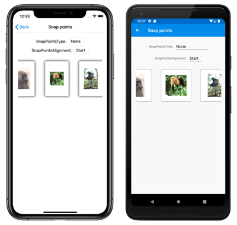
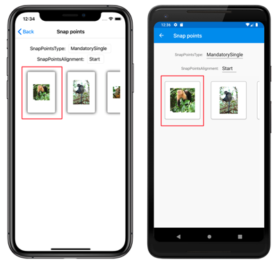
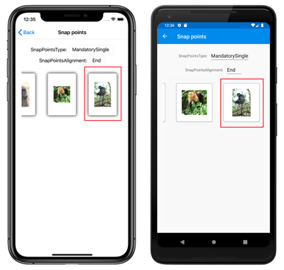

# Xamarin.Forms CarouselView Scrolling

[ Download the sample](/samples/xamarin/xamarin-forms-samples/userinterface-carouselviewdemos/)

[`CarouselView`](xref:Xamarin.Forms.CarouselView) defines the following scroll related properties:

- `HorizontalScrollBarVisibility`, of type `ScrollBarVisibility`, which specifies when the horizontal scroll bar is visible.
- `IsDragging`, of type `bool`, which indicates whether the `CarouselView` is scrolling. This is a read only property, whose default value is `false`.
- `IsScrollAnimated`, of type `bool`, which specifies whether an animation will occur when scrolling the `CarouselView`. The default value is `true`.
- `ItemsUpdatingScrollMode`, of type `ItemsUpdatingScrollMode`, which represents the scrolling behavior of the `CarouselView` when new items are added to it.
- `VerticalScrollBarVisibility`, of type `ScrollBarVisibility`, which specifies when the vertical scroll bar is visible.

All of these properties are backed by [`BindableProperty`](xref:Xamarin.Forms.BindableProperty) objects, which means that they can be targets of data bindings.

[`CarouselView`](xref:Xamarin.Forms.CarouselView) also defines two [`ScrollTo`](xref:Xamarin.Forms.ItemsView.ScrollTo*) methods, that scroll items into view. One of the overloads scrolls the item at the specified index into view, while the other scrolls the specified item into view. Both overloads have additional arguments that can be specified to indicate the exact position of the item after the scroll has completed, and whether to animate the scroll.

[`CarouselView`](xref:Xamarin.Forms.CarouselView) defines a [`ScrollToRequested`](xref:Xamarin.Forms.ItemsView.ScrollToRequested) event that is fired when one of the [`ScrollTo`](xref:Xamarin.Forms.ItemsView.ScrollTo*) methods is invoked. The [`ScrollToRequestedEventArgs`](xref:Xamarin.Forms.ScrollToRequestedEventArgs) object that accompanies the `ScrollToRequested` event has many properties, including `IsAnimated`, `Index`, `Item`, and `ScrollToPosition`. These properties are set from the arguments specified in the `ScrollTo` method calls.

In addition, [`CarouselView`](xref:Xamarin.Forms.CarouselView) defines a `Scrolled` event that is fired to indicate that scrolling occurred. The `ItemsViewScrolledEventArgs` object that accompanies the `Scrolled` event has many properties. For more information, see [Detect scrolling](#detect-scrolling).

When a user swipes to initiate a scroll, the end position of the scroll can be controlled so that items are fully displayed. This feature is known as snapping, because items snap to position when scrolling stops. For more information, see [Snap points](#snap-points).

[`CarouselView`](xref:Xamarin.Forms.CarouselView) can also load data incrementally as the user scrolls. For more information, see [Load data incrementally](populate-data.md#load-data-incrementally).

## Detect scrolling

The `IsDragging` property can be examined to determine whether the [`CarouselView`](xref:Xamarin.Forms.CarouselView) is currently scrolling through items.

In addition, [`CarouselView`](xref:Xamarin.Forms.CarouselView) defines a `Scrolled` event which is fired to indicate that scrolling occurred. This event should be consumed when data about the scroll is required.

The following XAML example shows a `CarouselView` that sets an event handler for the `Scrolled` event:

```xaml
<CarouselView Scrolled="OnCollectionViewScrolled">
    ...
</CarouselView>
```

The equivalent C# code is:

```csharp
CarouselView carouselView = new CarouselView();
carouselView.Scrolled += OnCarouselViewScrolled;
```

In this code example, the `OnCarouselViewScrolled` event handler is executed when the `Scrolled` event fires:

```csharp
void OnCarouselViewScrolled(object sender, ItemsViewScrolledEventArgs e)
{
    Debug.WriteLine("HorizontalDelta: " + e.HorizontalDelta);
    Debug.WriteLine("VerticalDelta: " + e.VerticalDelta);
    Debug.WriteLine("HorizontalOffset: " + e.HorizontalOffset);
    Debug.WriteLine("VerticalOffset: " + e.VerticalOffset);
    Debug.WriteLine("FirstVisibleItemIndex: " + e.FirstVisibleItemIndex);
    Debug.WriteLine("CenterItemIndex: " + e.CenterItemIndex);
    Debug.WriteLine("LastVisibleItemIndex: " + e.LastVisibleItemIndex);
}
```

In this example, the `OnCarouselViewScrolled` event handler outputs the values of the `ItemsViewScrolledEventArgs` object that accompanies the event.

> [!IMPORTANT]
> The `Scrolled` event is fired for user initiated scrolls, and for programmatic scrolls.

## Scroll an item at an index into view

The first [`ScrollTo`](xref:Xamarin.Forms.ItemsView.ScrollTo*) method overload scrolls the item at the specified index into view. Given a [`CarouselView`](xref:Xamarin.Forms.CarouselView) object named `carouselView`, the following example shows how to scroll the item at index 6 into view:

```csharp
carouselView.ScrollTo(6);
```

> [!NOTE]
> The [`ScrollToRequested`](xref:Xamarin.Forms.ItemsView.ScrollToRequested) event is fired when the [`ScrollTo`](xref:Xamarin.Forms.ItemsView.ScrollTo*) method is invoked.

## Scroll an item into view

The second [`ScrollTo`](xref:Xamarin.Forms.ItemsView.ScrollTo*) method overload scrolls the specified item into view. Given a [`CarouselView`](xref:Xamarin.Forms.CarouselView) object named `carouselView`, the following example shows how to scroll the Proboscis Monkey item into view:

```csharp
MonkeysViewModel viewModel = BindingContext as MonkeysViewModel;
Monkey monkey = viewModel.Monkeys.FirstOrDefault(m => m.Name == "Proboscis Monkey");
carouselView.ScrollTo(monkey);
```

> [!NOTE]
> The [`ScrollToRequested`](xref:Xamarin.Forms.ItemsView.ScrollToRequested) event is fired when the [`ScrollTo`](xref:Xamarin.Forms.ItemsView.ScrollTo*) method is invoked.

## Disable scroll animation

A scrolling animation is displayed when moving between items in a [`CarouselView`](xref:Xamarin.Forms.CarouselView). This animation occurs both for user initiated scrolls, and for programmatic scrolls. Setting the `IsScrollAnimated` property to `false` will disable the animation for both scrolling categories.

Alternatively, the `animate` argument of the `ScrollTo` method can be set to `false` to disable the scrolling animation on programmatic scrolls:

```csharp
carouselView.ScrollTo(monkey, animate: false);
```

## Control scroll position

When scrolling an item into view, the exact position of the item after the scroll has completed can be specified with the `position` argument of the [`ScrollTo`](xref:Xamarin.Forms.ItemsView.ScrollTo*) methods. This argument accepts a [`ScrollToPosition`](xref:Xamarin.Forms.ScrollToPosition) enumeration member.

### MakeVisible

The [`ScrollToPosition.MakeVisible`](xref:Xamarin.Forms.ScrollToPosition) member indicates that the item should be scrolled until it's visible in the view:

```csharp
carouselView.ScrollTo(monkey, position: ScrollToPosition.MakeVisible);
```

This example code results in the minimal scrolling required to scroll the item into view.

> [!NOTE]
> The [`ScrollToPosition.MakeVisible`](xref:Xamarin.Forms.ScrollToPosition) member is used by default, if the `position` argument is not specified when calling the `ScrollTo` method.

### Start

The [`ScrollToPosition.Start`](xref:Xamarin.Forms.ScrollToPosition) member indicates that the item should be scrolled to the start of the view:

```csharp
carouselView.ScrollTo(monkey, position: ScrollToPosition.Start);
```

This example code results in the item being scrolled to the start of the view.

### Center

The [`ScrollToPosition.Center`](xref:Xamarin.Forms.ScrollToPosition) member indicates that the item should be scrolled to the center of the view:

```csharp
carouselViewView.ScrollTo(monkey, position: ScrollToPosition.Center);
```

This example code results in the item being scrolled to the center of the view.

### End

The [`ScrollToPosition.End`](xref:Xamarin.Forms.ScrollToPosition) member indicates that the item should be scrolled to the end of the view:

```csharp
carouselViewView.ScrollTo(monkey, position: ScrollToPosition.End);
```

This example code results in the item being scrolled to the end of the view.

## Control scroll position when new items are added

[`CarouselView`](xref:Xamarin.Forms.CarouselView) defines a `ItemsUpdatingScrollMode` property, which is backed by a bindable property. This property gets or sets a `ItemsUpdatingScrollMode` enumeration value that represents the scrolling behavior of the `CarouselView` when new items are added to it. The `ItemsUpdatingScrollMode` enumeration defines the following members:

- `KeepItemsInView` keeps the first item in the list displayed when new items are added.
- `KeepScrollOffset` ensures that the current scroll position is maintained when new items are added.
- `KeepLastItemInView` adjusts the scroll offset to keep the last item in the list displayed when new items are added.

The default value of the `ItemsUpdatingScrollMode` property is `KeepItemsInView`. Therefore, when new items are added to a [`CarouselView`](xref:Xamarin.Forms.CarouselView) the first item in the list will remain displayed. To ensure that the last item in the list is displayed when new items are added, set the `ItemsUpdatingScrollMode` property to `KeepLastItemInView`:

```xaml
<CarouselView ItemsUpdatingScrollMode="KeepLastItemInView">
    ...
</CarouselView>
```

The equivalent C# code is:

```csharp
CarouselView carouselView = new CarouselView
{
    ItemsUpdatingScrollMode = ItemsUpdatingScrollMode.KeepLastItemInView
};
```

## Scroll bar visibility

[`CarouselView`](xref:Xamarin.Forms.CarouselView) defines `HorizontalScrollBarVisibility` and `VerticalScrollBarVisibility` properties, which are backed by bindable properties. These properties get or set a [`ScrollBarVisibility`](xref:Xamarin.Forms.ScrollBarVisibility) enumeration value that represents when the horizontal, or vertical, scroll bar is visible. The `ScrollBarVisibility` enumeration defines the following members:

- [`Default`](xref:Xamarin.Forms.ScrollBarVisibility) indicates the default scroll bar behavior for the platform, and is the default value for the `HorizontalScrollBarVisibility` and `VerticalScrollBarVisibility` properties.
- [`Always`](xref:Xamarin.Forms.ScrollBarVisibility) indicates that scroll bars will be visible, even when the content fits in the view.
- [`Never`](xref:Xamarin.Forms.ScrollBarVisibility) indicates that scroll bars will not be visible, even if the content doesn't fit in the view.

## Snap points

When a user swipes to initiate a scroll, the end position of the scroll can be controlled so that items are fully displayed. This feature is known as snapping, because items snap to position when scrolling stops, and is controlled by the following properties from the [`ItemsLayout`](xref:Xamarin.Forms.ItemsLayout) class:

- [`SnapPointsType`](xref:Xamarin.Forms.ItemsLayout.SnapPointsType), of type [`SnapPointsType`](xref:Xamarin.Forms.SnapPointsType), specifies the behavior of snap points when scrolling.
- [`SnapPointsAlignment`](xref:Xamarin.Forms.ItemsLayout.SnapPointsAlignment), of type [`SnapPointsAlignment`](xref:Xamarin.Forms.SnapPointsAlignment), specifies how snap points are aligned with items.

These properties are backed by [`BindableProperty`](xref:Xamarin.Forms.BindableProperty) objects, which means that the properties can be targets of data bindings.

> [!NOTE]
> When snapping occurs, it will occur in the direction that produces the least amount of motion.

### Snap points type

The [`SnapPointsType`](xref:Xamarin.Forms.SnapPointsType) enumeration defines the following members:

- `None` indicates that scrolling does not snap to items.
- `Mandatory` indicates that content always snaps to the closest snap point to where scrolling would naturally stop, along the direction of inertia.
- `MandatorySingle` indicates the same behavior as `Mandatory`, but only scrolls one item at a time.

By default on a [`CarouselView`](xref:Xamarin.Forms.CarouselView), the [`SnapPointsType`](xref:Xamarin.Forms.ItemsLayout.SnapPointsType) property is set to `SnapPointsType.MandatorySingle`, which ensures that scrolling only scrolls one item at a time.

The following screenshots show a [`CarouselView`](xref:Xamarin.Forms.CarouselView) with snapping turned off:

[](scrolling-images/snappoints-none-large.png#lightbox "CarouselView without snap points")

### Snap points alignment

The [`SnapPointsAlignment`](xref:Xamarin.Forms.SnapPointsAlignment) enumeration defines `Start`, `Center`, and `End` members.

> [!IMPORTANT]
> The value of the [`SnapPointsAlignment`](xref:Xamarin.Forms.ItemsLayout.SnapPointsAlignment) property is only respected when the [`SnapPointsType`](xref:Xamarin.Forms.ItemsLayout.SnapPointsType) property is set to `Mandatory`, or `MandatorySingle`.

#### Start

The `SnapPointsAlignment.Start` member indicates that snap points are aligned with the leading edge of items. The following XAML example shows how to set this enumeration member:

```xaml
<CarouselView ItemsSource="{Binding Monkeys}"
              PeekAreaInsets="100">
    <CarouselView.ItemsLayout>
        <LinearItemsLayout Orientation="Horizontal"
                           SnapPointsType="MandatorySingle"
                           SnapPointsAlignment="Start" />
    </CarouselView.ItemsLayout>
    ...
</CarouselView>
```

The equivalent C# code is:

```csharp
CarouselView carouselView = new CarouselView
{
    ItemsLayout = new LinearItemsLayout(ItemsLayoutOrientation.Horizontal)
    {
        SnapPointsType = SnapPointsType.MandatorySingle,
        SnapPointsAlignment = SnapPointsAlignment.Start
    },
    // ...
};
```

When a user swipes to initiate a scroll in a horizontally scrolling [`CarouselView`](xref:Xamarin.Forms.CarouselView), the left item will be aligned with the left of the view:

[](scrolling-images/snappoints-start-large.png#lightbox "CarouselView with start snap points")

#### Center

The `SnapPointsAlignment.Center` member indicates that snap points are aligned with the center of items.

By default on a [`CarouselView`](xref:Xamarin.Forms.CarouselView), the [`SnapPointsAlignment`](xref:Xamarin.Forms.ItemsLayout.SnapPointsAlignment) property is set to `Center`. However, for completeness, the following XAML example shows how to set this enumeration member:

```xaml
<CarouselView ItemsSource="{Binding Monkeys}"
              PeekAreaInsets="100">
    <CarouselView.ItemsLayout>
        <LinearItemsLayout Orientation="Horizontal"
                           SnapPointsType="MandatorySingle"
                           SnapPointsAlignment="Center" />
    </CarouselView.ItemsLayout>
    ...
</CarouselView>
```

The equivalent C# code is:

```csharp
CarouselView carouselView = new CarouselView
{
    ItemsLayout = new LinearItemsLayout(ItemsLayoutOrientation.Horizontal)
    {
        SnapPointsType = SnapPointsType.MandatorySingle,
        SnapPointsAlignment = SnapPointsAlignment.Center
    },
    // ...
};
```

When a user swipes to initiate a scroll in a horizontally scrolling [`CarouselView`](xref:Xamarin.Forms.CarouselView), the center item will be aligned with the center of the view:

[](scrolling-images/snappoints-center-large.png#lightbox "CarouselView with center snap points")

#### End

The `SnapPointsAlignment.End` member indicates that snap points are aligned with the trailing edge of items. The following XAML example shows how to set this enumeration member:

```xaml
<CarouselView ItemsSource="{Binding Monkeys}"
              PeekAreaInsets="100">
    <CarouselView.ItemsLayout>
        <LinearItemsLayout Orientation="Horizontal"
                           SnapPointsType="MandatorySingle"
                           SnapPointsAlignment="End" />
    </CarouselView.ItemsLayout>
    ...
</CarouselView>
```

The equivalent C# code is:

```csharp
CarouselView carouselView = new CarouselView
{
    ItemsLayout = new LinearItemsLayout(ItemsLayoutOrientation.Horizontal)
    {
        SnapPointsType = SnapPointsType.MandatorySingle,
        SnapPointsAlignment = SnapPointsAlignment.End
    },
    // ...
};
```

When a user swipes to initiate a scroll in a horizontally scrolling [`CarouselView`](xref:Xamarin.Forms.CarouselView), the right item will be aligned with the right of the view.

[](scrolling-images/snappoints-end-large.png#lightbox "CarouselView with end snap points")

## Related links

- [CarouselView (sample)](/samples/xamarin/xamarin-forms-samples/userinterface-carouselviewdemos/)
