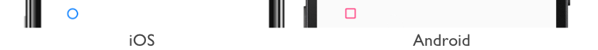
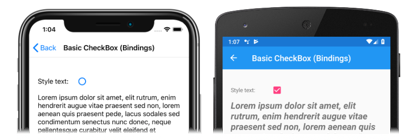
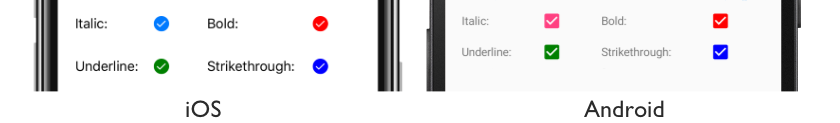

# Xamarin.Forms CheckBox

[ Download the sample](/samples/xamarin/xamarin-forms-samples/userinterface-checkboxdemos/)

The Xamarin.Forms `CheckBox` is a type of button that can either be checked or empty. When a checkbox is checked, it's considered to be on. When a checkbox is empty, it's considered to be off.

`CheckBox` defines a `bool` property named `IsChecked`, which indicates whether the `CheckBox` is checked. This property is also backed by a [`BindableProperty`](xref:Xamarin.Forms.BindableProperty) object, which means that it can be styled, and be the target of data bindings.

> [!NOTE]
> The `IsChecked` bindable property has a default binding mode of [`BindingMode.TwoWay`](xref:Xamarin.Forms.BindingMode.TwoWay).

`CheckBox` defines a `CheckedChanged` event that's fired when the `IsChecked` property changes, either through user manipulation or when an application sets the `IsChecked` property. The `CheckedChangedEventArgs` object that accompanies the `CheckedChanged` event has a single property named `Value`, of type `bool`. When the event is fired, the value of the `Value` property is set to the new value of the `IsChecked` property.

## Create a CheckBox

The following example shows how to instantiate a `CheckBox` in XAML:

```xaml
<CheckBox />
```

This XAML results in the appearance shown in the following screenshots:



By default, the `CheckBox` is empty. The `CheckBox` can be checked by user manipulation, or by setting the `IsChecked` property to `true`:

```xaml
<CheckBox IsChecked="true" />
```

This XAML results in the appearance shown in the following screenshots:


Alternatively, a `CheckBox` can be created in code:

```csharp
CheckBox checkBox = new CheckBox { IsChecked = true };
```

## Respond to a CheckBox changing state

When the `IsChecked` property changes, either through user manipulation or when an application sets the `IsChecked` property, the `CheckedChanged` event fires. An event handler for this event can be registered to respond to the change:

```xaml
<CheckBox CheckedChanged="OnCheckBoxCheckedChanged" />
```

The code-behind file contains the handler for the `CheckedChanged` event:

```csharp
void OnCheckBoxCheckedChanged(object sender, CheckedChangedEventArgs e)
{
    // Perform required operation after examining e.Value
}
```

The `sender` argument is the `CheckBox` responsible for this event. You can use this to access the `CheckBox` object, or to distinguish between multiple `CheckBox` objects sharing the same `CheckedChanged` event handler.

Alternatively, an event handler for the `CheckedChanged` event can be registered in code:

```csharp
CheckBox checkBox = new CheckBox { ... };
checkBox.CheckedChanged += (sender, e) =>
{
    // Perform required operation after examining e.Value
};
```

## Data bind a CheckBox

The `CheckedChanged` event handler can be eliminated by using data binding and triggers to respond to a `CheckBox` being checked or empty:

```xaml
<CheckBox x:Name="checkBox" />
<Label Text="Lorem ipsum dolor sit amet, elit rutrum, enim hendrerit augue vitae praesent sed non, lorem aenean quis praesent pede.">
    <Label.Triggers>
        <DataTrigger TargetType="Label"
                     Binding="{Binding Source={x:Reference checkBox}, Path=IsChecked}"
                     Value="true">
            <Setter Property="FontAttributes"
                    Value="Italic, Bold" />
            <Setter Property="FontSize"
                    Value="Large" />
        </DataTrigger>
    </Label.Triggers>
</Label>
```

In this example, the [`Label`](xref:Xamarin.Forms.Label) uses a binding expression in a data trigger to monitor the `IsChecked` property of the `CheckBox`. When this property becomes `true`, the `FontAttributes` and `FontSize` properties of the `Label` change. When the `IsChecked` property returns to `false`, the `FontAttributes` and `FontSize` properties of the `Label` are reset to their initial state.

In the following screenshots, the iOS screenshot shows the [`Label`](xref:Xamarin.Forms.Label) formatting when the `CheckBox` is empty, while the Android screenshot shows the `Label` formatting when the `CheckBox` is checked:

[](checkbox-images/checkbox-databinding-large.png#lightbox "Data bound CheckBox")

For more information about triggers, see [Xamarin.Forms Triggers](~/xamarin-forms/app-fundamentals/triggers.md).

## Disable a Checkbox

Sometimes an application enters a state where a `CheckBox` being checked is not a valid operation. In such cases, the `CheckBox` can be disabled by setting its `IsEnabled` property to `false`.

## CheckBox appearance

In addition to the properties that `CheckBox` inherits from the [`View`](xref:Xamarin.Forms.View) class, `CheckBox` also defines a `Color` property that sets its color to a [`Color`](xref:Xamarin.Forms.Color):

```xaml
<CheckBox Color="Red" />
```

The following screenshots show a series of checked `CheckBox` objects, where each object has its `Color` property set to a different [`Color`](xref:Xamarin.Forms.Color):



## CheckBox visual states

`CheckBox` has an `IsChecked` [`VisualState`](xref:Xamarin.Forms.VisualState) that can be used to initiate a visual change to the `CheckBox` when it becomes checked.

The following XAML example shows how to define a visual state for the `IsChecked` state:

```xaml
<CheckBox ...>
    <VisualStateManager.VisualStateGroups>
        <VisualStateGroup x:Name="CommonStates">
            <VisualState x:Name="Normal">
                <VisualState.Setters>
                    <Setter Property="Color"
                            Value="Red" />
                </VisualState.Setters>
            </VisualState>

            <VisualState x:Name="IsChecked">
                <VisualState.Setters>
                    <Setter Property="Color"
                            Value="Green" />
                </VisualState.Setters>
            </VisualState>
        </VisualStateGroup>
    </VisualStateManager.VisualStateGroups>
</CheckBox>
```

In this example, the `IsChecked` [`VisualState`](xref:Xamarin.Forms.VisualState) specifies that when the `CheckBox` is checked, its `Color` property will be set to green. The `Normal` `VisualState` specifies that when the `CheckBox` is in a normal state, its `Color` property will be set to red. Therefore, the overall effect is that the `CheckBox` is red when it's empty, and green when it's checked.

For more information about visual states, see [Xamarin.Forms Visual State Manager](~/xamarin-forms/user-interface/visual-state-manager.md).

## Related links

- [CheckBox Demos (sample)](/samples/xamarin/xamarin-forms-samples/userinterface-checkboxdemos/)
- [Xamarin.Forms Triggers](~/xamarin-forms/app-fundamentals/triggers.md)
- [Xamarin.Forms Visual State Manager](~/xamarin-forms/user-interface/visual-state-manager.md)