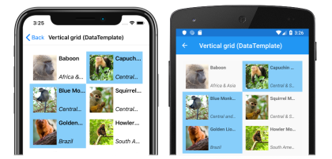

# Xamarin.Forms CollectionView Introduction

[ Download the sample](/samples/xamarin/xamarin-forms-samples/userinterface-collectionviewdemos/)

[`CollectionView`](xref:Xamarin.Forms.CollectionView) is a view for presenting lists of data using different layout specifications. It aims to provide a more flexible, and performant alternative to [`ListView`](xref:Xamarin.Forms.ListView). For example, the following screenshots show a `CollectionView` that uses a two column vertical grid, and which allows multiple selection:

[`CollectionView`](xref:Xamarin.Forms.CollectionView) should be used for presenting lists of data that require scrolling or selection. A bindable layout can be used when the data to be displayed doesn't require scrolling or selection. For more information, see [Bindable Layouts in Xamarin.Forms](~/xamarin-forms/user-interface/layouts/bindable-layouts.md).

[`CollectionView`](xref:Xamarin.Forms.CollectionView) is available from Xamarin.Forms 4.3.

> [!IMPORTANT]
> [`CollectionView`](xref:Xamarin.Forms.CollectionView) is available on iOS and Android, but is only [partially available](https://gist.github.com/hartez/7d0edd4182dbc7de65cebc6c67f72e14) on the Universal Windows Platform.

## CollectionView and ListView differences

While the [`CollectionView`](xref:Xamarin.Forms.CollectionView) and [`ListView`](xref:Xamarin.Forms.ListView) APIs are similar, there are some notable differences:

- [`CollectionView`](xref:Xamarin.Forms.CollectionView) has a flexible layout model, which allows data to be presented vertically or horizontally, in a list or a grid.
- [`CollectionView`](xref:Xamarin.Forms.CollectionView) supports single and multiple selection.
- [`CollectionView`](xref:Xamarin.Forms.CollectionView) has no concept of cells. Instead, a data template is used to define the appearance of each item of data in the list.
- [`CollectionView`](xref:Xamarin.Forms.CollectionView) automatically utilizes the virtualization provided by the underlying native controls.
- [`CollectionView`](xref:Xamarin.Forms.CollectionView) reduces the API surface of [`ListView`](xref:Xamarin.Forms.ListView). Many properties and events from [`ListView`](xref:Xamarin.Forms.ListView) are not present in `CollectionView`.
- [`CollectionView`](xref:Xamarin.Forms.CollectionView) does not include built-in separators.
- [`CollectionView`](xref:Xamarin.Forms.CollectionView) will throw an exception if its [`ItemsSource`](xref:Xamarin.Forms.ItemsView.ItemsSource) is updated off the UI thread.

## Move from ListView to CollectionView

[`ListView`](xref:Xamarin.Forms.ListView) implementations in existing Xamarin.Forms applications can be migrated to [`CollectionView`](xref:Xamarin.Forms.CollectionView) implementations with the help of the following table:

| Concept | ListView API | CollectionView |
|---|---|---|
| Data | `ItemsSource` | A [`CollectionView`](xref:Xamarin.Forms.CollectionView) is populated with data by setting its `ItemsSource` property. For more information, see [Populate a CollectionView with data](populate-data.md#populate-a-collectionview-with-data). |
| Item appearance | `ItemTemplate` | The appearance of each item in a [`CollectionView`](xref:Xamarin.Forms.CollectionView) can be defined by setting the `ItemTemplate` property to a [`DataTemplate`](xref:Xamarin.Forms.DataTemplate). For more information, see [Define item appearance](populate-data.md#define-item-appearance). |
| Cells | `TextCell`, `ImageCell`, `ViewCell` | [`CollectionView`](xref:Xamarin.Forms.CollectionView) has no concept of cells, and therefore no concept of disclosure indicators. Instead, a data template is used to define the appearance of each item of data in the list. |
| Row separators | `SeparatorColor`, `SeparatorVisibility` | [`CollectionView`](xref:Xamarin.Forms.CollectionView) does not include built-in separators. These can be provided, if desired, in the item template. |
| Selection | `SelectionMode`, `SelectedItem` | [`CollectionView`](xref:Xamarin.Forms.CollectionView) supports single and multiple selection. For more information, see [Xamarin.Forms CollectionView Selection](selection.md). |
| Row height | `HasUnevenRows`, `RowHeight` | In a `CollectionView`, the row height of each item is determined by the `ItemSizingStrategy` property. For more information, see [Item sizing](layout.md#item-sizing).|
| Caching | `CachingStrategy` | [`CollectionView`](xref:Xamarin.Forms.CollectionView) automatically uses the virtualization provided by the underlying native controls. |
| Headers and footers | `Header`, `HeaderElement`, `HeaderTemplate`, `Footer`, `FooterElement`, `FooterTemplate` | [`CollectionView`](xref:Xamarin.Forms.CollectionView) can present a header and footer that scroll with the items in the list, via the `Header`, `Footer`, `HeaderTemplate`, and `FooterTemplate` properties. For more information, see [Headers and footers](layout.md#headers-and-footers). |
| Grouping | `GroupDisplayBinding`, `GroupHeaderTemplate`, `GroupShortNameBinding`, `IsGroupingEnabled` | [`CollectionView`](xref:Xamarin.Forms.CollectionView) displays correctly grouped data by setting its `IsGrouped` property to `true`. Group headers and group footers can be customized by setting the `GroupHeaderTemplate` and `GroupFooterTemplate` properties to  [`DataTemplate`](xref:Xamarin.Forms.DataTemplate) objects. For more information, see [Xamarin.Forms CollectionView Grouping](grouping.md). |
| Pull to refresh | `IsPullToRefreshEnabled`, `IsRefreshing`, `RefreshAllowed`, `RefreshCommand`, `RefreshControlColor`, `BeginRefresh()`, `EndRefresh()` | Pull to refresh functionality is supported by setting a [`CollectionView`](xref:Xamarin.Forms.CollectionView) as the child of a `RefreshView`. For more information, see [Pull to refresh](populate-data.md#pull-to-refresh). |
| Context menu items | `ContextActions` | Context menu items are supported by setting a `SwipeView` as the root view in the [`DataTemplate`](xref:Xamarin.Forms.DataTemplate) that defines the appearance of each item of data in the [`CollectionView`](xref:Xamarin.Forms.CollectionView). For more information, see [Context menus](populate-data.md#context-menus). |
| Scrolling | `ScrollTo()` | [`CollectionView`](xref:Xamarin.Forms.CollectionView) defines `ScrollTo` methods, that scroll items into view. For more information, see [Scrolling](scrolling.md). |

## Related links

- [CollectionView (sample)](/samples/xamarin/xamarin-forms-samples/userinterface-collectionviewdemos/)
- [Bindable Layouts in Xamarin.Forms](~/xamarin-forms/user-interface/layouts/bindable-layouts.md)
