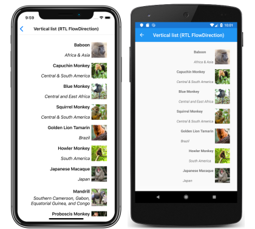

# Xamarin.Forms CollectionView Layout

[ Download the sample](https://github.com/xamarin/xamarin-forms-samples/tree/forms40/UserInterface/CollectionViewDemos/)

[`CollectionView`](xref:Xamarin.Forms.CollectionView) defines the following properties that control layout:

- [`ItemsLayout`](xref:Xamarin.Forms.ItemsLayout), of type [`IItemsLayout`](xref:Xamarin.Forms.IItemsLayout), specifies the layout to be used.
- [`ItemSizingStrategy`](xref:Xamarin.Forms.ItemsView.ItemSizingStrategy), of type [`ItemSizingStrategy`](xref:Xamarin.Forms.ItemSizingStrategy), specifies the item measure strategy to be used.

These properties are backed by [`BindableProperty`](xref:Xamarin.Forms.BindableProperty) objects, which means that the properties can be targets of data bindings.

By default, a [`CollectionView`](xref:Xamarin.Forms.CollectionView) will display its items in a vertical list. However, any of the following layouts can be used:

- Vertical list – a single column list that grows vertically as new items are added.
- Horizontal list – a single row list that grows horizontally as new items are added.
- Vertical grid – a multi-column grid that grows vertically as new items are added.
- Horizontal grid – a multi-row grid that grows horizontally as new items are added.

These layouts can be specified by setting the [`ItemsLayout`](xref:Xamarin.Forms.ItemsView.ItemsLayout) property to class that derives from the [`ItemsLayout`](xref:Xamarin.Forms.ItemsLayout) class. This class defines the following properties:

- [`Orientation`](xref:Xamarin.Forms.ItemsLayout.Orientation), of type [`ItemsLayoutOrientation`](xref:Xamarin.Forms.ItemsLayoutOrientation), specifies the direction in which the [`CollectionView`](xref:Xamarin.Forms.CollectionView) expands as items are added.
- [`SnapPointsAlignment`](xref:Xamarin.Forms.ItemsLayout.SnapPointsAlignment), of type [`SnapPointsAlignment`](xref:Xamarin.Forms.SnapPointsAlignment), specifies how snap points are aligned with items.
- [`SnapPointsType`](xref:Xamarin.Forms.ItemsLayout.SnapPointsType), of type [`SnapPointsType`](xref:Xamarin.Forms.SnapPointsType), specifies the behavior of snap points when scrolling.

These properties are backed by [`BindableProperty`](xref:Xamarin.Forms.BindableProperty) objects, which means that the properties can be targets of data bindings. For more information about snap points, see [Snap points](scrolling.md#snap-points) in the [Xamarin.Forms CollectionView Scrolling](scrolling.md) guide.

The [`ItemsLayoutOrientation`](xref:Xamarin.Forms.ItemsLayoutOrientation) enumeration defines the following members:

- `Vertical` indicates that the [`CollectionView`](xref:Xamarin.Forms.CollectionView) will expand vertically as items are added.
- `Horizontal` indicates that the [`CollectionView`](xref:Xamarin.Forms.CollectionView) will expand horizontally as items are added.

The [`ListItemsLayout`](xref:Xamarin.Forms.ListItemsLayout) class inherits from the [`ItemsLayout`](xref:Xamarin.Forms.ItemsLayout) class, and defines static `VerticalList` and `HorizontalList` members. These members can be used to create vertical or horizontal lists, respectively. Alternatively, a `ListItemsLayout` object can be created, specifying an [`ItemsLayoutOrientation`](xref:Xamarin.Forms.ItemsLayoutOrientation) enumeration member as an argument.

The [`GridItemsLayout`](xref:Xamarin.Forms.GridItemsLayout) class inherits from the [`ItemsLayout`](xref:Xamarin.Forms.ItemsLayout) class, and defines a `Span` property, of type `int`, that represents the number of columns or rows to display in the grid. The default value of the `Span` property is 1, and its value must always be greater than or equal to 1.

> [!NOTE]
> [`CollectionView`](xref:Xamarin.Forms.CollectionView) uses the native layout engines to perform layout.

## Vertical list

By default, [`CollectionView`](xref:Xamarin.Forms.CollectionView) will display its items in a vertical list layout. Therefore, it's not necessary to set the [`ItemsLayout`](xref:Xamarin.Forms.ItemsView.ItemsLayout) property to use this layout:

```xaml
<CollectionView ItemsSource="{Binding Monkeys}">
    <CollectionView.ItemTemplate>
        <DataTemplate>
            <Grid Padding="10">
                <Grid.RowDefinitions>
                    <RowDefinition Height="Auto" />
                    <RowDefinition Height="Auto" />
                </Grid.RowDefinitions>
                <Grid.ColumnDefinitions>
                    <ColumnDefinition Width="Auto" />
                    <ColumnDefinition Width="Auto" />
                </Grid.ColumnDefinitions>
                <Image Grid.RowSpan="2"
                       Source="{Binding ImageUrl}"
                       Aspect="AspectFill"
                       HeightRequest="60"
                       WidthRequest="60" />
                <Label Grid.Column="1"
                       Text="{Binding Name}"
                       FontAttributes="Bold" />
                <Label Grid.Row="1"
                       Grid.Column="1"
                       Text="{Binding Location}"
                       FontAttributes="Italic"
                       VerticalOptions="End" />
            </Grid>
        </DataTemplate>
    </CollectionView.ItemTemplate>
</CollectionView>
```

However, for completeness, a [`CollectionView`](xref:Xamarin.Forms.CollectionView) can be set to display its items in a vertical list by setting its [`ItemsLayout`](xref:Xamarin.Forms.ItemsView.ItemsLayout) property to the static `ListItemsLayout.VerticalList` member:

```xaml
<CollectionView ItemsSource="{Binding Monkeys}"
                ItemsLayout="{x:Static ListItemsLayout.VerticalList}">
    ...
</CollectionView>
```

Alternatively, this can also be accomplished by setting the [`ItemsLayout`](xref:Xamarin.Forms.ItemsView.ItemsLayout) property to an object of the [`ListItemsLayout`](xref:Xamarin.Forms.ListItemsLayout) class, specifying the `Vertical` [`ItemsLayoutOrientation`](xref:Xamarin.Forms.ItemsLayoutOrientation) enumeration member as an argument:

```xaml
<CollectionView ItemsSource="{Binding Monkeys}">
    <CollectionView.ItemsLayout>
        <ListItemsLayout>
            <x:Arguments>
                <ItemsLayoutOrientation>Vertical</ItemsLayoutOrientation>    
            </x:Arguments>
        </ListItemsLayout>
    </CollectionView.ItemsLayout>
    ...
</CollectionView>
```

The equivalent C# code is:

```csharp
CollectionView collectionView = new CollectionView
{
    ...
    ItemsLayout = ListItemsLayout.VerticalList
};
```

This results in a single column list, which grows vertically as new items are added:

[](layout-images/vertical-list-large.png#lightbox "CollectionView vertical list layout")

## Horizontal list

[`CollectionView`](xref:Xamarin.Forms.CollectionView) can display its items in a horizontal list by setting its [`ItemsLayout`](xref:Xamarin.Forms.ItemsView.ItemsLayout) property to the static `ListItemsLayout.HorizontalList` member:

```xaml
<CollectionView ItemsSource="{Binding Monkeys}"
                ItemsLayout="{x:Static ListItemsLayout.HorizontalList}">
    <CollectionView.ItemTemplate>
        <DataTemplate>
            <Grid Padding="10">
                <Grid.RowDefinitions>
                    <RowDefinition Height="35" />
                    <RowDefinition Height="35" />
                </Grid.RowDefinitions>
                <Grid.ColumnDefinitions>
                    <ColumnDefinition Width="70" />
                    <ColumnDefinition Width="140" />
                </Grid.ColumnDefinitions>
                <Image Grid.RowSpan="2"
                       Source="{Binding ImageUrl}"
                       Aspect="AspectFill"
                       HeightRequest="60"
                       WidthRequest="60" />
                <Label Grid.Column="1"
                       Text="{Binding Name}"
                       FontAttributes="Bold"
                       LineBreakMode="TailTruncation" />
                <Label Grid.Row="1"
                       Grid.Column="1"
                       Text="{Binding Location}"
                       LineBreakMode="TailTruncation"
                       FontAttributes="Italic"
                       VerticalOptions="End" />
            </Grid>
        </DataTemplate>
    </CollectionView.ItemTemplate>
</CollectionView>
```

Alternatively, this can also be accomplished by setting the [`ItemsLayout`](xref:Xamarin.Forms.ItemsView.ItemsLayout) property to a [`ListItemsLayout`](xref:Xamarin.Forms.ListItemsLayout) object, specifying the `Horizontal` [`ItemsLayoutOrientation`](xref:Xamarin.Forms.ItemsLayoutOrientation) enumeration member as an argument:

```xaml
<CollectionView ItemsSource="{Binding Monkeys}">
    <CollectionView.ItemsLayout>
        <ListItemsLayout>
            <x:Arguments>
                <ItemsLayoutOrientation>Horizontal</ItemsLayoutOrientation>    
            </x:Arguments>
        </ListItemsLayout>
    </CollectionView.ItemsLayout>
    ...
</CollectionView>
```

The equivalent C# code is:

```csharp
CollectionView collectionView = new CollectionView
{
    ...
    ItemsLayout = ListItemsLayout.HorizontalList
};
```

This results in a single row list, which grows horizontally as new items are added:

[](layout-images/horizontal-list-large.png#lightbox "CollectionView horizontal list layout")

## Vertical grid

[`CollectionView`](xref:Xamarin.Forms.CollectionView) can display its items in a vertical grid by setting its [`ItemsLayout`](xref:Xamarin.Forms.ItemsView.ItemsLayout) property to a [`GridItemsLayout`](xref:Xamarin.Forms.GridItemsLayout) object whose [`Orientation`](xref:Xamarin.Forms.ItemsLayout.Orientation) property is set to `Vertical`:

```xaml
<CollectionView ItemsSource="{Binding Monkeys}">
    <CollectionView.ItemsLayout>
       <GridItemsLayout Orientation="Vertical"
                        Span="2" />
    </CollectionView.ItemsLayout>
    <CollectionView.ItemTemplate>
        <DataTemplate>
            <Grid Padding="10">
                <Grid.RowDefinitions>
                    <RowDefinition Height="35" />
                    <RowDefinition Height="35" />
                </Grid.RowDefinitions>
                <Grid.ColumnDefinitions>
                    <ColumnDefinition Width="70" />
                    <ColumnDefinition Width="80" />
                </Grid.ColumnDefinitions>
                <Image Grid.RowSpan="2"
                       Source="{Binding ImageUrl}"
                       Aspect="AspectFill"
                       HeightRequest="60"
                       WidthRequest="60" />
                <Label Grid.Column="1"
                       Text="{Binding Name}"
                       FontAttributes="Bold"
                       LineBreakMode="TailTruncation" />
                <Label Grid.Row="1"
                       Grid.Column="1"
                       Text="{Binding Location}"
                       LineBreakMode="TailTruncation"
                       FontAttributes="Italic"
                       VerticalOptions="End" />
            </Grid>
        </DataTemplate>
    </CollectionView.ItemTemplate>
</CollectionView>
```

The equivalent C# code is:

```csharp
CollectionView collectionView = new CollectionView
{
    ...
    ItemsLayout = new GridItemsLayout(2, ItemsLayoutOrientation.Vertical)
};
```

By default, a vertical [`GridItemsLayout`](xref:Xamarin.Forms.GridItemsLayout) will display items in a single column. However, this example sets the `GridItemsLayout.Span` property to 2. This results in a two-column grid, which grows vertically as new items are added:

[](layout-images/vertical-grid-large.png#lightbox "CollectionView vertical grid layout")

## Horizontal grid

[`CollectionView`](xref:Xamarin.Forms.CollectionView) can display its items in a horizontal grid by setting its [`ItemsLayout`](xref:Xamarin.Forms.ItemsView.ItemsLayout) property to a [`GridItemsLayout`](xref:Xamarin.Forms.GridItemsLayout) object whose[`Orientation`](xref:Xamarin.Forms.ItemsLayout.Orientation) property is set to `Horizontal`:

```xaml
<CollectionView ItemsSource="{Binding Monkeys}">
    <CollectionView.ItemsLayout>
       <GridItemsLayout Orientation="Horizontal"
                        Span="4" />
    </CollectionView.ItemsLayout>
    <CollectionView.ItemTemplate>
        <DataTemplate>
            <Grid Padding="10">
                <Grid.RowDefinitions>
                    <RowDefinition Height="35" />
                    <RowDefinition Height="35" />
                </Grid.RowDefinitions>
                <Grid.ColumnDefinitions>
                    <ColumnDefinition Width="70" />
                    <ColumnDefinition Width="140" />
                </Grid.ColumnDefinitions>
                <Image Grid.RowSpan="2"
                       Source="{Binding ImageUrl}"
                       Aspect="AspectFill"
                       HeightRequest="60"
                       WidthRequest="60" />
                <Label Grid.Column="1"
                       Text="{Binding Name}"
                       FontAttributes="Bold"
                       LineBreakMode="TailTruncation" />
                <Label Grid.Row="1"
                       Grid.Column="1"
                       Text="{Binding Location}"
                       LineBreakMode="TailTruncation"
                       FontAttributes="Italic"
                       VerticalOptions="End" />
            </Grid>
        </DataTemplate>
    </CollectionView.ItemTemplate>
</CollectionView>
```

The equivalent C# code is:

```csharp
CollectionView collectionView = new CollectionView
{
    ...
    ItemsLayout = new GridItemsLayout(4, ItemsLayoutOrientation.Horizontal)
};
```

By default, a horizontal [`GridItemsLayout`](xref:Xamarin.Forms.GridItemsLayout) will display items in a single row. However, this example sets the `GridItemsLayout.Span` property to 4. This results in a four-row grid, which grows horizontally as new items are added:

[](layout-images/horizontal-grid-large.png#lightbox "CollectionView horizontal grid layout")

## Item sizing

By default, each item in a [`CollectionView`](xref:Xamarin.Forms.CollectionView) is individually measured and sized, provided that the UI elements in the [`DataTemplate`](xref:Xamarin.Forms.DataTemplate) don't specify fixed sizes. This behavior, which can be changed, is specified by the [`CollectionView.ItemSizingStrategy`](xref:Xamarin.Forms.ItemsView.ItemSizingStrategy) property value. This property value can be set to one of the [`ItemSizingStrategy`](xref:Xamarin.Forms.ItemSizingStrategy) enumeration members:

- `MeasureAllItems` – each item is individually measured. This is the default value.
- `MeasureFirstItem` – only the first item is measured, with all subsequent items being given the same size as the first item.

> [!IMPORTANT]
> The `MeasureFirstItem` sizing strategy will result in increased performance when used in situations where the item size is intended to be uniform across all items.

The following code example shows setting the [`ItemSizingStrategy`](xref:Xamarin.Forms.ItemsView.ItemSizingStrategy) property:

```xaml
<CollectionView ...
                ItemSizingStrategy="MeasureFirstItem">
    ...
</CollectionView>
```

The equivalent C# code is:

```csharp
CollectionView collectionView = new CollectionView
{
    ...
    ItemSizingStrategy = ItemSizingStrategy.MeasureFirstItem
};
```

> [!NOTE]
> The item sizing strategy is currently only implemented on iOS.

## Dynamic resizing of items

Items in a [`CollectionView`](xref:Xamarin.Forms.CollectionView) can be dynamically resized at runtime by changing layout related properties of elements within the [`DataTemplate`](xref:Xamarin.Forms.DataTemplate). For example, the following code example changes the [`HeightRequest`](xref:Xamarin.Forms.VisualElement.HeightRequest) and [`WidthRequest`](xref:Xamarin.Forms.VisualElement.WidthRequest) properties of an [`Image`](xref:Xamarin.Forms.Image) object:

```csharp
void OnImageTapped(object sender, EventArgs e)
{
    Image image = sender as Image;
    image.HeightRequest = image.WidthRequest = image.HeightRequest.Equals(60) ? 100 : 60;
}
```

The `OnImageTapped` event handler is executed in response to an [`Image`](xref:Xamarin.Forms.Image) object being tapped, and changes the dimensions of the image so that it's more easily viewed:

[](layout-images/runtime-resizing-large.png#lightbox "CollectionView dynamic item sizing")

## Right-to-left layout

[`CollectionView`](xref:Xamarin.Forms.CollectionView) can layout its content in a right-to-left flow direction by setting its [`FlowDirection`](xref:Xamarin.Forms.VisualElement.FlowDirection) property to [`RightToLeft`](xref:Xamarin.Forms.FlowDirection.RightToLeft). However, the `FlowDirection` property should ideally be set on a page or root layout, which causes all the elements within the page, or root layout, to respond to the flow direction:

```xaml
<?xml version="1.0" encoding="UTF-8"?>
<ContentPage xmlns="http://xamarin.com/schemas/2014/forms"
             xmlns:x="http://schemas.microsoft.com/winfx/2009/xaml"
             x:Class="CollectionViewDemos.Views.VerticalListFlowDirectionPage"
             Title="Vertical list (RTL FlowDirection)"
             FlowDirection="RightToLeft">
    <StackLayout Margin="20">
        <CollectionView ItemsSource="{Binding Monkeys}">
            ...
        </CollectionView>
    </StackLayout>
</ContentPage>
```

The default [`FlowDirection`](xref:Xamarin.Forms.VisualElement.FlowDirection) for an element with a parent is [`MatchParent`](xref:Xamarin.Forms.FlowDirection.MatchParent). Therefore, the [`CollectionView`](xref:Xamarin.Forms.CollectionView) inherits the `FlowDirection` property value from the [`StackLayout`](xref:Xamarin.Forms.StackLayout), which in turn inherits the `FlowDirection` property value from the [`ContentPage`](xref:Xamarin.Forms.ContentPage). This results in the right-to-left layout shown in the following screenshots:

[](layout-images/vertical-list-rtl-large.png#lightbox "CollectionView right-to-left vertical list layout")

For more information about flow direction, see [Right-to-left localization](~/xamarin-forms/app-fundamentals/localization/right-to-left.md).

## Related links

- [CollectionView (sample)](https://github.com/xamarin/xamarin-forms-samples/tree/forms40/UserInterface/CollectionViewDemos/)
- [Right-to-left localization](~/xamarin-forms/app-fundamentals/localization/right-to-left.md)
- [Xamarin.Forms CollectionView Scrolling](scrolling.md)
