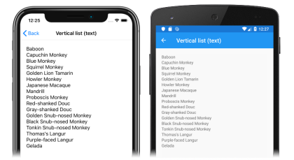

# Xamarin.Forms CollectionView Data


[ Download the sample](https://github.com/xamarin/xamarin-forms-samples/tree/forms40/UserInterface/CollectionViewDemos/)

`CollectionView` defines the following properties that define the data to be displayed, and its appearance:

- `ItemsSource`, of type `IEnumerable`, specifies the collection of items to be displayed, and has a default value of `null`.
- `ItemTemplate`, of type [`DataTemplate`](xref:Xamarin.Forms.DataTemplate), specifies the template to apply to each item in the collection of items to be displayed.

These properties are backed by [`BindableProperty`](xref:Xamarin.Forms.BindableProperty) objects, which means that the properties can be targets of data bindings.

## Populate a CollectionView with data

A `CollectionView` is populated with data by setting its `ItemsSource` property to any collection that implements `IEnumerable`. Items can be added in XAML by initializing the `ItemsSource` property from an array of strings:

```xaml
<CollectionView>
  <CollectionView.ItemsSource>
    <x:Array Type="{x:Type x:String}">
      <x:String>Baboon</x:String>
      <x:String>Capuchin Monkey</x:String>
      <x:String>Blue Monkey</x:String>
      <x:String>Squirrel Monkey</x:String>
      <x:String>Golden Lion Tamarin</x:String>
      <x:String>Howler Monkey</x:String>
      <x:String>Japanese Macaque</x:String>
    </x:Array>
  </CollectionView.ItemsSource>
</CollectionView>
```

> [!NOTE]
> Note that the `x:Array` element requires a `Type` attribute indicating the type of the items in the array.

The equivalent C# code is:

```csharp
CollectionView collectionView = new CollectionView();
collectionView.ItemsSource = new string[]
{
    "Baboon",
    "Capuchin Monkey",
    "Blue Monkey",
    "Squirrel Monkey",
    "Golden Lion Tamarin",
    "Howler Monkey",
    "Japanese Macaque"
};
```

> [!IMPORTANT]
> If the `CollectionView` is required to refresh as items are added, removed, or changed in the underlying collection, the underlying collection should be an `IEnumerable` collection that sends property change notifications, such as `ObservableCollection`.

By default, `CollectionView` displays items in a vertical list, as shown in the following screenshots:

[](populate-data-images/text-large.png#lightbox "Text items in a CollectionView")

For information on how to change the `CollectionView` layout, see [Specify a Layout](layout.md). For information on how to define the appearance of each item in the `CollectionView`, see [Define item appearance](#define-item-appearance).

### Data binding

`CollectionView` can be populated with data by using data binding to bind its `ItemsSource` property to an `IEnumerable` collection. In XAML, this is achieved with the `Binding` markup extension:

```xaml
<CollectionView ItemsSource="{Binding Monkeys}" />
```

The equivalent C# code is:

```csharp
CollectionView collectionView = new CollectionView();
collectionView.SetBinding(ItemsView.ItemsSourceProperty, "Monkeys");
```

In this example, the `ItemsSource` property data binds to the `Monkeys` property of the connected view model.

> [!NOTE]
> Compiled bindings can be enabled to improve data binding performance in Xamarin.Forms applications. For more information, see [Compiled Bindings](~/xamarin-forms/app-fundamentals/data-binding/compiled-bindings.md).

For more information about data binding, see [Xamarin.Forms Data Binding](~/xamarin-forms/app-fundamentals/data-binding/index.md).

## Define item appearance

The appearance of each item in the `CollectionView` can be defined by setting the `CollectionView.ItemTemplate` property to a [`DataTemplate`](xref:Xamarin.Forms.DataTemplate):

```xaml
<CollectionView ItemsSource="{Binding Monkeys}">
    <CollectionView.ItemTemplate>
        <DataTemplate>
            <Grid Padding="10">
                <Grid.RowDefinitions>
                    <RowDefinition Height="Auto" />
                    <RowDefinition Height="Auto" />
                </Grid.RowDefinitions>
                <Grid.ColumnDefinitions>
                    <ColumnDefinition Width="Auto" />
                    <ColumnDefinition Width="Auto" />
                </Grid.ColumnDefinitions>
                <Image Grid.RowSpan="2"
                       Source="{Binding ImageUrl}"
                       Aspect="AspectFill"
                       HeightRequest="60"
                       WidthRequest="60" />
                <Label Grid.Column="1"
                       Text="{Binding Name}"
                       FontAttributes="Bold" />
                <Label Grid.Row="1"
                       Grid.Column="1"
                       Text="{Binding Location}"
                       FontAttributes="Italic"
                       VerticalOptions="End" />
            </Grid>
        </DataTemplate>
    </CollectionView.ItemTemplate>
    ...
</CollectionView>
```

The equivalent C# code is:

```csharp
CollectionView collectionView = new CollectionView();
collectionView.SetBinding(ItemsView.ItemsSourceProperty, "Monkeys");

collectionView.ItemTemplate = new DataTemplate(() =>
{
    Grid grid = new Grid { Padding = 10 };
    grid.RowDefinitions.Add(new RowDefinition { Height = GridLength.Auto });
    grid.RowDefinitions.Add(new RowDefinition { Height = GridLength.Auto });
    grid.ColumnDefinitions.Add(new ColumnDefinition { Width = GridLength.Auto });
    grid.ColumnDefinitions.Add(new ColumnDefinition { Width = GridLength.Auto });

    Image image = new Image { Aspect = Aspect.AspectFill, HeightRequest = 60, WidthRequest = 60 };
    image.SetBinding(Image.SourceProperty, "ImageUrl");

    Label nameLabel = new Label { FontAttributes = FontAttributes.Bold };
    nameLabel.SetBinding(Label.TextProperty, "Name");

    Label locationLabel = new Label { FontAttributes = FontAttributes.Italic, VerticalOptions = LayoutOptions.End };
    locationLabel.SetBinding(Label.TextProperty, "Location");

    Grid.SetRowSpan(image, 2);

    grid.Children.Add(image);
    grid.Children.Add(nameLabel, 1, 0);
    grid.Children.Add(locationLabel, 1, 1);

    return grid;
});
```

The elements specified in the [`DataTemplate`](xref:Xamarin.Forms.DataTemplate) define the appearance of each item in the list. In the example, layout within the `DataTemplate` is managed by a [`Grid`](xref:Xamarin.Forms.Grid). The `Grid` contains an [`Image`](xref:Xamarin.Forms.Image) object, and two [`Label`](xref:Xamarin.Forms.Label) objects, that all bind to properties of the `Monkey` class:

```csharp
public class Monkey
{
    public string Name { get; set; }
    public string Location { get; set; }
    public string Details { get; set; }
    public string ImageUrl { get; set; }
}
```

The following screenshots show the result of templating each item in the list:

[](populate-data-images/datatemplate-large.png#lightbox "Templated items in a CollectionView")

For more information about data templates, see [Xamarin.Forms Data Templates](~/xamarin-forms/app-fundamentals/templates/data-templates/index.md).

## Choose item appearance at runtime

The appearance of each item in the `CollectionView` can be chosen at runtime, based on the item value, by setting the `CollectionView.ItemTemplate` property to a [`DataTemplateSelector`](xref:Xamarin.Forms.DataTemplateSelector) object:

```xaml
<ContentPage ...
             xmlns:controls="clr-namespace:CollectionViewDemos.Controls">
    <ContentPage.Resources>
        <DataTemplate x:Key="AmericanMonkeyTemplate">
            ...
        </DataTemplate>

        <DataTemplate x:Key="OtherMonkeyTemplate">
            ...
        </DataTemplate>

        <controls:MonkeyDataTemplateSelector x:Key="MonkeySelector"
                                             AmericanMonkey="{StaticResource AmericanMonkeyTemplate}"
                                             OtherMonkey="{StaticResource OtherMonkeyTemplate}" />
    </ContentPage.Resources>

    <CollectionView ItemsSource="{Binding Monkeys}"
                    ItemTemplate="{StaticResource MonkeySelector}" />
</ContentPage>
```

The equivalent C# code is:

```csharp
CollectionView collectionView = new CollectionView
{
    ItemTemplate = new MonkeyDataTemplateSelector { ... }
};
collectionView.SetBinding(ItemsView.ItemsSourceProperty, "Monkeys");
```

The `ItemTemplate` property is set to a `MonkeyDataTemplateSelector` object. The following example shows the `MonkeyDataTemplateSelector` class:

```csharp
public class MonkeyDataTemplateSelector : DataTemplateSelector
{
    public DataTemplate AmericanMonkey { get; set; }
    public DataTemplate OtherMonkey { get; set; }

    protected override DataTemplate OnSelectTemplate(object item, BindableObject container)
    {
        return ((Monkey)item).Location.Contains("America") ? AmericanMonkey : OtherMonkey;
    }
}
```

The `MonkeyDataTemplateSelector` class defines `AmericanMonkey` and `OtherMonkey` [`DataTemplate`](xref:Xamarin.Forms.DataTemplate) properties that are set to different data templates. The `OnSelectTemplate` override returns the `AmericanMonkey` template, which displays the monkey name and location in teal, when the monkey name contains "America". When the monkey name doesn't contain "America", the `OnSelectTemplate` override returns the `OtherMonkey` template, which displays the monkey name and location in silver:

[](populate-data-images/datatemplateselector-large.png#lightbox "Runtime item template selection in a CollectionView")

For more information about data template selectors, see [Create a Xamarin.Forms DataTemplateSelector](~/xamarin-forms/app-fundamentals/templates/data-templates/selector.md).

## Related links

- [CollectionView (sample)](https://github.com/xamarin/xamarin-forms-samples/tree/forms40/UserInterface/CollectionViewDemos/)
- [Xamarin.Forms Data Binding](~/xamarin-forms/app-fundamentals/data-binding/index.md)
- [Xamarin.Forms Data Templates](~/xamarin-forms/app-fundamentals/templates/data-templates/index.md)
- [Create a Xamarin.Forms DataTemplateSelector](~/xamarin-forms/app-fundamentals/templates/data-templates/selector.md)
