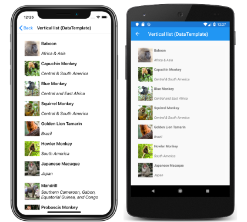
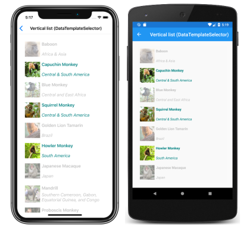
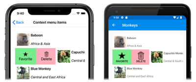

# Xamarin.Forms CollectionView Data

[ Download the sample](/samples/xamarin/xamarin-forms-samples/userinterface-collectionviewdemos/)

[`CollectionView`](xref:Xamarin.Forms.CollectionView) includes the following properties that define the data to be displayed, and its appearance:

- [`ItemsSource`](xref:Xamarin.Forms.ItemsView.ItemsSource), of type `IEnumerable`, specifies the collection of items to be displayed, and has a default value of `null`.
- [`ItemTemplate`](xref:Xamarin.Forms.ItemsView.ItemTemplate), of type [`DataTemplate`](xref:Xamarin.Forms.DataTemplate), specifies the template to apply to each item in the collection of items to be displayed.

These properties are backed by [`BindableProperty`](xref:Xamarin.Forms.BindableProperty) objects, which means that the properties can be targets of data bindings.

> [!NOTE]
> [`CollectionView`](xref:Xamarin.Forms.CollectionView) defines a `ItemsUpdatingScrollMode` property that represents the scrolling behavior of the `CollectionView` when new items are added to it. For more information about this property, see [Control scroll position when new items are added](scrolling.md#control-scroll-position-when-new-items-are-added).

[`CollectionView`](xref:Xamarin.Forms.CollectionView) supports incremental data virtualization as the user scrolls. For more information, see [Load data incrementally](#load-data-incrementally).

## Populate a CollectionView with data

A [`CollectionView`](xref:Xamarin.Forms.CollectionView) is populated with data by setting its [`ItemsSource`](xref:Xamarin.Forms.ItemsView.ItemsSource) property to any collection that implements `IEnumerable`. By default, [`CollectionView`](xref:Xamarin.Forms.CollectionView) displays items in a vertical list.

> [!IMPORTANT]
> If the [`CollectionView`](xref:Xamarin.Forms.CollectionView) is required to refresh as items are added, removed, or changed in the underlying collection, the underlying collection should be an `IEnumerable` collection that sends property change notifications, such as `ObservableCollection`.

[`CollectionView`](xref:Xamarin.Forms.CollectionView) can be populated with data by using data binding to bind its [`ItemsSource`](xref:Xamarin.Forms.ItemsView.ItemsSource) property to an `IEnumerable` collection. In XAML, this is achieved with the `Binding` markup extension:

```xaml
<CollectionView ItemsSource="{Binding Monkeys}" />
```

The equivalent C# code is:

```csharp
CollectionView collectionView = new CollectionView();
collectionView.SetBinding(ItemsView.ItemsSourceProperty, "Monkeys");
```

In this example, the [`ItemsSource`](xref:Xamarin.Forms.ItemsView.ItemsSource) property data binds to the `Monkeys` property of the connected viewmodel.

> [!NOTE]
> Compiled bindings can be enabled to improve data binding performance in Xamarin.Forms applications. For more information, see [Compiled Bindings](~/xamarin-forms/app-fundamentals/data-binding/compiled-bindings.md).

For information on how to change the [`CollectionView`](xref:Xamarin.Forms.CollectionView) layout, see [Xamarin.Forms CollectionView Layout](layout.md). For information on how to define the appearance of each item in the `CollectionView`, see [Define item appearance](#define-item-appearance). For more information about data binding, see [Xamarin.Forms Data Binding](~/xamarin-forms/app-fundamentals/data-binding/index.md).

> [!WARNING]
> [`CollectionView`](xref:Xamarin.Forms.CollectionView) will throw an exception if its [`ItemsSource`](xref:Xamarin.Forms.ItemsView.ItemsSource) is updated off the UI thread.

## Define item appearance

The appearance of each item in the [`CollectionView`](xref:Xamarin.Forms.CollectionView) can be defined by setting the [`CollectionView.ItemTemplate`](xref:Xamarin.Forms.ItemsView.ItemTemplate) property to a [`DataTemplate`](xref:Xamarin.Forms.DataTemplate):

```xaml
<CollectionView ItemsSource="{Binding Monkeys}">
    <CollectionView.ItemTemplate>
        <DataTemplate>
            <Grid Padding="10">
                <Grid.RowDefinitions>
                    <RowDefinition Height="Auto" />
                    <RowDefinition Height="Auto" />
                </Grid.RowDefinitions>
                <Grid.ColumnDefinitions>
                    <ColumnDefinition Width="Auto" />
                    <ColumnDefinition Width="Auto" />
                </Grid.ColumnDefinitions>
                <Image Grid.RowSpan="2"
                       Source="{Binding ImageUrl}"
                       Aspect="AspectFill"
                       HeightRequest="60"
                       WidthRequest="60" />
                <Label Grid.Column="1"
                       Text="{Binding Name}"
                       FontAttributes="Bold" />
                <Label Grid.Row="1"
                       Grid.Column="1"
                       Text="{Binding Location}"
                       FontAttributes="Italic"
                       VerticalOptions="End" />
            </Grid>
        </DataTemplate>
    </CollectionView.ItemTemplate>
    ...
</CollectionView>
```

The equivalent C# code is:

```csharp
CollectionView collectionView = new CollectionView();
collectionView.SetBinding(ItemsView.ItemsSourceProperty, "Monkeys");

collectionView.ItemTemplate = new DataTemplate(() =>
{
    Grid grid = new Grid { Padding = 10 };
    grid.RowDefinitions.Add(new RowDefinition { Height = GridLength.Auto });
    grid.RowDefinitions.Add(new RowDefinition { Height = GridLength.Auto });
    grid.ColumnDefinitions.Add(new ColumnDefinition { Width = GridLength.Auto });
    grid.ColumnDefinitions.Add(new ColumnDefinition { Width = GridLength.Auto });

    Image image = new Image { Aspect = Aspect.AspectFill, HeightRequest = 60, WidthRequest = 60 };
    image.SetBinding(Image.SourceProperty, "ImageUrl");

    Label nameLabel = new Label { FontAttributes = FontAttributes.Bold };
    nameLabel.SetBinding(Label.TextProperty, "Name");

    Label locationLabel = new Label { FontAttributes = FontAttributes.Italic, VerticalOptions = LayoutOptions.End };
    locationLabel.SetBinding(Label.TextProperty, "Location");

    Grid.SetRowSpan(image, 2);

    grid.Children.Add(image);
    grid.Children.Add(nameLabel, 1, 0);
    grid.Children.Add(locationLabel, 1, 1);

    return grid;
});
```

The elements specified in the [`DataTemplate`](xref:Xamarin.Forms.DataTemplate) define the appearance of each item in the list. In the example, layout within the `DataTemplate` is managed by a [`Grid`](xref:Xamarin.Forms.Grid). The `Grid` contains an [`Image`](xref:Xamarin.Forms.Image) object, and two [`Label`](xref:Xamarin.Forms.Label) objects, that all bind to properties of the `Monkey` class:

```csharp
public class Monkey
{
    public string Name { get; set; }
    public string Location { get; set; }
    public string Details { get; set; }
    public string ImageUrl { get; set; }
}
```

The following screenshots show the result of templating each item in the list:

[](populate-data-images/datatemplate-large.png#lightbox "Templated items in a CollectionView")

For more information about data templates, see [Xamarin.Forms Data Templates](~/xamarin-forms/app-fundamentals/templates/data-templates/index.md).

## Choose item appearance at runtime

The appearance of each item in the [`CollectionView`](xref:Xamarin.Forms.CollectionView) can be chosen at runtime, based on the item value, by setting the [`CollectionView.ItemTemplate`](xref:Xamarin.Forms.ItemsView.ItemTemplate) property to a [`DataTemplateSelector`](xref:Xamarin.Forms.DataTemplateSelector) object:

```xaml
<ContentPage ...
             xmlns:controls="clr-namespace:CollectionViewDemos.Controls">
    <ContentPage.Resources>
        <DataTemplate x:Key="AmericanMonkeyTemplate">
            ...
        </DataTemplate>

        <DataTemplate x:Key="OtherMonkeyTemplate">
            ...
        </DataTemplate>

        <controls:MonkeyDataTemplateSelector x:Key="MonkeySelector"
                                             AmericanMonkey="{StaticResource AmericanMonkeyTemplate}"
                                             OtherMonkey="{StaticResource OtherMonkeyTemplate}" />
    </ContentPage.Resources>

    <CollectionView ItemsSource="{Binding Monkeys}"
                    ItemTemplate="{StaticResource MonkeySelector}" />
</ContentPage>
```

The equivalent C# code is:

```csharp
CollectionView collectionView = new CollectionView
{
    ItemTemplate = new MonkeyDataTemplateSelector { ... }
};
collectionView.SetBinding(ItemsView.ItemsSourceProperty, "Monkeys");
```

The [`ItemTemplate`](xref:Xamarin.Forms.ItemsView.ItemTemplate) property is set to a `MonkeyDataTemplateSelector` object. The following example shows the `MonkeyDataTemplateSelector` class:

```csharp
public class MonkeyDataTemplateSelector : DataTemplateSelector
{
    public DataTemplate AmericanMonkey { get; set; }
    public DataTemplate OtherMonkey { get; set; }

    protected override DataTemplate OnSelectTemplate(object item, BindableObject container)
    {
        return ((Monkey)item).Location.Contains("America") ? AmericanMonkey : OtherMonkey;
    }
}
```

The `MonkeyDataTemplateSelector` class defines `AmericanMonkey` and `OtherMonkey` [`DataTemplate`](xref:Xamarin.Forms.DataTemplate) properties that are set to different data templates. The `OnSelectTemplate` override returns the `AmericanMonkey` template, which displays the monkey name and location in teal, when the monkey name contains "America". When the monkey name doesn't contain "America", the `OnSelectTemplate` override returns the `OtherMonkey` template, which displays the monkey name and location in silver:

[](populate-data-images/datatemplateselector-large.png#lightbox "Runtime item template selection in a CollectionView")

For more information about data template selectors, see [Create a Xamarin.Forms DataTemplateSelector](~/xamarin-forms/app-fundamentals/templates/data-templates/selector.md).

> [!IMPORTANT]
> When using [`CollectionView`](xref:Xamarin.Forms.CollectionView), never set the root element of your [`DataTemplate`](xref:Xamarin.Forms.DataTemplate) objects to a `ViewCell`. This will result in an exception being thrown because `CollectionView` has no concept of cells.

## Context menus

[`CollectionView`](xref:Xamarin.Forms.CollectionView) supports context menus for items of data through the `SwipeView`, which reveals the context menu with a swipe gesture. The `SwipeView` is a container control that wraps around an item of content, and provides context menu items for that item of content. Therefore, context menus are implemented for a `CollectionView` by creating a `SwipeView` that defines the content that the `SwipeView` wraps around, and the context menu items that are revealed by the swipe gesture. This is achieved by setting the `SwipeView` as the root view in the [`DataTemplate`](xref:Xamarin.Forms.DataTemplate) that defines the appearance of each item of data in the `CollectionView`:

```xaml
<CollectionView x:Name="collectionView"
                ItemsSource="{Binding Monkeys}">
    <CollectionView.ItemTemplate>
        <DataTemplate>
            <SwipeView>
                <SwipeView.LeftItems>
                    <SwipeItems>
                        <SwipeItem Text="Favorite"
                                   IconImageSource="favorite.png"
                                   BackgroundColor="LightGreen"
                                   Command="{Binding Source={x:Reference collectionView}, Path=BindingContext.FavoriteCommand}"
                                   CommandParameter="{Binding}" />
                        <SwipeItem Text="Delete"
                                   IconImageSource="delete.png"
                                   BackgroundColor="LightPink"
                                   Command="{Binding Source={x:Reference collectionView}, Path=BindingContext.DeleteCommand}"
                                   CommandParameter="{Binding}" />
                    </SwipeItems>
                </SwipeView.LeftItems>
                <Grid BackgroundColor="White"
                      Padding="10">
                    <!-- Define item appearance -->
                </Grid>
            </SwipeView>
        </DataTemplate>
    </CollectionView.ItemTemplate>
</CollectionView>
```

The equivalent C# code is:

```csharp
CollectionView collectionView = new CollectionView();
collectionView.SetBinding(ItemsView.ItemsSourceProperty, "Monkeys");

collectionView.ItemTemplate = new DataTemplate(() =>
{
    // Define item appearance
    Grid grid = new Grid { Padding = 10, BackgroundColor = Color.White };
    // ...

    SwipeView swipeView = new SwipeView();
    SwipeItem favoriteSwipeItem = new SwipeItem
    {
        Text = "Favorite",
        IconImageSource = "favorite.png",
        BackgroundColor = Color.LightGreen
    };
    favoriteSwipeItem.SetBinding(MenuItem.CommandProperty, new Binding("BindingContext.FavoriteCommand", source: collectionView));
    favoriteSwipeItem.SetBinding(MenuItem.CommandParameterProperty, ".");

    SwipeItem deleteSwipeItem = new SwipeItem
    {
        Text = "Delete",
        IconImageSource = "delete.png",
        BackgroundColor = Color.LightPink
    };
    deleteSwipeItem.SetBinding(MenuItem.CommandProperty, new Binding("BindingContext.DeleteCommand", source: collectionView));
    deleteSwipeItem.SetBinding(MenuItem.CommandParameterProperty, ".");

    swipeView.LeftItems = new SwipeItems { favoriteSwipeItem, deleteSwipeItem };
    swipeView.Content = grid;    
    return swipeView;
});
```

In this example, the `SwipeView` content is a [`Grid`](xref:Xamarin.Forms.Grid) that defines the appearance of each item in the [`CollectionView`](xref:Xamarin.Forms.CollectionView). The swipe items are used to perform actions on the `SwipeView` content, and are revealed when the control is swiped from the left side:

[](populate-data-images/swipeview-large.png#lightbox "CollectionView with SwipeView context menu items")

`SwipeView` supports four different swipe directions, with the swipe direction being defined by the directional `SwipeItems` collection the `SwipeItems` objects are added to. By default, a swipe item is executed when it's tapped by the user. In addition, once a swipe item has been executed the swipe items are hidden and the `SwipeView` content is re-displayed. However, these behaviors can be changed.

For more information about the `SwipeView` control, see [Xamarin.Forms SwipeView](~/xamarin-forms/user-interface/swipeview.md).

## Pull to refresh

[`CollectionView`](xref:Xamarin.Forms.CollectionView) supports pull to refresh functionality through the `RefreshView`, which enables the data being displayed to be refreshed by pulling down on the list of items. The `RefreshView` is a container control that provides pull to refresh functionality to its child, provided that the child supports scrollable content. Therefore, pull to refresh is implemented for a `CollectionView` by setting it as the child of a `RefreshView`:

```xaml
<RefreshView IsRefreshing="{Binding IsRefreshing}"
             Command="{Binding RefreshCommand}">
    <CollectionView ItemsSource="{Binding Animals}">
        ...
    </CollectionView>
</RefreshView>
```

The equivalent C# code is:

```csharp
RefreshView refreshView = new RefreshView();
ICommand refreshCommand = new Command(() =>
{
    // IsRefreshing is true
    // Refresh data here
    refreshView.IsRefreshing = false;
});
refreshView.Command = refreshCommand;

CollectionView collectionView = new CollectionView();
collectionView.SetBinding(ItemsView.ItemsSourceProperty, "Animals");
refreshView.Content = collectionView;
// ...
```

When the user initiates a refresh, the `ICommand` defined by the `Command` property is executed, which should refresh the items being displayed. A refresh visualization is shown while the refresh occurs, which consists of an animated progress circle:

[](populate-data-images/pull-to-refresh-large.png#lightbox "CollectionView pull-to-refresh")

The value of the `RefreshView.IsRefreshing` property indicates the current state of the `RefreshView`. When a refresh is triggered by the user, this property will automatically transition to `true`. Once the refresh completes, you should reset the property to `false`.

For more information about `RefreshView`, see [Xamarin.Forms RefreshView](~/xamarin-forms/user-interface/refreshview.md).

## Load data incrementally

[`CollectionView`](xref:Xamarin.Forms.CollectionView) supports incremental data virtualization as the user scrolls. This enables scenarios such as asynchronously loading a page of data from a web service, as the user scrolls. In addition, the point at which more data is loaded is configurable so that users don't see blank space, or are stopped from scrolling.

[`CollectionView`](xref:Xamarin.Forms.CollectionView) defines the following properties to control incremental loading of data:

- `RemainingItemsThreshold`, of type `int`, the threshold of items not yet visible in the list at which the `RemainingItemsThresholdReached` event will be fired.
- `RemainingItemsThresholdReachedCommand`, of type `ICommand`, which is executed when the `RemainingItemsThreshold` is reached.
- `RemainingItemsThresholdReachedCommandParameter`, of type `object`, which is the parameter that's passed to the `RemainingItemsThresholdReachedCommand`.

[`CollectionView`](xref:Xamarin.Forms.CollectionView) also defines a `RemainingItemsThresholdReached` event that is fired when the `CollectionView` is scrolled far enough that `RemainingItemsThreshold` items have not been displayed. This event can be handled to load more items. In addition, when the `RemainingItemsThresholdReached` event is fired, the `RemainingItemsThresholdReachedCommand` is executed, enabling incremental data loading to take place in a viewmodel.

The default value of the `RemainingItemsThreshold` property is -1, which indicates that the `RemainingItemsThresholdReached` event will never be fired. When the property value is 0, the `RemainingItemsThresholdReached` event will be fired when the final item in the [`ItemsSource`](xref:Xamarin.Forms.ItemsView.ItemsSource) is displayed. For values greater than 0, the `RemainingItemsThresholdReached` event will be fired when the `ItemsSource` contains that number of items not yet scrolled to.

> [!NOTE]
> [`CollectionView`](xref:Xamarin.Forms.CollectionView) validates the `RemainingItemsThreshold` property so that its value is always greater than or equal to -1.

The following XAML example shows a [`CollectionView`](xref:Xamarin.Forms.CollectionView) that loads data incrementally:

```xaml
<CollectionView ItemsSource="{Binding Animals}"
                RemainingItemsThreshold="5"
                RemainingItemsThresholdReached="OnCollectionViewRemainingItemsThresholdReached">
    ...
</CollectionView>
```

The equivalent C# code is:

```csharp
CollectionView collectionView = new CollectionView
{
    RemainingItemsThreshold = 5
};
collectionView.RemainingItemsThresholdReached += OnCollectionViewRemainingItemsThresholdReached;
collectionView.SetBinding(ItemsView.ItemsSourceProperty, "Animals");
```

In this code example, the `RemainingItemsThresholdReached` event fires when there are 5 items not yet scrolled to, and in response executes the `OnCollectionViewRemainingItemsThresholdReached` event handler:

```csharp
void OnCollectionViewRemainingItemsThresholdReached(object sender, EventArgs e)
{
    // Retrieve more data here and add it to the CollectionView's ItemsSource collection.
}
```

> [!NOTE]
> Data can also be loaded incrementally by binding the `RemainingItemsThresholdReachedCommand` to an `ICommand` implementation in the viewmodel.

## Related links

- [CollectionView (sample)](/samples/xamarin/xamarin-forms-samples/userinterface-collectionviewdemos/)
- [Xamarin.Forms RefreshView](~/xamarin-forms/user-interface/refreshview.md)
- [Xamarin.Forms SwipeView](~/xamarin-forms/user-interface/swipeview.md)
- [Xamarin.Forms Data Binding](~/xamarin-forms/app-fundamentals/data-binding/index.md)
- [Xamarin.Forms Data Templates](~/xamarin-forms/app-fundamentals/templates/data-templates/index.md)
- [Create a Xamarin.Forms DataTemplateSelector](~/xamarin-forms/app-fundamentals/templates/data-templates/selector.md)