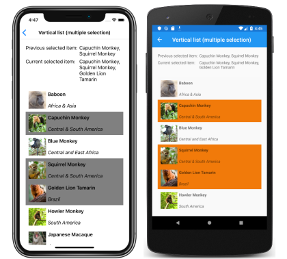

# Xamarin.Forms CollectionView Selection

[ Download the sample](/samples/xamarin/xamarin-forms-samples/userinterface-collectionviewdemos/)

[`CollectionView`](xref:Xamarin.Forms.CollectionView) defines the following properties that control item selection:

- [`SelectionMode`](xref:Xamarin.Forms.SelectableItemsView.SelectionMode), of type [`SelectionMode`](xref:Xamarin.Forms.SelectionMode), the selection mode.
- [`SelectedItem`](xref:Xamarin.Forms.SelectableItemsView.SelectedItem), of type `object`, the selected item in the list. This property has a default binding mode of `TwoWay`, and has a `null` value when no item is selected.
- [`SelectedItems`](xref:Xamarin.Forms.SelectableItemsView.SelectedItems), of type `IList<object>`, the selected items in the list. This property has a default binding mode of `OneWay`, and has a `null` value when no items are selected.
- [`SelectionChangedCommand`](xref:Xamarin.Forms.SelectableItemsView.SelectionChangedCommand), of type `ICommand`, which is executed when the selected item changes.
- [`SelectionChangedCommandParameter`](xref:Xamarin.Forms.SelectableItemsView.SelectionChangedCommandParameter), of type `object`, which is the parameter that's passed to the `SelectionChangedCommand`.

All of these properties are backed by [`BindableProperty`](xref:Xamarin.Forms.BindableProperty) objects, which means that the properties can be targets of data bindings.

By default, [`CollectionView`](xref:Xamarin.Forms.CollectionView) selection is disabled. However, this behavior can be changed by setting the [`SelectionMode`](xref:Xamarin.Forms.SelectableItemsView.SelectionMode) property value to one of the [`SelectionMode`](xref:Xamarin.Forms.SelectionMode) enumeration members:

- `None` – indicates that items cannot be selected. This is the default value.
- `Single` – indicates that a single item can be selected, with the selected item being highlighted.
- `Multiple` – indicates that multiple items can be selected, with the selected items being highlighted.

[`CollectionView`](xref:Xamarin.Forms.CollectionView) defines a [`SelectionChanged`](xref:Xamarin.Forms.SelectableItemsView.SelectionChanged) event that is fired when the [`SelectedItem`](xref:Xamarin.Forms.SelectableItemsView.SelectedItem) property changes, either due to the user selecting an item from the list, or when an application sets the property. In addition, this event is also fired when the [`SelectedItems`](xref:Xamarin.Forms.SelectableItemsView.SelectedItems) property changes. The [`SelectionChangedEventArgs`](xref:Xamarin.Forms.SelectionChangedEventArgs) object that accompanies the `SelectionChanged` event has two properties, both of type `IReadOnlyList<object>`:

- `PreviousSelection` – the list of items that were selected, before the selection changed.
- `CurrentSelection` – the list of items that are selected, after the selection change.

In addition, [`CollectionView`](xref:Xamarin.Forms.CollectionView) has a `UpdateSelectedItems` method that updates the [`SelectedItems`](xref:Xamarin.Forms.SelectableItemsView.SelectedItems) property with a list of selected items, while only firing a single change notification.

## Single selection

When the [`SelectionMode`](xref:Xamarin.Forms.SelectableItemsView.SelectionMode) property is set to `Single`, a single item in the [`CollectionView`](xref:Xamarin.Forms.CollectionView) can be selected. When an item is selected, the [`SelectedItem`](xref:Xamarin.Forms.SelectableItemsView.SelectedItem) property will be set to the value of the selected item. When this property changes, the [`SelectionChangedCommand`](xref:Xamarin.Forms.SelectableItemsView.SelectionChangedCommand) is executed (with the value of the [`SelectionChangedCommandParameter`](xref:Xamarin.Forms.SelectableItemsView.SelectionChangedCommandParameter) being passed to the `ICommand`), and the [`SelectionChanged`](xref:Xamarin.Forms.SelectableItemsView.SelectionChanged) event fires.

The following XAML example shows a [`CollectionView`](xref:Xamarin.Forms.CollectionView) that can respond to single item selection:

```xaml
<CollectionView ItemsSource="{Binding Monkeys}"
                SelectionMode="Single"
                SelectionChanged="OnCollectionViewSelectionChanged">
    ...
</CollectionView>
```

The equivalent C# code is:

```csharp
CollectionView collectionView = new CollectionView
{
    SelectionMode = SelectionMode.Single
};
collectionView.SetBinding(ItemsView.ItemsSourceProperty, "Monkeys");
collectionView.SelectionChanged += OnCollectionViewSelectionChanged;
```

In this code example, the `OnCollectionViewSelectionChanged` event handler is executed when the [`SelectionChanged`](xref:Xamarin.Forms.SelectableItemsView.SelectionChanged) event fires, with the event handler retrieving the previously selected item, and the current selected item:

```csharp
void OnCollectionViewSelectionChanged(object sender, SelectionChangedEventArgs e)
{
    string previous = (e.PreviousSelection.FirstOrDefault() as Monkey)?.Name;
    string current = (e.CurrentSelection.FirstOrDefault() as Monkey)?.Name;
    ...
}
```

> [!IMPORTANT]
> The [`SelectionChanged`](xref:Xamarin.Forms.SelectableItemsView.SelectionChanged) event can be fired by changes that occur as a result of changing the [`SelectionMode`](xref:Xamarin.Forms.SelectableItemsView.SelectionMode) property.

The following screenshots show single item selection in a [`CollectionView`](xref:Xamarin.Forms.CollectionView):

[](selection-images/single-selection-large.png#lightbox "CollectionView vertical list with single selection")

## Multiple selection

When the [`SelectionMode`](xref:Xamarin.Forms.SelectableItemsView.SelectionMode) property is set to `Multiple`, multiple items in the [`CollectionView`](xref:Xamarin.Forms.CollectionView) can be selected. When items are selected, the [`SelectedItems`](xref:Xamarin.Forms.SelectableItemsView.SelectedItems) property will be set to the selected items. When this property changes, the [`SelectionChangedCommand`](xref:Xamarin.Forms.SelectableItemsView.SelectionChangedCommand) is executed (with the value of the [`SelectionChangedCommandParameter`](xref:Xamarin.Forms.SelectableItemsView.SelectionChangedCommandParameter) being passed to the `ICommand`), and the [`SelectionChanged`](xref:Xamarin.Forms.SelectableItemsView.SelectionChanged) event fires.

The following XAML example shows a [`CollectionView`](xref:Xamarin.Forms.CollectionView) that can respond to multiple item selection:

```xaml
<CollectionView ItemsSource="{Binding Monkeys}"
                SelectionMode="Multiple"
                SelectionChanged="OnCollectionViewSelectionChanged">
    ...
</CollectionView>
```

The equivalent C# code is:

```csharp
CollectionView collectionView = new CollectionView
{
    SelectionMode = SelectionMode.Multiple
};
collectionView.SetBinding(ItemsView.ItemsSourceProperty, "Monkeys");
collectionView.SelectionChanged += OnCollectionViewSelectionChanged;
```

In this code example, the `OnCollectionViewSelectionChanged` event handler is executed when the [`SelectionChanged`](xref:Xamarin.Forms.SelectableItemsView.SelectionChanged) event fires, with the event handler retrieving the previously selected items, and the current selected items:

```csharp
void OnCollectionViewSelectionChanged(object sender, SelectionChangedEventArgs e)
{
    var previous = e.PreviousSelection;
    var current = e.CurrentSelection;
    ...
}
```

> [!IMPORTANT]
> The [`SelectionChanged`](xref:Xamarin.Forms.SelectableItemsView.SelectionChanged) event can be fired by changes that occur as a result of changing the [`SelectionMode`](xref:Xamarin.Forms.SelectableItemsView.SelectionMode) property.

The following screenshots show multiple item selection in a [`CollectionView`](xref:Xamarin.Forms.CollectionView):

[](selection-images/multiple-selection-large.png#lightbox "CollectionView vertical list with multiple selection")

## Single pre-selection

When the [`SelectionMode`](xref:Xamarin.Forms.SelectableItemsView.SelectionMode) property is set to `Single`, a single item in the [`CollectionView`](xref:Xamarin.Forms.CollectionView) can be pre-selected by setting the [`SelectedItem`](xref:Xamarin.Forms.SelectableItemsView.SelectedItem) property to the item. The following XAML example shows a `CollectionView` that pre-selects a single item:

```xaml
<CollectionView ItemsSource="{Binding Monkeys}"
                SelectionMode="Single"
                SelectedItem="{Binding SelectedMonkey}">
    ...
</CollectionView>
```

The equivalent C# code is:

```csharp
CollectionView collectionView = new CollectionView
{
    SelectionMode = SelectionMode.Single
};
collectionView.SetBinding(ItemsView.ItemsSourceProperty, "Monkeys");
collectionView.SetBinding(SelectableItemsView.SelectedItemProperty, "SelectedMonkey");
```

> [!NOTE]
> The [`SelectedItem`](xref:Xamarin.Forms.SelectableItemsView.SelectedItem) property has a default binding mode of `TwoWay`.

The [`SelectedItem`](xref:Xamarin.Forms.SelectableItemsView.SelectedItem) property data binds to the `SelectedMonkey` property of the connected view model, which is of type `Monkey`. By default, a `TwoWay` binding is used so that if the user changes the selected item, the value of the `SelectedMonkey` property will be set to the selected `Monkey` object. The `SelectedMonkey` property is defined in the `MonkeysViewModel` class, and is set to the fourth item of the `Monkeys` collection:

```csharp
public class MonkeysViewModel : INotifyPropertyChanged
{
    ...
    public ObservableCollection<Monkey> Monkeys { get; private set; }

    Monkey selectedMonkey;
    public Monkey SelectedMonkey
    {
        get
        {
            return selectedMonkey;
        }
        set
        {
            if (selectedMonkey != value)
            {
                selectedMonkey = value;
            }
        }
    }

    public MonkeysViewModel()
    {
        ...
        selectedMonkey = Monkeys.Skip(3).FirstOrDefault();
    }
    ...
}
```

Therefore, when the [`CollectionView`](xref:Xamarin.Forms.CollectionView) appears, the fourth item in the list is pre-selected:

[](selection-images/single-pre-selection-large.png#lightbox "CollectionView vertical list with single pre-selection")

## Multiple pre-selection

When the [`SelectionMode`](xref:Xamarin.Forms.SelectableItemsView.SelectionMode) property is set to `Multiple`, multiple items in the [`CollectionView`](xref:Xamarin.Forms.CollectionView) can be pre-selected. The following XAML example shows a `CollectionView` that will enable the pre-selection of multiple items:

```xaml
<CollectionView x:Name="collectionView"
                ItemsSource="{Binding Monkeys}"
                SelectionMode="Multiple"
                SelectedItems="{Binding SelectedMonkeys}">
    ...
</CollectionView>
```

The equivalent C# code is:

```csharp
CollectionView collectionView = new CollectionView
{
    SelectionMode = SelectionMode.Multiple
};
collectionView.SetBinding(ItemsView.ItemsSourceProperty, "Monkeys");
collectionView.SetBinding(SelectableItemsView.SelectedItemsProperty, "SelectedMonkeys");
```

> [!NOTE]
> The [`SelectedItems`](xref:Xamarin.Forms.SelectableItemsView.SelectedItems) property has a default binding mode of `OneWay`.

The [`SelectedItems`](xref:Xamarin.Forms.SelectableItemsView.SelectedItems) property data binds to the `SelectedMonkeys` property of the connected view model, which is of type `ObservableCollection<object>`. The `SelectedMonkeys` property is defined in the `MonkeysViewModel` class, and is set to the second, fourth, and fifth items in the `Monkeys` collection:

```csharp
namespace CollectionViewDemos.ViewModels
{
    public class MonkeysViewModel : INotifyPropertyChanged
    {
        ...
        ObservableCollection<object> selectedMonkeys;
        public ObservableCollection<object> SelectedMonkeys
        {
            get
            {
                return selectedMonkeys;
            }
            set
            {
                if (selectedMonkeys != value)
                {
                    selectedMonkeys = value;
                }
            }
        }

        public MonkeysViewModel()
        {
            ...
            SelectedMonkeys = new ObservableCollection<object>()
            {
                Monkeys[1], Monkeys[3], Monkeys[4]
            };
        }
        ...
    }
}
```

Therefore, when the [`CollectionView`](xref:Xamarin.Forms.CollectionView) appears, the second, fourth, and fifth items in the list are pre-selected:

[](selection-images/multiple-pre-selection-large.png#lightbox "CollectionView vertical list with multiple pre-selection")

## Clear selections

The [`SelectedItem`](xref:Xamarin.Forms.SelectableItemsView.SelectedItem) and [`SelectedItems`](xref:Xamarin.Forms.SelectableItemsView.SelectedItems) properties can be cleared by setting them, or the objects they bind to, to `null`.

## Change selected item color

[`CollectionView`](xref:Xamarin.Forms.CollectionView) has a `Selected` [`VisualState`](xref:Xamarin.Forms.VisualState) that can be used to initiate a visual change to the selected item in the `CollectionView`. A common use case for this `VisualState` is to change the background color of the selected item, which is shown in the following XAML example:

```xaml
<ContentPage ...>
    <ContentPage.Resources>
        <Style TargetType="Grid">
            <Setter Property="VisualStateManager.VisualStateGroups">
                <VisualStateGroupList>
                    <VisualStateGroup x:Name="CommonStates">
                        <VisualState x:Name="Normal" />
                        <VisualState x:Name="Selected">
                            <VisualState.Setters>
                                <Setter Property="BackgroundColor"
                                        Value="LightSkyBlue" />
                            </VisualState.Setters>
                        </VisualState>
                    </VisualStateGroup>
                </VisualStateGroupList>
            </Setter>
        </Style>
    </ContentPage.Resources>
    <StackLayout Margin="20">
        <CollectionView ItemsSource="{Binding Monkeys}"
                        SelectionMode="Single">
            <CollectionView.ItemTemplate>
                <DataTemplate>
                    <Grid Padding="10">
                        ...
                    </Grid>
                </DataTemplate>
            </CollectionView.ItemTemplate>
        </CollectionView>
    </StackLayout>
</ContentPage>
```

> [!IMPORTANT]
> The [`Style`](xref:Xamarin.Forms.Style) that contains the `Selected` `VisualState` must have a [`TargetType`](xref:Xamarin.Forms.Style.TargetType) property value that's the type of the root element of the [`DataTemplate`](xref:Xamarin.Forms.DataTemplate), which is set as the `ItemTemplate` property value.

In this example, the [`Style.TargetType`](xref:Xamarin.Forms.Style.TargetType) property value is set to `Grid` because the root element of the [`ItemTemplate`](xref:Xamarin.Forms.ItemsView.ItemTemplate) is a [`Grid`](xref:Xamarin.Forms.Grid). The `Selected` [`VisualState`](xref:Xamarin.Forms.VisualState) specifies that when an item in the [`CollectionView`](xref:Xamarin.Forms.CollectionView) is selected, the [`BackgroundColor`](xref:Xamarin.Forms.VisualElement.BackgroundColor) of the item will be set to `LightSkyBlue`:

[](selection-images/single-selection-color-large.png#lightbox "CollectionView vertical list with a custom single selection color")

For more information about visual states, see [Xamarin.Forms Visual State Manager](~/xamarin-forms/user-interface/visual-state-manager.md).

## Disable selection

[`CollectionView`](xref:Xamarin.Forms.CollectionView) selection is disabled by default. However, if a `CollectionView` has selection enabled, it can be disabled by setting the [`SelectionMode`](xref:Xamarin.Forms.SelectableItemsView.SelectionMode) property to `None`:

```xaml
<CollectionView ...
                SelectionMode="None" />
```

The equivalent C# code is:

```csharp
CollectionView collectionView = new CollectionView
{
    ...
    SelectionMode = SelectionMode.None
};
```

When the [`SelectionMode`](xref:Xamarin.Forms.SelectableItemsView.SelectionMode) property is set to `None`, items in the [`CollectionView`](xref:Xamarin.Forms.CollectionView) cannot be selected, the [`SelectedItem`](xref:Xamarin.Forms.SelectableItemsView.SelectedItem) property will remain `null`, and the [`SelectionChanged`](xref:Xamarin.Forms.SelectableItemsView.SelectionChanged) event will not be fired.

> [!NOTE]
> When an item has been selected and the [`SelectionMode`](xref:Xamarin.Forms.SelectableItemsView.SelectionMode) property is changed from `Single` to `None`, the [`SelectedItem`](xref:Xamarin.Forms.SelectableItemsView.SelectedItem) property will be set to `null` and the [`SelectionChanged`](xref:Xamarin.Forms.SelectableItemsView.SelectionChanged) event will be fired with an empty `CurrentSelection` property.

## Related links

- [CollectionView (sample)](/samples/xamarin/xamarin-forms-samples/userinterface-collectionviewdemos/)
- [Xamarin.Forms Visual State Manager](~/xamarin-forms/user-interface/visual-state-manager.md)