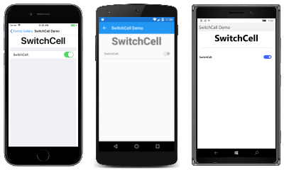
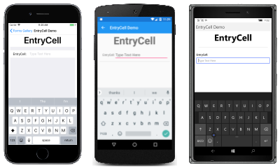

# Xamarin.Forms Cells

[ Download the sample](/samples/xamarin/xamarin-forms-samples/formsgallery)

_Xamarin.Forms cells can be added to ListViews and TableViews._

A *cell* is a specialized element used for items in a table and describes how each item in a list should be rendered. The [`Cell`](xref:Xamarin.Forms.Cell) class derives from [`Element`](xref:Xamarin.Forms.Element), from which [`VisualElement`](xref:Xamarin.Forms.Element) also derives. A cell is not itself a visual element; it is instead a template for creating a visual element.

`Cell` is used exclusively with [`ListView`](xref:Xamarin.Forms.ListView) and [`TableView`](xref:Xamarin.Forms.TableView) controls. To learn how to use and customize cells, refer to the [`ListView`](~/xamarin-forms/user-interface/listview/index.md) and [`TableView`](~/xamarin-forms/user-interface/tableview.md) documentation.

## Cells

Xamarin.Forms supports the following cell types:

| Type | Description | Appearance |
| --- | --- | --- |
| `TextCell` | A [`TextCell`](xref:Xamarin.Forms.TextCell) displays one or two text strings. Set the [`Text`](xref:Xamarin.Forms.TextCell.Text) property and, optionally, the [`Detail`](xref:Xamarin.Forms.TextCell.Detail) property to these text strings.  [API Documentation](xref:Xamarin.Forms.TextCell) / [Guide](~/xamarin-forms/user-interface/listview/customizing-cell-appearance.md#textcell) |  [C# code for this page](https://github.com/xamarin/xamarin-forms-samples/blob/master/FormsGallery/FormsGallery/FormsGallery/CodeExamples/TextCellDemoPage.cs) / [XAML page](https://github.com/xamarin/xamarin-forms-samples/blob/master/FormsGallery/FormsGallery/FormsGallery/XamlExamples/TextCellDemoPage.xaml) |
| `ImageCell` | The [`ImageCell`](xref:Xamarin.Forms.ImageCell) displays the same information as [`TextCell`](xref:Xamarin.Forms.TextCell) but includes a bitmap that you set with the [`Source`](xref:Xamarin.Forms.Image.Source) property.  [API Documentation](xref:Xamarin.Forms.ImageCell) / [Guide](~/xamarin-forms/user-interface/listview/customizing-cell-appearance.md#imagecell) |  [C# code for this page](https://github.com/xamarin/xamarin-forms-samples/blob/master/FormsGallery/FormsGallery/FormsGallery/CodeExamples/ImageCellDemoPage.cs) / [XAML page](https://github.com/xamarin/xamarin-forms-samples/blob/master/FormsGallery/FormsGallery/FormsGallery/XamlExamples/ImageCellDemoPage.xaml) |
| `SwitchCell` | The [`SwitchCell`](xref:Xamarin.Forms.SwitchCell) contains text set with the [`Text`](xref:Xamarin.Forms.SwitchCell.Text) property and an on/off switch initially set with the Boolean [`On`](xref:Xamarin.Forms.SwitchCell.On) property. Handle the [`OnChanged`](xref:Xamarin.Forms.SwitchCell.OnChanged) event to be notified when the `On` property changes.  [API Documentation](xref:Xamarin.Forms.SwitchCell) / [Guide](~/xamarin-forms/user-interface/tableview.md#switchcell) |  [C# code for this page](https://github.com/xamarin/xamarin-forms-samples/blob/master/FormsGallery/FormsGallery/FormsGallery/CodeExamples/SwitchCellDemoPage.cs) / [XAML page](https://github.com/xamarin/xamarin-forms-samples/blob/master/FormsGallery/FormsGallery/FormsGallery/XamlExamples/SwitchCellDemoPage.xaml) |
| `EntryCell` | The [`EntryCell`](xref:Xamarin.Forms.EntryCell) defines a [`Label`](xref:Xamarin.Forms.EntryCell.Label) property that identifies the cell and a single line of editable text in the [`Text`](xref:Xamarin.Forms.EntryCell.Text) property. Handle the [`Completed`](xref:Xamarin.Forms.EntryCell.Completed) event to be notified when the user has completed the text entry.  [API Documentation](xref:Xamarin.Forms.EntryCell) / [Guide](~/xamarin-forms/user-interface/tableview.md#entrycell) |  [C# code for this page](https://github.com/xamarin/xamarin-forms-samples/blob/master/FormsGallery/FormsGallery/FormsGallery/CodeExamples/EntryCellDemoPage.cs) / [XAML page](https://github.com/xamarin/xamarin-forms-samples/blob/master/FormsGallery/FormsGallery/FormsGallery/XamlExamples/EntryCellDemoPage.xaml) |
| | | |

## Related links

- [Xamarin.Forms FormsGallery sample](/samples/xamarin/xamarin-forms-samples/formsgallery)
- [Xamarin.Forms Samples](/samples/browse/?products=xamarin&term=Xamarin.Forms)
- [Xamarin.Forms API Documentation](/dotnet/api/xamarin.forms?view=xamarin-forms&preserve-view=true)