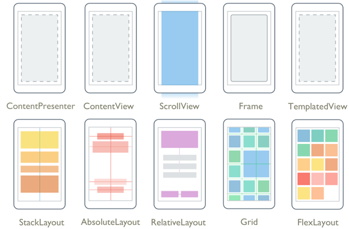
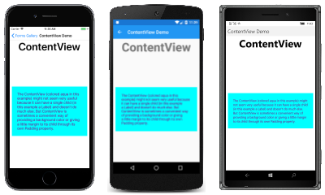
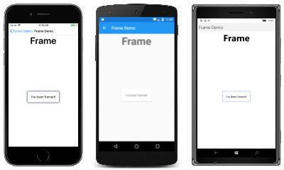
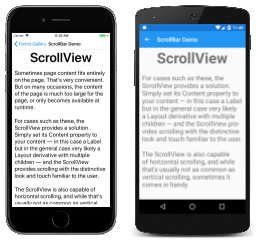
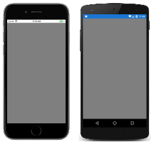
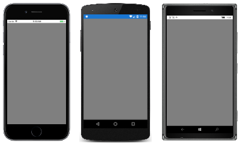
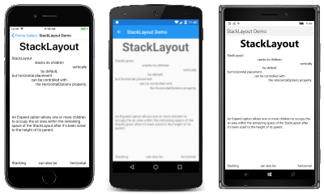
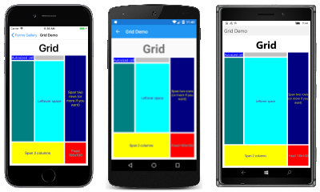
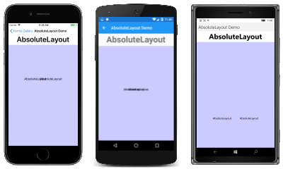
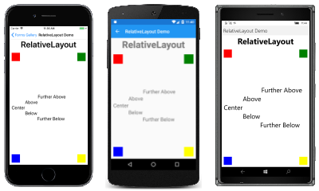

# Xamarin.Forms Layouts

[ Download the sample](/samples/xamarin/xamarin-forms-samples/formsgallery)

_Xamarin.Forms Layouts are used to compose user-interface controls into visual structures._

The [`Layout`](xref:Xamarin.Forms.Layout) and [`Layout<T>`](xref:Xamarin.Forms.Layout`1) classes in Xamarin.Forms are specialized subtypes of views that act as containers for views and other layouts. The `Layout` class itself derives from [`View`](views.md). A `Layout` derivative typically contains logic to set the position and size of child elements in Xamarin.Forms applications.

The classes that derive from `Layout` can be divided into two categories:

## Layouts with Single Content

These classes derive from [`Layout`](xref:Xamarin.Forms.Layout), which defines [`Padding`](xref:Xamarin.Forms.Layout.Padding) and [`IsClippedToBounds`](xref:Xamarin.Forms.Layout.IsClippedToBounds) properties:

| Type | Description | Appearance |
| --- | --- | --- |
| `ContentView` | [`ContentView`](xref:Xamarin.Forms.ContentView) contains a single child that is set with the [`Content`](xref:Xamarin.Forms.ContentView.Content) property. The `Content` property can be set to any `View` derivative, including other `Layout` derivatives. `ContentView` is mostly used as a structural element and serves as a base class to [`Frame`](xref:Xamarin.Forms.Frame).  [API Documentation](xref:Xamarin.Forms.ContentView) / [Guide](~/xamarin-forms/user-interface/layouts/contentview.md) / [Sample](/samples/xamarin/xamarin-forms-samples/userinterface-contentviewdemos/) |  [C# code for this page](https://github.com/xamarin/xamarin-forms-samples/blob/master/FormsGallery/FormsGallery/FormsGallery/CodeExamples/ContentViewDemoPage.cs) / [XAML page](https://github.com/xamarin/xamarin-forms-samples/blob/master/FormsGallery/FormsGallery/FormsGallery/XamlExamples/ContentViewDemoPage.xaml) |
| `Frame` | The [`Frame`](xref:Xamarin.Forms.Frame) class derives from [`ContentView`](xref:Xamarin.Forms.ContentView) and displays a border, or frame, around its child. The `Frame` class has a default [`Padding`](xref:Xamarin.Forms.Layout.Padding) value of 20, and also defines [`BorderColor`](xref:Xamarin.Forms.Frame.BorderColor), [`CornerRadius`](xref:Xamarin.Forms.Frame.CornerRadius), and [`HasShadow`](xref:Xamarin.Forms.Frame.HasShadow) properties.  [API Documentation](xref:Xamarin.Forms.Frame) / [Guide](~/xamarin-forms/user-interface/layouts/frame.md) / [Sample](/samples/xamarin/xamarin-forms-samples/userinterface-frame/) |  [C# code for this page](https://github.com/xamarin/xamarin-forms-samples/blob/master/FormsGallery/FormsGallery/FormsGallery/CodeExamples/FrameDemoPage.cs) / [XAML page](https://github.com/xamarin/xamarin-forms-samples/blob/master/FormsGallery/FormsGallery/FormsGallery/XamlExamples/FrameDemoPage.xaml) |
| `ScrollView` | [`ScrollView`](xref:Xamarin.Forms.ScrollView) is capable of scrolling its contents. Set the [`Content`](xref:Xamarin.Forms.ScrollView.Content) property to a view or layout too large to fit on the screen. (The content of a `ScrollView` is very often a [`StackLayout`](xref:Xamarin.Forms.StackLayout).) Set the [`Orientation`](xref:Xamarin.Forms.ScrollView.Orientation) property to indicate if scrolling should be vertical, horizontal, or both.  [API Documentation](xref:Xamarin.Forms.ScrollView) / [Guide](~/xamarin-forms/user-interface/layouts/scrollview.md) / [Sample](/samples/xamarin/xamarin-forms-samples/userinterface-layout) |  [C# code for this page](https://github.com/xamarin/xamarin-forms-samples/blob/master/FormsGallery/FormsGallery/FormsGallery/CodeExamples/ScrollViewDemoPage.cs) / [XAML page](https://github.com/xamarin/xamarin-forms-samples/blob/master/FormsGallery/FormsGallery/FormsGallery/XamlExamples/ScrollViewDemoPage.xaml) |
| `TemplatedView` | [`TemplatedView`](xref:Xamarin.Forms.TemplatedView) displays content with a control template, and is the base class for [`ContentView`](xref:Xamarin.Forms.ContentView).  [API Documentation](xref:Xamarin.Forms.TemplatedView) / [Guide](~/xamarin-forms/app-fundamentals/templates/control-template.md) |  |
| `ContentPresenter` | [`ContentPresenter`](xref:Xamarin.Forms.ContentPresenter) is a layout manager for templated views, used within a [`ControlTemplate`](xref:Xamarin.Forms.ControlTemplate) to mark where the content that is to be presented appears.  [API Documentation](xref:Xamarin.Forms.ContentPresenter) / [Guide](~/xamarin-forms/app-fundamentals/templates/control-template.md) |  |
|     |     |     |

## Layouts with Multiple Children

These classes derive from [`Layout<View>`](xref:Xamarin.Forms.Layout`1):

| Type | Description | Appearance |
| --- | --- | --- |
| `StackLayout` | [`StackLayout`](xref:Xamarin.Forms.StackLayout) positions child elements in a stack either horizontally or vertically based on the [`Orientation`](xref:Xamarin.Forms.StackLayout.Orientation) property. The [`Spacing`](xref:Xamarin.Forms.StackLayout.Spacing) property governs the spacing between the children, and has a default value of 6.  [API Documentation](xref:Xamarin.Forms.StackLayout) / [Guide](~/xamarin-forms/user-interface/layouts/stacklayout.md) / [Sample](/samples/xamarin/xamarin-forms-samples/userinterface-layout)|  [C# code for this page](https://github.com/xamarin/xamarin-forms-samples/blob/master/FormsGallery/FormsGallery/FormsGallery/CodeExamples/StackLayoutDemoPage.cs) / [XAML page](https://github.com/xamarin/xamarin-forms-samples/blob/master/FormsGallery/FormsGallery/FormsGallery/XamlExamples/StackLayoutDemoPage.xaml) |
| `Grid` | [`Grid`](xref:Xamarin.Forms.Grid) positions its child elements in a grid of rows and columns. A child's position is indicated using the [attached properties](~/xamarin-forms/xaml/attached-properties.md) [`Row`](xref:Xamarin.Forms.Grid.RowProperty), [`Column`](xref:Xamarin.Forms.Grid.ColumnProperty), [`RowSpan`](xref:Xamarin.Forms.Grid.RowSpanProperty), and [`ColumnSpan`](xref:Xamarin.Forms.Grid.ColumnSpanProperty).  [API Documentation](xref:Xamarin.Forms.Grid) / [Guide](~/xamarin-forms/user-interface/layouts/grid.md) / [Sample](/samples/xamarin/xamarin-forms-samples/userinterface-layout) |  [C# code for this page](https://github.com/xamarin/xamarin-forms-samples/blob/master/FormsGallery/FormsGallery/FormsGallery/CodeExamples/GridDemoPage.cs) / [XAML page](https://github.com/xamarin/xamarin-forms-samples/blob/master/FormsGallery/FormsGallery/FormsGallery/XamlExamples/GridDemoPage.xaml) |
| `AbsoluteLayout` | [`AbsoluteLayout`](xref:Xamarin.Forms.AbsoluteLayout) positions child elements at specific locations relative to its parent. A child's position is indicated using the [attached properties](~/xamarin-forms/xaml/attached-properties.md) [`LayoutBounds`](xref:Xamarin.Forms.AbsoluteLayout.LayoutBoundsProperty) and [`LayoutFlags`](xref:Xamarin.Forms.AbsoluteLayout.LayoutFlagsProperty). An `AbsoluteLayout` is useful for animating the positions of views.  [API Documentation](xref:Xamarin.Forms.AbsoluteLayout) / [Guide](~/xamarin-forms/user-interface/layouts/absolutelayout.md) / [Sample](/samples/xamarin/xamarin-forms-samples/userinterface-layout) |  [C# code for this page](https://github.com/xamarin/xamarin-forms-samples/blob/master/FormsGallery/FormsGallery/FormsGallery/CodeExamples/AbsoluteLayoutDemoPage.cs) / [XAML page](https://github.com/xamarin/xamarin-forms-samples/blob/master/FormsGallery/FormsGallery/FormsGallery/XamlExamples/AbsoluteLayoutDemoPage.xaml) with [code-behind](https://github.com/xamarin/xamarin-forms-samples/blob/master/FormsGallery/FormsGallery/FormsGallery/XamlExamples/AbsoluteLayoutDemoPage.xaml.cs) |
| `RelativeLayout` | [`RelativeLayout`](xref:Xamarin.Forms.RelativeLayout) positions child elements relative to the `RelativeLayout` itself or to their siblings. A child's position is indicated using the [attached properties](~/xamarin-forms/xaml/attached-properties.md) that are set to objects of type [`Constraint`](xref:Xamarin.Forms.Constraint) and [`BoundsConstraint`](xref:Xamarin.Forms.Constraint).  [API Documentation](xref:Xamarin.Forms.RelativeLayout) / [Guide](~/xamarin-forms/user-interface/layouts/relativelayout.md) / [Sample](/samples/xamarin/xamarin-forms-samples/userinterface-layout) |  [C# code for this page](https://github.com/xamarin/xamarin-forms-samples/blob/master/FormsGallery/FormsGallery/FormsGallery/CodeExamples/RelativeLayoutDemoPage.cs) / [XAML page](https://github.com/xamarin/xamarin-forms-samples/blob/master/FormsGallery/FormsGallery/FormsGallery/XamlExamples/RelativeLayoutDemoPage.xaml) |
| `FlexLayout` | [`FlexLayout`](xref:Xamarin.Forms.FlexLayout) is based on the CSS [Flexible Box Layout Module](https://www.w3.org/TR/css-flexbox-1/), commonly known as _flex layout_ or _flex-box_. `FlexLayout` defines six bindable properties and five attached bindable properties that allow children to be stacked or wrapped with many alignment and orientation options.  [API Documentation](xref:Xamarin.Forms.FlexLayout) / [Guide](~/xamarin-forms/user-interface/layouts/flex-layout.md) / [Sample](/samples/xamarin/xamarin-forms-samples/userinterface-flexlayoutdemos) |  [C# code for this page](https://github.com/xamarin/xamarin-forms-samples/blob/master/FormsGallery/FormsGallery/FormsGallery/CodeExamples/FlexLayoutDemoPage.cs) / [XAML page](https://github.com/xamarin/xamarin-forms-samples/blob/master/FormsGallery/FormsGallery/FormsGallery/XamlExamples/FlexLayoutDemoPage.xaml) |
|     |     |     |

## Related links

- [Xamarin.Forms FormsGallery sample](/samples/xamarin/xamarin-forms-samples/formsgallery)
- [Xamarin.Forms Samples](/samples/browse/?products=xamarin&term=Xamarin.Forms)
- [Xamarin.Forms API Documentation](/dotnet/api/xamarin.forms?view=xamarin-forms&preserve-view=true)