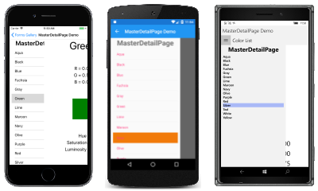

# Xamarin.Forms Pages

[ Download the sample](https://developer.xamarin.com/samples/FormsGallery/)

_Xamarin.Forms Pages represent cross-platform mobile application screens._

All the page types that are described below derive from the Xamarin.Forms [`Page`](xref:Xamarin.Forms.Page) class. These visual elements occupy all or most of the screen. A `Page` object represents a `ViewController` in iOS and a `Page` in the Universal Windows Platform. On Android, each page takes up the screen like an `Activity`, but Xamarin.Forms pages are *not* `Activity` objects.

## Pages

Xamarin.Forms supports the following page types:

<a name="contentPage" />

### ContentPage

|     |     |
| --- | --- |
| [`ContentPage`](xref:Xamarin.Forms.ContentPage) is the simplest and most common type of page. Set the [`Content`](xref:Xamarin.Forms.ContentPage.Content) property to a single [`View`](views.md) object, which is most often a [`Layout`](layouts.md) such as [`StackLayout`](layouts.md#stackLayout), [`Grid`](layouts.md#grid), or [`ScrollView`](layouts.md#scrollView).  [API Documentation](xref:Xamarin.Forms.ContentPage) |  [C# code for this page](https://github.com/xamarin/xamarin-forms-samples/blob/master/FormsGallery/FormsGallery/FormsGallery/CodeExamples/ContentPageDemoPage.cs) / [XAML page](https://github.com/xamarin/xamarin-forms-samples/blob/master/FormsGallery/FormsGallery/FormsGallery/XamlExamples/ContentPageDemoPage.xaml) |
|     |     |

### MasterDetailPage

|     |     |
| --- | --- |
| A [`MasterDetailPage`](xref:Xamarin.Forms.MasterDetailPage) manages two panes of information. Set the [`Master`](xref:Xamarin.Forms.MasterDetailPage.Master) property to a page generally showing a list or menu. Set the [`Detail`](xref:Xamarin.Forms.MasterDetailPage.Detail) property to a page showing a selected item from the master page. The [`IsPresented`](xref:Xamarin.Forms.MasterDetailPage.IsPresented) property governs whether the master or detail page is visible.  [API Documentation](xref:Xamarin.Forms.MasterDetailPage) / [Guide](~/xamarin-forms/app-fundamentals/navigation/master-detail-page.md) / [Sample](https://developer.xamarin.com/samples/xamarin-forms/Navigation/MasterDetailPage/) |  [C# code for this page](https://github.com/xamarin/xamarin-forms-samples/blob/master/FormsGallery/FormsGallery/FormsGallery/CodeExamples/MasterDetailPageDemoPage.cs) / [XAML page](https://github.com/xamarin/xamarin-forms-samples/blob/master/FormsGallery/FormsGallery/FormsGallery/XamlExamples/MasterDetailPageDemoPage.xaml) with [code-behind](https://github.com/xamarin/xamarin-forms-samples/blob/master/FormsGallery/FormsGallery/FormsGallery/XamlExamples/MasterDetailPageDemoPage.xaml.cs) |
|     |     |

### NavigationPage

|     |     |
| --- | --- |
| The [`NavigationPage`](xref:Xamarin.Forms.NavigationPage) manages navigation among other pages using a stack-based architecture. When using page navigation in your application, an instance of the home page should be passed to the constructor of a `NavigationPage` object.  [API Documentation](xref:Xamarin.Forms.NavigationPage) / [Guide](~/xamarin-forms/app-fundamentals/navigation/hierarchical.md) / [Sample 1](https://developer.xamarin.com/samples/xamarin-forms/Navigation/Hierarchical/), [2](https://developer.xamarin.com/samples/xamarin-forms/Navigation/PassingData/), and [3](https://developer.xamarin.com/samples/xamarin-forms/Navigation/LoginFlow/)  |  [C# code for this page](https://github.com/xamarin/xamarin-forms-samples/blob/master/FormsGallery/FormsGallery/FormsGallery/CodeExamples/NavigationPageDemoPage.cs) / [XAML Page](https://github.com/xamarin/xamarin-forms-samples/blob/master/FormsGallery/FormsGallery/FormsGallery/XamlExamples/NavigationPageDemoPage.xaml) with [code=behind](https://github.com/xamarin/xamarin-forms-samples/blob/master/FormsGallery/FormsGallery/FormsGallery/XamlExamples/NavigationPageDemoPage.xaml.cs) |
|     |     |

### TabbedPage

|     |     |
| --- | --- |
| [`TabbedPage`](xref:Xamarin.Forms.TabbedPage) derives from the abstract [`MultiPage`](xref:Xamarin.Forms.MultiPage`1) class and allows navigation among child pages using tabs. Set the [`Children`](xref:Xamarin.Forms.MultiPage`1.Children) property to a collection of pages, or set the [`ItemsSource`](xref:Xamarin.Forms.MultiPage`1.ItemsSource) property to a collection of data objects and the [`ItemTemplate`](xref:Xamarin.Forms.MultiPage`1.ItemTemplate) property to a [`DataTemplate`](xref:Xamarin.Forms.DataTemplate) describing how each object is to be visually represented.  [API Documentation](xref:Xamarin.Forms.TabbedPage) / [Guide](~/xamarin-forms/app-fundamentals/navigation/tabbed-page.md) / [Sample 1](https://developer.xamarin.com/samples/xamarin-forms/Navigation/TabbedPage/) and [2](https://developer.xamarin.com/samples/xamarin-forms/Navigation/TabbedPageWithNavigationPage) |  [C# code for this page](https://github.com/xamarin/xamarin-forms-samples/blob/master/FormsGallery/FormsGallery/FormsGallery/CodeExamples/TabbedPageDemoPage.cs) / [XAML page](https://github.com/xamarin/xamarin-forms-samples/blob/master/FormsGallery/FormsGallery/FormsGallery/XamlExamples/TabbedPageDemoPage.xaml) |
|     |     |

### CarouselPage

|     |     |
| --- | --- |
| [`CarouselPage`](xref:Xamarin.Forms.CarouselPage) derives from the abstract [`MultiPage`](xref:Xamarin.Forms.MultiPage`1) class and allows navigation among child pages through finger swiping. Set the [`Children`](xref:Xamarin.Forms.MultiPage`1.Children) property to a collection of [`ContentPage`](#contentPage) objects, or set the [`ItemsSource`](xref:Xamarin.Forms.MultiPage`1.ItemsSource) property to a collection of data objects and the [`ItemTemplate`](xref:Xamarin.Forms.MultiPage`1.ItemTemplate) property to a [`DataTemplate`](xref:Xamarin.Forms.DataTemplate) describing how each object is to be visually represented.  [API Documentation](xref:Xamarin.Forms.CarouselPage) / [Guide](~/xamarin-forms/app-fundamentals/navigation/carousel-page.md) / [Sample 1](https://developer.xamarin.com/samples/xamarin-forms/Navigation/CarouselPage/) and [2](https://developer.xamarin.com/samples/xamarin-forms/Navigation/CarouselPageTemplate/) |  [C# code for this page](https://github.com/xamarin/xamarin-forms-samples/blob/master/FormsGallery/FormsGallery/FormsGallery/CodeExamples/CarouselPageDemoPage.cs) / [XAML page](https://github.com/xamarin/xamarin-forms-samples/blob/master/FormsGallery/FormsGallery/FormsGallery/XamlExamples/CarouselPageDemoPage.xaml) |
|     |     |

### TemplatedPage

|     |     |
| --- | --- |
| [`TemplatedPage`](xref:Xamarin.Forms.TemplatedPage) displays full-screen content with a control template, and is the base class for [`ContentPage`](#contentPage).  [API Documentation](xref:Xamarin.Forms.TemplatedPage) / [Guide](~/xamarin-forms/app-fundamentals/templates/control-templates/index.md) |  |
|     |     |

## Related Links

- [Xamarin.Forms FormsGallery sample](https://developer.xamarin.com/samples/FormsGallery/)
- [Xamarin.Forms Samples](https://developer.xamarin.com/samples/xamarin-forms/all/)
- [Xamarin.Forms API Documentation](https://docs.microsoft.com/dotnet/api/xamarin.forms?view=xamarin-forms)
