# Xamarin.Forms Views

[ Download the sample](/samples/xamarin/xamarin-forms-samples/formsgallery/)

_Xamarin.Forms views are the building blocks of cross-platform mobile user interfaces._

Views are user-interface objects such as labels, buttons, and sliders that are commonly known as *controls* or *widgets* in other graphical programming environments. The views supported by Xamarin.Forms all derive from the [`View`](xref:Xamarin.Forms.View) class. They can be divided into several categories:

## Views for presentation

| Type | Description | Appearance |
| --- | --- | --- |
| `BoxView` | [`BoxView`](xref:Xamarin.Forms.BoxView) displays a solid rectangle colored by the [`Color`](xref:Xamarin.Forms.BoxView.Color) property. `BoxView` has a default size request of 40x40. For other sizes, assign the [`WidthRequest`](xref:Xamarin.Forms.VisualElement.WidthRequest) and [`HeightRequest`](xref:Xamarin.Forms.VisualElement.HeightRequest) properties.  [API Documentation](xref:Xamarin.Forms.BoxView) / [Guide](~/xamarin-forms/user-interface/boxview.md) / [Sample 1](/samples/xamarin/xamarin-forms-samples/boxview-basicboxview), [2](/samples/xamarin/xamarin-forms-samples/boxview-textdecoration), [3](/samples/xamarin/xamarin-forms-samples/boxview-listviewcolors/), [4](/samples/xamarin/xamarin-forms-samples/boxview-gameoflife), [5](/samples/xamarin/xamarin-forms-samples/boxview-dotmatrixclock), and [6](/samples/xamarin/xamarin-forms-samples/boxview-boxviewclock) | [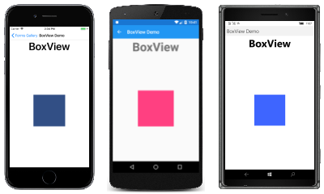](views-images/BoxView-Large.png#lightbox "BoxView Example") [C# code for this page](https://github.com/xamarin/xamarin-forms-samples/blob/master/FormsGallery/FormsGallery/FormsGallery/CodeExamples/BoxViewDemoPage.cs) / [XAML page](https://github.com/xamarin/xamarin-forms-samples/blob/master/FormsGallery/FormsGallery/FormsGallery/XamlExamples/BoxViewDemoPage.xaml) |
| `Ellipse` | [`Ellipse`](xref:Xamarin.Forms.Shapes.Ellipse) displays an ellipse or circle of size [`WidthRequest`](xref:Xamarin.Forms.VisualElement.WidthRequest) x [`HeightRequest`](xref:Xamarin.Forms.VisualElement.HeightRequest). To paint the inside of the ellipse, set its [`Fill`](xref:Xamarin.Forms.Shapes.Shape.Fill) property to a [`Color`](xref:Xamarin.Forms.Color). To give the ellipse an outline, set its [`Stroke`](xref:Xamarin.Forms.Shapes.Shape.Stroke) property to a `Color`.  [API Documentation](xref:Xamarin.Forms.Shapes.Ellipse) / [Guide](~/xamarin-forms/user-interface/shapes/ellipse.md) / [Sample](/samples/xamarin/xamarin-forms-samples/userinterface-shapesdemos) | [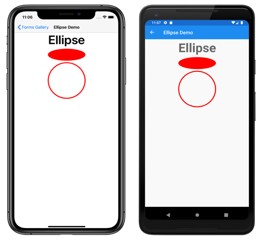](views-images/Ellipse-Large.png#lightbox "Ellipse Example") [C# code for this page](https://github.com/xamarin/xamarin-forms-samples/blob/master/FormsGallery/FormsGallery/FormsGallery/CodeExamples/EllipseDemoPage.cs) / [XAML page](https://github.com/xamarin/xamarin-forms-samples/blob/master/FormsGallery/FormsGallery/FormsGallery/XamlExamples/EllipseDemoPage.xaml) |
| `Label` | [`Label`](xref:Xamarin.Forms.Label) displays single-line text strings or multi-line blocks of text, either with constant or variable formatting. Set the [`Text`](xref:Xamarin.Forms.Label.Text) property to a string for constant formatting, or set the [`FormattedText`](xref:Xamarin.Forms.Label.FormattedText) property to a [`FormattedString`](xref:Xamarin.Forms.FormattedString) object for variable formatting.  [API Documentation](xref:Xamarin.Forms.Label) / [Guide](~/xamarin-forms/user-interface/text/label.md) / [Sample](/samples/xamarin/xamarin-forms-samples/userinterface-text) | [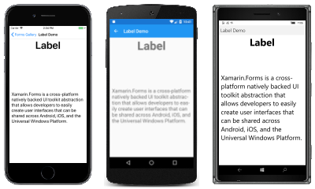](views-images/Label-Large.png#lightbox "Label Example")  [C# code for this page](https://github.com/xamarin/xamarin-forms-samples/blob/master/FormsGallery/FormsGallery/FormsGallery/CodeExamples/LabelDemoPage.cs) / [XAML page](https://github.com/xamarin/xamarin-forms-samples/blob/master/FormsGallery/FormsGallery/FormsGallery/XamlExamples/LabelDemoPage.xaml) |
| `Line` | [`Line`](xref:Xamarin.Forms.Shapes.Line) displays a line from a start point to an end point. The start point is represented by the [`X1`](xref:Xamarin.Forms.Shapes.Line.X1) and [`Y1`](xref:Xamarin.Forms.Shapes.Line.Y1) properties, while the end point is represented by the [`X2`](xref:Xamarin.Forms.Shapes.Line.X2) and [`Y2`](xref:Xamarin.Forms.Shapes.Line.Y2) properties. To color the line, set its [`Stroke`](xref:Xamarin.Forms.Shapes.Shape.Stroke) property to a [`Color`](xref:Xamarin.Forms.Color).  [API Documentation](xref:Xamarin.Forms.Shapes.Line) / [Guide](~/xamarin-forms/user-interface/shapes/line.md) / [Sample](/samples/xamarin/xamarin-forms-samples/userinterface-shapesdemos) | [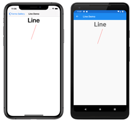](views-images/Line-Large.png#lightbox "Line Example") [C# code for this page](https://github.com/xamarin/xamarin-forms-samples/blob/master/FormsGallery/FormsGallery/FormsGallery/CodeExamples/LineDemoPage.cs) / [XAML page](https://github.com/xamarin/xamarin-forms-samples/blob/master/FormsGallery/FormsGallery/FormsGallery/XamlExamples/LineDemoPage.xaml) |
| `Image` | [`Image`](xref:Xamarin.Forms.Image) displays a bitmap. Bitmaps can be downloaded over the Web, embedded as resources in the common project or platform projects, or created using a .NET `Stream` object.  [API Documentation](xref:Xamarin.Forms.Image) / [Guide](~/xamarin-forms/user-interface/images.md) / [Sample](/samples/xamarin/xamarin-forms-samples/workingwithimages) | [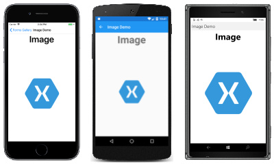](views-images/Image-Large.png#lightbox "Image Example") [C# code for this page](https://github.com/xamarin/xamarin-forms-samples/blob/master/FormsGallery/FormsGallery/FormsGallery/CodeExamples/ImageDemoPage.cs) / [XAML page](https://github.com/xamarin/xamarin-forms-samples/blob/master/FormsGallery/FormsGallery/FormsGallery/XamlExamples/ImageDemoPage.xaml) |
| `Map` | [`Map`](xref:Xamarin.Forms.Maps.Map) displays a map. The **Xamarin.Forms.Maps** NuGet package must be installed. Android and Universal Windows Platform require a map authorization key.  [API Documentation](xref:Xamarin.Forms.Maps.Map) / [Guide](~/xamarin-forms/user-interface/map/index.md) / [Sample](/samples/xamarin/xamarin-forms-samples/workingwithmaps/) | [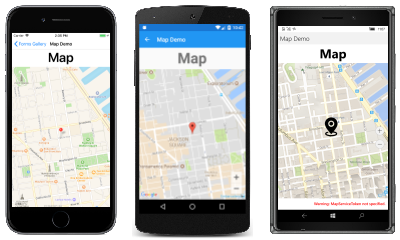](views-images/Map-Large.png#lightbox "Map Example") [C# code for this page](https://github.com/xamarin/xamarin-forms-samples/blob/master/FormsGallery/FormsGallery/FormsGallery/CodeExamples/MapDemoPage.cs) / [XAML page](https://github.com/xamarin/xamarin-forms-samples/blob/master/FormsGallery/FormsGallery/FormsGallery/XamlExamples/MapDemoPage.xaml) |
| `OpenGLView` | [`OpenGLView`](xref:Xamarin.Forms.OpenGLView) displays OpenGL graphics in iOS and Android projects. There is no support for the Universal Windows Platform. The iOS and Android projects require a reference to the **OpenTK-1.0** assembly or the **OpenTK** version 1.0.0.0 assembly. `OpenGLView` is easier to use in a Shared Project; if used in a .NET Standard library, then a Dependency Service will also be required (as shown in the sample code).  This is the only graphics facility that is built into Xamarin.Forms, but a Xamarin.Forms application can also render graphics using [`SkiaSharp`](~/xamarin-forms/user-interface/graphics/skiasharp/index.md), or [`UrhoSharp`](~/xamarin-forms/user-interface/graphics/urhosharp.md).  [API Documentation](xref:Xamarin.Forms.OpenGLView)   | [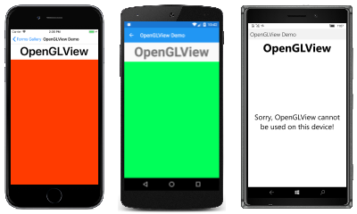](views-images/OpenGLView-Large.png#lightbox "OpenGLView Example") [C# code for this page](https://github.com/xamarin/xamarin-forms-samples/blob/master/FormsGallery/FormsGallery/FormsGallery/CodeExamples/OpenGLViewDemoPage.cs) / [XAML page](https://github.com/xamarin/xamarin-forms-samples/blob/master/FormsGallery/FormsGallery/FormsGallery/XamlExamples/OpenGLViewDemoPage.xaml) with [code-behind](https://github.com/xamarin/xamarin-forms-samples/blob/master/FormsGallery/FormsGallery/FormsGallery/XamlExamples/OpenGLViewDemoPage.xaml.cs) |
| `Path` | [`Path`](xref:Xamarin.Forms.Shapes.Path) displays curves and complex shapes. The [`Data`](xref:Xamarin.Forms.Shapes.Path.Data) property specifies the shape to be drawn. To color the shape, set its [`Stroke`](xref:Xamarin.Forms.Shapes.Shape.Stroke) property to a [`Color`](xref:Xamarin.Forms.Color).  [API Documentation](xref:Xamarin.Forms.Shapes.Path) / [Guide](~/xamarin-forms/user-interface/shapes/path.md) / [Sample](/samples/xamarin/xamarin-forms-samples/userinterface-shapesdemos) | [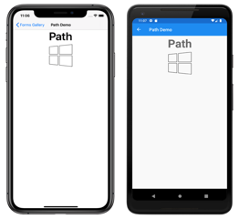](views-images/Path-Large.png#lightbox "Path Example") [C# code for this page](https://github.com/xamarin/xamarin-forms-samples/blob/master/FormsGallery/FormsGallery/FormsGallery/CodeExamples/PathDemoPage.cs) / [XAML page](https://github.com/xamarin/xamarin-forms-samples/blob/master/FormsGallery/FormsGallery/FormsGallery/XamlExamples/PathDemoPage.xaml) |
| `Polygon` | [`Polygon`](xref:Xamarin.Forms.Shapes.Polygon) displays a polygon. The [`Points`](xref:Xamarin.Forms.Shapes.Polygon.Points) property specifies the vertex points of the polygon, while the [`FillRule`](xref:Xamarin.Forms.Shapes.Polygon.FillRule) property specifies how the interior fill of the polygon is determined. To paint the inside of the polygon, set its [`Fill`](xref:Xamarin.Forms.Shapes.Shape.Fill) property to a [`Color`](xref:Xamarin.Forms.Color). To give the polygon an outline, set its [`Stroke`](xref:Xamarin.Forms.Shapes.Shape.Stroke) property to a `Color`.  [API Documentation](xref:Xamarin.Forms.Shapes.Polygon) / [Guide](~/xamarin-forms/user-interface/shapes/polygon.md) / [Sample](/samples/xamarin/xamarin-forms-samples/userinterface-shapesdemos) | [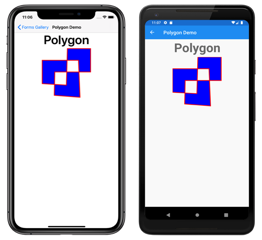](views-images/Polygon-Large.png#lightbox "Polygon Example") [C# code for this page](https://github.com/xamarin/xamarin-forms-samples/blob/master/FormsGallery/FormsGallery/FormsGallery/CodeExamples/PolygonDemoPage.cs) / [XAML page](https://github.com/xamarin/xamarin-forms-samples/blob/master/FormsGallery/FormsGallery/FormsGallery/XamlExamples/PolygonDemoPage.xaml) |
| `Polyline` | [`Polyline`](xref:Xamarin.Forms.Shapes.Polyline) displays a series of connected straight lines. The [`Points`](xref:Xamarin.Forms.Shapes.Polygon.Points) property specifies the vertex points of the polyline, while the [`FillRule`](xref:Xamarin.Forms.Shapes.Polygon.FillRule) property specifies how the interior fill of the polyline is determined. To paint the inside of the polyline, set its [`Fill`](xref:Xamarin.Forms.Shapes.Shape.Fill) property to a [`Color`](xref:Xamarin.Forms.Color). To give the polyline an outline, set its [`Stroke`](xref:Xamarin.Forms.Shapes.Shape.Stroke) property to a `Color`.  [API Documentation](xref:Xamarin.Forms.Shapes.Polyline) / [Guide](~/xamarin-forms/user-interface/shapes/polyline.md) / [Sample](/samples/xamarin/xamarin-forms-samples/userinterface-shapesdemos) | [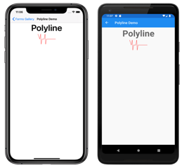](views-images/Polyline-Large.png#lightbox "Polyline Example") [C# code for this page](https://github.com/xamarin/xamarin-forms-samples/blob/master/FormsGallery/FormsGallery/FormsGallery/CodeExamples/PolylineDemoPage.cs) / [XAML page](https://github.com/xamarin/xamarin-forms-samples/blob/master/FormsGallery/FormsGallery/FormsGallery/XamlExamples/PolylineDemoPage.xaml) |
| `Rectangle` | [`Rectangle`](xref:Xamarin.Forms.Shapes.Rectangle) displays a rectangle or square. To paint the inside of the rectangle, set its [`Fill`](xref:Xamarin.Forms.Shapes.Shape.Fill) property to a [`Color`](xref:Xamarin.Forms.Color). To give the rectangle an outline, set its [`Stroke`](xref:Xamarin.Forms.Shapes.Shape.Stroke) property to a `Color`.  [API Documentation](xref:Xamarin.Forms.Shapes.Rectangle) / [Guide](~/xamarin-forms/user-interface/shapes/rectangle.md) / [Sample](/samples/xamarin/xamarin-forms-samples/userinterface-shapesdemos) | [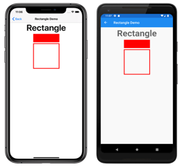](views-images/Rectangle-Large.png#lightbox "Rectangle Example") [C# code for this page](https://github.com/xamarin/xamarin-forms-samples/blob/master/FormsGallery/FormsGallery/FormsGallery/CodeExamples/RectangleDemoPage.cs) / [XAML page](https://github.com/xamarin/xamarin-forms-samples/blob/master/FormsGallery/FormsGallery/FormsGallery/XamlExamples/RectangleDemoPage.xaml) |
| `WebView` | [`WebView`](xref:Xamarin.Forms.WebView) displays Web pages or HTML content, based on whether the [`Source`](xref:Xamarin.Forms.WebView.Source) property is set to a [`UriWebViewSource`](xref:Xamarin.Forms.UrlWebViewSource) or an [`HtmlWebViewSource`](xref:Xamarin.Forms.HtmlWebViewSource) object.  [API Documentation](xref:Xamarin.Forms.WebView) / [Guide](~/xamarin-forms/user-interface/webview.md) / [Sample 1](/samples/xamarin/xamarin-forms-samples/workingwithwebview) and [2](/samples/xamarin/xamarin-forms-samples/userinterface-webview) |  [C# code for this page](https://github.com/xamarin/xamarin-forms-samples/blob/master/FormsGallery/FormsGallery/FormsGallery/CodeExamples/WebViewDemoPage.cs) / [XAML page](https://github.com/xamarin/xamarin-forms-samples/blob/master/FormsGallery/FormsGallery/FormsGallery/XamlExamples/WebViewDemoPage.xaml) |
|     |     |     |

## Views that initiate commands

| Type | Description | Appearance |
| --- | --- | --- |
| `Button` | [`Button`](xref:Xamarin.Forms.Button) is a rectangular object that displays text, and which fires a [`Clicked`](xref:Xamarin.Forms.Button.Clicked) event when it's been pressed.  [API Documentation](xref:Xamarin.Forms.Button) / [Guide](~/xamarin-forms/user-interface/button.md) / [Sample](/samples/xamarin/xamarin-forms-samples/userinterface-buttondemos/) | [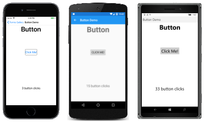](views-images/Button-Large.png#lightbox "Button Example")  [C# code for this page](https://github.com/xamarin/xamarin-forms-samples/blob/master/FormsGallery/FormsGallery/FormsGallery/CodeExamples/ButtonDemoPage.cs) / [XAML page](https://github.com/xamarin/xamarin-forms-samples/blob/master/FormsGallery/FormsGallery/FormsGallery/XamlExamples/ButtonDemoPage.xaml) with [code-behind](https://github.com/xamarin/xamarin-forms-samples/blob/master/FormsGallery/FormsGallery/FormsGallery/XamlExamples/ButtonDemoPage.xaml.cs) |
| `ImageButton` | [`ImageButton`](xref:Xamarin.Forms.ImageButton) is a rectangular object that displays an image, and which fires a `Clicked` event when it's been pressed.  [API Documentation](xref:Xamarin.Forms.ImageButton) / [Guide](~/xamarin-forms/user-interface/imagebutton.md) / [Sample](/samples/xamarin/xamarin-forms-samples/formsgallery) | [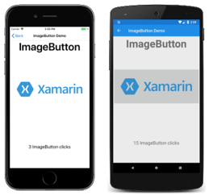](views-images/ImageButton-Large.png#lightbox "ImageButton Example")  [C# code for this page](https://github.com/xamarin/xamarin-forms-samples/blob/master/FormsGallery/FormsGallery/FormsGallery/CodeExamples/ImageButtonDemoPage.cs) / [XAML page](https://github.com/xamarin/xamarin-forms-samples/blob/master/FormsGallery/FormsGallery/FormsGallery/XamlExamples/ImageButtonDemoPage.xaml) with [code-behind](https://github.com/xamarin/xamarin-forms-samples/blob/master/FormsGallery/FormsGallery/FormsGallery/XamlExamples/ImageButtonDemoPage.xaml.cs) |
| `RadioButton` | [`RadioButton`](xref:Xamarin.Forms.RadioButton) allows the selection of one option from a set, and fires a `CheckedChanged` event when selection occurs.  [API Documentation](xref:Xamarin.Forms.RadioButton) / [Guide](~/xamarin-forms/user-interface/radiobutton.md) / [Sample](/samples/xamarin/xamarin-forms-samples/userinterface-radiobuttondemos/) | [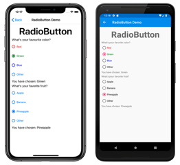](views-images/RadioButton-Large.png#lightbox "RadioButton Example")  [C# code for this page](https://github.com/xamarin/xamarin-forms-samples/blob/master/FormsGallery/FormsGallery/FormsGallery/CodeExamples/RadioButtonDemoPage.cs) / [XAML page](https://github.com/xamarin/xamarin-forms-samples/blob/master/FormsGallery/FormsGallery/FormsGallery/XamlExamples/RadioButtonDemoPage.xaml) with [code-behind](https://github.com/xamarin/xamarin-forms-samples/blob/master/FormsGallery/FormsGallery/FormsGallery/XamlExamples/RadioButtonDemoPage.xaml.cs) |
| `RefreshView` | [`RefreshView`](xref:Xamarin.Forms.RefreshView) is a container control that provides pull-to-refresh functionality for scrollable content. The `ICommand` defined by the `Command` property is executed when a refresh is triggered, and the `IsRefreshing` property indicates the current state of the control.  [API Documentation](xref:Xamarin.Forms.RefreshView) / [Guide](~/xamarin-forms/user-interface/refreshview.md) / [Sample](/samples/xamarin/xamarin-forms-samples/formsgallery) | [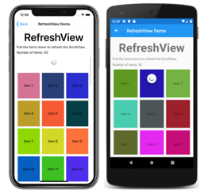](views-images/RefreshView-Large.png#lightbox "RefreshView Example")  [C# code for this page](https://github.com/xamarin/xamarin-forms-samples/blob/master/FormsGallery/FormsGallery/FormsGallery/CodeExamples/RefreshViewDemoPage.cs) / [XAML page](https://github.com/xamarin/xamarin-forms-samples/blob/master/FormsGallery/FormsGallery/FormsGallery/XamlExamples/RefreshViewDemoPage.xaml) with [code-behind](https://github.com/xamarin/xamarin-forms-samples/blob/master/FormsGallery/FormsGallery/FormsGallery/XamlExamples/RefreshViewDemoPage.xaml.cs) |
| `SearchBar` | [`SearchBar`](xref:Xamarin.Forms.SearchBar) displays an area for the user to type a text string, and a button (or a keyboard key) that signals the application to perform a search. The [`Text`](xref:Xamarin.Forms.InputView.Text) property provides access to the text, and the [`SearchButtonPressed`](xref:Xamarin.Forms.SearchBar.SearchButtonPressed) event indicates that the button has been pressed.  [API Documentation](xref:Xamarin.Forms.SearchBar) / [Guide](~/xamarin-forms/user-interface/searchbar.md) / [Sample](/samples/xamarin/xamarin-forms-samples/userinterface-searchbardemos/) | [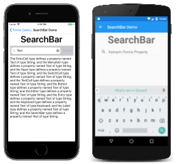](views-images/SearchBar-Large.png#lightbox "SearchBar Example")  [C# code for this page](https://github.com/xamarin/xamarin-forms-samples/blob/master/FormsGallery/FormsGallery/FormsGallery/CodeExamples/SearchBarDemoPage.cs) / [XAML page](https://github.com/xamarin/xamarin-forms-samples/blob/master/FormsGallery/FormsGallery/FormsGallery/XamlExamples/SearchBarDemoPage.xaml) with [code-behind](https://github.com/xamarin/xamarin-forms-samples/blob/master/FormsGallery/FormsGallery/FormsGallery/XamlExamples/SearchBarDemoPage.xaml.cs) |
| `SwipeView`| [`SwipeView`](xref:Xamarin.Forms.SwipeView) is a container control that wraps around an item of content, and provides context menu items that are revealed by a swipe gesture. Each menu item is represented by a `SwipeItem`, which has a `Command` property that executes an `ICommand` when the item is tapped.  [API Documentation](xref:Xamarin.Forms.SwipeView) / [Guide](~/xamarin-forms/user-interface/swipeview.md) / [Sample](/samples/xamarin/xamarin-forms-samples/formsgallery) | [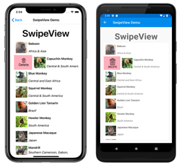](views-images/SwipeView-Large.png#lightbox "SwipeView Example")  [C# code for this page](https://github.com/xamarin/xamarin-forms-samples/blob/master/FormsGallery/FormsGallery/FormsGallery/CodeExamples/SwipeViewDemoPage.cs) / [XAML page](https://github.com/xamarin/xamarin-forms-samples/blob/master/FormsGallery/FormsGallery/FormsGallery/XamlExamples/SwipeViewDemoPage.xaml) with [code-behind](https://github.com/xamarin/xamarin-forms-samples/blob/master/FormsGallery/FormsGallery/FormsGallery/XamlExamples/SwipeViewDemoPage.xaml.cs) |
|     |     |     |

## Views for setting values

| Type | Description | Appearance |
| --- | --- | --- |
| `CheckBox` | [`CheckBox`](xref:Xamarin.Forms.CheckBox) allows the user to select a Boolean value using a type of button that can either be checked or empty. The `IsChecked` property is the state of the `CheckBox`, and the `CheckedChanged` event is fired when the state changes.  [API Documentation](xref:Xamarin.Forms.CheckBox) / [Guide](~/xamarin-forms/user-interface/checkbox.md) / [Sample](/samples/xamarin/xamarin-forms-samples/userinterface-checkboxdemos) |  [C# code for this page](https://github.com/xamarin/xamarin-forms-samples/blob/master/FormsGallery/FormsGallery/FormsGallery/CodeExamples/CheckBoxPage.cs) / [XAML page](https://github.com/xamarin/xamarin-forms-samples/blob/master/FormsGallery/FormsGallery/FormsGallery/XamlExamples/CheckBoxPage.xaml) |
| `Slider` | [`Slider`](xref:Xamarin.Forms.Slider) allows the user to select a `double` value from a continuous range specified with the [`Minimum`](xref:Xamarin.Forms.Slider.Minimum) and [`Maximum`](xref:Xamarin.Forms.Slider.Maximum) properties.  [API Documentation](xref:Xamarin.Forms.Slider) / [Guide](~/xamarin-forms/user-interface/slider.md) / [Sample](/samples/xamarin/xamarin-forms-samples/userinterface-sliderdemos) | [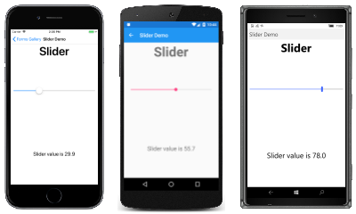](views-images/Slider-Large.png#lightbox "Slider Example") [C# code for this page](https://github.com/xamarin/xamarin-forms-samples/blob/master/FormsGallery/FormsGallery/FormsGallery/CodeExamples/SliderDemoPage.cs) / [XAML page](https://github.com/xamarin/xamarin-forms-samples/blob/master/FormsGallery/FormsGallery/FormsGallery/XamlExamples/SliderDemoPage.xaml) |
| `Stepper` | [`Stepper`](xref:Xamarin.Forms.Stepper) allows the user to select a `double` value from a range of incremental values specified with the [`Minimum`](xref:Xamarin.Forms.Stepper.Minimum), [`Maximum`](xref:Xamarin.Forms.Stepper.Maximum), and [`Increment`](xref:Xamarin.Forms.Stepper.Increment) properties.  [API Documentation](xref:Xamarin.Forms.Stepper)  / [Guide](~/xamarin-forms/user-interface/stepper.md) / [Sample](/samples/xamarin/xamarin-forms-samples/userinterface-stepperdemos) | [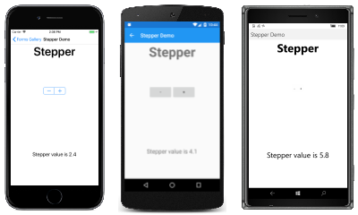](views-images/Stepper-Large.png#lightbox "Stepper Example") [C# code for this page](https://github.com/xamarin/xamarin-forms-samples/blob/master/FormsGallery/FormsGallery/FormsGallery/CodeExamples/StepperDemoPage.cs) / [XAML page](https://github.com/xamarin/xamarin-forms-samples/blob/master/FormsGallery/FormsGallery/FormsGallery/XamlExamples/StepperDemoPage.xaml) |
| `Switch` | [`Switch`](xref:Xamarin.Forms.Switch) takes the form of an on/off switch to allow the user to select a Boolean value. The [`IsToggled`](xref:Xamarin.Forms.Switch.IsToggled) property is the state of the switch, and the [`Toggled`](xref:Xamarin.Forms.Switch.Toggled) event is fired when the state changes.  [API Documentation](xref:Xamarin.Forms.Switch) / [Guide](~/xamarin-forms/user-interface/switch.md) / [Sample](/samples/xamarin/xamarin-forms-samples/userinterface-switchdemos/) | [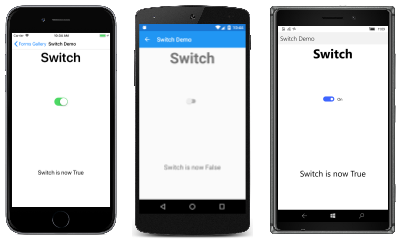](views-images/Switch-Large.png#lightbox "Switch Example") [C# code for this page](https://github.com/xamarin/xamarin-forms-samples/blob/master/FormsGallery/FormsGallery/FormsGallery/CodeExamples/SwitchDemoPage.cs) / [XAML page](https://github.com/xamarin/xamarin-forms-samples/blob/master/FormsGallery/FormsGallery/FormsGallery/XamlExamples/SwitchDemoPage.xaml) |
| `DatePicker` | [`DatePicker`](xref:Xamarin.Forms.DatePicker) allows the user to select a date with the platform date picker. Set a range of allowable dates with the [`MinimumDate`](xref:Xamarin.Forms.DatePicker.MinimumDate) and [`MaximumDate`](xref:Xamarin.Forms.DatePicker.MaximumDate) properties. The [`Date`](xref:Xamarin.Forms.DatePicker.Date) property is the selected date, and the [`DateSelected`](xref:Xamarin.Forms.DatePicker.DateSelected) event is fired when that property changes.  [API Documentation](xref:Xamarin.Forms.DatePicker) / [Guide](~/xamarin-forms/user-interface/datepicker.md) / [Sample](/samples/xamarin/xamarin-forms-samples/userinterface-datepicker) | [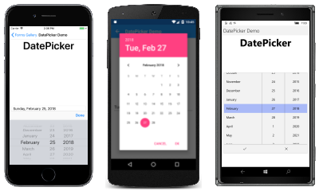](views-images/DatePicker-Large.png#lightbox "DatePicker Example") [C# code for this page](https://github.com/xamarin/xamarin-forms-samples/blob/master/FormsGallery/FormsGallery/FormsGallery/CodeExamples/DatePickerDemoPage.cs) / [XAML page](https://github.com/xamarin/xamarin-forms-samples/blob/master/FormsGallery/FormsGallery/FormsGallery/XamlExamples/DatePickerDemoPage.xaml) |
| `TimePicker` | [`TimePicker`](xref:Xamarin.Forms.TimePicker) allows the user to select a time with the platform time picker. The [`Time`](xref:Xamarin.Forms.TimePicker.Time) property is the selected time. An application can monitor changes in the `Time` property by installing a handler for the [`PropertyChanged`](xref:Xamarin.Forms.BindableObject.PropertyChanged) event.  [API Documentation](xref:Xamarin.Forms.TimePicker) / [Guide](~/xamarin-forms/user-interface/timepicker.md) / [Sample](/samples/xamarin/xamarin-forms-samples/userinterface-timepicker) | [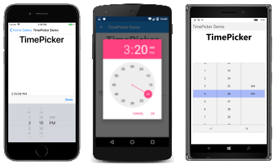](views-images/TimePicker-Large.png#lightbox "TimePicker Example") [C# code for this page](https://github.com/xamarin/xamarin-forms-samples/blob/master/FormsGallery/FormsGallery/FormsGallery/CodeExamples/TimePickerDemoPage.cs) / [XAML page](https://github.com/xamarin/xamarin-forms-samples/blob/master/FormsGallery/FormsGallery/FormsGallery/XamlExamples/TimePickerDemoPage.xaml) |
|     |     |     |

## Views for editing text

These two classes derive from the [`InputView`](xref:Xamarin.Forms.InputView) class, which defines the [`Keyboard`](xref:Xamarin.Forms.InputView.Keyboard) property:

| Type | Description | Appearance |
| --- | --- | --- |
| `Entry` | [`Entry`](xref:Xamarin.Forms.Entry) allows the user to enter and edit a single line of text. The text is available as the [`Text`](xref:Xamarin.Forms.InputView.Text) property, and the [`TextChanged`](xref:Xamarin.Forms.InputView.TextChanged) and [`Completed`](xref:Xamarin.Forms.Entry.Completed) events are fired when the text changes or the user signals completion by tapping the enter key.  Use an [`Editor`](xref:Xamarin.Forms.Editor) for entering and editing multiple lines of text.  [API Documentation](xref:Xamarin.Forms.Entry) / [Guide](~/xamarin-forms/user-interface/text/entry.md) / [Sample](/samples/xamarin/xamarin-forms-samples/userinterface-text) | [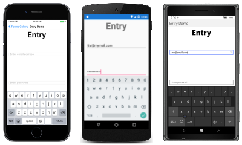](views-images/Entry-Large.png#lightbox "Entry Example") [C# code for this page](https://github.com/xamarin/xamarin-forms-samples/blob/master/FormsGallery/FormsGallery/FormsGallery/CodeExamples/EntryDemoPage.cs) / [XAML page](https://github.com/xamarin/xamarin-forms-samples/blob/master/FormsGallery/FormsGallery/FormsGallery/XamlExamples/EntryDemoPage.xaml) |
| `Editor` | [`Editor`](xref:Xamarin.Forms.Editor) allows the user to enter and edit multiple lines of text. The text is available as the [`Text`](xref:Xamarin.Forms.InputView.Text) property, and the [`TextChanged`](xref:Xamarin.Forms.InputView.TextChanged) and [`Completed`](xref:Xamarin.Forms.Editor.Completed) events are fired when the text changes or the user signals completion.  Use an [`Entry`](xref:Xamarin.Forms.Entry) view for entering and editing a single line of text.  [API Documentation](xref:Xamarin.Forms.Editor) / [Guide](~/xamarin-forms/user-interface/text/editor.md) / [Sample](/samples/xamarin/xamarin-forms-samples/userinterface-text) | [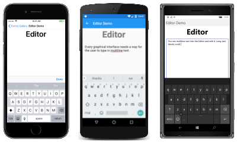](views-images/Editor-Large.png#lightbox "Editor Example") [C# code for this page](https://github.com/xamarin/xamarin-forms-samples/blob/master/FormsGallery/FormsGallery/FormsGallery/CodeExamples/EditorDemoPage.cs) / [XAML page](https://github.com/xamarin/xamarin-forms-samples/blob/master/FormsGallery/FormsGallery/FormsGallery/XamlExamples/EditorDemoPage.xaml) |
|     |     |     |

## Views to indicate activity

| Type | Description | Appearance |
| --- | --- | --- |
| `ActivityIndicator` | [`ActivityIndicator`](xref:Xamarin.Forms.ActivityIndicator) uses an animation to show that the application is engaged in a lengthy activity without giving any indication of progress. The [`IsRunning`](xref:Xamarin.Forms.ActivityIndicator.IsRunning) property controls the animation.  If the activity's progress is known, use a [`ProgressBar`](xref:Xamarin.Forms.ProgressBar) instead.  [API Documentation](xref:Xamarin.Forms.ActivityIndicator) / [Guide](~/xamarin-forms/user-interface/activityindicator.md) / [Sample](/samples/xamarin/xamarin-forms-samples/userinterface-activityindicatordemos/) | [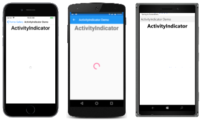](views-images/ActivityIndicator-Large.png#lightbox "ActivityIndicator Example") [C# code for this page](https://github.com/xamarin/xamarin-forms-samples/blob/master/FormsGallery/FormsGallery/FormsGallery/CodeExamples/ActivityIndicatorDemoPage.cs) / [XAML page](https://github.com/xamarin/xamarin-forms-samples/blob/master/FormsGallery/FormsGallery/FormsGallery/XamlExamples/ActivityIndicatorDemoPage.xaml) |
| `ProgressBar` | [`ProgressBar`](xref:Xamarin.Forms.ProgressBar) uses an animation to show that the application is progressing through a lengthy activity. Set the [`Progress`](xref:Xamarin.Forms.ProgressBar.Progress) property to values between 0 and 1 to indicate the progress.  If the activity's progress is not known, use an [`ActivityIndicator`](xref:Xamarin.Forms.ActivityIndicator) instead.  [API Documentation](xref:Xamarin.Forms.ProgressBar) / [Guide](~/xamarin-forms/user-interface/progressbar.md) / [Sample](/samples/xamarin/xamarin-forms-samples/userinterface-progressbardemos/) | [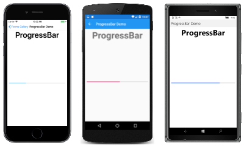](views-images/ProgressBar-Large.png#lightbox "ProgressBar Example") [C# code for this page](https://github.com/xamarin/xamarin-forms-samples/blob/master/FormsGallery/FormsGallery/FormsGallery/CodeExamples/ProgressBarDemoPage.cs) / [XAML page](https://github.com/xamarin/xamarin-forms-samples/blob/master/FormsGallery/FormsGallery/FormsGallery/XamlExamples/ProgressBarDemoPage.xaml) with [code-behind](https://github.com/xamarin/xamarin-forms-samples/blob/master/FormsGallery/FormsGallery/FormsGallery/XamlExamples/ProgressBarDemoPage.xaml.cs) |
|     |     |     |

## Views that display collections

| Type | Description | Appearance |
| --- | --- | --- |
| `CarouselView` | [`CarouselView`](xref:Xamarin.Forms.CarouselView) displays a scrollable list of data items. Set the `ItemsSource` property to a collection of objects, and set the `ItemTemplate` property to a [`DataTemplate`](xref:Xamarin.Forms.DataTemplate) object describing how the items are to be formatted. The `CurrentItemChanged` event signals that the currently displayed item has changed, which is available as the `CurrentItem` property.  [Guide](~/xamarin-forms/user-interface/carouselview/index.md) / [Sample](/samples/xamarin/xamarin-forms-samples/userinterface-carouselviewdemos/) | [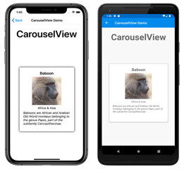](views-images/CarouselView-Large.png#lightbox "CarouselView Example") [C# code for this page](https://github.com/xamarin/xamarin-forms-samples/blob/master/FormsGallery/FormsGallery/FormsGallery/CodeExamples/CarouselViewDemoPage.cs) / [XAML page](https://github.com/xamarin/xamarin-forms-samples/blob/master/FormsGallery/FormsGallery/FormsGallery/XamlExamples/CarouselViewDemoPage.xaml) |
| `CollectionView` | [`CollectionView`](xref:Xamarin.Forms.CollectionView) displays a scrollable list of selectable data items, using different layout specifications. It aims to provide a more flexible, and performant alternative to [`ListView`](xref:Xamarin.Forms.ListView). Set the `ItemsSource` property to a collection of objects, and set the `ItemTemplate` property to a [`DataTemplate`](xref:Xamarin.Forms.DataTemplate) object describing how the items are to be formatted. The `SelectionChanged` event signals that a selection has been made, which is available as the `SelectedItem` property.  [Guide](~/xamarin-forms/user-interface/collectionview/index.md) / [Sample](/samples/xamarin/xamarin-forms-samples/userinterface-collectionviewdemos/) | [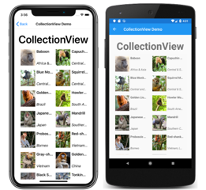](views-images/CollectionView-Large.png#lightbox "CollectionView Example") [C# code for this page](https://github.com/xamarin/xamarin-forms-samples/blob/master/FormsGallery/FormsGallery/FormsGallery/CodeExamples/CollectionViewDemoPage.cs) / [XAML page](https://github.com/xamarin/xamarin-forms-samples/blob/master/FormsGallery/FormsGallery/FormsGallery/XamlExamples/CollectionViewDemoPage.xaml) |
| `IndicatorView` | [`IndicatorView`](xref:Xamarin.Forms.IndicatorView) displays indicators that represent the number of items in a `CarouselView`. Set the `CarouselView.IndicatorView` property to the `IndicatorView` object to display indicators for the `CarouselView`.  [API Documentation](xref:Xamarin.Forms.IndicatorView) / [Guide](~/xamarin-forms/user-interface/indicatorview.md) / [Sample](/samples/xamarin/xamarin-forms-samples/userinterface-indicatorviewdemos/) | [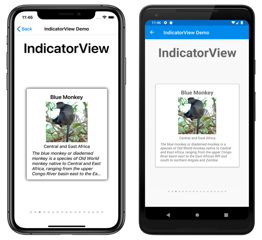](views-images/IndicatorView-Large.png#lightbox "IndicatorView Example") [C# code for this page](https://github.com/xamarin/xamarin-forms-samples/blob/master/FormsGallery/FormsGallery/FormsGallery/CodeExamples/IndicatorViewDemoPage.cs) / [XAML page](https://github.com/xamarin/xamarin-forms-samples/blob/master/FormsGallery/FormsGallery/FormsGallery/XamlExamples/IndicatorViewDemoPage.xaml) |
| `ListView` | [`ListView`](xref:Xamarin.Forms.ListView) derives from [`ItemsView`](xref:Xamarin.Forms.ItemsView`1) and displays a scrollable list of selectable data items. Set the [`ItemsSource`](xref:Xamarin.Forms.ItemsView`1.ItemsSource) property to a collection of objects, and set the [`ItemTemplate`](xref:Xamarin.Forms.ItemsView`1.ItemTemplate) property to a [`DataTemplate`](xref:Xamarin.Forms.DataTemplate) object describing how the items are to be formatted. The [`ItemSelected`](xref:Xamarin.Forms.ListView.ItemSelected) event signals that a selection has been made, which is available as the [`SelectedItem`](xref:Xamarin.Forms.ListView.SelectedItem) property.  [API Documentation](xref:Xamarin.Forms.ListView) / [Guide](~/xamarin-forms/user-interface/listview/index.md) / [Sample](/samples/xamarin/xamarin-forms-samples/workingwithlistview/) | [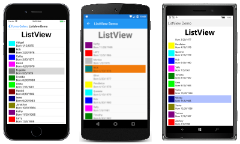](views-images/ListView-Large.png#lightbox "ListView Example") [C# code for this page](https://github.com/xamarin/xamarin-forms-samples/blob/master/FormsGallery/FormsGallery/FormsGallery/CodeExamples/ListViewDemoPage.cs) / [XAML page](https://github.com/xamarin/xamarin-forms-samples/blob/master/FormsGallery/FormsGallery/FormsGallery/XamlExamples/ListViewDemoPage.xaml) |
| `Picker` | [`Picker`](xref:Xamarin.Forms.Picker) displays a selected item from a list of text strings, and allows selecting that item when the view is tapped. Set the [`Items`](xref:Xamarin.Forms.Picker.Items) property to a list of strings, or the [`ItemsSource`](xref:Xamarin.Forms.Picker.ItemsSource) property to a collection of objects. The [`SelectedIndexChanged`](xref:Xamarin.Forms.Picker.SelectedIndexChanged) event is fired when an item is selected.  The `Picker` displays the list of items only when it's selected. Use a [`ListView`](xref:Xamarin.Forms.ListView) or [`TableView`](xref:Xamarin.Forms.TableView) for a scrollable list that remains on the page.  [API Documentation](xref:Xamarin.Forms.Picker) / [Guide](~/xamarin-forms/user-interface/picker/index.md)  | [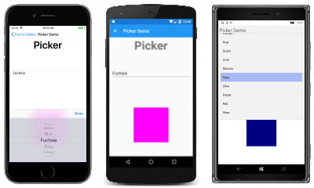](views-images/Picker-Large.png#lightbox "Picker Example") [C# code for this page](https://github.com/xamarin/xamarin-forms-samples/blob/master/FormsGallery/FormsGallery/FormsGallery/CodeExamples/PickerDemoPage.cs) / [XAML page](https://github.com/xamarin/xamarin-forms-samples/blob/master/FormsGallery/FormsGallery/FormsGallery/XamlExamples/PickerDemoPage.xaml) with [code-behind](https://github.com/xamarin/xamarin-forms-samples/blob/master/FormsGallery/FormsGallery/FormsGallery/XamlExamples/PickerDemoPage.xaml.cs) |
| `TableView` | [`TableView`](xref:Xamarin.Forms.TableView) displays a list of rows of type [`Cell`](xref:Xamarin.Forms.Cell) with optional headers and subheaders. Set the [`Root`](xref:Xamarin.Forms.TableView.Root) property to an object of type [`TableRoot`](xref:Xamarin.Forms.TableRoot), and add [`TableSection`](xref:Xamarin.Forms.TableSection) objects to that `TableRoot`. Each `TableSection` is a collection of `Cell` objects.  [API Documentation](xref:Xamarin.Forms.TableView) / [Guide](~/xamarin-forms/user-interface/tableview.md) / [Sample](/samples/xamarin/xamarin-forms-samples/userinterface-tableview) | [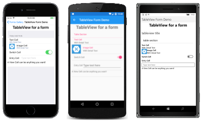](views-images/TableView-Large.png#lightbox "TableView Example") [C# code for this page](https://github.com/xamarin/xamarin-forms-samples/blob/master/FormsGallery/FormsGallery/FormsGallery/CodeExamples/TableViewFormDemoPage.cs) / [XAML page](https://github.com/xamarin/xamarin-forms-samples/blob/master/FormsGallery/FormsGallery/FormsGallery/XamlExamples/TableViewFormDemoPage.xaml) |
|     |     |     |

## Related links

- [Xamarin.Forms FormsGallery sample](/samples/xamarin/xamarin-forms-samples/formsgallery)
- [Xamarin.Forms Samples](/samples/browse/?products=xamarin&term=Xamarin.Forms)
- [Xamarin.Forms API Documentation](/dotnet/api/xamarin.forms?view=xamarin-forms&preserve-view=true)
