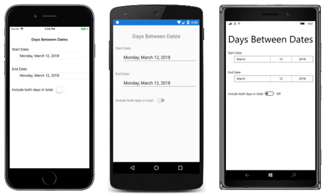
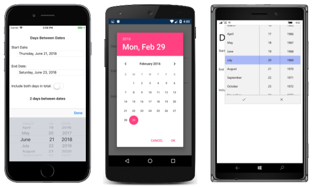
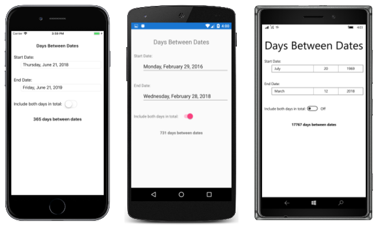

# Xamarin.Forms DatePicker

[ Download the sample](/samples/xamarin/xamarin-forms-samples/userinterface-datepicker)

_A Xamarin.Forms view that allows the user to select a date._

The Xamarin.Forms [`DatePicker`](xref:Xamarin.Forms.DatePicker) invokes the platform's date-picker control and allows the user to select a date. `DatePicker` defines eight properties:

- [`MinimumDate`](xref:Xamarin.Forms.DatePicker.MinimumDate) of type [`DateTime`](xref:System.DateTime), which defaults to the first day of the year 1900.
- [`MaximumDate`](xref:Xamarin.Forms.DatePicker.MaximumDate) of type `DateTime`, which defaults to the last day of the year 2100.
- [`Date`](xref:Xamarin.Forms.DatePicker.Date) of type `DateTime`, the selected date, which defaults to the value [`DateTime.Today`](xref:System.DateTime.Today).
- [`Format`](xref:Xamarin.Forms.DatePicker.Format) of type `string`, a [standard](/dotnet/standard/base-types/standard-date-and-time-format-strings/) or [custom](/dotnet/standard/base-types/custom-date-and-time-format-strings/) .NET formatting string, which defaults to "D", the long date pattern.
- [`TextColor`](xref:Xamarin.Forms.DatePicker.TextColor) of type [`Color`](xref:Xamarin.Forms.Color), the color used to display the selected date, which defaults to [`Color.Default`](xref:Xamarin.Forms.Color.Default).
- [`FontAttributes`](xref:Xamarin.Forms.DatePicker.FontAttributes) of type [`FontAttributes`](xref:Xamarin.Forms.FontAttributes), which defaults to [`FontAtributes.None`](xref:Xamarin.Forms.FontAttributes.None).
- [`FontFamily`](xref:Xamarin.Forms.DatePicker.FontFamily) of type `string`, which defaults to `null`.
- [`FontSize`](xref:Xamarin.Forms.DatePicker.FontSize) of type `double`, which defaults to -1.0.
- `CharacterSpacing`, of type `double`, is the spacing between characters of the `DatePicker` text.

The `DatePicker` fires a [`DateSelected`](xref:Xamarin.Forms.DatePicker.DateSelected) event when the user selects a date.

> [!WARNING]
> When setting `MinimumDate` and `MaximumDate`, make sure that `MinimumDate` is always less than or equal to `MaximumDate`. Otherwise, `DatePicker` will raise an exception.

Internally, the `DatePicker` ensures that `Date` is between `MinimumDate` and `MaximumDate`, inclusive. If `MinimumDate` or `MaximumDate` is set so that `Date` is not between them, `DatePicker` will adjust the value of `Date`.

All eight properties are backed by [`BindableProperty`](xref:Xamarin.Forms.BindableProperty) objects, which means that they can be styled, and the properties can be targets of data bindings. The `Date` property has a default binding mode of [`BindingMode.TwoWay`](xref:Xamarin.Forms.BindingMode.TwoWay), which means that it can be a target of a data binding in an application that uses the [Model-View-ViewModel (MVVM)](~/xamarin-forms/enterprise-application-patterns/mvvm.md) architecture.

## Initializing the DateTime properties

In code, you can initialize the `MinimumDate`, `MaximumDate`, and `Date` properties to values of type `DateTime`:

```csharp
DatePicker datePicker = new DatePicker
{
    MinimumDate = new DateTime(2018, 1, 1),
    MaximumDate = new DateTime(2018, 12, 31),
    Date = new DateTime(2018, 6, 21)
};
```

When a `DateTime` value is specified in XAML, the XAML parser uses the `DateTime.Parse` method with a `CultureInfo.InvariantCulture` argument to convert the string to a `DateTime` value. The dates must be specified in a precise format: two-digit months, two-digit days, and four-digit years separated by slashes:

```xaml
<DatePicker MinimumDate="01/01/2018"
            MaximumDate="12/31/2018"
            Date="06/21/2018" />
```

If the `BindingContext` property of `DatePicker` is set to an instance of a viewmodel containing properties of type `DateTime` named `MinDate`, `MaxDate`, and `SelectedDate` (for example), you can instantiate the `DatePicker` like this:

```xaml
<DatePicker MinimumDate="{Binding MinDate}"
            MaximumDate="{Binding MaxDate}"
            Date="{Binding SelectedDate}" />
```

In this example, all three properties are initialized to the corresponding properties in the viewmodel. Because the `Date` property has a binding mode of `TwoWay`, any new date that the user selects is automatically reflected in the viewmodel.

If the `DatePicker` does not contain a binding on its `Date` property, an application should attach a handler to the `DateSelected` event to be informed when the user selects a new date.

For information about setting font properties, see [Fonts](~/xamarin-forms/user-interface/text/fonts.md).

## DatePicker and layout

It's possible to use an unconstrained horizontal layout option such as `Center`, `Start`, or `End` with `DatePicker`:

```xaml
<DatePicker ···
            HorizontalOptions="Center"
            ··· />
```

However, this is not recommended. Depending on the setting of the `Format` property, selected dates might require different display widths. For example, the "D" format string causes `DateTime` to display dates in a long format, and "Wednesday, September 12, 2018" requires a greater display width than "Friday, May 4, 2018". Depending on the platform, this difference might cause the `DateTime` view to change width in layout, or for the display to be truncated.

> [!TIP]
> It's best to use the default `HorizontalOptions` setting of `Fill` with `DatePicker`, and not to use a width of `Auto` when putting `DatePicker` in a `Grid` cell.

## DatePicker in an application

The [**DaysBetweenDates**](/samples/xamarin/xamarin-forms-samples/userinterface-datepicker) sample includes two `DatePicker` views on its page. These can be used to select two dates, and the program calculates the number of days between those dates. The program doesn't change the settings of the `MinimumDate` and `MaximumDate` properties, so the two dates must be between 1900 and 2100.

Here's the XAML file:

```xaml
<?xml version="1.0" encoding="utf-8" ?>
<ContentPage xmlns="http://xamarin.com/schemas/2014/forms"
             xmlns:x="http://schemas.microsoft.com/winfx/2009/xaml"
             xmlns:local="clr-namespace:DaysBetweenDates"
             x:Class="DaysBetweenDates.MainPage">
    <ContentPage.Padding>
        <OnPlatform x:TypeArguments="Thickness">
            <On Platform="iOS" Value="0, 20, 0, 0" />
        </OnPlatform>
    </ContentPage.Padding>

    <StackLayout Margin="10">
        <Label Text="Days Between Dates"
               Style="{DynamicResource TitleStyle}"
               Margin="0, 20"
               HorizontalTextAlignment="Center" />

        <Label Text="Start Date:" />

        <DatePicker x:Name="startDatePicker"
                    Format="D"
                    Margin="30, 0, 0, 30"
                    DateSelected="OnDateSelected" />

        <Label Text="End Date:" />

        <DatePicker x:Name="endDatePicker"
                    MinimumDate="{Binding Source={x:Reference startDatePicker},
                                          Path=Date}"
                    Format="D"
                    Margin="30, 0, 0, 30"
                    DateSelected="OnDateSelected" />

        <StackLayout Orientation="Horizontal"
                     Margin="0, 0, 0, 30">
            <Label Text="Include both days in total: "
                   VerticalOptions="Center" />
            <Switch x:Name="includeSwitch"
                    Toggled="OnSwitchToggled" />
        </StackLayout>

        <Label x:Name="resultLabel"
               FontAttributes="Bold"
               HorizontalTextAlignment="Center" />

    </StackLayout>
</ContentPage>
```

Each `DatePicker` is assigned a `Format` property of "D" for a long date format. Notice also that the `endDatePicker` object has a binding that targets its `MinimumDate` property. The binding source is the selected `Date` property of the `startDatePicker` object. This ensures that the end date is always later than or equal to the start date. In addition to the two `DatePicker` objects, a `Switch` is labeled "Include both days in total".

The two `DatePicker` views have handlers attached to the `DateSelected` event, and the `Switch` has a handler attached to its `Toggled` event. These event handlers are in the code-behind file and trigger a new calculation of the days between the two dates:

```csharp
public partial class MainPage : ContentPage
{
    public MainPage()
    {
        InitializeComponent();
    }

    void OnDateSelected(object sender, DateChangedEventArgs args)
    {
        Recalculate();
    }

    void OnSwitchToggled(object sender, ToggledEventArgs args)
    {
        Recalculate();
    }

    void Recalculate()
    {
        TimeSpan timeSpan = endDatePicker.Date - startDatePicker.Date +
            (includeSwitch.IsToggled ? TimeSpan.FromDays(1) : TimeSpan.Zero);

        resultLabel.Text = String.Format("{0} day{1} between dates",
                                            timeSpan.Days, timeSpan.Days == 1 ? "" : "s");
    }
}
```

When the sample is first run, both `DatePicker` views are initialized to today's date. The following screenshot shows the program running on iOS and Android:

[](datepicker-images/DaysBetweenDatesStart-Large.png#lightbox "Days Between Dates Start")

Tapping either of the `DatePicker` displays invokes the platform date picker. The platforms implement this date picker in very different ways, but each approach is familiar to users of that platform:

[](datepicker-images/DaysBetweenDatesSelect-Large.png#lightbox "Days Between Dates Select")

> [!TIP]
> On Android, the `DatePicker` dialog can be customized by overriding the `CreateDatePickerDialog` method in a custom renderer. This allows, for example, additional buttons to be added to the dialog.

After two dates are selected, the application displays the number of days between those dates:

[](datepicker-images/DaysBetweenDatesResult-Large.png#lightbox "Days Between Dates Result")

## Related links

- [DaysBetweenDates sample](/samples/xamarin/xamarin-forms-samples/userinterface-datepicker)
- [DatePicker API](xref:Xamarin.Forms.DatePicker)