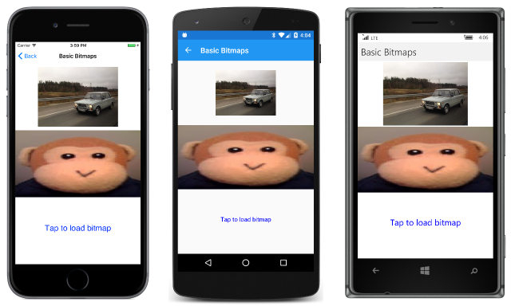

# Bitmap Basics

_Load bitmaps from various sources and display them._

The support of bitmaps in SkiaSharp is quite extensive. This article covers only the basics &mdash; how to load bitmaps and how to display them:


A SkiaSharp bitmap is an object of type [`SKBitmap`](https://developer.xamarin.com/api/type/SkiaSharp.SKBitmap/). There are many ways to create a bitmap but this article restricts itself to the [`SKBitmap.Decode`](https://developer.xamarin.com/api/member/SkiaSharp.SKBitmap.Decode/p/SkiaSharp.SKStream/) method, which loads the bitmap from an [`SKStream`](https://developer.xamarin.com/api/type/SkiaSharp.SKStream/) object that references a bitmap file. It is convenient to use the [`SKManagedStream`](https://developer.xamarin.com/api/type/SkiaSharp.SKManagedStream/) class that derives from `SKStream` because it has a constructor that accepts a .NET [`Stream`](https://developer.xamarin.com/api/type/System.IO.Stream/) object.

The **Basic Bitmaps** page in the **SkiaSharpFormsDemos** program demonstrates how to load bitmaps from three different sources:

- From over the Internet
- From a resource embedded in the executable
- From the user's photo library

Three `SKBitmap` objects for these three sources are defined as fields in the [`BasicBitmapsPage`](https://github.com/xamarin/xamarin-forms-samples/blob/master/SkiaSharpForms/Demos/Demos/SkiaSharpFormsDemos/Basics/BasicBitmapsPage.cs) class:

```csharp
public class BasicBitmapsPage : ContentPage
{
    SKCanvasView canvasView;
    SKBitmap webBitmap;
    SKBitmap resourceBitmap;
    SKBitmap libraryBitmap;

    public BasicBitmapsPage()
    {
        Title = "Basic Bitmaps";

        canvasView = new SKCanvasView();
        canvasView.PaintSurface += OnCanvasViewPaintSurface;
        Content = canvasView;
        ...
    }
    ...
}
```

## Loading a Bitmap from the Web

To load a bitmap based on a URL, you can use the [`WebRequest`](https://developer.xamarin.com/api/type/System.Net.WebRequest/) class, as shown in the following code executed in the `BasicBitmapsPage` constructor. The URL here points to an area on the Xamarin web site with some sample bitmaps. A package on the web site allows appending a specification for resizing the bitmap to a particular width:

```csharp
Uri uri = new Uri("http://developer.xamarin.com/demo/IMG_3256.JPG?width=480");
WebRequest request = WebRequest.Create(uri);
request.BeginGetResponse((IAsyncResult arg) =>
{
    try
    {
        using (Stream stream = request.EndGetResponse(arg).GetResponseStream())
        using (MemoryStream memStream = new MemoryStream())
        {
            stream.CopyTo(memStream);
            memStream.Seek(0, SeekOrigin.Begin);

            using (SKManagedStream skStream = new SKManagedStream(memStream))
            {
                webBitmap = SKBitmap.Decode(skStream);
            }
        }
    }
    catch
    {
    }

    Device.BeginInvokeOnMainThread(() => canvasView.InvalidateSurface());

}, null);
```

When the bitmap has been successfully downloaded, the callback method passed to the `BeginGetResponse` method runs. The `EndGetResponse` call needs to be in a `try` block in case an error has occurred. The `Stream` object obtained from `GetResponseStream` is not adequate on some platforms, so the bitmap contents are copied into a `MemoryStream` object. At this point, the `SKManagedStream` object can be created. This now references the bitmap file, which is likely a JPEG or PNG file. The `SKBitmap.Decode` method decodes the bitmap file and stores the results in an internal SkiaSharp format.

The callback method passed to `BeginGetResponse` runs after the constructor has finished executing, which means that the `SKCanvasView` needs to be invalidated to allow the `PaintSurface` handler to update the display. However, the `BeginGetResponse` callback runs in a secondary thread of execution, so it's necessary to use `Device.BeginInvokeOnMainThread` to run the `InvalidateSurface` method in the user-interface thread.

## Loading a Bitmap Resource

In terms of code, the easiest approach to loading bitmaps is including a bitmap resource directly in your application. The **SkiaSharpFormsDemos** program includes a folder named **Media** containing a bitmap file named **monkey.png**. In the **Properties** dialog for this file, you must give such a file a **Build Action** of **Embedded Resource**!

Each embedded resource has a *resource ID* that consists of the project name, the folder, and the filename, all connected by periods: **SkiaSharpFormsDemos.Media.monkey.png**. You can get access to this resource by specifying that resource ID as an argument to the [`GetManifestResourceStream`](https://developer.xamarin.com/api/member/System.Reflection.Assembly.GetManifestResourceStream/p/System.String/) method of the [`Assembly`](https://developer.xamarin.com/api/type/System.Reflection.Assembly/) class:

```csharp
string resourceID = "SkiaSharpFormsDemos.Media.monkey.png";
Assembly assembly = GetType().GetTypeInfo().Assembly;

using (Stream stream = assembly.GetManifestResourceStream(resourceID))
using (SKManagedStream skStream = new SKManagedStream(stream))
{
    resourceBitmap = SKBitmap.Decode(skStream);
}
```

This `Stream` object can be converted directly to an `SKManagedStream` object.

## Loading a Bitmap from the Photo Library

It's also possible for the user to load a photo from the device's picture library. This facility is not provided by Xamarin.Forms itself. The job requires a dependency service, such as the one described in the article [Picking a Photo from the Picture Library](~/xamarin-forms/app-fundamentals/dependency-service/photo-picker.md).

The **IPicturePicker.cs** file and the three **PicturePickerImplementation.cs** files from that article have been copied to the various projects of the **SkiaSharpFormsDemos** solution, and given new namespace names. In addition, the Android **MainActivity.cs** file has been modified as described in the article, and the iOS project has been given permission to access the photo library with two lines towards the bottom of the **info.plist** file.

The `BasicBitmapsPage` constructor adds a `TapGestureRecognizer` to the `SKCanvasView` to be notified of taps. On receipt of a tap, the `Tapped` handler gets access to the picture-picker dependency service and calls `GetImageStreamAsync`. If a `Stream` object is returned, then the contents are copied into a `MemoryStream`, as required by some of the platforms. The rest of the code is similar to the two other techniques:

```csharp
// Add tap gesture recognizer
TapGestureRecognizer tapRecognizer = new TapGestureRecognizer();
tapRecognizer.Tapped += async (sender, args) =>
{
    // Load bitmap from photo library
    IPicturePicker picturePicker = DependencyService.Get<IPicturePicker>();

    using (Stream stream = await picturePicker.GetImageStreamAsync())
    {
        if (stream != null)
        {
            using (MemoryStream memStream = new MemoryStream())
            {
                stream.CopyTo(memStream);
                memStream.Seek(0, SeekOrigin.Begin);

                using (SKManagedStream skStream = new SKManagedStream(memStream))
                {
                    libraryBitmap = SKBitmap.Decode(skStream);
                }
            }
            canvasView.InvalidateSurface();
        }
    }
};
canvasView.GestureRecognizers.Add(tapRecognizer);
```

Notice that the `Tapped` handler calls the `InvalidateSurface` method of the `SKCanvasView` object. This generates a new call to the `PaintSurface` handler.

## Displaying the Bitmaps

The `PaintSurface` handler needs to display three bitmaps. The handler assumes that the phone is in portrait mode and divides the canvas vertically into three equal parts.

The first bitmap is displayed with the simplest [`DrawBitmap`](https://developer.xamarin.com/api/member/SkiaSharp.SKCanvas.DrawBitmap/p/SkiaSharp.SKBitmap/System.Single/System.Single/SkiaSharp.SKPaint/) method. All you need to specify are the X and Y coordinates where the upper-left corner of the bitmap is to be positioned:

```csharp
public void DrawBitmap (SKBitmap bitmap, Single x, Single y, SKPaint paint = null)
```

Although an `SKPaint` parameter is defined, it has a default value of `null` and you can ignore it. The pixels of the bitmap are simply transferred to the pixels of the display surface with a one-to-one mapping.

A program can obtain the pixel dimensions of a bitmap with the [`Width`](https://developer.xamarin.com/api/property/SkiaSharp.SKBitmap.Width/) and [`Height`](https://developer.xamarin.com/api/property/SkiaSharp.SKBitmap.Height/) properties. These properties allow the program to calculate coordinates to position the bitmap in the center of the upper-third of the canvas:

```csharp
void OnCanvasViewPaintSurface(object sender, SKPaintSurfaceEventArgs args)
{
    SKImageInfo info = args.Info;
    SKSurface surface = args.Surface;
    SKCanvas canvas = surface.Canvas;

    canvas.Clear();

    if (webBitmap != null)
    {
        float x = (info.Width - webBitmap.Width) / 2;
        float y = (info.Height / 3 - webBitmap.Height) / 2;
        canvas.DrawBitmap(webBitmap, x, y);
    }
    ...
}
```

The other two bitmaps are displayed with a version of [`DrawBitmap`](https://developer.xamarin.com/api/member/SkiaSharp.SKCanvas.DrawBitmap/p/SkiaSharp.SKBitmap/SkiaSharp.SKRect/SkiaSharp.SKPaint/) with an `SKRect` parameter:

```csharp
public void DrawBitmap (SKBitmap bitmap, SKRect dest, SKPaint paint = null)
```

A third version of [`DrawBitmap`](https://developer.xamarin.com/api/member/SkiaSharp.SKCanvas.DrawBitmap/p/SkiaSharp.SKBitmap/SkiaSharp.SKRect/SkiaSharp.SKRect/SkiaSharp.SKPaint/) has two `SKRect` arguments for specifying a rectangular subset of the bitmap to display, but that version isn't used in this article.

Here's the code to display the bitmap loaded from an embedded resource bitmap:

```csharp
void OnCanvasViewPaintSurface(object sender, SKPaintSurfaceEventArgs args)
{
    ...
    if (resourceBitmap != null)
    {
        canvas.DrawBitmap(resourceBitmap,
            new SKRect(0, info.Height / 3, info.Width, 2 * info.Height / 3));
    }
    ...
}
```

The bitmap is stretched to the dimensions of the rectangle, which is why the monkey is horizontally stretched in these screenshots:

[](bitmaps-images/basicbitmaps-large.png#lightbox "A triple screenshot of the Basic Bitmaps page")

The third image &mdash; which you can only see if you run the program and load a photo from your own picture library &mdash; is also displayed within a rectangle, but the rectangle's position and size are adjusted to maintain the bitmap's aspect ratio. This calculation is a little more involved because it requires calculating a scaling factor based on the size of the bitmap and the destination rectangle, and centering the rectangle in that area:

```csharp
void OnCanvasViewPaintSurface(object sender, SKPaintSurfaceEventArgs args)
{
    ...
    if (libraryBitmap != null)
    {
        float scale = Math.Min((float)info.Width / libraryBitmap.Width,
                               info.Height / 3f / libraryBitmap.Height);

        float left = (info.Width - scale * libraryBitmap.Width) / 2;
        float top = (info.Height / 3 - scale * libraryBitmap.Height) / 2;
        float right = left + scale * libraryBitmap.Width;
        float bottom = top + scale * libraryBitmap.Height;
        SKRect rect = new SKRect(left, top, right, bottom);
        rect.Offset(0, 2 * info.Height / 3);

        canvas.DrawBitmap(libraryBitmap, rect);
    }
    else
    {
        using (SKPaint paint = new SKPaint())
        {
            paint.Color = SKColors.Blue;
            paint.TextAlign = SKTextAlign.Center;
            paint.TextSize = 48;

            canvas.DrawText("Tap to load bitmap",
                info.Width / 2, 5 * info.Height / 6, paint);
        }
    }
}
```

If no bitmap has yet been loaded from the picture library, then the `else` block displays some text to prompt the user to tap the screen.


## Related Links

- [SkiaSharp APIs](https://developer.xamarin.com/api/root/SkiaSharp/)
- [SkiaSharpFormsDemos (sample)](https://developer.xamarin.com/samples/xamarin-forms/SkiaSharpForms/Demos/)
- [Picking a Photo from the Picture Library](~/xamarin-forms/app-fundamentals/dependency-service/photo-picker.md)
