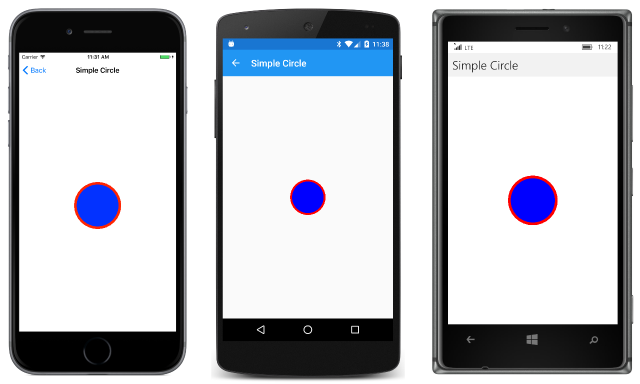

# Drawing a Simple Circle

_Learn the basics of SkiaSharp drawing, including canvases and paint_

This article introduces the concepts of drawing graphics in Xamarin.Forms using SkiaSharp, including creating an `SKCanvasView` object to host the graphics, handling the `PaintSurface` event, and using a `SKPaint` object to specify color and other drawing attributes.

The [**SkiaSharpFormsDemos**](https://developer.xamarin.com/samples/xamarin-forms/SkiaSharpForms/SkiaSharpFormsDemos/) program contains all the sample code for this series of SkiaSharp articles. The first page is entitled **Simple Circle** and invokes the page class [`SimpleCirclePage`](https://github.com/xamarin/xamarin-forms-samples/blob/master/SkiaSharpForms/SkiaSharpFormsDemos/SkiaSharpFormsDemos/SkiaSharpFormsDemos/Basics/SimpleCirclePage.cs). This code shows how to draw a circle in the center of the page with a radius of 100 pixels. The outline of the circle is red, and the interior of the circle is blue.


The [`SimpleCirle`](https://github.com/xamarin/xamarin-forms-samples/blob/master/SkiaSharpForms/SkiaSharpFormsDemos/SkiaSharpFormsDemos/SkiaSharpFormsDemos/Basics/SimpleCirclePage.cs) page class derives from `ContentPage` and contains two `using` directives for the SkiaSharp namespaces:

```csharp
using SkiaSharp;
using SkiaSharp.Views.Forms;
```

The following constructor of the class creates an [`SKCanvasView`](https://developer.xamarin.com/api/type/SkiaSharp.Views.Forms.SKCanvasView/) object, attaches a handler for the [`PaintSurface`](https://developer.xamarin.com/api/event/SkiaSharp.Views.Forms.SKCanvasView.PaintSurface/) event, and sets the `SKCanvasView` object as the content of the page:

```csharp
public SimpleCirclePage()
{
    Title = "Simple Circle";

    SKCanvasView canvasView = new SKCanvasView();
    canvasView.PaintSurface += OnCanvasViewPaintSurface;
    Content = canvasView;
}
```

The `SKCanvasView` occupies the entire content area of the page. You can alternatively combine an `SKCanvasView` with other Xamarin.Forms `View` derivatives, as you'll see in other examples.

The `PaintSurface` event handler is where you do all your drawing. This method is generally called multiple times while your program is running, so it should maintain all the information necessary to recreate the graphics display:

```csharp
void OnCanvasViewPaintSurface(object sender, SKPaintSurfaceEventArgs args)
{
    ...
}

```

The [`SKPaintSurfaceEventArgs`](https://developer.xamarin.com/api/type/SkiaSharp.Views.Forms.SKPaintSurfaceEventArgs/) object that accompanies the event has two properties:

- [`Info`](https://developer.xamarin.com/api/property/SkiaSharp.Views.Forms.SKPaintSurfaceEventArgs.Info/) of type [`SKImageInfo`](https://developer.xamarin.com/api/type/SkiaSharp.SKImageInfo/)
- [`Surface`](https://developer.xamarin.com/api/property/SkiaSharp.Views.Forms.SKPaintSurfaceEventArgs.Surface/) of type [`SKSurface`](https://developer.xamarin.com/api/type/SkiaSharp.SKSurface/)

The `SKImageInfo` structure contains information about the drawing surface, most importantly, it's width and height in pixels. The `SKSurface` object represents the drawing surface itself. In this program, the drawing surface is a video display, but in other programs an `SKSurface` object can also represent a bitmap that you use SkiaSharp to draw on.

The most important property of `SKSurface` is [`Canvas`](https://developer.xamarin.com/api/property/SkiaSharp.SKSurface.Canvas/) of type [`SKCanvas`](https://developer.xamarin.com/api/type/SkiaSharp.SKCanvas/). This class is a graphics drawing context that you use to perform the actual drawing. The `SKCanvas` object encapsulates a graphics state, which includes graphics transforms and clipping.

Here's a typical start of a `PaintSurface` event handler:

```csharp
void OnCanvasViewPaintSurface(object sender, SKPaintSurfaceEventArgs args)
{
    SKImageInfo info = args.Info;
    SKSurface surface = args.Surface;
    SKCanvas canvas = surface.Canvas;

    canvas.Clear();
    ...
}

```

The [`Clear`](https://developer.xamarin.com/api/member/SkiaSharp.SKCanvas.Clear()/) method clears the canvas with a transparent color. An overload lets you specify a background color for the canvas.

The goal here is to draw a red circle filled with blue. Because this particular graphic image contains two different colors, the job needs to be done in two steps. The first step is to draw the outline of the circle. To specify the color and other characteristic of the line, you create and initialize an [`SKPaint`](https://developer.xamarin.com/api/type/SkiaSharp.SKPaint/) object:

```csharp
void OnCanvasViewPaintSurface(object sender, SKPaintSurfaceEventArgs args)
{
    ...
    SKPaint paint = new SKPaint
    {
        Style = SKPaintStyle.Stroke,
        Color = Color.Red.ToSKColor(),
        StrokeWidth = 25
    };
    ...
}
```

The [`Style`](https://developer.xamarin.com/api/property/SkiaSharp.SKPaint.Style/) property indicates that you want to *stroke* a line (in this case the outline of the circle) rather than *fill* the interior. The three members of the [`SKPaintStyle`](https://developer.xamarin.com/api/type/SkiaSharp.SKPaintStyle/) enumeration are as follows:

- [`Fill`](https://developer.xamarin.com/api/field/SkiaSharp.SKPaintStyle.Fill/)
- [`Stroke`](https://developer.xamarin.com/api/field/SkiaSharp.SKPaintStyle.Stroke/)
- [`StrokeAndFill`](https://developer.xamarin.com/api/field/SkiaSharp.SKPaintStyle.StrokeAndFill/)

The default is `Fill`. Use the third option to stroke the line and fill the interior with the same color.

Set the [`Color`](https://developer.xamarin.com/api/property/SkiaSharp.SKPaint.Color/) property to a value of type [`SKColor`](https://developer.xamarin.com/api/type/SkiaSharp.SKColor/). One way to get an `SKColor` value is by converting a Xamarin.Forms `Color` value to an `SKColor` value using the extension method [`ToSKColor`](https://developer.xamarin.com/api/member/SkiaSharp.Views.Forms.Extensions.ToSKColor/p/Xamarin.Forms.Color/). The [`Extensions`](https://developer.xamarin.com/api/type/SkiaSharp.Views.Forms.Extensions/) class in the `SkiaSharp.Views.Forms` namespace includes other methods that convert between Xamarin.Forms values and SkiaSharp values.

The [`StrokeWidth`](https://developer.xamarin.com/api/property/SkiaSharp.SKPaint.StrokeWidth/) property indicates the thickness of the line. Here it's set to 25 pixels.

You use that `SKPaint` object to draw the circle:

```csharp
void OnCanvasViewPaintSurface(object sender, SKPaintSurfaceEventArgs args)
{
    ...
    canvas.DrawCircle(info.Width / 2, info.Height / 2, 100, paint);
    ...
}
```

Coordinates are specified relative to the upper-left corner of the display surface. X coordinates increase to the right and Y coordinates increase going down. In discussion about graphics, often the mathematical notation (x, y) is used to denote a point. The point (0, 0) is the upper-left corner of the display surface and is often called the *origin*.

The first two arguments of `DrawCircle` indicate the X and Y coordinates of the center of the circle. These are assigned half the width and height of the display surface to put the center of the circle in the center of the display surface. The third argument specifies the circle's radius, and the last argument is the `SKPaint` object.

To fill the interior of the circle, you can alter two properties of the `SKPaint` object and call `DrawCircle` again. This code also shows an alternative way to get an `SKColor` value from one of the many fields of the [`SKColors`](https://developer.xamarin.com/api/type/SkiaSharp.SKColors/) structure:

```csharp
void OnCanvasViewPaintSurface(object sender, SKPaintSurfaceEventArgs args)
{
    ...
    paint.Style = SKPaintStyle.Fill;
    paint.Color = SKColors.Blue;
    canvas.DrawCircle(args.Info.Width / 2, args.Info.Height / 2, 100, paint);
}
```
This time, the `DrawCircle` call fills the circle using the new properties of the `SKPaint` object.

Here's the program running on iOS, Android, and the Universal Windows Platform:

[](circle-images/simplecircle-large.png#lightbox "Triple screenshot of the Simple Circle page")

When running the program yourself, you can turn the phone or simulator sideways to see how the graphic is redrawn. Each time the graphic needs to be redrawn, the `PaintSurface` event handler is called again.

An `SKPaint` object is little more than a collection of graphics drawing properties. These objects are very lightweight. You can reuse `SKPaint` objects as this program does, or you can create multiple `SKPaint` objects for various combinations of drawing properties. You can create and initialize these objects outside of the `PaintSurface` event handler, and you can save them as fields in your page class.

Although the width of the circle's outline is specified as 25 pixels &#x2014; or one-quarter of the radius of the circle &#x2014; it appears to be thinner, and there's a good reason for that: Half the width of the line is obscured by the blue circle. The arguments to the `DrawCircle` method define the abstract geometric coordinates of a circle. The blue interior is sized to that dimension to the nearest pixel, but the 25-pixel-wide outline straddles the geometric circle &#x2014; half on the inside and half on the outside.

The next sample in the [Integrating with Xamarin.Forms](~/xamarin-forms/user-interface/graphics/skiasharp/basics/integration.md) article demonstrates this visually.


## Related Links

- [SkiaSharp APIs](https://developer.xamarin.com/api/root/SkiaSharp/)
- [SkiaSharpFormsDemos (sample)](https://developer.xamarin.com/samples/xamarin-forms/SkiaSharpForms/SkiaSharpFormsDemos/)
