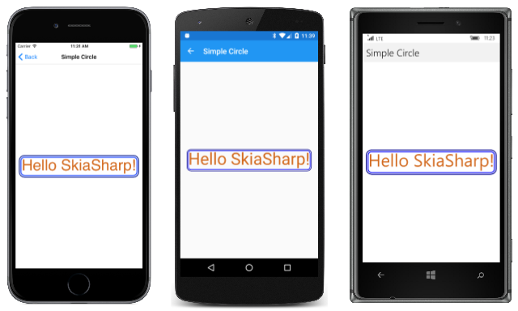
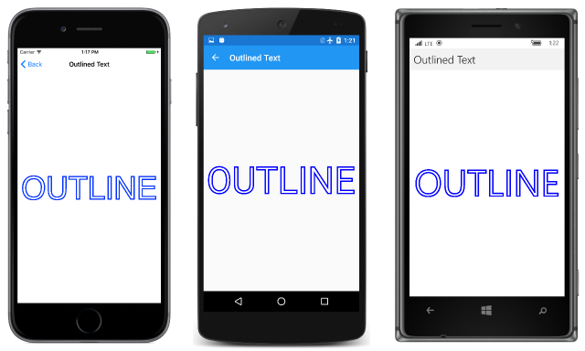

# Integrating Text and Graphics

_See how to determine the size of rendered text string to integrate text with SkiaSharp graphics_

This article demonstrates how to measure text, possibly scale the text to a particular size, and integrate the text with other graphics:


The SkiaSharp `Canvas` class also includes methods to draw a rectangle ([`DrawRect`](https://developer.xamarin.com/api/member/SkiaSharp.SKCanvas.DrawRect/p/SkiaSharp.SKRect/SkiaSharp.SKPaint/)) and a rectangle with rounded corners ([`DrawRoundRect`](https://developer.xamarin.com/api/member/SkiaSharp.SKCanvas.DrawRoundRect/p/SkiaSharp.SKRect/System.Single/System.Single/SkiaSharp.SKPaint/)). These methods require the rectangle to be defined as an `SKRect` value.

The **Framed Text** page centers a short text string on the page and surrounds it with a frame composed of a pair of rounded rectangles. The [`FramedTextPage`](https://github.com/xamarin/xamarin-forms-samples/blob/master/SkiaSharpForms/Demos/Demos/SkiaSharpFormsDemos/Basics/FramedTextPage.cs) class shows how it's done.

In SkiaSharp you use the `SKPaint` class to set text and font attributes, but you can also use it to obtain the rendered size of text. The beginning of the following `PaintSurface` event handler calls two different `MeasureText` methods. The first [`MeasureText`](https://developer.xamarin.com/api/member/SkiaSharp.SKPaint.MeasureText/p/System.String/) call has a simple `string` argument and returns the pixel width of the text based on the current font attributes. The program then calculates a new `TextSize` property of the `SKPaint` object based on that rendered width, the current `TextSize` property, and the width of the display area. This is intended to set `TextSize` so that the text string to be rendered at 90% of the width of the screen:

```csharp
void OnCanvasViewPaintSurface(object sender, SKPaintSurfaceEventArgs args)
{
    SKImageInfo info = args.Info;
    SKSurface surface = args.Surface;
    SKCanvas canvas = surface.Canvas;

    canvas.Clear();

    string str = "Hello SkiaSharp!";

    // Create an SKPaint object to display the text
    SKPaint textPaint = new SKPaint
    {
        Color = SKColors.Chocolate
    };

    // Adjust TextSize property so text is 90% of screen width
    float textWidth = textPaint.MeasureText(str);
    textPaint.TextSize = 0.9f * info.Width * textPaint.TextSize / textWidth;

    // Find the text bounds
    SKRect textBounds = new SKRect();
    textPaint.MeasureText(str, ref textBounds);
    ...
}
```

The second [`MeasureText`](https://developer.xamarin.com/api/member/SkiaSharp.SKPaint.MeasureText/p/System.String/SkiaSharp.SKRect@/) call has an `SKRect` argument, so it obtains both a width and height of the rendered text. The `Height` property of this `SKRect` value depends on the presence of capital letters, ascenders, and descenders in the text string. Different `Height` values are reported for the text strings "mom", "cat", and "dog", for example.

The `Left` and `Top` properties of the `SKRect` structure indicate the coordinates of the upper-left corner of the rendered text if the text is displayed by a `DrawText` call with X and Y positions of 0. For example, when this program is running on an iPhone 7 simulator, `TextSize` is assigned the value 90.6254 as a result of the calculation following the first call to `MeasureText`. The `SKRect` value obtained from the second call to `MeasureText` has the following property values:

- `Left` = 6
- `Top` = &ndash;68
- `Width` = 664.8214
- `Height` = 88;

Keep in mind that the X and Y coordinates you pass to the `DrawText` method specify the left side of the text at the baseline. The `Top` value indicates that the text extends 68 pixels above that baseline and (subtracting 68 it from 88) 20 pixels below the baseline. The `Left` value of 6 indicates that the text begins 6 pixels to the right of the X value in the `DrawText` call. This allows for normal inter-character spacing. If you want to display the text snugly in the upper-left corner of the display, pass the negatives of these `Left` and `Top` values as the X and Y coordinates of `DrawText`, in this example, &ndash;6 and 68.

The `SKRect` structure defines several handy properties and methods, some of which are used in the remainder of the `PaintSurface` handler. The `MidX` and `MidY` values indicate the coordinates of the center of the rectangle. (In the iPhone 7 example, those values are 338.4107 and &ndash;24.) The following code uses these values for the easiest calculation of coordinates to center text on the display:

```csharp
void OnCanvasViewPaintSurface(object sender, SKPaintSurfaceEventArgs args)
{
    ...
    // Calculate offsets to center the text on the screen
    float xText = info.Width / 2 - textBounds.MidX;
    float yText = info.Height / 2 - textBounds.MidY;

    // And draw the text
    canvas.DrawText(str, xText, yText, textPaint);
    ...
}
```

The `PaintSurface` handler concludes with two calls to `DrawRoundRect`, both of which require arguments of `SKRect`. This `SKRect` value is certainly similar to the `SKRect` value obtained from the `MeasureText` method, but it can't be the same. First, it needs to be a little larger so that the rounded rectangle doesn't draw over edges of the text, and secondly, it needs to be shifted in space so that the `Left` and `Top` values correspond to the upper-left corner where the rectangle is to be positioned. These two jobs are accomplished by `Offset` and `Inflate` methods defined by `SKRect`:

```csharp
void OnCanvasViewPaintSurface(object sender, SKPaintSurfaceEventArgs args)
{
    ...
    // Create a new SKRect object for the frame around the text
    SKRect frameRect = textBounds;
    frameRect.Offset(xText, yText);
    frameRect.Inflate(10, 10);

    // Create an SKPaint object to display the frame
    SKPaint framePaint = new SKPaint
    {
        Style = SKPaintStyle.Stroke,
        StrokeWidth = 5,
        Color = SKColors.Blue
    };

    // Draw one frame
    canvas.DrawRoundRect(frameRect, 20, 20, framePaint);

    // Inflate the frameRect and draw another
    frameRect.Inflate(10, 10);
    framePaint.Color = SKColors.DarkBlue;
    canvas.DrawRoundRect(frameRect, 30, 30, framePaint);
}
```

Following that, the remainder of the method is straight-forward. It creates another `SKPaint` object for the borders and calls `DrawRoundRect` twice. The second call uses a rectangle inflated by another 10 pixels. The first call specifies a corner radius of 20 pixels; the second has a corner radius of 30 pixels, so they seem to be parallel:

 [](text-images/framedtext-large.png#lightbox "Triple screenshot of the Framed Text page")

You can turn your phone or simulator sideways to see the text and frame increase in size.

If you only need to center some text on the screen, you can do it approximately without measuring the text by setting the `TextAlign` property of `SKPaint` to `SKTextAlign.Center`. The X coordinate you specify in the `DrawText` method then indicates where the horizontal center of the text is positioned. If you pass the midpoint of the screen to the `DrawText` method, the text will be horizontally centered and *nearly* vertically centered because the baseline will be vertically centered.

Text itself can be treated much like a graphical option. One simple option is to display the outline of the text characters rather than the normal filled display:

[](text-images/outlinedtext-large.png#lightbox "Triple screen shot of the Outlined Text page")

This is done simply by changing the normal `Style` property of the `SKPaint` object from its default setting of `SKPaintStyle.Fill` to `SKPaintStyle.Stroke` and by specifying a stroke width. The `PaintSurface` handler of the **Outlined Text** page shows how it's done:

```csharp
void OnCanvasViewPaintSurface(object sender, SKPaintSurfaceEventArgs args)
{
    SKImageInfo info = args.Info;
    SKSurface surface = args.Surface;
    SKCanvas canvas = surface.Canvas;

    canvas.Clear();

    string text = "OUTLINE";

    // Create an SKPaint object to display the text
    SKPaint textPaint = new SKPaint
    {
        Style = SKPaintStyle.Stroke,
        StrokeWidth = 1,
        FakeBoldText = true,
        Color = SKColors.Blue
    };

    // Adjust TextSize property so text is 95% of screen width
    float textWidth = textPaint.MeasureText(text);
    textPaint.TextSize = 0.95f * info.Width * textPaint.TextSize / textWidth;

    // Find the text bounds
    SKRect textBounds = new SKRect();
    textPaint.MeasureText(text, ref textBounds);

    // Calculate offsets to center the text on the screen
    float xText = info.Width / 2 - textBounds.MidX;
    float yText = info.Height / 2 - textBounds.MidY;

    // And draw the text
    canvas.DrawText(text, xText, yText, textPaint);
}
```

 In the past several articles, you You have now seen how to use SkiaSharp to draw text, circles, ellipses, and rounded rectangles. The next step is [SkiaSharp Lines and Paths](~/xamarin-forms/user-interface/graphics/skiasharp/paths/paths.md) in which you will learn how to draw connected lines in a graphics path.


## Related Links

- [SkiaSharp APIs](https://developer.xamarin.com/api/root/SkiaSharp/)
- [SkiaSharpFormsDemos (sample)](https://developer.xamarin.com/samples/xamarin-forms/SkiaSharpForms/Demos/)
