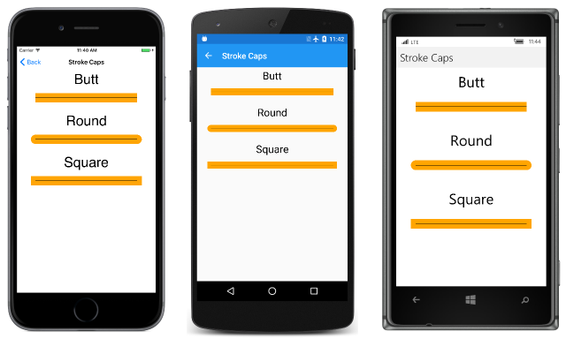
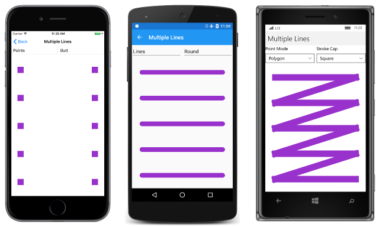

# Lines and Stroke Caps

_Learn how to use SkiaSharp to draw lines with different stroke caps_

In SkiaSharp, rendering a single line is very different from rendering a series of connected straight lines. Even when drawing single lines, however, it's often necessary to give the lines a particular stroke width, and the wider the line, the more important becomes the appearance of the end of the lines, called the *stroke cap*:


For drawing single lines, `SKCanvas` defines a simple [`DrawLine`](https://developer.xamarin.com/api/member/SkiaSharp.SKCanvas.DrawLine/p/System.Single/System.Single/System.Single/System.Single/SkiaSharp.SKPaint/) method whose arguments indicate the starting and ending coordinates of the line with an `SKPaint` object:

```csharp
canvas.DrawLine (x0, y0, x1, y1, paint);
```

By default, the `StrokeWidth` property of a newly instantiated `SKPaint` object is 0, which has the same effect as a value of 1 in rendering a line of one pixel in thickness. This appears very thin on high resolution devices such as phones, so you'll probably want to set the `StrokeWidth` to a larger value. But once you start drawing lines of a sizable thickness, that raises another issue: How should the starts and ends of these thick lines be rendered?

The appearance of the starts and ends of lines is called a *line cap* or, in Skia, a *stroke cap*. The word "cap" in this context refers to a kind of hat &#x2014; something that sits on the end of the line. You set the [`StrokeCap`](https://developer.xamarin.com/api/property/SkiaSharp.SKPaint.StrokeCap/) property of the `SKPaint` object to one of the following members of the [`SKStrokeCap`](https://developer.xamarin.com/api/type/SkiaSharp.SKStrokeCap/) enumeration:

- [`Butt`](https://developer.xamarin.com/api/field/SkiaSharp.SKStrokeCap.Butt/) (the default)
- [`Square`](https://developer.xamarin.com/api/field/SkiaSharp.SKStrokeCap.Round/)
- [`Round`](https://developer.xamarin.com/api/field/SkiaSharp.SKStrokeCap.Round/)

These are best illustrated with a sample program. The second section of the home page of the [**SkiaSharpFormsDemos**](https://developer.xamarin.com/samples/xamarin-forms/SkiaSharpForms/SkiaSharpFormsDemos/) program begins with a page titled **Stroke Caps** based on the [`StrokeCapsPage`](https://github.com/xamarin/xamarin-forms-samples/blob/master/SkiaSharpForms/SkiaSharpFormsDemos/SkiaSharpFormsDemos/SkiaSharpFormsDemos/LinesAndPaths/StrokeCapsPage.cs) class. This page defines a `PaintSurface` event handler that loops through the three members of the `SKStrokeCap` enumeration, displaying both the name of the enumeration member and drawing a line using that stroke cap:

```csharp
void OnCanvasViewPaintSurface(object sender, SKPaintSurfaceEventArgs args)
{
    SKImageInfo info = args.Info;
    SKSurface surface = args.Surface;
    SKCanvas canvas = surface.Canvas;

    canvas.Clear();

    SKPaint textPaint = new SKPaint
    {
        Color = SKColors.Black,
        TextSize = 75,
        TextAlign = SKTextAlign.Center
    };

    SKPaint thickLinePaint = new SKPaint
    {
        Style = SKPaintStyle.Stroke,
        Color = SKColors.Orange,
        StrokeWidth = 50
    };

    SKPaint thinLinePaint = new SKPaint
    {
        Style = SKPaintStyle.Stroke,
        Color = SKColors.Black,
        StrokeWidth = 2
    };

    float xText = info.Width / 2;
    float xLine1 = 100;
    float xLine2 = info.Width - xLine1;
    float y = textPaint.FontSpacing;

    foreach (SKStrokeCap strokeCap in Enum.GetValues(typeof(SKStrokeCap)))
    {
        // Display text
        canvas.DrawText(strokeCap.ToString(), xText, y, textPaint);
        y += textPaint.FontSpacing;

        // Display thick line
        thickLinePaint.StrokeCap = strokeCap;
        canvas.DrawLine(xLine1, y, xLine2, y, thickLinePaint);

        // Display thin line
        canvas.DrawLine(xLine1, y, xLine2, y, thinLinePaint);
        y += 2 * textPaint.FontSpacing;
    }
}
```

For each member of the `SKStrokeCap` enumeration, the handler draws two lines, one with a stroke thickness of 50 pixels and another line positioned on top with a stroke thickness of 2 pixels. This second line is intended to illustrate the geometric start and end of the line independent of the line thickness and a stroke cap:

[](lines-images/strokecaps-large.png "Triple screenshot of the Stroke Caps page")

As you can see, the `Square` and `Round` stroke caps effectively extend the length of the line by half the stroke width at the beginning of the line and again at the end. This extension becomes important when it's necessary to determine the dimensions of a rendered graphics object.

The `SKCanvas` class also includes another method for drawing multiple lines that is somewhat peculiar:

```csharp
DrawPoints (SKPointMode mode, points, paint)
```

The `points` parameter is an array of `SKPoint` values and `mode` is a member of the [`SKPointMode`](https://developer.xamarin.com/api/type/SkiaSharp.SKPointMode/) enumeration, which has three members:

- [`Points`](https://developer.xamarin.com/api/field/SkiaSharp.SKPointMode.Points/) to render the individual points
- [`Lines`](https://developer.xamarin.com/api/field/SkiaSharp.SKPointMode.Lines/) to connect each pair of points
- [`Polygon`](https://developer.xamarin.com/api/field/SkiaSharp.SKPointMode.Polygon/) to connect all consecutive points

The **Multiple Lines** page demonstrates this method. The [`MultipleLinesPage` XAML file](https://github.com/xamarin/xamarin-forms-samples/blob/master/SkiaSharpForms/SkiaSharpFormsDemos/SkiaSharpFormsDemos/SkiaSharpFormsDemos/LinesAndPaths/MultipleLinesPage.xaml) instantiates two `Picker` views that let you select a member of the `SKPointMode` enumeration and a member of the `SKStrokeCap` enumeration:

```xaml
<ContentPage xmlns="http://xamarin.com/schemas/2014/forms"
             xmlns:x="http://schemas.microsoft.com/winfx/2009/xaml"
             xmlns:skia="clr-namespace:SkiaSharp.Views.Forms;assembly=SkiaSharp.Views.Forms"
             x:Class="SkiaSharpFormsDemos.MultipleLinesPage"
             Title="Multiple Lines">
    <Grid>
        <Grid.ColumnDefinitions>
            <ColumnDefinition Width="*" />
            <ColumnDefinition Width="*" />
        </Grid.ColumnDefinitions>

        <Grid.RowDefinitions>
            <RowDefinition Height="Auto" />
            <RowDefinition Height="*" />
        </Grid.RowDefinitions>

        <Picker x:Name="pointModePicker"
                Title="Point Mode"
                Grid.Row="0"
                Grid.Column="0"
                SelectedIndexChanged="OnPickerSelectedIndexChanged">
            <Picker.Items>
                <x:String>Points</x:String>
                <x:String>Lines</x:String>
                <x:String>Polygon</x:String>
            </Picker.Items>
            <Picker.SelectedIndex>
                0
            </Picker.SelectedIndex>
        </Picker>

        <Picker x:Name="strokeCapPicker"
                Title="Stroke Cap"
                Grid.Row="0"
                Grid.Column="1"
                SelectedIndexChanged="OnPickerSelectedIndexChanged">
            <Picker.Items>
                <x:String>Butt</x:String>
                <x:String>Round</x:String>
                <x:String>Square</x:String>
            </Picker.Items>
            <Picker.SelectedIndex>
                0
            </Picker.SelectedIndex>
        </Picker>

        <skia:SKCanvasView x:Name="canvasView"
                           PaintSurface="OnCanvasViewPaintSurface"
                           Grid.Row="1"
                           Grid.Column="0"
                           Grid.ColumnSpan="2" />
    </Grid>
</ContentPage>
```

The `SelectedIndexChanged` handler for both `Picker` views simply invalidates the `SKCanvasView` object:

```csharp
void OnPickerSelectedIndexChanged(object sender, EventArgs args)
{
    if (canvasView != null)
    {
        canvasView.InvalidateSurface();
    }
}
```

This handler needs to check for the existence of the `SKCanvasView` object because the event handler is first called when the `SelectedIndex` property of the `Picker` is set to 0 in the XAML file, and that occurs before the `SKCanvasView` has been instantiated.

The `PaintSurface` handler accesses a generic method for obtaining the two selected items from the `Picker` views and converting them to enumeration values:

```csharp
void OnCanvasViewPaintSurface(object sender, SKPaintSurfaceEventArgs args)
{
    SKImageInfo info = args.Info;
    SKSurface surface = args.Surface;
    SKCanvas canvas = surface.Canvas;

    canvas.Clear();

    // Create an array of points scattered through the page
    SKPoint[] points = new SKPoint[10];

    for (int i = 0; i < 2; i++)
    {
        float x = (0.1f + 0.8f * i) * info.Width;

        for (int j = 0; j < 5; j++)
        {
            float y = (0.1f + 0.2f * j) * info.Height;
            points[2 * j + i] = new SKPoint(x, y);
        }
    }

    SKPaint paint = new SKPaint
    {
        Style = SKPaintStyle.Stroke,
        Color = SKColors.DarkOrchid,
        StrokeWidth = 50,
        StrokeCap = GetPickerItem<SKStrokeCap>(strokeCapPicker)
    };

    // Render the points by calling DrawPoints
    SKPointMode pointMode = GetPickerItem<SKPointMode>(pointModePicker);
    canvas.DrawPoints(pointMode, points, paint);
}

T GetPickerItem<T>(Picker picker)
{
    if (picker.SelectedIndex == -1)
    {
        return default(T);
    }
    return (T)Enum.Parse(typeof(T), picker.Items[picker.SelectedIndex]);
}
```

The screenshot shows a variety of `Picker` selections on the three platforms:

[](lines-images/multiplelines-large.png "Triple screenshot of the Multiple Lines page")

The iPhone at the left shows how the `SKPointMode.Points` enumeration member causes `DrawPoints` to render each of the points in the `SKPoint` array as a square if the line cap is `Butt` or `Square`. Circles are rendered if the line cap is `Round`.

When you instead use `SKPointMode.Lines`, as shown on the Android screen in the center, the `DrawPoints` method draws a line between each pair of `SKPoint` values, using the specified line cap, in this case `Round`.

The Windows mobile device shows the result of the `SKPointMode.Polygon` value. A line is drawn between the successive points in the array, but if you look very closely, you'll see that these lines are not connected. Each of these separate lines starts and ends with the specified line cap. If you select the `Round` caps, the lines might appear to be connected, but they're really not connected.

Whether lines are connected or not connected is a crucial aspect of working with graphics paths.


## Related Links

- [SkiaSharp APIs](https://developer.xamarin.com/api/root/SkiaSharp/)
- [SkiaSharpFormsDemos (sample)](https://developer.xamarin.com/samples/xamarin-forms/SkiaSharpForms/SkiaSharpFormsDemos/)
